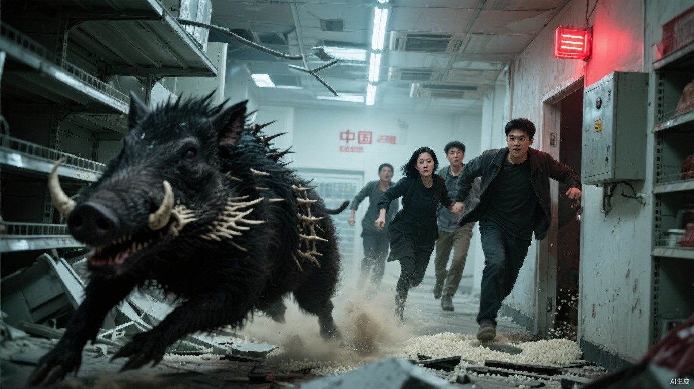

# 第一章 关门之后

灰雾把太阳磨成了一枚惨白的硬币。

它挂在城市上空，没有温度，也照不出多少光。沿街店铺大多敞着门，碎玻璃铺满人行道，偶尔被风推着滚动，发出细碎的摩擦声。更远处，一辆烧空的公交车横在路口，焦黑车架像一具被啃净的骨头。

十个人贴着墙根往前走。

鞋底踩过湿灰，发出一串压得极轻的沙响。没人交谈，只有背包扣环偶尔撞上钢管，又立刻被主人伸手按住。

小文不用回头，也知道自己走在倒数第二位。

压队尾的阿盛离他四步，呼吸不快不慢。腰间那串钥匙随着胸口起伏微微发颤，却始终没有碰响。再远一点，才是风推动碎玻璃的摩擦声。只要其中任何一道声音突然断掉，小文都会立刻停下。

老秦走在最前面，改装连弩的弩托紧贴肩窝。弩身上方压着一只五发短箭匣，那是整支搜索队唯一不会把半条街都惊醒的远程武器。

老韩落后他半步，工具包里的扳手都裹了布。阿慧走在队伍中间，不时摸一下腰间仅剩的半卷纱布。第一次参加高危任务的小齐抱紧钢管，指节发白；背上的旧帆布包大了半号，两根肩带都补着胶布。

周勇背着最大的帆布包。包里还什么都没有，他却每走几步就回头看一眼，像是已经有人打算从里面分走东西。

队伍后半截，有人扛着消防斧，有人背绳，还有人提着塞了布团的空桶。

小文的目光没有停在老秦背上。

二楼窗帘向外鼓起，又落回空窗；废车底下的灰层完整，没有东西钻过；楼顶积水管垂着几道干泥痕，也不像刚有人攀爬。

灾变前送外卖时，小文每天要在这片街区绕十几趟。闭上眼，他也能记起前方两个路口分别缺了哪块井盖。再往前，就是他们此行的目标，一家占据两层楼的大型粮油超市。

周勇终于忍不住回头：“你再这么一步三看，太阳落山咱们都摸不到超市门。那时候里面真有米，也只够丧尸煮粥。”

小文正要越过左侧巷口，一抹不该出现的灰色从视野边缘横了进来。

他脚步慢下去。阿盛差点撞上他的背，鞋底在湿灰里急擦了一声。

“那里多了一辆面包车。”小文抬起手。

灰色车身斜停在巷口，车头朝外，驾驶门留着一条缝。

周勇眯眼看了半天：“一辆破车也值得停队？这条街哪天不多几堆破烂？”

“昨天的侦察图上没有。”小文没有立即靠近，只隔着五六步观察轮胎，“雨停了半天，别的车轮下面都有一圈干灰，它没有。驾驶门没关，车头又冲着出口。”

他顺着车尾看向巷子深处。

里面没有风，半扇广告纸却贴在墙上轻轻发颤。

“有人最近开过。”小文说，“走得还很急。”

“昨天没有，今天就不能有？”周勇声音压得低，话却一串接一串，“全城的车是不是都得先去你那儿登记？你高考能考第一，难道轮胎也认状元？”

市状元三个字落在灰雾里，比路边褪色的广告还不真实。

三个月前，班主任打电话问小文准备报哪所大学。那时他穿着黄色外卖服站在透析楼下，父亲的诊断书压在保温箱底，母亲刚做完中风康复。

电话那头谈志愿和前途。他盯着电梯跳动的红色楼层数，算的是再送几单，才能补上父亲下次透析的钱。

大学没能等来。为少超时记住的后门、消防通道和员工入口，反倒留了下来。

老秦抬起拳头，队伍立刻停住。他没有看周勇，先走到面包车旁，用弩尖挑开驾驶门。

车内没有人。

钥匙孔周围有新鲜刮痕，副驾驶脚垫上还粘着半片湿叶。

老秦看了眼轮胎下的湿灰：“新停的。绕开它，得多花多久？”

“五分钟。”小文回答，“走右边窄巷，穿过废五金店后院还能接回原路。中间有两道院门，真遇见东西，至少能关一次。”

周勇用舌头顶了顶腮帮：“五分钟说得轻巧。今天任务要是空手，后勤不发基础贡献，路上吃的口粮还得倒扣。我不是舍不得走路，我是怕大伙儿冒着命出来，最后拿一张欠条回去。”

“怕空手没错。”老秦重新端起弩，“但你现在只盯着还没见到的粮食。”

“那你盯着什么？”

“我盯着怎么把十个人带回去。”老秦朝右巷偏了偏头，“多走五分钟，最坏是晚喝一口凉粥。走这边，最坏是什么，不用我替你算。”

周勇看了一眼那辆面包车，嘴唇动了动，最终只把背包肩带往上提紧：“绕就绕。先说好，真让别人抢了先，回去别说是我磨蹭。”

“你这张嘴真能把前后两条路都占了。”阿慧从旁边经过，“放心，空手回去我替你作证。就说你一路没停，光忙着给自己留后路。”

队伍里有人忍不住笑了一声。

周勇瞪她：“药店倒闭以后，你这嘴比药还苦。”

“苦药至少救命。你少说两句，也许一样有效。”

紧绷的队伍松了一瞬，又很快钻进右侧窄巷。

巷子里没有风，腐肉和积水的气味闷在两墙之间。墙角趴着两具残缺尸体：靠外那具头骨已经被砸开，晶核也被人取走；压在下面的另一具却还没有死透，灰白手指正一下下抠着水泥缝。

阿慧经过时突然停了半步。

“别看脸，看手。”老秦没有回头，“手还能不能抓，决定你能不能靠近。”

“我知道。”阿慧嘴上回答，目光仍落在那张被血污盖住一半的脸上，“他在前街修鞋。女儿上初中，书包带断了，他给缝过三次都不肯换。每次来药店买膏药也要最便宜的，自己疼得弯不下腰，还非说是替客人备着。”

周勇往尸体那边扫了一眼：“你连死人欠过几块钱都记得。记住这些有什么用？他还能坐起来把鞋钱补给你？”

“我没等他还钱。”

“那你图什么？”

阿慧终于收回目光：“图我下次见到他女儿，知道该说她爸最后叫什么，不是只说巷口有具尸体。”

老秦脚步没停，速度却慢了一点：“活着回去再替他记。现在跟紧。”

小齐绕过那只仍在抽动的手，喉结上下滚了几次：“秦叔，进超市以后真只待二十分钟？”

“真。”

“要是东西没装满呢？任务单写的是尽量搬空。后勤要是按失败算，我们没有基础贡献，今天吃掉的两顿口粮还得自己贴。”

“装不满也撤。”老秦侧过脸，“我叫你名字，你就往出口走。别数袋子，别替别人等，也别回来问我是不是认真的。”

小齐把话在嘴里默念了一遍：“二十分钟，叫名字就走。可要是……”

“你已经问第三遍了。”周勇插进来，“真怕成这样，回去接扫地任务。一天三点贡献，少是少点，至少尿裤子时离换洗衣服近。”

小齐的脸一下涨红：“我没想跑。我妈还等我换药，我只是怕没挣到点数，又把带出来的口粮赔进去。”

周勇嘴角那点笑停住了。

老秦替小齐把钢管往下按了按：“怕，说明你知道自己可能死。知道怕的人才会听撤退命令。至于他——”

他看向周勇。

“他总觉得自己不怕，所以每句话都得多说一遍，骗骗自己。”

这次笑声更明显。周勇骂了句娘，却没有再拿小齐取乐。

粮油超市很快从灰雾里显出轮廓。

巨大的红色招牌只剩下“粮油”两个字。卷帘门被撞开半边，几辆购物车歪在入口深处，车轮偶尔被穿堂风推动，转过小半圈，又吱呀停住。

门前没有尸体。

也没有鸟。

一张褪色促销布挂在二楼外墙，风每吹一次，它便啪地拍回墙面。除此以外，整栋建筑安静得像有人刚刚按下了静音键。

老秦在门前蹲下。

入口左墙画着一道白色斜线，上面压着两道短横。

“巨熊。”周勇先认出来，眼睛却亮了，“他们画了记号还没搬，里面肯定有来不及带走的大货。”

白漆尚未干透，边缘正缓慢向下坠出一滴。

小文伸手在标记旁边抹过。墙灰立刻在指腹留下一层黑，白漆表面却干净得什么也没有。

“最多半天。”他说。

手电照进门内，只够看清最近一排倾斜的货架，再深便被黑暗截断。小文抬头看向老秦：“秦叔，标记太新了。北侧卸货区最好先查一遍。”

“新才好。”周勇俯身去看，“说明巨熊刚清过附近，只等运输队。咱们赶在他们回来前搬一趟，难道还留在门口替他们看仓库？”

老韩已经把撬棍伸进卷帘门下沿。他没有评价谁对，只听了听金属摩擦声，又用指甲从门轴缝里刮出一小片亮铁。

“门刚开合过。”他把铁屑摊在掌心，“锈磨掉一层。配重还吃力，靠风抬不起来。”

周勇的目光已经越过门缝，钻进了里面的仓库。

老韩仍蹲在门轴旁，指腹来回碾着那片亮铁屑。

小文把拇指上的墙灰搓开，又将手指收回掌心。

老秦盯着白漆下那滴迟迟没有落地的漆珠，最终检查了一遍弩机和箭匣。

“不能凭一道新漆让几百人继续饿，也不能装作没看见。”他说，“老韩跟我先探主通道，其他人贴墙等。三分钟听不见我敲门，立刻原路回基地。”

“北侧卸货区呢？”小文问。

“在仓库最里面，不能让老韩一个人过去。”老秦看了他一眼，“前厅没问题，我们十个人一起进，再边走边查。原定二十分钟，改成十五。阿慧居中，小齐报时。谁擅自离队，回去不只扣贡献，我亲自把他名字从下一张任务单上划掉。”

“听着像处罚，其实是以后不让出门。”周勇嘟囔。

“你能听懂就行。”

卷帘门先被抬到膝盖高。

老韩俯身钻进去，撬棍在前方地砖上逐块轻点。老秦贴在他身后，弩尖依次扫过货架底部和头顶吊牌。两人的手电一前一后穿过主通道，停在仓储区外沿。

第一分钟，没有动静。

第二分钟，门里传回两短一长的敲击声。

老秦重新出现在光里，朝众人压了压手掌：“主通道除了我和老韩的脚印，没有新的。里面没动静。跟紧，谁都别单走。”

卷帘门这才被抬高到肩膀位置。

阴冷潮气从里面贴着地面漫出来，混着烂果和积水发馊的味道。

十个人依次低头钻入黑暗。

超市里比街上冷得多。腐败蔬果在地面化成发亮黑水，倒塌货架层层压住主通道。手电光扫过空包装袋、半只童鞋和墙上拖出的暗红手印，每经过一块镜面，队伍便在里面多出几张惨白的脸。

小文的手电扫过入口宣传墙。

一张巨幅海报仍挂在那里。下半截已经被撕烂，上半截的深蓝夜空中，一颗彗星拖着夸张的银白长尾。褪色标题只剩半行：

**百年一遇，与所爱的人一起见证。**

三个月前，同样的海报挂满了商场外墙和公交站牌。

广场上挤满举着手机的人。有人卖“末日彗星”荧光棒，有情侣堵在他电动车前合影。新闻说它只会从地球附近掠过，是百年一遇的天文奇观。

小文记得那晚的天亮得没有影子。

手机直播里，彗星刚擦过大气层，银白长尾便无声裂开。细小光点从屏幕顶端散落，人群仍举着手机，伸手去接第一缕灰。

那个卖荧光棒的男人最先跪下。

他手里的蓝光还亮着，脸已经磕在地砖上。情侣、推婴儿车的女人、维持秩序的保安接连倒进镜头。不到半小时，广场空掉了一半声音。

几分钟后，跪倒的人又开始动。

男人用折断的手腕撑起上身，扑向仍在摇他的女孩。荧光棒被踩断，蓝色黏液和血一起淌进砖缝。尖叫炸开，小文手机上的信号却开始转圈。

画面卡死前，主持人张着嘴，屏幕底部滚过“请市民留在室内”。她身后的藤蔓已经顶开花盆，贴着玻璃疯长；远处，一道远比鸟翼宽大的黑影掠过楼群。

医院第二夜，高热的女孩抬手挡向丧尸，两米外的窗帘却烧了起来。同一晚，被咬伤的保安在担架上重新睁眼，瞳孔蒙着死灰。没人说得清那层灰究竟把世界变成了什么。

“米！”

周勇一声喊，把小文从海报背后的那个夜晚拽了回来。

手电光在仓储区尽头乱晃。二十多袋大米堆在防潮板上，旁边是十几箱盐和成排食用油。两辆折叠板车靠着墙，车把还缠着未拆的塑料膜。

队伍里压抑许久的呼吸一下全乱了。

“先别碰。”老秦抬手拦住最前面的人，“老韩。”

老韩蹲到防潮板旁，撬棍敲过四角，又贴着地面扫了一圈手电。他压下两辆板车的折叠把手，晃了晃轮轴，听完金属回声才开口：“板下实的，车能用。一辆最多三百斤，右轮少气，重物放左边。”

他提起撬棍，继续沿仓储区外围往北侧后墙查。

老秦这才放下手：“阿慧看装车，小齐报时。其他人别出手电范围。”

提空桶的沈蓉从破口捻出两粒米，放进嘴里咬开。听见那声细小的脆响，她眼角一下弯了：“是真的，没掺沙。”

背绳的大刘蹲到油桶旁清点数量。提斧的赵叔把消防斧靠在腿边，弯腰托起一袋大米的底角。小齐先看表，又忍不住伸手按住鼓胀的粮袋，像在确认这些东西不会眨眼消失。

“五百斤只多不少。”周勇已经蹲在货堆前计算，“油二十三桶，盐十二箱。先拿盐和油，米压板车底。老秦带队那一成我不争，剩下的按谁背回去多少算，别回了基地又说集体贡献，把我的肩膀也平均掉。”

阿慧拍开他去抓第二桶油的手：“你先把第一桶背起来再分。嘴上已经搬回三趟，腰还没弯一次。”

“我这是替所有人算清楚，省得回去吵。”

“还剩十二分钟。”小齐看着表，“七分钟装货，五分钟撤，对不对？我七分钟就喊，谁没装完也停？”

老秦将周勇搬上来的米袋压稳：“对。你报时，我叫人。别因为他们装聋，你也跟着闭嘴。”

仓库里重新有了活人的声音。

纸箱摩擦，油桶落上板车，周勇和阿慧为一箱盐该横放还是竖放争了两句。饥饿让每个人的脸上都多了一点光，仿佛只要把这些粮食推回去，城墙外的灰雾便能离生活远一点。

正因如此，那份安静才更不对。

小文看向货堆顶层。

没有鼠咬。

没有翻找。

连最容易带走的盐都封得整整齐齐。

“先别装。”他说。

周勇正把背带勒紧，闻言猛地抬头：“又怎么了？”

“有人画了标记，开过卷帘门，却留下所有东西。”小文沿货堆看向后墙，“如果他们遇到危险，为什么这里连一袋扯开的米都没有？”

“也许刚进门就接到撤退信号。也许死了人。也许巨熊那帮人今天突然学会不拿别人东西。”周勇越说越快，“疑点能当饭吃吗？我那间店——”

他说到一半停住。

帆布在周勇掌心里咯吱作响。

小文想起老秦提过的那间店。灾变第一天，周勇离开仓库不到十分钟，把被卷帘门压住的邻居拖了出来；等两人回去，货架已经被同行搬空。

此刻，那只空包又被周勇攥出一道道折痕。

周勇把视线移开：“总之东西就在这儿。你要查，我不拦。让其他人先装，行不行？”

“不行。”老秦说。

“队长——”

“刚才还说按谁背回去多少算，现在连停手都听不见？”老秦走到他面前，“放下。真有问题，油桶跑不了；你要是死了，贡献点不会去你坟头找人。”

周勇抱着盐箱站了两息，最终骂骂咧咧地放回去：“回头东西没了，你们两个得陪我挨后勤的脸色。”

老韩已经沿仓储区外围走到半开的防火门前。

他没有伸手。

撬棍先探进门缝，轻轻一挑。

一根比头发粗不了多少的鱼线在手电光里闪了一下。贴地的半截仍裹着灰，刚被拉离阴影的那一段却绷得发亮。

老韩脸上所有皱纹都僵住了。

鱼线没有横在门口。

它贴着防潮板边缘绕了半圈，压在右侧板车的轮子下面，再钻进后墙小孔。防潮板本就向北侧微微下斜，板车又没有刹扣；刚才一桶桶油压上去，缺气的轮胎已经向前滚了两指宽。细线绷得笔直，还在一点点陷进橡胶。

老韩顺着线扑到北侧轨道前。卷帘门的插销已经退出大半，只剩末端挂在孔沿；门上的旧配重被重新穿过滑轮，正把那一点余量缓慢吃尽。

“板车别动！”老韩嗓音骤然变尖，“不是报警线，是开门线！油把车压偏了，插销快脱了。都别碰，所有人原路——”

咔。

最后一截插销从孔里弹了出来。

很轻。

像有人在黑暗里拨开了一枚锁舌。

老韩猛地扑向卷帘轨道：“已经动了！”

北侧铁门缓缓升起。

先露出一条不足半尺的黑缝。

一只桶口豁开的塑料桶先从门后滚出来，已经发暗的兽血受震从桶沿涌出，稠得几乎拉出丝来。浓重腥气随即从缝里喷出，甜得发腻。紧接着，尖爪开始疯狂刮挠铁板，密集声响从门后一层层叠上来。

一双暗红眼睛贴近地面。

然后是第二双。

第三双。

“小齐先走，阿慧跟上！”老秦的吼声撞开凝固的人群，“所有东西扔下，西侧消防门撤！老韩，别硬顶！”

老韩已经把撬棍插进轨道。第一只异化野狗将半边肩背塞进门缝，向上一顶，钢棍顿时弯成弧形。一只带倒钩的前爪随即从缝下探出，在地面胡乱抓挠。

“我不顶，它们一次全出来！”老韩靴底在黑水里向后滑，工具包从肩上落下，扳手滚了一地，“配重在左边，门全开就落不回去。别管我，先清通道！”

小齐刚才一直守着最靠北的板车报时，离卷帘门最近，离西侧撤离通道却还有七八步。

“小齐”两个字落下时，他肩膀猛地一颤，立刻转向西侧。

他没有迟疑。

刚迈出第一步，背上那只补过肩带的旧帆布包突然向下一沉。

那只前爪勾住了背包底部的皮环。

小齐整个人被拽得向后仰倒，后脑几乎撞上地面。钢管脱手滚远，他慌忙反手去扯肩带，越挣，皮环便在倒钩上缠得越紧。

“包扔了！”老秦已经转身，“把胳膊抽出来！”

“卡住了！”小齐用力缩肩，左臂刚从肩带里挣脱，另一边却被拉得勒进颈侧，“秦叔，我没有停，我是在往外走——”

卷帘门又升高一寸。

挤在门下的野狗猛地抬头，裂到耳根的嘴咬住小齐肩膀，将他拖回门边。

第二只野狗紧贴着同伴挤出门缝，扑上来咬住他的颈侧。

后半句话变成一声被血堵住的气音。

老秦扣动弩机。

弩箭从小齐耳侧穿过，扎进第一只野狗眼窝。它临死前仍没有松爪，连人带包撞上货架，包装袋如雪片般落下来。

“看出口！”老秦压下弩臂，第二支短箭滑入箭槽，声音已经嘶哑，“谁都别看他！”

没人能真的不看。

但所有人都开始跑。

野狗从升高的门缝里接连挤出。老韩仍压着撬棍，肩膀在第二次撞击中猛地塌下去。

“轨道要断！”他咬着牙喊，“左边配重脱槽了！”

“松手，老韩！”

“你叫我看门，我就把门看到最后！”老韩回头只看了一眼，“老秦，别让我白压！”

弩弦连续响了三次。

第四次隔得很久。

西侧消防门前忽然传来赵叔的叫喊：“堵死了！货架焊在一起，斧子劈不开，后面也没路！”

老秦摸过已经打空的箭匣，又按住腰侧箭袋。

还剩五支。

小文隔着倒斜的货架看见墙上的区域指示牌。“冷鲜区”三个字只剩下半边，箭头却仍指向东侧。

他忽然想起自己曾经抱着餐箱站在那块牌子下面。超市员工嫌他堵住正门收银台，把他赶去冷库旁边的内部通道。

“东侧还有员工出口！”小文冲老秦喊，“从第三排右转，穿过冷库，尽头保温板后面有消防梯！”

老秦抽出一支备用箭压入箭槽，射倒扑近的野狗，借压下弩臂的间隙问：“你走过，还是猜的？”

“走过。图上没标，门藏在颜色较深的保温板后面，推右下角能开。”

“出口通哪儿？”

“东后巷。出去往南两百米有院墙，可以第二次封门。”

“那就换路。”老秦把最后四支箭夹在指间，“小文带路。阿慧守在队伍中段，谁掉队立刻喊；周勇把大包扔了！”

“里面还空着！”

“正好，不用替它陪葬。”

老秦转身挡住过道。

小文只来得及看见他弩尖抬起。

下一刻，货架倾倒，将两人视线彻底隔开。

越过第三排货架，入口漏进来的最后一点灰光也被挡住。冷库方向的天花板沉在黑暗里，只剩几支手电随着奔跑剧烈摇晃，光柱时而扫上管道，时而砸进脚下黑水，把七个人的影子扯得忽长忽短。

小文举着自己的手电照住左墙，一边跑一边报路：“第三排右转！贴左墙！地上有碎瓶，踩我踩过的位置！”

阿慧挤到队伍中间，一只手始终搭着后方队员的肩。沈蓉被撞得转错方向，她立刻抓住对方衣领，将人推回小文照亮的路线。

“前面的人回一声！我得知道中间有没有断！”

“周勇在！”

“大刘跟着！”

“后面呢？”

“赵叔还在！”

阿盛腰间的钥匙在黑暗里轻轻一颤：“我也在！”

阿慧回头朝被货架隔断的仓库喊：“老秦呢？”

没人回答。

身后弩弦又连响三次。

“还有一支！”老秦的声音隔着货架传来，“别替我数，继续走！”

老韩随后喊了一句什么。

北侧卷帘轨道崩裂的巨响将他的声音拦腰截断。

赵叔没能翻过倒架。消防斧卡在两根铁梁之间，他还攥着斧柄，本能地拔了第二次，裤腿已经被什么东西咬住。

“斧子不要了！”阿慧回身去抓他。

赵叔松开斧柄时已经晚了。他整个人向后栽倒，阿慧伸出的手只擦过他的指尖。

他的手电掉在货架另一侧，贴着地面旋转半圈。惨白光束最后一次扫过众人的腿，随即被扑上来的黑影遮住。

隔着两排倒架，最后一声弩弦响起。

这一次，后面没有命令跟上来。

进入冷库走廊时，只剩小文、阿慧、周勇、大刘、沈蓉和阿盛。

一排货架向阿慧头顶倒下。

周勇几乎没想便扑过去，把她推开。货架擦过他后背砸地，帆布包被压在最下面。

他跪下拽了一次。

没动。

再拽，背带勒进掌心。

“别拽了！”阿慧抱住他胳膊，“你刚把我推出来，现在要为一只空包再钻回去？”

“任务装备丢了也要扣点！”周勇眼睛发红，“我今天什么都没拿到，再把包丢了，回去拿什么——”

“拿命。”阿慧冲他吼，“你拿命回去！以后还有机会往里面装东西！”

一声低沉撞击从超市大厅深处传来。

货架上的铁罐同时跳了一下。

第二声更近。

阿盛把手电放在货架上腾手搬障碍。震动一到，手电从铁板边缘滚落，啪地摔灭。

他们身后的半截走廊陷回黑暗。

周勇终于松手。他站起来时还在骂，声音却明显发抖：“你记着，是你让我扔的。回去后勤扣我，你得站旁边，别到时候又忙着认死人。”

“你先活到能跟我吵。”

第三声撞击落下。

两排货架从中间向外炸开。

黑色野猪撞穿西侧来路上的倾倒铁架，将他们与大厅彻底隔开。它的肩高超过成年人胸口，背部骨刺刮过天花板，灰尘和碎瓷砖成片坠落。

沈蓉手里的光束照中它。

她被吓得后退，那道白光便从骨刺移到鬃毛，又一路抖向獠牙。怪物庞大的身体只在晃动光斑里显露一部分，其余轮廓全埋在黑暗中。

野猪低下头。鼻孔喷出的白气穿过手电光，两根獠牙上还挂着没有咽下去的布条。

“二级……”周勇贴着东侧墙面，手心在潮湿的保温板上滑了两次，“野狗还不够，里面还关着这种东西？这不是搜索，这是拿我们喂！谁报的任务，谁早就知道！”

野猪前蹄刨地。

铁蹄擦过瓷砖，刮出一道直指人群的白痕。尖响钻进小文耳中，与三个月前医院里失控病床的轮子骤然重叠。

病床横卡在门诊正门，玻璃外全是扑咬的人影。手臂流血的护士推开污衣间，只朝运输梯喊了一句：“走后面！”

第五天，主路再次堵死。小文又从后勤坡道把父母送了出去。

正门堵死，不等于没有路。

小文的视线越过慌乱的人群，落在冷库尽头那块颜色略深的保温板上。

几束白光还死死钉在野猪身上。小文手腕一转，自己的光束从獠牙上剥开，落向出口。

“散开！”他喊。

野猪撞了上来。

骨刺贴着小文右腿擦过，裤管瞬间撕裂。他避开了正面獠牙，脚踝却被翘起的金属边缘割开。伤口一直翻到皮下，鲜血立刻灌进鞋里。

小文撞上墙，疼得一时无法呼吸。

手电从掌心飞出去，镜片撞上墙角。白光骤然一缩，熄了。

野猪收不住冲势，擦过人群后撞进走廊侧面的斜倒冷柜。铁皮向内凹陷，左侧骨刺穿过货架横梁，死死卡在里面。它疯狂甩头，整排铁架被扯得前后摇晃，每一下都把锈屑震落在地。

阿慧第一个折回来。

“别动，让我看！”她单膝跪进血水，先扒开伤口两侧，“没有咬痕，暂时看不到感染黑线。伤口深，压这里。不是让你捂住，是压死，听懂没有？”

她撕开腰间最后半卷纱布。手抖得几乎穿不过小文腿后，结却仍然打得又紧又稳。

身后传来钢梁变形的咯吱声。

周勇已经扑到走廊尽头，双手在两块保温板上乱按：“哪一块？门到底在哪一块？你把位置告诉我，我先打开，出去以后在外面接——”

“队长让小文带路。”大刘挡在他和小文之间。

“他腿都开花了，还带什么路？让开！”

“你连门在哪儿都没找到。”

“找到不就能出去！”

周勇一把推开大刘。大刘后背撞上不锈钢操作台，巨响在走廊里来回震荡。

野猪猛地停止挣扎。

卡住它的横梁已经被拧成麻花。那颗低垂的头一点点转了过来。

周勇脸上最后一点血色消失了。

小文亲眼看见，刚才货架倒向阿慧时，周勇连犹豫都没有便扑了过去。

现在同一双手抓住身边队员，硬把人拖到自己与獠牙之间。

“周勇！”阿慧的声音变了，“那是人！”

“我知道！”周勇吼得比她更响，“我灾变那天回头救过人，转眼店就让人搬空了！你们都说命重要，可最后没东西的人照样得饿死！”

被他抓住的大刘拼命挣扎。野猪的骨刺还卡在横梁里，两只前蹄却已经蹬住地面；钢梁每弯下一寸，刺耳的呻吟便更近一分。

小文撑着墙站起，将阿慧推向前方：“右边那块，颜色更深。推右下角。消防梯通后巷，出去别停，往南两百米再点人。”

阿慧看着他脚下迅速扩大的血迹：“你敢把路线说完就留下，我现在先把你打晕拖走。”

“我走不快，会堵门。”

“那就让我扶。你找的路，你自己带到头。”她把小文胳膊架上肩膀，咬牙撑起他的重量，“我只剩这点纱布，已经全缠你腿上了。你要死，至少把它还我。”

小文想让她走。

咔嚓。

横梁从中间折断。

野猪没有再给他说话的时间。

獠牙挑起周勇身前的大刘，将人整个掀上冷柜门。沈蓉和阿盛同时扑向走廊尽头的保温板，一个被骨刺扫开，另一个撞翻工具架，铁盒和扳手瀑布般砸下，把去路堵住一半。

大刘后背撞上冷柜，把半扇柜门砸得凹了进去。沈蓉手里的光束急晃三次，随即折向地面；阿盛刚踢开一只铁盒，腰间那串一路没有响过的钥匙骤然响成一片。

阿慧没有往人堆里挤。

她转身，把小文用力推进保温板旁的杂物凹间。

“右下角！”她还在喊，“你记得自己说的！”

野猪肩背撞来。

阿慧从小文眼前横着飞出去。

她的手电脱手飞出。

光束先扫过野猪沾血的獠牙，又划过周勇扭曲的脸，最后照亮阿慧撞进倒塌货架的身体。她右手仍朝杂物凹间伸着，指缝里沾满刚从小文伤口按出来的血。

手电落地，滚进铁架下方。

野猪撞歪了门侧工具架。铁架斜着栽下，横卡在杂物凹间入口，纸箱和扳手越过小文头顶倾泻下来。

一只铁皮工具箱砸中他的后脑。

白光在货架缝隙里转了半圈。

黑暗压了下来。

再睁眼时，那道光还在地上缓慢转动。它擦过阿慧的手，扫上天花板，第三圈没能转完，便闪了两下，彻底熄灭。

歪倒的工具架仍卡在凹间入口，只留下一道刚够侧身的缝。外面的手电已经熄灭或被货架压住，冷库尽头那块保温板接缝漏进一点灰光。诱兽血和人血的腥气混在一起，浓得堵住喉咙，小文连哪一股来自自己都分不清。

“阿慧？”

没有回答。

“周勇？”

只有野狗在货架另一侧低吼。

小文屏住呼吸。

透过靠近地面的铁架缝隙，小文先看见大刘掉在门边的鞋，随后是压在冷柜下的手电。

更深的黑暗里，阿盛那串钥匙被什么东西碰了一下，清脆响过一声，便只剩咀嚼声。

阿慧的手还伸在铁架外，离凹间只差半臂。周勇不见了，只有他那只空帆布包被压在原地，肩带已经扯断。

他咬住袖口，把阿慧留下的纱布重新勒紧。那个结还在，只是已经完全被血浸透。手指抖得厉害，他补了三次才把结打牢。

“不能停。”

声音出口时，他才发现自己在哭。

不是放声哭，只是眼泪不断落进嘴角，和灰、汗、血混在一起。

父亲今天该治疗。

母亲的药只剩一顿。

他答应过，带回这批物资，就能凑够下一阶段的费用。

可是粮食一袋也没带出来。

身后再没有命令，没有报时，也没有那串一路压着不响的钥匙。

老秦那句“我盯着怎么把十个人带回去”，还压在他的耳边。

小文挪动膝盖，一枚套筒从压住他的工具箱下滚出来。

叮。

货架外的咀嚼声停了。

一只野狗缓缓吸了吸鼻子。

小文侧身挤过工具架留下的窄缝。铁边刮过肋骨，他没敢出声，只扶着墙摸到那块颜色略深的保温板，掌根压住右下角。

灾变前，他曾为了少等七分钟，从员工嘴里问出这条近路。

那时，七分钟只是一张催单。

保温板向内弹开。板后夹层只容一个人侧身通过，生锈消防梯直通东后巷。

小文刚挤进去，保温板便在身后合拢。一只尖爪紧跟着刺穿板面。

小文松开梯子。

身体沿铁阶滚下去，肩膀、手肘和膝盖接连撞上金属。他摔进后巷积水，挣扎两次才爬起来。

身后保温板正在被撞得向外鼓起。

他拖着右腿继续跑。

直到超市被灰雾彻底吞没，才扶住一辆废车停下。

整座城市安静得可怕。

只剩他的喘息。

一声重过一声。

---

同一时间，超市对面楼顶。

可轩松开屈起的左手。

转运兽血的铁桶搁在他脚边，内壁还挂着一层暗红。最后一道微风掠过桶口，将残余的腥甜贴着街面送向超市，随后散去。街对面，那张反复拍打外墙的促销布慢慢垂落，再没有响。

可轩先看小文消失的街口，又低头摸了摸右臂。三道已经结痂的擦伤被牵得重新裂开，血珠正从边缘往外冒。

“大哥，真跑了一个。”他趴到女儿墙边看了两次，又缩回来。

聂浩没有回答，只把鞋底压在一枚沾泥脚印上，缓缓碾平：“先把气喘匀。昨晚被野猪追时没喊这么快，人都走远了，你倒像它还在屁股后面。”

“它真在，我哪还有气替你查漏。”可轩揉着伤口龇牙，“昨晚门是关慢了，可野猪要不是我引得准，它现在咬的就是你这位账房先生。”

“这句话可以回去说给梁肃听。”

“那算了。”可轩立刻收声，“首领听完只会先问，我为什么让你站得离门那么近。”

他把裂开的伤口举到聂浩眼前：“爬坡、泼血、差点让野猪拱下楼，全是我干。三卷纱布，再加今晚一勺肉汤，这价不过分吧？”

“两卷半。肉汤没有。”

“纱布还能领半卷？你连线头都不肯多给。”可轩把铁桶抱进怀里，嘴上还在嘟囔，目光却重新落回小文消失的街口。那点笑意慢慢淡了，“还是盯着面包车轮胎看的那个。这种人回去能少说一句吗？鱼线和门后那只塑料桶我都戴了手套，可卸货坡道的脚印没扫。”

聂浩问：“他回去会怎么说？”

“野狗、野猪、卷帘门，还有那道白漆。”可轩数到最后，手指停住，“等等，画的是巨熊。你让我描歪，不是嫌我手艺差，是怕太像故意留下的？”

“手艺确实差。”聂浩仍望着灰雾。

可轩嘴角刚要抬起，又停住：“到现在只出来一个。可马克又不是刚才那个见粮就红眼的，不会看见一道标记就找熊震拼命。”

“他会查。”

可轩抱着桶，半晌才轻轻“啧”了一声：“还不能让他查到。查不到，这事才会一直硌在他心里。”

他低头看向楼下：“那小子呢？真不追？”

聂浩用鞋底抹掉最后一点泥痕：“别往一条已经干净的路上，加自己的脚印。”

两人从楼顶另一侧离开。

楼下，细雨开始斜着穿过灰雾。

雨点敲在废弃面包车顶，起初一颗一颗，后来连成细密沙响。

车底先落下一滴血。

藏在后轴备胎槽里的狸花猫缓缓睁眼，贴着底盘挤了出来。它瘦得脊骨根根凸起，左腹裂着一道野狗留下的伤口；右前爪落地时向内一折，整个肩背随之抽动。

雨水正把小文留在路面的血冲成一条浅红细线。红线绕过碎石，淌下路沿，沿后巷一路向南；越往远处，颜色越淡。

狸花猫把受伤的右爪收在胸前，用另外三条腿走进雨里。每迈一步，左腹的伤口便重新渗出一点血。

它走得并不快。

前方灰雾里，小文踉跄留下的脚印，一个比一个短。

猫停在第一枚脚印旁，舔去鼻尖的雨水。

然后抬起头。

黄褐色的瞳孔收成两道细线。

灰雾吞没街口以前，最后留在雨里的，是两行血迹。

一行被雨水越冲越淡，朝南逃。

一行新鲜、断续，一滴一滴跟在后面。
