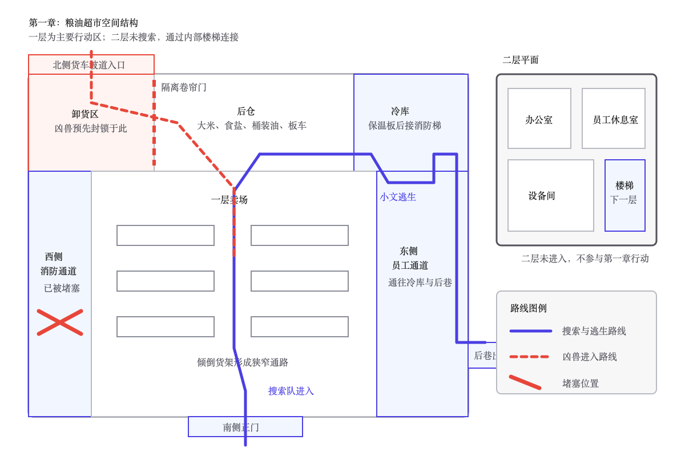

# 第一章 关门之后

灰雾把太阳磨成了一枚惨白的硬币。

它挂在城市上空，没有温度，也照不出多少光。沿街店铺大多敞着门，碎玻璃铺满人行道，偶尔被风推着滚动，发出细碎的摩擦声。更远处，一辆烧空的公交车横在路口，焦黑的车架像一具被啃净的骨头。

十个人贴着墙根前行，没有人说话。

他们手里拿着钢管、消防斧和削尖的木棍。队伍最前方的老秦握着一把弩，弩身被汗浸得发亮。那是整支队伍唯一算得上安静的远程武器。

老秦身后是背着撬棍和工具包的老韩。阿慧走在中间，不时摸一摸腰间仅剩的半卷纱布。第一次参加高危任务的小齐紧紧抱着钢管，嘴唇从离开基地起就没恢复过血色。周勇则背着最大的帆布包，走几步便回头看看，仿佛别人已经在商量如何少分他一份。

小文走在倒数第二位。

他背着空荡荡的帆布包，目光从路边招牌、楼顶窗口和废车底下一一扫过。灾变前，他送外卖时来过这片街区。前面拐过两个路口，就是此行的目的地，一家占据了两层楼的大型粮油超市。

“还看什么？”周勇压低声音，“路都快被你看出洞了。再磨蹭一会儿，里面真有东西也该被别人搬光了。”

小文指了指前方：“左边巷口多了一辆车。”

“昨天侦查图上没有。车头朝外，驾驶门开着，轮胎下面也没积灰。”小文说，“有人最近开过。”

周勇嗤笑一声：“昨天图上没有，今天就不能有？全城的破车还得先向状元报到？照你这么查，天黑了咱们也走不到超市。”

市状元三个字落在灰雾里，比路边褪色的广告还不真实。

三个月前，小文确实考了全市第一。父亲随后确诊尿毒症，母亲又突发中风，两个人相继失去工作能力。班主任打来电话时，他正穿着黄色外卖服，站在医院透析楼下等电梯。父亲的诊断书压在保温箱底层，母亲刚在康复科做完第一次训练。别人问他准备报哪所大学，他算的却是每天多送多少单，才能补上父亲下一次透析的费用。

后来大学没有等到他。

每天骑车穿过的街巷、为了避免超时记住的后门和员工通道，反而成了比录取通知更有用的东西。

老秦抬起拳头，整支队伍立刻停下。

他看了几眼那辆灰色面包车，又看向小文：“侦察图没有，驾驶门开着，车头还冲着出口。是这三点？”

“还有轮胎。”小文说，“雨停了半天，其他车轮下面都有一圈干灰，它没有。”

“绕行要多久？”

“从右巷穿过去，多走五分钟。出口能接回原路，路上有两道院门可以退。”

老秦点头：“那就绕。多花五分钟，最多晚回去喝口凉粥；走原路，是把十条命押在一辆来路不明的车上。”

“我也没说非走原路。”周勇嘟囔，“大家空着肚子出来，总不能看什么都像陷阱。”

“怕饿没错。”老秦重新端起弩，“因为怕饿就只看见粮食，才会死。走。”

周勇张了张嘴，到底没再反驳。老秦在基地里不算异能者，却带队活过了七次搜索。死人不会争论，能活着回来的人说话才有分量。

十个人钻进右侧小巷。

巷子里弥漫着腐肉和雨水混合的味道。墙角趴着两具残缺的尸体，灰白手指不时抽动。它们的脑袋已经被砸开，晶核也被人取走，只剩一点尚未散尽的活性。

经过尸体时，阿慧偏过头，脚步也慢了下来。

“阿慧，别看脸。”老秦说，“看手。手还能不能动，决定你能不能靠近。”

“我认识他。”阿慧声音发涩，“他在前街修鞋，女儿上初中。每次来药店买膏药都要最便宜的，自己舍不得贴，非说是给客人备的。”

周勇回头看了一眼：“人都变成这样了，你还记这些干什么？”

“不记得，他就真只剩一具尸体了。”

“记得也不能让他起来叫你一声。”

老秦没有停，只回头叫了一声：“阿慧，跟上。活着回去，再替他记着。”

话说得很硬，脚步却慢了一点。

小齐绕开尸体，忍了半天还是问：“秦叔，进超市以后真只待十五分钟？要是东西没装满呢？”

“装不满也撤。”

小齐迟疑了一下：“可任务要求把物资带回去。要是空手撤退，后勤处会判定任务失败，一点基础贡献也不给，路上吃掉的口粮还得我们自己贴。”

“小齐，人比袋子难补。”老秦看着他，“十五分钟一到，我叫你的名字，你就往外走。别数袋子，也别等别人。”

小齐点了两次头：“十五分钟，叫名字就走。我记住了。”

周勇哼了一声：“第一趟就怕成这样，回去还是接扫地任务吧。虽然一天三点，至少不用把裤子尿湿在外面。”

“怕才能记住命令。”老秦说，“你不怕，所以更要记。”

绕过面包车后，粮油超市出现在灰雾深处。

巨大的红色招牌只剩下“粮油”两个字，卷帘门被撞开半边，黑洞洞的入口后面散落着购物车。门前没有丧尸，也没有凶兽，安静得只能听见塑料广告布被风反复拍打墙面的声音。

老秦蹲下查看地面。

入口左侧有一道用白漆画出的斜线，斜线上压着两个短横。

周勇脸色一沉：“巨熊基地。”

不同基地会在搜索区域留下自己的记号。两横一斜，属于实力仅次于猎鹰的巨熊基地。两座基地长期争夺城北的地盘和物资，摩擦从未停止。这个标记意味着巨熊已经发现了超市，只是尚未完成清理。

“他们还没动手，说明里面的东西还在。”周勇舔了舔干裂的嘴唇，“巨熊的人吃肉，总不能连汤也不许别人喝。谁先拿到就是谁的，这是基地之间默认的规矩。”

“太新了。”小文说。

周勇回头瞪他：“又怎么了？一辆车不对，现在连墙也不对。你干脆说这整座超市都在等着吃我们。”

“白漆没有落灰。”小文说，“旁边墙面至少积了两天灰，这个标记不会超过半天。”

小文伸手抹过旁边的墙，再给众人看指尖。墙上积着薄薄一层灰，标记表面却很干净。

老韩用撬棍刮了刮卷帘门下沿，又蹲下摸过门轴。

“漆是新的，门也刚动过。”他说，“轴缝里的锈被磨掉一层。不是风吹的，至少开合过一次。”

“开过门不正说明里面能进？”周勇说，“巨熊可能遇到别的事，画完标记就走了。真有大货，我们现在掉头，回来连空袋子都没得捡。”

老秦盯着那道标记，眉头慢慢收紧。

“疑点不够让我们空手回去，也够让我们少贪一趟。”他重新给弩上弦，“进去以后不分散。十五分钟，不管找到多少都撤。老韩看门和电闸，阿慧走中间，小齐跟紧我。”

“十五分钟，装不满也走。”小齐重复。

“对。”老秦看了他一眼，“这次记得不错。”

超市里比外面更冷。

腐败的蔬果在地面化成黑水，货架横七竖八地倒着。手电光扫过一排排空荡荡的包装袋，偶尔照见墙上的暗红手印。众人沿主通道前进，很快在最里面发现了没有搬空的仓储区。

入口上方挂着一块断电的电视宣传屏。积灰之下，还凝固着灾变前最后一条新闻的半幅画面：深蓝色夜空里，一颗拖着银白长尾的彗星正在逼近地球。

最初，没有人把它当成灾难。

新闻连续播报了一个星期，专家说彗星只会从地球附近掠过，是百年难遇的天文奇观。有人提前订好露营地，有人在楼顶架起望远镜，小文送餐经过广场时，还见过商场把“末日彗星限定套餐”印在巨幅海报上。

灾变当天，彗星却在进入高层大气后突然崩碎。

没有足以摧毁城市的撞击，也没有遮天蔽日的火焰。无数发光碎片在天空中无声解体，释放出的灰色物质顺着高空气流扩散。不到数小时，灰雾便覆盖了人类能够联系到的每一片大陆。

最先倒下的是街上的人。

没有统一的年龄、血型和病史。约一半人突然失去意识，心跳和呼吸相继停止。半小时后，他们又一个接一个站了起来，扑向仍然活着的人。

剩下的人能够抵抗空气中的灰雾，却无法抵抗抓咬和进入伤口的体液。随后几天，猫狗开始长出不属于原本形态的骨刺和獠牙，植物的根须也会主动缠住经过的活物。少数幸存者则在濒死、极端情绪或长期接触灰雾后展现出异能。

没有人知道那是进化，还是另一种尚未完成的感染。

“米！老天爷，这不是几袋，是一整批！”

周勇的喊声把小文从电视屏前拽回仓库。

二十多袋大米、十几箱盐，还有成排的桶装食用油。仓库深处甚至停着两辆可以折叠的载货板车。

这些东西在三个月前随处可见，如今却足够十个人装满背包和板车，往返运送数次。猎鹰基地若能全部搬走，至少可以让数百人多撑半个月。

周勇扑到米袋前，掰着手指飞快计算：“大米至少五百斤，油有二十多桶，盐比米还值钱。就算后勤只按最低价回收，十个人也能分不少。先装油和盐，米压在板车下面，队长那一成我不争，剩下的可得按背回去多少算。”

老韩踢了踢板车轮胎，又压下折叠把手：“轴承没锈死，两辆都能用。每辆装三百斤不成问题，再多，东侧坡道推不上去。”

小齐看向老秦：“还剩十二分钟。装上车也要时间，八分钟是不是就得停？”

“七分钟停，留五分钟撤。”老秦说，“小齐报时。谁听见还往包里塞东西，我亲手给他倒出来。”

“别急着搬。”小文皱起眉，“这里有人来过，为什么留下这些？”

“有人进来不代表有能力搬。”周勇抓起一袋盐塞进背包，“也可能刚画完标记就遇上尸群。咱们十个人冒着命进来，不能因为你一句‘为什么’把全家的口粮扔在地上。”

“停手。”老秦说。

周勇抱着盐没动：“队长，时间正在走。你要查可以，让我们先装。”

“我说停手，不是让你换个姿势抱着。”老秦看向他，“放下。”

周勇咬了咬牙，终于把盐放回地面。

老韩沿仓储区外围检查，停在一道半开的防火门前。他没有伸手，而是先用撬棍挑开门缝。

门后系着一根极细的鱼线。

鱼线贴着地面延伸，穿过仓库后墙的小孔，连向北侧卸货区的隔离卷帘门。那片区域拥有直通街面的货车入口，灾变前专门供大型货车装卸货物。

老韩顺着鱼线看向墙孔，声音第一次快了：“不是报警线。它连着北侧隔离门，插销被卸过，只靠配重扣着。线一松，门就会升起来。”

老秦的脸色瞬间变了。

“所有人放下东西。小齐先走，阿慧跟着，原路撤！老韩，别碰那根线！”

话音未落，超市深处传来“咔”的一声。

像是卷帘门的插销被松开了。

紧接着，一股浓烈的血腥气从通风管道里涌出。不是积存多日的腐臭，而是新鲜血肉特有的甜腥。北侧卸货区的卷帘门缓缓升起，门后响起急促的抓挠声，一双又一双暗红色的眼睛在黑暗里亮了起来。

“门已经动了。”老韩把撬棍插进卷帘门轨道，肩膀死死顶住，“我卡不住多久，走！”

“秦叔，说好一起撤的！”小齐回头喊。

“小齐，看门，不要看我。按刚才说的走！”

第一只异化野狗从门下挤出，撞弯撬棍，直接扑倒了离门最近的小齐。

惨叫声只响了半截。

更多黑影从仓库两侧冲出。它们的肩背高过成年人腰部，嘴角裂到耳根，牙齿交错着探出唇外。

老秦扣下弩机，弩箭射进一只野狗眼窝。

老韩仍顶着撬棍。第二只野狗撞上卷帘门，他的肩膀猛地陷下去，靴底在地面犁出两道痕迹。

“轨道撑不住！”他咬着牙喊，“配重在左边，门全开以后就落不回来了！”

“老韩，松手！”

“松了它们全出来！”

老秦没有再命令他。他摸了一把箭袋：“我还有五支，最多替你们挡五次。所有人按原路退，走西侧消防门！”

“西侧消防门被货架堵死了！”前去探路的队员绝望地喊，“推不开，后面也没有路！”

“东侧还有一条员工通道。”小文迅速说道，“从第三排货架右转，经过冷库，尽头的保温板后面有消防梯。不要碰倒货架，声音会把野狗全引过来！”

老秦只问：“你走过？”

“灾变前送餐走过。图上没标，但出口通后巷。”

“那就换路。”老秦转身挡住过道，“所有人听小文指挥。阿慧清点人，周勇把你的大包扔了。现在里面装的东西只会拖死你！”

队伍瞬间被冲散。

小文翻过倾倒的货架，听见身后骨头被咬断的脆响。他没有回头。不是因为不害怕，而是因为他清楚，回头不会让任何人活过来。

弩弦在身后接连响了三次。

第四次隔了很久。

“还有一支！”老秦的声音穿过货架，“别替我数，继续走！”

紧接着，老韩喊了一句“轨道断了”。卷帘门撞上地面的巨响吞没了后面所有声音。

一组货架被野狗撞倒，朝阿慧迎面砸下。周勇先一步推开她，自己的帆布包却被压在货架底下。

他试着拽了一下，没有拽动。

“别看了！”阿慧抓住他，“命比袋子难补，你不是刚听过吗？”

“那里面还什么都没装！”周勇红着眼睛骂了一句，最终还是松手，“走，走！回去谁敢说我丢了装备，你得替我作证！”

“小文，等等我！”

“我就在前面。”小文回头报出路线，“右转以后贴左墙，地上有碎瓶。踩我踩过的位置，别碰货架！”

他们冲进冷库走廊。周勇和另外三人也追了上来，老秦却没有出现。下一刻，沉重的撞击声从超市大厅传来，一头背生骨刺的黑色野猪撞穿货架，堵住了来路。

“二级……”周勇的嘴唇失去了血色，“野狗就算了，为什么还有二级？这不是搜索，这是拿我们喂东西！谁报的任务，谁他妈早就知道！”

野猪低下头，鼻孔喷出两道白气。

它堵住冷库走廊的姿势，让小文想起了三个月前的医院。

灰雾降临时，他刚把一份外卖送到医院对面的写字楼。街上近半行人毫无征兆地倒下，几分钟后又以扭曲的姿势爬起。尖叫的人群全在往主路逃，小文却扔下电动车，逆着人流冲进医院。

父亲在地下透析区，母亲在三楼康复科。

门诊大厅已经失守，普通电梯每打开一次，都会涌出血和人。小文没有进去。他每天给住院部送餐，知道东侧污衣间后面有一部运输电梯，也知道康复科尽头的防火门可以绕开门诊。

他先找到母亲，再用污衣车推着她下到透析区。备用电源让医院勉强支撑了五天。第五天撤离时，主路被车辆彻底堵死，他又带着幸存者从送餐车辆使用的后勤坡道离开，才把父母送回居住区。

此后近一个月，小文骑着那辆外卖电动车，沿自己记过的商铺后门、楼顶水箱和小巷寻找食物与药物。直到父亲的药耗尽，母亲的病情继续恶化，一家人才加入宣称“不放弃任何普通人”的猎鹰基地。

现在，野猪堵住了正面通道。

医院教会他的事只有一条：所有人都在看正门时，先找后门。

“散开！”小文喊道。

骨刺擦着他的右腿掠过，裤管顿时裂开，脚踝也被碎裂的金属边缘划出一道深口。剧痛沿着小腿向上窜，他踉跄着撞上墙壁。

阿慧第一个冲回来，撕开自己腰间仅剩的纱布，勒住小文脚踝上方。

“不是咬伤，没有感染黑线。”她的声音抖得厉害，手却没有停，“伤口太深，绑一层止不住。你压住这里，我再绕一圈。”

“别管伤口了！”周勇冲到前方门口，拼命拉动把手，“门太窄，一次只能过一个。让我先出去，我出去以后接你们！”

另一名队员挡在门前：“队长让小文带路。”

“他腿都废了，还带什么路！”

周勇把那人推向一旁。对方撞上冷库的不锈钢门，巨响立即引得野猪转头。

“周勇，你把它引过来了！”阿慧喊道。

周勇看着那头转向自己的凶兽，脸上的血色彻底褪去。他刚才还愿意为阿慧推开货架，此刻却本能地抓住身边队员，把人挡在自己与野猪之间。

小文撑着墙站起，推开阿慧：“前面左转。冷库尽头有块颜色较深的保温板，推右下角，后面就是消防梯。出去以后别停在后巷，往南跑两百米再等人。”

阿慧停了一瞬。

“你伤口一动就会重新裂开。”她把小文的胳膊架到自己肩上，“路线是你找到的，你自己带。到了出口我再放开你。”

“阿慧，走！”

也就是争执的这一瞬，黑色野猪撞了上来。

墙面震动，灯架坠落。小文被气浪掀进旁边的杂物间，眼前一黑。等他从破桶和纸箱里爬出来时，走廊已经安静下来。

阿慧不见了。

周勇也不见了。

地面只剩下一串拖向黑暗的血迹。

小文咬住袖口，把阿慧留下的纱布重新勒紧。她打的结还在，只是已经被血浸透。他的手抖得厉害，补了三次才把结打牢。

“不能停。”

他低声对自己说。

父亲今天该接受治疗，母亲的药也只剩下一顿。他答应过，带回这批物资，就能凑够下一阶段的治疗费。

可是背包已经丢了。

九个人也都没了。

小文推开冷库尽头松动的保温板，拖着右腿钻进狭窄夹层。灾变前送餐时，他曾因为超市正门排队，从员工口中问出这条近路。那时只是为了节省七分钟，如今却成了唯一的活路。

身后的保温板刚刚合上，尖锐的爪子便抓穿板面。

小文顺着消防梯滚进后巷，肩膀和膝盖重重撞上水泥地。他顾不上疼，爬起来继续跑。直到超市彻底被灰雾遮住，他才扶着一辆废车停下。

城市寂静得可怕。

只有他的喘息，一声重过一声。

远处楼顶，两个身影正俯视着超市。

可轩收起装过鲜血的铁桶，又碰了碰手臂上的擦伤。昨夜为了把野猪和野狗从北侧货车坡道引进卸货区，他险些没能及时拉下卷帘门。

“大哥，跑了一个。”他探头看着小文消失的方向，语速越来越快，“那小子眼睛尖，进门前就发现面包车不对。他要是回去乱说，猎鹰肯定派人查。咱们脚印擦干净了吗？鱼线有没有留下手印？”

聂浩用鞋底缓缓碾过一处沾泥的鞋印：“他回去以后，会说自己看见了什么？”

“野狗、野猪，还有超市门口的标记。”

“谁的标记？”

“巨熊的。”可轩说完一愣，“你的意思是，让他替咱们作证？”

聂浩仍望着灰雾：“证词要由活人说出来才值钱。九具尸体只会让马克损失一支队伍，一个活人却能告诉他，该把这笔账记在谁头上。”

可轩咧嘴笑了，又很快收住：“可马克没那么蠢吧？一个标记就跟巨熊开战，他能坐到今天？”

“当然不会。”聂浩说，“精明人不会为了一个标记开战，他只会调查、提防，再把每一次损失都记下来。”

“那我们这不是白忙？”

“做买卖时，第一笔债从来不是为了立刻收回。”聂浩转身，把沾血的铁桶踢进楼道，“先让两边都觉得对方欠了自己。等账多到谁也不肯认，火自然就烧起来了。”

可轩跟上两步，又回头看了一眼：“真不用追那个小子？”

“他伤得很重。”

“那不是更该补一刀？”

“他若死在路上，事情不变。”聂浩说，“他若活着回去，事情会更好。无论哪一种，都不值得我们现在露面。”

两人从楼顶另一侧离开。

他们没有注意到，一只瘦小的狸花猫从废弃面包车底钻出。它的左腹被撕开一道伤口，前爪落地时也有些不稳，显然刚才同样被卸货区里的混乱波及。

它低头嗅了嗅小文留下的血，又抬起已经收缩成细线的瞳孔。伤势让它没有立刻扑上去，只是不远不近地跟着，等待前面的猎物彻底失去反击能力。

细雨落了下来。

狸花猫迈开脚步，不紧不慢地追进灰雾。
