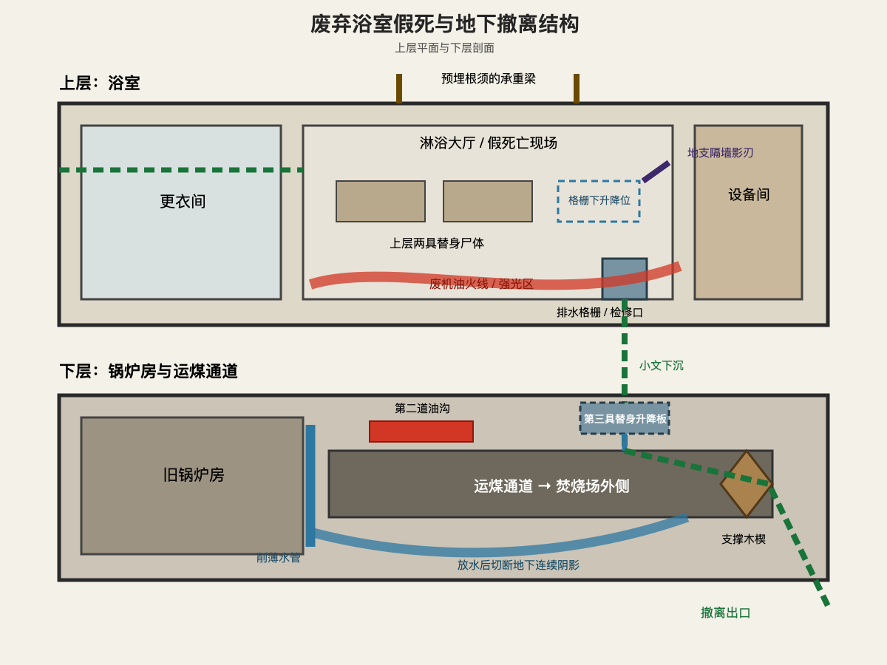

# 第七章 死于地支

小文一家没有从后门逃。

他们点亮屋里仅剩的油灯，收拾出三个明显的包裹，再从正门离开。街口两名巡夜守卫远远看见他们，立刻吹响木哨。

“站住！”

小文背起母亲，父亲拄着老杜的木拐走在中间。三人没有跑向基地边缘，而是径直穿过医务区，进入那座废弃半年的公共浴室。

这条路线看上去仓促、慌乱。

实际上，小文准备了一个月。

小文原本就准备在次日晚间带父母离开。为了避免猎鹰沿身份记录持续追捕，他把制造死亡记录列为失败时的备用方案。

他参加尸体清理时，知道停尸房每三天集中焚烧一次，也提前记下三具无人认领的遗体：一名身形与父亲接近的老人，一个与母亲年龄相仿的女人，还有一名烧伤严重、只能从骨架判断年龄的年轻人。

当天午后，小文篡改编号，把三具尸体转进浴室下方的旧锅炉房。

那不是一个完美计划。

只是他们唯一能够准备出的死亡。

浴室门在身后关上。

“按说好的做。”小文放下母亲。

父亲没有动：“你最后下来。”

“嗯。”

“超过两分钟，我们就放水。”

“别等我。”

“我不是在征求你的意见。”

父亲说完，掀开检修口。母亲撑着右手慢慢爬下去，左腿拖在铁梯上，发出轻微摩擦声。

“妈，慢点。”

“你少管我。”母亲回头瞪他，“把自己的命顾住。”

锅炉房里，三具尸体已经换上一家人的旧衣。父亲把自己的身份木牌挂到老人脖子上，又将藏着账页的木拐塞进母亲怀里。

“这东西比我们三个都容易惹祸。”母亲说。

“也比我们三个会说话。”父亲回答。

上层传来第一声撞击。

普通守卫被藤墙挡在更衣间。湿润墙缝中钻出的藤蔓交错成网，不足以杀人，却足以拖延。

“砍开！”

“叫地支大人！”

小文把带有影印的账册封皮放进中间被褥，再用三组藤蔓缠住尸体手脚。

一层阴影越过窗框。

地支已经到了。

他没有破坏藤墙，而是从隔壁设备间的墙影中浮现。强光从淋浴大厅中央油沟升起，把他拦在明暗交界处。

“你研究过我。”地支说。

小文藏在检修口旁，没有回答。

“医务室无影灯，暴雨排水渠，仓库油灯。”地支逐项念出，“目标有学习能力。”

“你也会害怕光？”

“不喜欢，不等于害怕。”

一道影刃从相邻墙面穿出。

小文猛地拉动藤蔓。三具裹在被褥里的尸体同时挣扎，其中两具像是在试图爬向后门，另一具护着怀里的账册。

地支没有生命感知。

火焰、烟雾和墙壁切断视线，他只能依据一路追来的影印、三个人进入浴室的背影，以及此刻移动的人形判断。

第一道影刃贯穿老人胸口。

第二道割开女人喉咙。

第三道却停在年轻尸体上方。

地支察觉到了什么。

“为什么不叫？”

小文心脏几乎停住。

锅炉房下面传来水管被扳动的轻响。

两分钟到了。

小文催动最后一根藤蔓，让年轻尸体抓住胸前影刃。黑色刀锋穿透手掌，尸体被带得猛然坐起。

地支终于刺下。

三具尸体全部留下他的伤口。

小文点燃剩余废机油。

火线沿淋浴大厅边缘合拢，强光把所有阴影压进墙角。地支被迫完全退出影化。他抬头时，承重梁里的根须已经同时收紧。

木头断裂。

屋顶向下倾斜。

“处理目标前，”地支平静地说，“应该先确认出口。”

设备间的影子伸向检修口。

小文一脚踢翻铁盆。燃烧的油顺着地面流过，截断那道影子。他跳进检修口，反手拉上铁盖。

屋顶轰然坍塌。

砖石砸中铁盖，也将整个浴室吞进火焰。

“放水！”小文在地下喊。

父亲拔掉削薄水管的木塞。

浑浊水流喷进运煤通道，很快没过脚踝。阴影刚从检修口缝隙渗下，便被晃动水光割裂。

母亲点燃第二道油沟。

她右手握着火柴，左手不听使唤地贴在身侧。火焰升起时，她被热浪逼退半步，却仍把火把扔准了位置。

“你小时候点煤炉，还是我教的。”她喘着气说。

“现在不是说这个的时候。”

“等安全了，你又不肯听。”

父亲来到最后一处支撑木楔前。

他的手因为尿毒症不断发抖，第一次没有拔动。

通道后方，黑影再次聚拢。

地支正在穿过上层废墟。

“我来。”小文伸手。

父亲推开他：“你维持根须。”

他用肩膀抵住木楔，一点点向外挪。粗糙木头磨破掌心，血流下来。

“爸！”

“我不是只能等你救。”

木楔脱落。

早被根须撑裂的砖墙向内坍塌。水流、火焰和碎石把通道彻底封死，也把最后一缕阴影挡在另一边。

三人沿运煤通道向前。

母亲走不快，小文便背起她。父亲扶着墙，每隔几十步就要停下喘息。

身后没有追兵。

但谁也不敢相信地支会被真正困住。

地面上，守卫们花了半个小时才扑灭火。

地支从废墟里走出，衣服烧掉一半，脸上依旧没有表情。他扒开砖石，找到三具焦尸。

尸体数量正确。

体型与性别大致吻合。

衣物、身份木牌和账册封皮全部在场。

三具尸体也确实留着他的影刃伤口。

一名守卫低声问：“处理完了？”

地支蹲在年轻尸体旁。

他的刀穿透这具身体时，没有听见惨叫。

也没有感到活人临死时挣扎的重量。

但周围守卫都亲眼看见一家三口进入浴室。火场外没有脚印，地下入口也被完全堵死。

证据指向同一个答案。

“目标处理完毕。”他说。

“要不要把尸体送去核验？”

地支看了守卫一眼。

“你核验？”

守卫立刻低下头。

地支撕下一小块烧焦衣料，收进掌心。

他报告了死亡。

却没有把怀疑一起报告。

运煤通道另一端通向焚烧场外。小文推开锈死铁门时，天边刚泛出一点灰白。

门外停着一辆运煤板车。

他们把父母藏进煤渣下，小文披上焚烧工的罩衣，推车沿废弃铁路向南。

猎鹰警钟在远处响了三次。

第一次代表火灾。

第二次代表敌袭。

第三次代表目标死亡、解除封锁。

母亲从煤渣下面伸出右手，抓住小文手腕。

“他们真以为我们死了？”

“地支会怀疑。”

“那还走这条路？”

“因为他只能怀疑。”

父亲在车下问：“账页呢？”

母亲敲了敲怀里的木拐：“比你儿子的命结实。”

小文继续推车。

太阳从灰雾后升起，没有照亮猎鹰。

从这一刻起，小文和他的父母已经死在地支手中。

活着离开的，是三个暂时没有名字的人。
