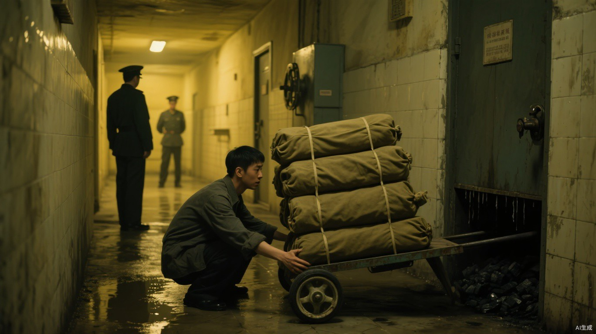

# 第十一章 缝影

距离父母被送往西区，只剩两天。

小文没有销毁账册。

封皮上的追踪若突然消失，地支会立刻封锁最后位置；直接回家，则等于把刀递到父母门前。

他先用枯藤卷住账册，让它沿废屋外墙移动。封皮暴露在路灯下时，远处屋檐的阴影便改变方向；塞进没有清晰投影的布袋后，那道影子又会停下。

缝影结只能借稳定投影判断方向，不能持续锁定持有者。

小文把账册留在废屋灯下，让藤蔓每隔一段时间翻动一次。地支会看见目标仍在移动，却看不见拿着它的究竟是不是人。

他从另一条无灯巷道绕回家，只争取到半个小时。

父亲听完后先问三个数字：“封城要多久？”

“最快十分钟。”

“住处到浴室？”

“二百二十米。”

“你妈能走多远？”

“平地六百米，再远需要车。”

“假目标多久会被发现？”

“不知道。按最坏算，二十分钟。”

父亲把数字写成三列：“那就没有直接出城的窗口。”

母亲扶着桌角看了半天：“你问完儿子能跑多快，怎么不问自己能走几步？”

父亲在纸上补了一行：“我最多三百米，需要木拐。你六百米，中途至少歇一次。”

“这还差不多。”母亲把纸转向小文，“别一张嘴就是你带账册、你引人、你断后。家里不是只有你一个动词。”

“我带账册引开地支，你们——”

“又来了。”母亲打断他，“计划里只要出现一句‘你们等着’，后面就一定全是你替我们决定。”

“他追的是我。”

“他追的是一家三口。”母亲看着他肩背渗血的位置，“两个病人如果只负责听话，执行时就是两个你没算进去的变量。”

三人重新分工。

父亲保管真账页和地下支撑，母亲负责身份衣物与第二道火线，小文携带带有缝影结的账册，把地支引进他们选定的现场。

门外突然贴出新通知：仓库失窃，所有未核验尸体当夜重新清点，焚烧提前十二小时。

地支在压缩他们能够藏匿证据与同谋的时间。

小文原定明晚转移三具候选尸体，计划当场失效。父亲先划掉体型最不像自己的旧候选：“肩宽差太多，火烧以后也未必盖得住。”

母亲翻出三层旧衣：“外套垫肩，里面绑木条。先问活人怎么走，别只顾死人像不像。”

过去十二天的准备被逐项拿出来。

三具候选不是当晚碰巧出现，而是四轮筛选后刻意留下；废弃浴室北墙后连着锅炉房，锅炉房运煤通道通往焚烧场；医务室无影灯曾让地支避开门口，暴雨排水也证明流动水能切断连续影迹。

他们只能确定三条原则：全黑换尸，固定单灯制造假影，最后用火与水破坏复核。

具体步骤没有任何一项保险。

转移尸体最难。

此前三天，小文借清理浴室废料，把停尸房长期积压、没有独立编号的残缺遗骸分装成三个密封尸袋，逐次藏进锅炉房废弃投煤口。它们不在当日转运木牌内，移动时不会立刻造成编号缺失。

提前焚烧的推车在入夜前经过废弃浴室。车上共有八只尸袋，三具候选被排在最下层。小文事先磨薄了左轮插销，推到浴室门前的凹砖时，车轮按预定方向脱落，整辆车歪向墙面。

押车守卫捂住口鼻：“还能不能推？”

“换插销要半刻钟。”小文掀起最上层防水布，让尸水顺着倾斜车板流向守卫脚边，“你可以留在这里看，也可以先去通知焚烧场晚一刻收袋。”

守卫骂了一声，退到走廊拐角，既没有靠近，也没有让八只尸袋离开视线。

他能看见推车，看不见车板与浴室墙之间不足两尺的死角。

小文拆轮时让细根从墙缝拉开三道旧投煤挡板，将最下层尸袋依次滑入锅炉房；预藏的三个替代尸袋同时被顶回车底，重量由碎砖和湿布补足。

一只候选尸体的手从袋口滑出。小文没有急着去塞，先把轮轴敲回原位，直到守卫被敲击声引得再次探头，才当着他的面重新束紧袋口。

“八个？”守卫问。

小文逐块指过木牌：“八个。你可以自己数第二遍。”

守卫看见尸水已经流到鞋边，没有上前。

焚烧端只核对尸袋和木牌，不会在疫病风险下逐个开袋。转出数、焚烧数、木牌数全部相同。

只有袋子里的人被换了。

三具候选在冷库里停留过，真正的血早已凝固。小文没有把希望押在尸体还能流血上。他在当日新送来的无主尸体胸腔里收集尚未完全凝结的血，分装进三个废弃输液袋；进入浴室后再用锅炉余温隔水加热，分别压在三具替身的衣物下面。影刃切入时，先破的是血袋。

母亲拆下三人的旧衣和身份木牌，另备三套随时可以丢弃的外套。父亲将木拐夹层重新涂蜡封死，又在锅炉房支撑处预埋木楔。

第三具替身的处理与前两具不同。除血袋外，母亲又把一只温水薄囊缝进它腹部，在灰色夹衣肩口穿入抽拉绳；父亲削出一截能够在胸口受压时挤动肺部的弯木。小文则反复测试排水格栅下的升降板，确保配重松开后，尸体能在两个呼吸内顶到他原本站立的位置。

他们没有把这一步叫作“换人”。它只有在固定灯熄灭、地支看不见影子的短暂空白里才可能成立；慢一息，小文和替身就会同时留在灯下。

马克得知账册失窃后没有封城。

“窃取者若只想逃，拿到账页就会走。”他对地支说，“他还留在城里，说明这里有比证据更重要的人。”

“是否收网？”

“继续追踪。让他把我们带过去。”

地支在废屋外读完墙面影迹，确认持有者只短暂停留，附近没有第二个人长期活动。他知道小文已经察觉缝影结的条件，却故意撤掉两名可见监视者。

猎物需要一点希望，才会主动走向出口。

小文也没有相信监视消失。

他把逃亡分成两层。表层路线通往巨熊，沿途留下板车轮迹、鞋印和沾血旧衣；真实路线不经过任何城门，而是从浴室进入锅炉房，再由运煤通道抵达焚烧场，混入清晨运出的煤渣车。

父亲看着地图：“地支若亲眼确认尸体，马克还会复核。”

“所以三具尸体要被他的影刃击中，焚烧数要对，最后还要让搜查指向巨熊。”

“你怎么保证他攻击尸体？”

“不能保证。”小文说，“我只能让他看到所有他习惯相信的证据。”

母亲问：“失败呢？”

“你们先下通道。”

“又是这句。”

小文停了一下，改口：“失败时，爸抽掉支撑，我断后；如果我没下来，你们按原时间放水，不等。”

母亲盯着他很久：“这才叫计划。不是一句让我听话。”

半小时到了。

小文重新取回账册。

封皮离开流动水面的一刻，墙上原本被水光切碎的黑影忽然停住。

一片。

两片。

所有暗斑像嗅到血的虫群，贴着砖缝朝账册缓缓合拢。

父亲把木拐夹进腋下。母亲用右手替小文拉紧那件准备烧掉的旧外套，拉链卡了两次，她索性用牙咬住布边，狠狠向上一拽。

三个人谁也没有说告别。

屋里能证明他们生活过的东西都留在原处：父亲分到一半的药，母亲没缝完的衣角，小文床下那双已经磨穿的外卖鞋。

小文最后看了一眼，推门。

门边水桶被他故意撞翻。

清水哗地铺开。三个人的脚步将走廊灯影踩得不停摇晃，父亲的木拐每隔两步便重重落下一次。

“站住！”

他们没有停。

巡逻守卫的喊声追在身后。更远处，屋檐下那片静止已久的阴影也动了。

它先吞掉第一根廊柱的影子。

再越过第二根。

没有脚步，没有呼吸。

只有黑暗一段接一段向他们追来。

母亲听见身后灯火熄灭，抓紧了父亲的衣袖。

小文没有回头。

他知道，地支来了。
