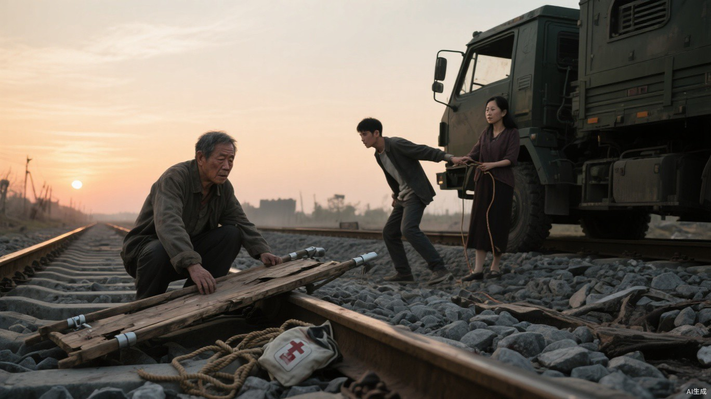

# 第十三章 南下铁路

煤渣车留下的黑烟消失后，小文背着父亲沿废弃铁路走了一段。父亲几次拍他的肩，等他停下，才扶住木拐自己落地。

父亲走了不到百米便扶着木拐干呕。唇边残留的淡红泡沫被风吹出细丝，鞋面也被重新浮肿的脚背撑得发亮，每一次呼吸都像有水压在胸口。

“按上次维持治疗算，最迟明晚。”他自己报出期限，“再晚，我可能走不了。”

“今晚前先找到水。”小文没有讨论放弃谁，“沿南线走。”

母亲用右手拄着捡来的钢管：“你腿上的血先止住。三个人一起走，不是一个人拖两个。”

他们在废弃收费站遇见四名流民：带孩子的女人、熟悉附近水路的老人，以及一名腹部受伤的青年。青年自称伤口来自翻车，衣服上的切口却平直得像刀伤。

小文没有拆穿，只指了指他腹部已经发黑的布条：“这不像车皮刮的。你不想说是谁动的刀可以，但得告诉我血什么时候止住、现在还能不能跑。”

青年下意识按住伤口：“两个小时前。我能走，跑起来会重新裂。你们要是怕我拖累，我自己落后。”

“正因为会流血，才别走队尾。”小文把一截干布递过去，“你留下的血会告诉东西我们有几个人，也会告诉它们最慢的是谁。走中间，布湿透前说一声。”

老人带他们找到封闭雨水箱。铁盖掀开后，一股湿叶和铁锈味先冒出来。孩子蹲在旁边，看着水面漂过一只虫尸，皱着脸问：“这个喝了会不会在肚子里继续爬？”

“会。”老人一本正经地说，“所以先拿布滤，再烧开，把它们都烫得不会爬。”

孩子立刻缩到母亲身后。女人瞪了老人一眼：“他从昨晚到现在一口水没喝，你就不能说句好听的？”

“好听的不能杀虫。”老人把最干净的一块布递给她，“你兜住四角，我倒水。看见还有腿的，再滤一遍。”

母亲用还能活动的右手帮忙压住布边：“他说话吓人，办法没错。先让孩子抿一口，十分钟没吐，大人再喝。”

众人轮流清理腐叶和虫尸。等其他人都绕到水箱内侧，母亲靠着外墙坐下，用身体挡住缺口。小文让父亲坐到她身后，左手压住砖缝里的一簇野草，右手扣住父亲手腕，只做了三个呼吸。草叶失去光泽，父亲胸口的湿响随之减轻；能力停止时，小文腿上的旧伤也重新渗血。

父亲脚背的浮肿没有立刻退。老人拆下收费亭旁两根短栏杆，带孩子的女人把旧篷布穿在中间，扎成一副拖行担架。平地由众人轮换拉行；遇到铁轨和碎石，父亲再拄木拐下来走。

午后，铁路养护站方向传来两轮枪声。

第一轮短促整齐，第二轮混着斧头砸击金属的声音。小文让所有人伏进排水沟，独自沿铁轨爬上路基。

战斗已经结束。

一支无旗猎鹰小队与巨熊巡逻队倒在养护站两侧。幸存猎鹰队员腹部中斧，仍死死抱着背包：“火花的摩托信使说……账页在前面。巨熊扣了人……”

另一侧巨熊尸体下压着一张猎鹰路线图。图纸过于干净，折痕也刚压出来。

火花商队很快抵达。

他们带来的止血带、担架和交换文书恰好足够处理双方伤员。聂浩没有出现，可轩骑着摩托前后奔跑，一边让风把血腥味送离主路，一边催促人收走武器。

“都别瞪了。”可轩对两边说，“活人回去才能告状。死在这儿，连谁先动手都归乌鸦编。”

他嘴上抱怨麻烦，人员撤离却快得像演练过。最后一辆车离开时，连临时运输口令和伤员姓名都已经登记完毕。

小文等发动机声彻底消失，才检查现场。

巨熊标记画在落尘上，底下没有旧漆渗入的颜色。封路钢丝使用反向双扣，与粮油超市开启卷帘门的机关完全相同。侧沟里还有一袋诱兽血，摆放位置处于下风口，自然风根本不可能把气味送向交火点。

有人用局部气流改变过风向。

假归属，单一退路，气味诱导。

小文刮下一片白漆，又剪走带结钢丝。粮油超市没有留下可供比对的实物，他只能判断两个现场手法高度相似，不能把“同一执行团队”当作已经证实，更不能证明命令来自谁。

火花驻地里，可轩正在洗手上的血。

“两边各死了人，车队口令也拿到了。”他说，“要不要再添一把火？我还能让血味往巨熊那边飘。”

聂浩把两份互相矛盾的口供封进不同信袋：“火还没烧起来时，添柴有用。现在风已经起来，再靠近只会把自己熏黑。”

可轩把沾血的手往水盆里又搓了一遍：“人我撤了，口供也送了，接下来就坐着等？我不怕闲，我怕他们忽然想明白，回头先把咱们当柴劈了。”

“把口供送出去。然后让他们自己决定，死去的人值不值得开战。”

窗外风向旗由北转南。

聂浩慢慢道：“他们会替我们把火吹大。”

铁路旁，小文让众人绕开尸体继续南下。刚走出养护站，一辆巨熊接应车从北侧追来，残余巡逻队封住前路。

队长没有先问名字，只让小文催动一株路边野草。看见枯叶重新抬起，他才检查一家人的状态。

父亲手臂有透析瘘痕，脚踝浮肿，呼吸带着湿重杂音，药袋里只剩零散药片。母亲仍能借钢管行走。

队长很快完成计算：“植物系，一级，可征调。女人能做整理和缝补，占一个家属额。老人长期耗药，还需要治疗异能，不收。”

“我们不去巨熊。”小文说。

“边境战时征调，不是邀请。”

队长让人把一壶水、一把刀和半日口粮放到父亲身边：“你和你母亲上车。他留在这里。你若再用异能替他续命，等于主动降低战力，你母亲的额度也会重新核减。”

父亲看了一眼药量，又看向北侧车辆：“小文，按距离算，跟他们走至少能保住你妈。”

母亲立刻转头：“今天能按价值丢下你，明天他受伤，他们一样会重新算。你别拿别人的刀替自己做减法。”

小文只说：“我不走。”

队长抬手。

一名队员踩住担架绳。

刀刃压下去时，麻绳没有立刻断。绷紧的纤维一股接一股崩开，发出细小而清晰的噼啪声。

小文猛地向前。

两条手臂同时从后方扣住他，肩关节被拧得发麻。他只能看着最后几根绳丝在刀锋下拉长，变白。

“反抗造成的每一道伤，”队长贴近小文耳边，“都从你母亲的家属额度里扣。”

绳断了。

失去牵引的担架先向后滑了一尺。父亲伸手去抓铁轨，浮肿的手指刚碰到锈面，担架右轮便陷进碎石。

整个木框翻下路基。

药袋从父亲怀里滚出来，白色药片撒进黑色道砟。一片，两片，很快便分不清哪一片还干净。

“爸！”

木框撞上石块。

咚。

声音不大。

小文却像被那一下撞在胸口，身体骤然绷紧。身后两人同时加力，把他的肩膀压得更低。

母亲用钢管抵住车门，右手指节一寸寸发白：“让他看一眼！人摔下去了，你们至少让他看一眼！”

巨熊队员掰开她的手指，将她推进车厢。

铁门沿滑轨轰然拉开。车厢内部没有灯，黑暗从门里压出来，吞掉母亲半边身体。

小文被拖向那扇门。

父亲在路基下面咳了一声。

很轻。

第二声没有响起。

小文拼命转头，颈侧青筋绷起，视野里却只有铁轨、散落的药片和半截断绳。

车门越来越近。

他仍然看不见父亲。
