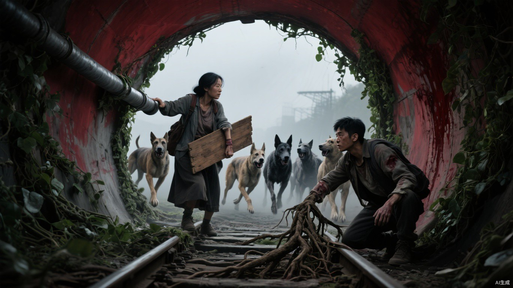

# 第十四章 去往何处

南侧林线同时向下伏倒。

先传来的是枯枝连续折断声，随后才是低沉犬吠。巨熊斥候只看了一眼便吹响骨哨：“两翼都有，至少十二只！”

反扣小文双臂的两个人同时松手。

“归队！护车！”队长厉声下令。

此前腹部受伤的青年一路滴落的血，把袭击过南郊运粮线的异化犬群引上了铁路。它们没有沿同一条路追，而是分成两股贴着灌木逼近，显然已经学会围住猎物的退路。

巨熊巡逻队刚在养护站交火中减员。若继续分出两人押送小文，北侧接应车会在合围前失去完整阵形。

小文扑下路基，扶起翻倒的担架。

父亲额角撞破了一道口子，木框也折断一根横档。他还能回答小文的询问，胸口的湿重喘息却比刚才更急。小文只来得及摸过他的颈侧、确认脉搏没有骤降，林线里的犬吠已经逼近。

队长看见他重新挡在父亲身前，握住刀柄，却没有拔刀。强抢一个一级植物系，意味着先和小文拼命，再背着两个无法行走的人突破犬群。

这笔账不值。

“上车。”他命令自己的人，“能走的跟我们走。”

带孩子的女人刚向前一步，队长已经关上车门。发动机轰鸣，车辆沿北侧铁轨旁的碎石路撤离。最后一名巨熊队员扔出示警火筒，红烟在半空炸开，却没有留下一个人守住被他们判定为负担的流民。

第一只异化犬从坡顶跃下。

小文没有追车。他把父亲担架重新扣好，让老人和女人把伤员送进铁路涵洞。

“里面有多深？”父亲问。

“二十七步后转弯，入口只能并排过两只。”

“你打算守入口。”

“不是守。”小文看向铁轨两侧疯长的野藤，“拖到它们觉得代价太大。”

母亲把钢管横在涵洞口：“那就别说成你一个人的事。”

带路老人从担架底下抽出铁锤：“我这把年纪跑不过狗，砸鼻子还行。你告诉我站哪儿，别等打起来再把老人和伤员混成一堆。”

带孩子的女人把孩子推到父亲担架后，自己捡起一块断木板：“我堵上面的裂口。先说好，我手抖，不代表我会松。”

腹部受伤的青年按住渗血位置，勉强笑了一下：“那我负责最不体面的活。哪只爪子伸进来，我就扎哪只。”

犬群没有立即冲击。

领头犬肩高接近成人胸口，右耳缺了一半。它先让三只瘦犬从正面逼近，另外几只绕向涵洞上方。小文催动根须贴着碎石延伸，直到第一只前爪跨过枕木才猛然收紧。

犬身翻倒。

第二只踩着同伴跃过来，咬断藤条。小文没有补原来的位置，而是让根须从枕木下抬起废弃钢索，勒住它腹部，将它甩向涵洞侧壁。

领头犬仍没有动。

它在试小文控制植物的距离和速度。

“右上。”父亲忽然说。

涵洞顶端落下一片碎土。一只异化犬沿斜坡绕到上方，正试图从排水裂口钻入。母亲把钢管顶进裂缝，女人也用木板抵住。犬爪抓穿木板，离孩子的脸只剩半尺。

腹部受伤的青年从地上坐起，用短刀刺进犬爪关节。他自己伤口随之崩开，血涌得更快。

犬群躁动起来。

小文知道领头犬等的就是这一刻。涵洞里的血味变浓，它不必再试探。

六只犬同时冲下路基。

小文把入口藤墙全部收紧。第一层被利爪撕断，第二层缠住犬腿，第三层沿着钢轨爬升，将最前面的两只悬在半空。根系传来的每一次撕扯都像落在他自己的神经上。

肩伤先裂开，温热血液沿手臂流下。

紧接着是假死时被缝影撕开的腿。小文膝盖一软，半跪在涵洞口。

“十二息一撞。”父亲在后方报数，“头犬还没进。它在等你补墙。”

小文也看见了。

领头犬每次都让普通犬咬断同一个缺口，逼他持续把力量投入正面。两侧灌木下的根须却传来更轻的踩踏。它准备从涵洞侧坡跃过藤墙。

小文故意第三次补住正面。

领头犬动了。

它没有沿地面冲锋，而是踩上一只被缠住的同类，借力越过两米高的藤墙。小文在它腾空后才松开正面根系，让全部力量涌向涵洞上方。

枕木缝里的细根托起一块松动道砟，打偏它受伤的落点。母亲同时用钢管顶住它咬来的下颌。

犬齿擦过她右臂。

小文抓住领头犬落地失衡的一瞬，让藤蔓缠住缺耳，向伤侧猛拽。青年忍着腹伤将短刀送进它前腿肌腱。

领头犬惨叫着翻滚，尾巴却扫中小文胸口。

他撞上涵洞壁，嘴里涌出血。

其余犬群没有退。领头犬的受伤反而让它们彻底失控，正面藤墙被连续撕开。小文只能一次次重新催生。周围野草从绿变黄，再从根部枯死，能够借来的生命越来越少。

“第九次。”父亲报数时声音已经发抖，“再补一次，你会先倒。”

“不补，它们进来。”

“那就把缺口留窄。”母亲用最后一条干净布带勒住小文肩膀，“别想着堵死，让它们一次只能进一只。”

小文改变根须方向，不再与犬群正面角力，而是把断藤收向两侧，留出不足半米的入口。

第一只犬挤进来，肩骨卡住。老人用铁锤砸向鼻梁，青年补上第二刀。第二只踩着尸体向内钻，又被母亲的钢管顶偏。

他们不是在等小文独自救命。

每个人都在承担一个位置。

可犬群数量仍然更多。领头犬重新站起，拖着断裂前腿向入口逼近。小文视野边缘开始发黑，藤蔓也一根根失去控制。

风向忽然变了。

先是小文额前被血黏住的头发向右飘了一下。

随后，涵洞里的灰尘、断草和血腥气像被一只看不见的手同时攥住，猛地抽向西侧废车。

犬群齐齐转头。

一声短促锐响贴地掠过。

领头犬后腿忽然失去支撑，身体向前栽倒。断裂肌腱处的血还没喷出来，第二道风刃已经切过它身后的碎石，逼得两只异化犬同时跃开。

南侧路基上，一排人影从灰雾里显现。

没有人喊杀。第一排半跪举弩，第二排把血袋抛向废车，最后一人扬起手，横风立刻卷住腥气，在犬群鼻端拖出一条通往西面的路。

他们原本在追踪连续袭击南郊运粮线的犬群，巨熊撤退前升起的红色示警火筒让搜索队提前确定了合围位置。若不是那道烟，他们还要晚到至少一刻钟。

犬群终于被引离涵洞。

小文仍维持着抬手的姿势。

可藤蔓已经不再听话。一根断藤从涵洞顶垂下来，在他眼前缓慢摇晃，摇到第三次时，整片视野也跟着倾斜。

有人冲进来接住他。

不是先搜身，也不是先问异能。

那双手只在他颈侧停了一瞬，便立刻转向路基下的父亲。

为首女人跪进泥水里，掰开父亲眼皮，又将耳朵贴近他的胸口。她语速很快，每句话却都落到具体的人身上：“老人额角裂伤，意识还在，肺部积液更急，十分钟内必须转移。少年失血，先压胸口。腹伤者别拔刀。能走的抱孩子，不能走的上担架。”

有人亮出袖口标记。

两片交叉的翠竹叶。

标记被犬血和泥盖住大半，小文还是认了出来。

翠竹。

那个会没收财产、强迫劳动、把外来者关起来的地方。交换市场里所有人都是这样说的。

他张了张嘴，想让对方先别碰父亲，想问他们要把一家人带到哪里。

为首的苏禾却没有问他是什么异能，也没有先清点他们剩下的药。她指向呼吸最困难的父亲。

“先抬那个病得最重的老人。其他人原地缴械，边走边登记。”

两名队员立刻越过小文，把父亲连同断裂担架一起抬起。白色急救布从父亲胸前展开，在涵洞暗处亮得刺眼。

这是小文失去意识前看见的最后一个画面。

黑暗压下来时，苏禾的声音仍在催促：

“担架稳住，老人先走！”
