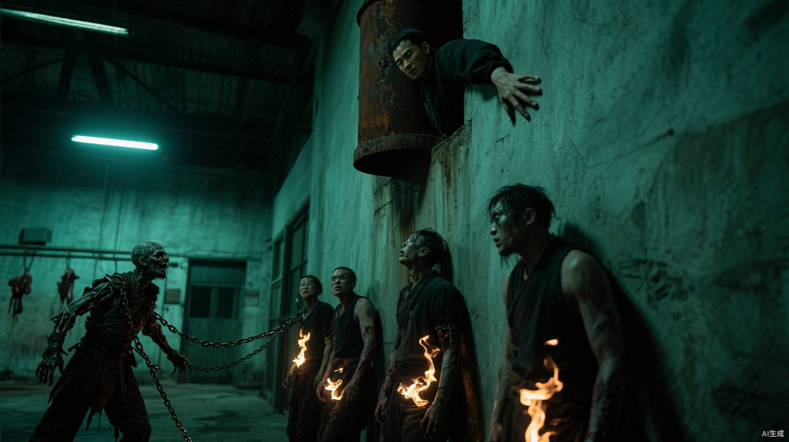

# 第十五章 同一笔账

小文醒来时，先闻到煮沸过的布和草药味。

屋顶很低，墙面没有装饰，床边挂着一块编号木牌。门外守卫收走了所有武器，连母亲那根钢管也登记在册。

“你们在哪儿找到我？”他问。

苏禾站在门口：“铁路涵洞。你昏了十一个小时。肩背失血，腿伤二次撕裂，至少七天不能参与外勤。”

“我父亲呢？”

“肺部积液，已经吸氧、利尿，饮水和静脉用液都在限量。药量按急救标准，不因你是异能者增加，也不会因为他不能劳动减少。”

小文撑起身体：“条件是什么？”

“缴械、登记、七天隔离，服从宵禁。能劳动以后按能力分配岗位。”苏禾看着他，“救命本身没有附加条件。”

翠竹不知道一家人来自猎鹰，只把他们当作铁路上救回的普通流民。没有证件的人可以登记自报姓名、身体特征和同行关系，不必证明灾前身份。

父亲、母亲和小文用了三个临时名字。

他们没有因此得到更差的床位。

父亲发现配给少了一勺粥，提出复核。管理人员没有呵斥，而是取来原始登记，确认量杯刻度磨损，当场补足整间隔离屋的差额。母亲追问药品去向，医务人员便把当日领用与剩余数量一项项给她看。

管制是真的，贫困也是真的。

但这里的规则允许被询问。

更重要的是，一家三口的临时住处、最低配给和父亲治疗已经批准。没有人问他们能提供什么秘密。

“留下吗？”父亲问。

小文看着药房门外同样排队的伤员：“至少这里不会先问你值不值得治。刚才少一勺粥，他们查的是量杯，不是先查你有没有资格开口。”

父亲摸了摸临时身份木牌：“我们连真名都没说。他们若一直不问，反而更难判断。”

“不问秘密，不等于不管人。”母亲把他手里的木牌翻回正面，“七天隔离、宵禁、缴械，一条没少。先住下，不是把命交给他们，是看这些规矩明天还认不认今天的账。”

她又看向小文：“还有，你别因为人家救了我们，就急着替他们卖命。感激是感激，判断是判断，别搅成一锅粥。”

小文点头：“先留下，原件不交。”

安置确定后，小文才处理账页。

他没有交出藏在木拐里的原件，也没有说明真实姓名。他只抄下下一次朝贡的日期、人数、名单暗语和核验位置，拓下马克私人印章；白漆碎片和反向双扣钢丝则装进另一个袋子。

材料通过隔离区公开设置的匿名检举箱送出。

小文不是用它换身份。他只是不愿五名尚不知情的人重走老杜的结局。足以救人的核验方法可以交出去，足以暴露父母仍活着的原件必须留下。

检举箱每天由民政和审查人员各持一把钥匙共同开启。纸条、漆片和钢丝被分别放上编号铁盘，原始封口先由两名经手人签字，才送到顾衡桌前。没有人能够单独抽走其中一样，也没有人因内容敏感先去隔离屋寻找投信者。

顾衡收到材料后，没有把两条证据强行拼成一个结论。

“目前只能证明一件事，推断一件事。”他说，“朝贡日期、名单暗语和私人印章可以彼此核验，这是证据。白漆和钢丝只能证明铁路现场有人伪造归属；粮油超市没有留下可比对原件，所谓同一种手法只是举报者的陈述。不能据此认定幕后是聂浩。”

苏禾核对风向和兽血位置：“火花商队抵达太快。这个时间差可以单独复核，最多证明有人提前知道交火时间。”

韩拓问：“介入要损失几条运输线？”

“最坏两条，药品交换也会停。”

许岚没有要求先找举报者：“先算下一批贡品还有多久。”

顾衡核对纸条与交换日历：“四天。名单在明晚封存，真正转运仍在第四日午夜；我们最多有两天把核验方法送到猎鹰。”

“顾衡拆分证据，苏禾选两条互不接触的递送线。”许岚把责任和中止条件逐项落下，“每个人只带一半，即使被搜也不能单独指向举报者；两日内没有送达回执，就停止后续联络，不派人沿途寻找。不公开站队，不找原件持有人。”

他们最终选择天干。

线索被拆成两份。一份由正常交换队携带日期和旧体育场诱饵，另一份由晚两个时辰出发的修理工带走名单暗语与真正核验位置。两人从不同入口交给天干值守处，彼此不知道对方身份；任一份被截，都无法构成完整指引。

火花探子在中途拆开第一份，抄录后重新封好，没有让交换队察觉，也没有截断它继续前往猎鹰。

可轩把纸条交给聂浩，手指在“旧体育场”四个字上弹了两下：“地点、日期、从哪扇门进去，全替咱们写好了。写信的人这么怕我们迷路？要不要把那里清掉，顺便真摆五个人给他们看？”

聂浩看了日期：“不用。真想让人去旧体育场，不会把地点写得这么完整。另一半还在路上。”

“那我去拦修理工，还是回头追交换队？”可轩已经把摩托钥匙套上手指转了一圈，“先说好，只追一个。今天的油只够我勤快一次。”

“谁都不拦。让猎鹰先看见自己的账。”

钥匙在可轩指间停下：“不拦人，也不清场。你叫我来，就是让我把纸送上楼？”

“还要你记住纸是从谁手里经过的。”

“行吧。”可轩把钥匙揣回去，“腿省下了，脑子又得加班。”

两份信先后抵达天干手里。第一份给出日期，第二份的暗语让他排除旧体育场，把真正核验点锁定在废弃屠宰场。

他没有向马克询问，也没有带队惊动守卫，只把魂火标记留在下一批五名“西区安置者”身上，独自跟到废弃屠宰场。

原本焊死的冷库铁门从里面打开。

天干藏在上风处烟囱内，锈蚀铁皮隔开了视线，却隔不断他亲手留下的五道魂火。下方传来铁链拖过水泥地的声音，随后是冷库门轴缓慢转动。

第一道魂火被疫手碰触后没有立即熄灭，而是从边缘向内变黑；第二道开始剧烈跳动，像有人把另一团意志硬塞进活人体内。天干右手按住烟囱内壁，没有发动照命。场内至少还有三道高阶丧尸魂火，一旦暴露，他救不出五个人，也带不回能够迫使马克回答的事实。

第五道魂火发生同样变化后，他才撤掉标记。

失踪记录不是误差。

回到猎鹰后，他把朝贡抄录放到马克面前。

马克看见私人印章，先问：“有没有惊动尸王？是否有人跟踪？”

“没有。我等五道魂火全部发生感染变化才撤离，也没有带任何人回来。”天干按住抄录，“现在回答我：记录属实，还是有人能够伪造你的私印、暗语和西区交接？”

马克没有再看那张纸：“属实。每七天五人，换西区主群改道；从第一笔开始，印章就是我亲手盖的。”

马克没有把朝贡称为谋杀。他展开三个月尸潮分布图，指出西区尸群两次替猎鹰挡住更大尸潮。

“停止以后，谁承担城破时几千人的死亡？”

天干问：“为什么名单里没有管理者和异能者？”

“因为医生、水井工、守城者死一个，会带走更多人。把不同职责放进同一个箱子抽签，只是表面公平。”

“命令可以要求我去死，也可以要求天干中的任何一名战斗人员去守必死的位置。”天干盯着他，“可你从没有把这条命令写给制定名单的人。”

“你死了，魂灯网络会一起消失。”马克平静地看着他，“我不会为了证明自己公平，故意选择损失更大的答案。”

天干要求停止下一次朝贡。

马克没有处罚他，只让他在四天内提出能够替代尸王庇护的完整防御方案。方案可行，交易便停。

这是一个看似尊重意见、实际短期内无法完成的选择。

天干知道自己仍被操纵，却也无法否认尸潮图上的数字。他没有背叛，只第一次拒绝说“确认”。

隔离第五日，小文从公开配给价和交换队回报里发现三项异常：猎鹰大量收购燃油，巨熊停止出售晶核，火花却同时替双方运输。他把判断、依据和可能出错的地方分成三栏，写在配给复核单背面，交给隔离区值守。

“两边都在为同一批东西加价，火花却没有承担任何一边的风险。”他对前来复核的顾衡说，“这只能证明战争概率正在上升，不能证明谁会先动手。建议停用火花路线，准备七天口粮，南侧预留隔离区。”

顾衡核对完三份交换记录，才把这份意见带进军事会商。韩拓先问的不是报信者是谁：“现在停两条路线，药品能撑多久？南侧仓棚改成隔离区要多少木料？判断错了，谁负责恢复？”

他逐项算完，给出结论：“药品缺口最多撑七天；先清一间仓棚，保留第二间原用途；四十八小时没有新增伤员，就恢复一条线路。”

许岚批准了这个有中止条件的最低准备。小文没有进入会议，也没有得到指挥权；他的意见只是因为依据能够复核，被放上了桌。

就在天干与马克分歧最深时，猎鹰北部仓库遭袭，三十余人死亡。现场留下巨熊标记和制式武器。

马克没有被怒火推动。他封锁消息，安排一支真实运输队，再向三名后勤主管分别透露三条只有一个细节不同的改道路线。

“谁把哪条路送出去，明早就知道。”

三封命令同时离开办公室。

第一封写东侧水厂，封口压一道横纹。

第二封写北部煤场，封口压两道。

第三封写西北旧桥，封口没有纹路，只在蜡边留下一个针孔。

三名主管分别进来，分别领走，谁也没有见到另外两封。

夜色落下后，三支车队从不同仓门出发。车灯很快被灰雾吞没，只剩三道发动机声在城外渐渐拉远。

马克一夜没有离开办公室。

墙上的路线图被油灯照成暗黄。他在三个目的地旁各放了一枚弹壳，随后合上所有调度记录，只让通讯员守着桌角那台旧电台。

天快亮时，第一只弹壳仍然立着。

第二只也没有动。

电台里只有持续不断的沙沙声，像远处有人在灰雾里磨刀。

太阳越过城墙的前一刻，喇叭突然炸响。

“运输队遇袭！重复，运输队遇袭！坐标西北——”

枪声吞掉后半句。

紧接着，通讯彻底中断。

屋内没有人说话。

马克伸出手，缓缓推倒第三枚弹壳。

弹壳滚过地图，停在那座被红笔圈出的桥上。

西北旧桥。
