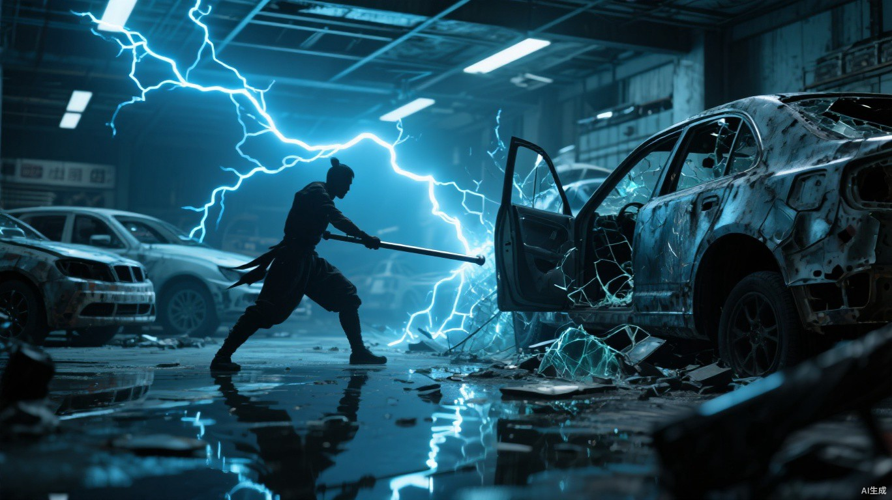

# 第十六章 借刀

三条假路线里，只有西北旧桥传回遇袭信号。

马克把对应的后勤主管带进办公室，没有刑讯，只让他坐在三张路线图前。

“你拿到的是西北线。”马克说，“伏击也发生在西北线。现在告诉我，中间还有几个人。”

主管坚持了不到半小时，供出一名使用巨熊暗号的中间人。他不知道情报最终交给谁，每一次转交也确实经过巨熊控制区。

证据完整得过分。

马克没有因此宣布答案。他命地支继续追查，同时召见梁肃和聂浩，要求火花交出全部外勤记录。

梁肃当场拍桌：“火花替你们运伤员、运药，最后还得把每个车轮印交出来？今天怀疑路线，明天是不是要查我睡在哪张床上？”

聂浩等他把话说完，才把两名潜伏人员、三份往来账和一条通往巨熊的秘密联络线摆到桌上。

“出了问题，总得先查自己。”他说，“人可以交，账也可以交。只请马克首领查清以后，记得把清白还回来。”

每份证据都是真的。

两个被交出去的人却只是早已准备舍弃的外围棋子。他们收到的命令全经巨熊中间人转手，知道的每一件事都能彼此印证，也只能证明巨熊。

地支完成审讯后说：“口供闭合。”

马克看着聂浩离开的背影：“闭合得太快。”

地支把两份供词并排放好：“现有痕迹只能继续指向巨熊中间人。下一步需要明确权限：监视聂浩、拘捕外围人员，还是执行清除？”

“清除梁肃。”

地支第一次没有立即收起供词：“梁肃不掌握这条泄密链，也不是供词中的目标。请确认任务目的，而不是只给姓名。”

“聂浩把所有证据都做成了别人的手。现在抓他，只会让整张运输网一起缩回去。”马克把一枚黑色令牌放在桌上，“梁肃是公开首领。若火花有罪，他一死，真正发号施令的人必须亲手接住军队；若火花清白，巨熊雇凶杀死盟友，火花只会更依赖猎鹰。”

地支问：“如何留下巨熊？”

马克把一柄缴获自巨熊斥候的短斧和一份伪造接头信推过去：“尸体带回，展厅焚毁，短斧留在维修沟。明早由猎鹰公开追查并提供治疗、粮食和复仇。风险是聂浩提前控制现场，所以不追第二目标，不给他把你留下的机会。”

地支问：“尸体未带回？”

“聂浩就会拿到猎鹰动手的证据，火花也会彻底倒向他。”马克没有回避结果，“所以先确认专用撤离暗面。那条路一旦被灯或水切断，放弃刺杀。”

“仍然执行？”

“执行。”马克按住那份闭合得过分完整的口供，“我若因为他可能设局就不碰梁肃，运输、仓储和口令会继续落进他手里。风险已经存在，区别只是由谁选择动手时间。”

地支抽出一根影线，一端系上匕首柄，一端缝入令牌。匕首端主动切断，令牌上的结便会同步消散。

单次信号。

没有文字，也不需要解释。

火花驻地的旧汽配展厅里，梁肃正在试新换来的金属短杖。

电弧第一次跃出去时，短杖头重了一寸，蓝光擦过墙上的旧车标，把“零首付”三个褪色大字烧掉一半。

替他改杖的机械工缩了缩脖子：“我按您说的加粗了导电槽。”

“我让你加槽，没让你给我做根门闩。”梁肃转了转发麻的手腕，把短杖丢回去又在半途接住，“再轻半斤。雷要赶在人前面，等我把这东西抡圆，客户都跑去隔壁店了。”

机械工没忍住笑：“现在没有隔壁店。”

“所以火花才更不能砸自己招牌。”梁肃也笑了一声，“明早改好。今晚我先拿它凑合，别让聂浩看见，不然他又要给我算换材料亏了几袋粮。”

他喜欢这座房子。四排展车骨架、纵横地轨和充电线能让雷电跃过更远距离；屋顶探照灯又能把每一处角落照得通亮。聂浩几个月前以防备暗影刺客为由，加装了翻转灯架、循环水渠和分段闸门。

梁肃以为那是替自己准备的退路。

午夜，地支先观察了一个时辰。

巨熊短斧包在背后，焚烧展厅用的油囊系在腰间。这两样都不是杀死梁肃所必需的东西，而是马克准备留给第二天的答案。

他没有选择守卫最少的后窗，而是先让一缕影线从维修沟试探到西侧泵房，确认那条专用撤离暗面仍然连续，才用溯痕读出每班巡逻转身的位置，沿沟潜入。梁肃每天更换休息车辆，地面却有一根新拖动过的接地线。

影迹不会说谎。

地支贴上车底阴影，把梁肃抬杖的右臂缝回座椅扶手。匕首无声刺向颈侧。

梁肃在刀锋入肉前抓住充电线。

蓝白电弧沿车壳和地轨同时炸开。地支鞋底的绝缘胶隔开地面电流，握刀手却被车门传来的高压电得痉挛。刀锋偏开喉管，在肩颈留下长伤。

梁肃强行撕开缝线。

右臂肌肉随影子一同裂开，鲜血溅上座椅。他仍将短杖砸中展架，雷光沿四排金属框架奔走，把潜伏暗面全部照亮。

“来杀火花首领，”他朝黑暗喝问，“只敢躲在我的影子里？”

地支出现在两辆车之间：“目标确认。出口四处，已排除三处。”

“第四处留给你自己？”

“留给尸体。”

梁肃先出手。

短促电光连续闪烁，单一影子裂成不断叠换的多重投影。地支无法完成缝合，只能切断两组照明，在每次雷光熄灭后的黑暗间隔潜影换位。

第一道电弧击穿玻璃。

第二道贴着地支肩侧掠过。

第三道尚未落下，梁肃的膝盖突然向后折去。地支已读出他前两次抬杖留下的影迹，将当前姿势缝回上一轮发力前的位置。

梁肃单膝跪地，短杖仍指着维修沟。

他故意重复了动作。

积蓄的雷电没有射向地支，而是全部灌入积水和沟内钢梯。电光沿狭长沟槽爆开，藏在阴影里的地支被迫现身。他撕断钉在沟壁上的影线跃出，左臂仍被电弧贯穿，胸口在短暂停顿后才重新起伏。

梁肃笑出声，唇边却已经发白：“你们猎鹰杀人，也得踩别人画好的路。”

地支没有回答讥讽。他只是重新计算光源、积水和梁肃每次放电后的间隔。

展厅里的灯开始闪烁。

每亮一次，两人便在不同位置显形；每暗一次，地面积水里只剩尚未散尽的蓝白电蛇。

梁肃呼吸越来越重。肩颈伤口不断往下淌血，握杖的手也因连续放电开始痉挛。

地支右臂垂在身侧，焦黑皮肤冒着细烟。他用左手放出两根影线，一根缝住短杖投在地上的影子，另一根绕向梁肃左腿。

灯亮。

短杖与左腿同时被钉住。

梁肃只看了一眼便松开武器。

金属短杖落进积水，发出一声脆响。他整个人却向前撞上展架，肩背压住裸露充电线。电流瞬间爬满四排车架，蓝光从一具具空车壳内部亮起，像整座展厅突然睁开了眼。

地支割断最近的接地线。

一排车壳随之熄灭。

黑暗从缺口里出现。

他以绝缘布裹住匕首，沿那道黑暗贴近。刀锋从梁肃肋下刺入时几乎没有声音，只在后背顶出一小块染红的衣料。

梁肃身体一震。

却没有后退。

他低头看了看腹侧刀柄，忽然笑了。

“抓到你了。”

左手猛地扣住地支持刀的手腕。

地支第一次试图抽身。

晚了。

梁肃体内最后一轮电荷沿刀身灌入。蓝白电光从两人交握处爆开，皮肉焦味顷刻压过血腥。地支右臂从手指到肩膀迅速焦黑，半边身体失去控制，膝盖砸进积水。

梁肃也跪了下来。

展厅总闸终于承受不住。

砰。

四排灯同时熄灭，只剩角落一盏应急灯亮着暗红光。光线从侧面照过来，将梁肃跪地的影子完整投上车门。

稳定。

清晰。

再也没有雷光将它撕碎。

地支抬起还能活动的左手。

影线缝住那道影子的颈部，将梁肃强行拉回第一次受刀时的角度。梁肃仰头抵抗，颈侧肌肉一束束绷起，又在黑线下接连撕开。

他仍向前挪出了半步。

影刃掠过。

鲜血溅上暗红应急灯。

梁肃最后一掌也按在地支胸口。

没有耀眼雷柱。

只剩一声沉闷电爆，像心脏在两个人之间炸开。

地支胸腔骤停。

他向后倒进积水，身体抽搐数次，心跳才以完全紊乱的节奏重新出现。梁肃仍保持着伸掌姿势，片刻后，手臂缓缓垂落。

地支躺在他身旁，右臂已经没有知觉。

他用左手摸到匕首柄，一根根收紧手指，切断缝在上面的影线。

猎鹰办公室里，黑色令牌上的另一半细线悄然散开。

“目标完成。”马克说。

他以为地支会按计划带走尸体、烧掉展厅，让那柄巨熊短斧成为现场唯一能够辨认的归属。他不知道执行者也已濒死，更不知道梁肃的尸体和猎鹰刺杀的痕迹都会落进聂浩手里。

信号消失的同时，汽配展厅第二套防御启动。探照灯自动翻转，燃烧沟被点亮，循环水渠从四边涌入，把院落切割成没有连续暗面的孤岛。

这套机关不是为了在刺杀前保护梁肃。

而是等他死后留下刺客。

聂浩隔着高墙开口：“这笔活已经做完。愿不愿意换个付账的人？”

地支扶着失去知觉的手臂站起：“目标处理完毕。新命令，无来源。”

他利用梁肃击毁的一盏灯撕开最后一段暗面，强行越过燃烧沟，最终因电伤发作坠入坍塌泵房。

聂浩没有让人下去追。

沈砺返回时，先封闭营门，再检查梁肃尸体和缝影残线。他又从维修沟旁捡起那柄过分干净的巨熊短斧，斧刃没有梁肃的血，地支腰间却还挂着未用的油囊。

“短斧没有血，油囊没有开，缝影残线却从车底一直连到梁肃颈侧。”沈砺把三样东西依次摆开，“刺客来自猎鹰。巨熊只是马克准备留给我们的答案。”

聂浩没有再维持调停者的说法：“是。动手的是地支，命令只能来自马克。”

沈砺看向四周仍在转动的水渠：“你把我和战斗队调去西仓，又让这套机关等梁肃死后才启动。你是不知道哪天，还是根本没打算让他活？”

“我知道马克迟早会杀他，不知道是哪一天。”聂浩看着梁肃烧焦的手，“提前启动机关，地支不会进来；告诉梁肃，他会先去找马克对质，火花当晚就会被缴械。”

“所以你让梁肃站在饵上，让我带队离开，再等他死后收住刺客。”沈砺声音没有提高，“理由以后再算。现在告诉我，你要这支队伍做什么，最多死多少人，哪条路还能撤。”

“对外说是巨熊雇来的刺客。以盟军身份进入猎鹰，等马克主力北上，再讨梁肃这笔债。”

“目标、伤亡上限、撤退线。”

“夺城门，不追天干；伤亡三成即停；南侧旧路撤退。”

沈砺没有宣誓效忠：“三项有一项失效，我带队走。”

聂浩点头。他得到兵权，没有得到一个会替自己送死的人。

梁肃死讯传到翠竹时，顾衡把三辆火花货车的返程时间和卸货次序带进隔离区，请小文只判断其中能够确认的异常。公开首领死了，掌握车辆与口令的人却没有乱。

“建议停用火花仓单。”小文说，“车辆间隔、护卫换班和入库口令都没乱。他们丢的是一个名字，不是运输能力。”

顾衡复核记录后将建议转交许岚，翠竹随即切断线路。此前被聂浩舍弃的外围人员在被捕前已经传出西北旧桥的命令副本；聂浩改掉日期与货物名称，再经巨熊中间人送回北线。巨熊据此截杀猎鹰晶核车，猎鹰幸存者随即报复。假的证据终于换来真的尸体。

天干最后一次前往巨熊阵地。

猎鹰愿意归还尸体、暂停推进，共同复核仓库袭击；熊震则要求猎鹰先退出北部通道、交出袭击者。双方条件都能自证合理，也都要求对方先交出维持内部威信的筹码。

两名使者空手而归。

入夜以后，高架两端同时安静下来。

没有枪声，没有喊话。灰雾沿断裂桥面缓慢流动，把中间两百米无人区一点点填满。

南端先传来一声指响。

第一道暗金火柱从桥面拔起。

火焰没有随风摆动，而是笔直烧穿灰雾，将猎鹰旗上的鹰首照得如同活物。第二道、第三道紧随其后，沿高架依次点亮。

三声低沉号角从北侧回答。

巨熊战士掀开油布，把三车从废墟里刨出的木料和兽脂推进火坑。熊震亲自将火把扔下去，赤红火浪轰然升起，热流把他背后的巨熊旗吹得完全展开。

南面暗金。

北面血红。

六道火光隔着断桥彼此照见，也照亮桥下尚未来得及收走的尸体。

最后一名谈判使者走到无人区边缘，将那份无人签字的停战书举过头顶。

纸张先被南面的热浪卷曲。

随后烧成灰烬。

两端同时响起武器出鞘的声音。
