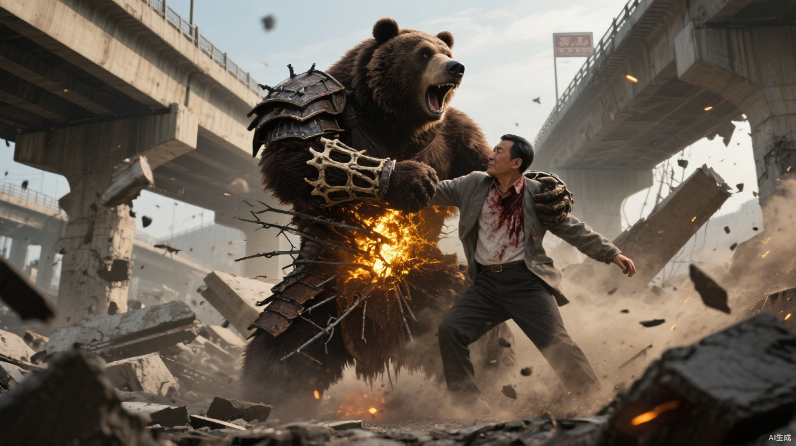

# 第十七章 顶上战争

第一道暗金火柱升起时，北部物流枢纽的所有枪声都停了一瞬。

南端属于猎鹰，北端属于巨熊。

西侧是层层堆叠的集装箱货场，东侧是储油库，中间双层高架跨过铁路和排洪渠。谁控制这里，谁就握住三座基地之间最重要的运输通道。

熊震没有在战火升起后立刻冲锋。

“贺岭守正面，魏川走排洪渠。”他站在北侧货车顶上，“第一天只看他们把火埋在哪里。谁没看清就冲，死了不算战功。”

贺岭让铁墙战团拆下钢板、链条和车架，以“铁脉连城”接成一张移动承重网。每块钢板受力都会沿连接分散，弩箭和子弹落上去，只能把整支队伍推慢。

魏川则亲自骑摩托穿过排洪渠，在地面铺下三段动量回廊。重载车沿既定方向启动得越来越快，刹停时损失的动量又被储进转向节点。

马克主动放弃最外层货场。

巨熊两路人马推进到狭长集装箱通道时，他才抬起手。

暗金火线从箱体夹层同时亮起。预埋燃油爆开，火焰封住两端出口。

贺岭没有命令后退。他把整排箱体接入铁脉，爆炸冲击沿钢板、锁链和废弃轨道传散，再从侧面节点集中释放。三只集装箱被反震推倒，硬生生隔开火势。

“正面承重剩六成！”他吼道，“还能带回二十七人！”

排洪渠里，魏川释放两处制动节点。储存的动量灌回牵引车，两辆重车拖着尚未燃烧的箱体骤然退出火场。

贺岭看见车辆先退，隔着火墙骂道：“正面还没塌，你又先给自己留路？”

“油剩四成，回廊还能用两次。”魏川没有回骂，只把第二辆车停到伤员能够攀上的位置，“你负责让墙不塌，我负责让墙后面的人回去。两件事少一件，战功都只能记在尸体上。”

贺岭没有认同，却把最重的三名伤员送上了车。

二十分钟后，双方各自收兵。

猎鹰守住内场，马克的预埋位置和引燃距离也全部暴露。

熊震隔着火墙望向他：“你喜欢让别人走你画好的路。”

他一拳砸断旁边护栏。

“可惜路也能砸断。”

当夜，伤员沿南线送往翠竹。

小文的七日隔离恰在当天结束。顾衡没有让一个刚入城的流民进入军事会议，只按他熟悉猎鹰路线、能辨认火伤痕迹两项事实，给了他临时路线观察员的木牌；权限只包括记录伤员来向、提出撤离建议，不能调动人员和物资。

小文看见烧伤集中在车辆同一侧，钢板却向反方向弯曲，判断马克的火点与贺岭反震同时存在。双方还在试探，真正决战没有开始。

“建议清空南侧铁路两间仓棚。”他把伤员来源和战场方向标在地图上，“明天伤员至少翻倍。”

韩拓先看地图：“现在能不能清，清完能撑多久，判断错了从哪里恢复？”

“先清一间，今晚能完成，能多放二十七副担架。”小文说，“双方今天都只试出一半底牌，明天不会停。若天亮前没有第二批伤员，货架不拆，半日内可以恢复仓储。”

韩拓计算木料与口粮后批准一处。小文没有争第二处，先沿废轨催生低矮藤标，保证黑夜里也能摸到撤离方向。

第二日，熊震不再碰货场。

他利用夜间风向，把湿布和建筑粉尘抛进猎鹰上风口，遮住火系视野；魏川沿回廊送出两支小队，切断储油库地下管道。

天干从魂火移动中发现伏兵，也感知到十四名普通搬运工被困在储油区。

“我带四个人进去。”他说。

马克看着正在收缩的主阵：“你离开，贺岭会从正面压进来。”

“十四道魂火，六分钟后进入燃烧区。”

“给你两个人，三分钟。主阵不能失去方向。”

天干接受命令。

他救出九人。剩下的魂火一盏接一盏熄灭时，他仍站在主阵，把每个名字记进战报。

朝贡场的五道魂火与眼前死亡重叠。他第一次清楚看见，马克不是偶尔越过原则，而是永远会在更大数字面前要求某些人先死。

马克当日不再夺回仓库。

他点燃巨熊缴获却来不及搬走的粮食与药品。熊震看懂了：巨熊依靠战利品维持战团，如果守不住运输通道，又任由物资被烧，强者分配的秩序会先从内部崩开。

两名首领都知道第三日是陷阱。

谁也没有退路。

黄昏，更多平民抵达翠竹。小文从他们携带的火花通行牌确认，聂浩的核心车辆仍未投入北线。

父亲在病床上算出伤员增长速度：“明天结束后，至少再来两批。”

母亲在医务人员允许下帮忙核对空床。她发现新送来的伤员仍按猎鹰和巨熊分区，便指着其中两个呼吸困难的人说：“别先看他们是哪边的。快死的往前抬，能坐起来骂人的往后放。床位怎么排，你们决定；谁快撑不住，不能装作没看见。”

翠竹开放第二间仓棚。小文把藤标继续铺向猎鹰方向。

此后，没有人再把视线从高架移开。

第三日清晨，马克将猎鹰主力布在高架南端，故意暴露北侧燃料车和指挥旗。

熊震没有追旗。他让贺岭破坏两侧坡道，让魏川切断排洪渠退路，自己沿桥下铁路逼近马克。

“他不肯上来。”天干说。

“那我下去。”

马克把主阵交给天干。

贺岭用两辆货车底盘搭成铁脉，承受第一轮集火后从侧架释放反震；魏川沿回廊在高架与排洪渠间连续换位。天干的魂火网络能让猎鹰始终保持队形，却无法同时压制两个同档强者。

“我可以照命熊震，给你七息。”天干说。

“你来，他们会从背后撕开猎鹰。”马克走下高架，“首领只能有一个对手，军队不能只有一个支点。”

桥下，熊震只让双臂、肩背和胸腔熊化。膨胀骨骼撑破衣服，黑褐骨板覆盖前臂。他披着一块钢板冲入火线，每一步都把落地冲击压进骨板。

马克以烬印切割地面。暗金火焰一旦接触变身能量便会附着，逼熊震只能在有限落点间移动。

熊震不追后退的火。

他一掌将积蓄的震劲砸进桥柱。碎石和尘土压灭外层火苗，高架随之晃动。马克可以不断退，他便让整座战场越来越小。

第一辆燃料车被远程引燃。

熊震举起混凝土护栏挡住爆焰。骨板吸收正面冲击，却挡不住持续高热。他在金焰附着前把燃烧护栏投向马克，逼对方收回部分火势，以免封死自己的退路。

碎石贯穿马克左臂。

他连续后退，看似失去控制。熊震却停了下来。

每一道火线都在引他靠近同一根主桥柱。马克想逼他提前使用只能维持十二分钟的完全变身。

“用一座桥换我的时间。”熊震说，“账算得不错。”

他转身攻击承重结构。

桥面开始断裂。马克若继续维持远程火场，也会被一起埋入废墟。

最后一块桥板下坠前，马克提出停战：“巨熊交还北部通道，猎鹰开放治疗配额。尸体各自带走，到这里为止。”

熊震知道条件并非虚假。

他也知道自己不能接受。

“条件开得不错。”熊震抹掉嘴角灰尘，甚至认真想了一息，“要是第一天谈，我会让贺岭再加两成药，然后签。”

“现在也不晚。”

“晚了。三堆战火是我让人点的，北路的尸体也是跟着我来的。”熊震看了一眼仍在等命令的战团，“我今天拿一张治疗单回去，他们明天就会问，强者打输了是不是也能把撤退叫交易。”

马克说：“继续打，你会死。”

“我知道。”熊震重新压低肩背，“坐这个位置，最麻烦的不是不知道会死，是知道了也不能让脚先退。”

桥面轰然断裂。

裂缝先从两人之间张开。

一根钢筋绷断。

紧接着是第二根、第三根。整块桥板带着车辆残骸向下倾斜，混凝土碎块彼此碾压，发出的低吼盖过战场上所有喊声。

熊震就在那片轰鸣里抬起头。

他最后看了一眼北侧战团。

随后，人体轮廓消失。

脊椎一节节拱起，肩骨向外撑开，黑褐骨板从皮肉下咬合而出。衣物在肌肉膨胀中撕碎，近三米高的巨熊迎着坠落桥板站起，双臂交叉护住头颈。

桥板砸下。

尘浪向四面炸开。

熊震两膝陷进废墟，脚下混凝土全部粉碎，脊背骨板也在重压下成片崩裂。可那股足以压扁装甲车的冲击没有让他倒下，而是被骨骼、肌肉和骨板层层吞入身体。

下一瞬，他消失在尘土里。

马克只看见两团赤红兽瞳骤然逼近。

巨掌拍碎护体金焰，余力撞进左胸。肋骨断裂声从身体里面传来，短促得像几根干柴同时折断。马克双脚离地，后背砸上桥墩，喉间鲜血喷过半幅猎鹰旗。

熊震没有给他落地的时间。

第二掌已经扬起。

马克却没有躲。

他看着熊震踏进主桥柱旁那块唯一完整的落脚地，染血手指轻轻一扣。

埋在裂缝中的烬印同时亮起。

暗金火线沿燃油一路钻进桥柱。爆炸从两人脚下向上贯穿，火浪卷住熊震胸腹，又被厚毛和脂肪挡在体表。那具躯体没有后退，反而穿过火焰，一把攥住马克肩膀。

然后，一截断裂钢筋从废墟中弹起。

熊震冲得太快。

钢筋从骨板接缝刺入，在他腹侧拉开一道半尺长的伤口。

血没有立刻流下，先被体表高温蒸成一片红雾。

两人的目光在火里撞到一起。

熊震明白了。

完全变身挡住了外面的火，也把身体里不断生成的热锁在皮毛、脂肪和骨板下面。现在腹侧被撕开，马克的烬印终于找到了入口。

“你一直在等这个？”他的声音已经不像人声。

马克没有回答。

所有散布在战场外围的暗金火焰同时熄灭。

下一息，它们在熊震伤口深处重新亮起。

没有冲天火柱，也没有爆炸。

只有一线暗金沿着腹侧血管向内游走。熊震胸腔深处传来沉闷爆响，皮肤下面一块接一块亮起，仿佛有一座炉子正从骨头里烧开。

熊震知道自己散不掉这股热。

他没有松手。

崩裂骨板里积存的最后一层震劲全部涌向掌心。他盯着马克，把那一掌完整送了出去。

咚。

马克左肋凹陷下去，身体擦着桥墩坠入碎石。

熊震也跪了下来。

战场上所有声音像被这一击推远。猎鹰没有放箭，巨熊也没有冲锋，只有桥下碎石仍在一颗颗滚落。

熊震双手撑地，试着再站一次。

完全形态从指尖开始崩解。骨板缩回皮肉，焦黑毛发大片脱落，近三米高的身躯一寸寸退回人形。每退回一寸，腹侧便涌出更多血。

他终于抬起一只手，朝北侧战团伸去。

“继续……”

那只手停在半空。

马克扶着断裂桥柱站起来。每吸一口气，左胸都会响起细小的摩擦声。

他吐掉嘴里的血，望着熊震。

“你赢得了这一掌。”

暗金火光在熊震眼底熄灭。

“我得赢下这条路。”

熊震的手砸进尘土。

贺岭要求再冲一次夺回尸体。魏川报出剩余油量、伤员人数和唯一可走的排洪渠：“再冲以后，谁把首领带走？”

两名战团长按巨熊规则表决。贺岭背起熊震，魏川组织撤退。首领死亡没有让他们变成乌合之众。

马克也没有追杀。他收缴武器，救治两方仍可能活下来的伤员，让巨熊残部带走熊震尸体。随后，他在断裂高架上重新升起猎鹰旗。

黎明时，猎鹰车队返城。

马克坐在装甲车后排，左肋被钢板和绷带固定，每次呼吸都带出血沫，却仍逐项询问伤亡、物资与城防口令。

猎鹰旗还在。

城门也亮着灯。

车队进入最后一段直路时，马克忽然抬手。

“停车。”

前车刹停，后车险些撞上。轮胎在碎石路上拖出一声长响，昏睡的伤员被惯性推向车厢一侧，呻吟接连响起。

马克没有理会。

他透过沾血车窗望向城门。

出征前用于标记内外夹击的三盏高灯，现在只剩两盏。原本分列瓮城左右的低灯也被调换了位置，灯罩在风里轻晃，一明一暗，像有人故意模仿原来的信号，却记错了顺序。

墙头巡逻的人少了一半。

更不对的是门。

战时规程需要两次旗号、一次口令，绞盘才会转动。此刻没有人询问车队番号，沉重城门却已经自行向内打开。

锁链哗啦作响。

门缝由一线扩大到一尺。

黑暗从里面缓缓露出来。

副官盯着城头，压低声音：“也许只是换班出了差错。伤员撑不住了，要不先让医务车——”

“全队停在三百米外，熄火。伤员不下车。”马克的声音很轻，却让前后车辆同时静下来，“天干，重新清点城墙魂火。不要按灯位认人。”

一辆接一辆熄火。

发动机轰鸣退去后，城门绞盘声显得格外清楚。那扇门还在向他们打开，越来越宽，像一张确信猎物会自己走进去的嘴。

马克抹掉唇边血沫。

暗金火星从指缝里亮起，又因虚弱迅速熄灭。

他看着门内那片没有灯的广场，终于开口：

“先别回家。”

“里面有人替我们换了主人。”
