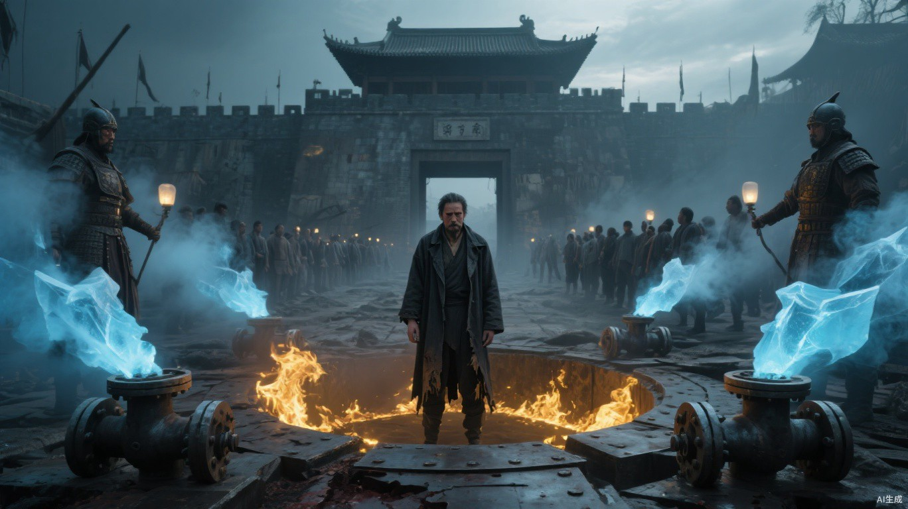

# 第十八章 猎鹰坠落

“先别回家。”马克望着主动打开的城门，“里面有人替我们换了主人。”

车队在三百米外同时熄火。

天干闭上眼，重新清点城墙上的魂火。熟悉的守卫只剩四成，另外一些生命信号来自火花驻防队。更深处还有大量人被集中在仓库和广场，行动受限，却没有发生混战。

“正门是口袋。”他说，“对方已经控制粮仓、通讯塔和内墙。南门还有七名旧守卫，状态不明。”

马克没有强攻正门。他让伤员留在装甲车内，带尚能战斗的人绕向南门，试图借只有核心城防知道的备用入口反夺控制权。

他用只有地支知道的暗号呼叫后备。

城内没有回应。

梁肃的尸体从墙头被扔下来，重重落在门外。颈侧影刃伤口和雷击焦痕都还清楚。

马克只看了一眼便明白：地支完成了刺杀；聂浩却同时拿到尸体、城门和猎鹰内部口令。

猎鹰外围观察哨的急报沿两处中继点传到翠竹时，南门尚未完全合拢。小文以临时路线观察员身份提出开放废弃铁路作为单向撤离线。韩拓列出木料、守卫和封路时间，顾衡把方案改成分段接应、逐段封闭；任何一段身份核验失效，后一段立即落闸。

小文前两日铺下的低矮藤标已经延伸到铁路中段。许岚批准两支接应队携带他的藤枝继续向北，每到岔口便催生一簇猎鹰搜索队常用的箭形回撤标记。小文留在南侧总闸，无法隔着数公里凭空铺出整条路线。

这个决定救不了马克。

却能给仍活着的人留一条路。

此后，视线不再离开南门。

聂浩站上城墙，衣着仍比周围人朴素，甚至没有佩戴梁肃的首领徽章。

“马克首领伤重。”他说，“火花只替盟友稳定城防。交出临时指挥权，伤员可以立即入城。”

马克没有争论谁是叛徒。

一缕只有二级强度的暗金火线贴地射出。

聂浩抬起冰墙。烬印附着其上，正常冰层本应持续融化，眼前却没有产生足量水迹；相反，四周空气里的热量迅速消失。

“不是冰。”马克说。

聂浩没有承认：“你还剩多少火，可以再试。”

马克已经得到答案。

他不再铺开容易被地下管线传导的火海，而是同时点燃南门拒马、废车座椅和浸油沙袋。那些烬印是他每次巡查城防时留下的后手，如今从多个方向短促爆发，逼聂浩连续吸收。

聂浩手臂皮肤开始开裂。

即使只剩不到三成力量，马克的爆发仍超过他单位时间的吸收上限。

“天干，断管线！”

猎鹰弩手朝城墙根推进。天干没有冲向聂浩，而是用魂火网络标出每一个伤员和战士的位置，让残部在交错火焰中保持队形。

聂浩向后退了三步。

每一步都踩在预埋钢板上。吸收的热量被即时转成震动，经钢板送入蓄水池活塞和六段封闭管道。水柱被压缩，配重被逐级抬高，再由城内人员锁死阀门；普通材料无法把冲击保存数月，聂浩数月来准备的是这套转换结构，此刻储存的只是马克刚刚释放的几轮爆发。

天干先发现异常。

“地下阀门有六道魂火，位置固定。他们在控制节点。”

话音未落，聂浩让地下人员同时解锁六道阀门，将刚刚积蓄的水压与配重势能一次释放。

高压水从破裂接口喷向天空，随即被抽走热量。冰雾覆盖南门，地面结出薄冰，视野和脚步同时失控。

沈砺让肩背、胸颈局部犀化，率正规战斗队从两翼压缩猎鹰阵形。可轩不参与正面冲杀，只用短促侧风把冰雾推向猎鹰，又吹动不同颜色的指令布条。城内潜伏者同时打开南门。

战场、夺门与首领决斗在同一刻发生。

天干在交换日记录过聂浩的魂火。只要撤掉残部身上的巡灯网络，他便能集中照命，让聂浩出现数息感官错乱。

可冰雾中还有几十名伤员依靠魂火辨认同伴。网络一旦关闭，沈砺会立刻把队形切断。

聂浩看准了这个选择。

马克也看准了。

“灯别灭。”他说，“带人出去。”

“你会失去压制窗口。”

“这是命令。”马克咳出血，“猎鹰不能只剩一个会放火的人。”

天干继续维持网络。

马克独自走进冰雾。

三步以后，身影便只剩一团暗色。

五步以后，连那团暗色也被吞没。

马克用拇指抹过左肋伤口。

指腹沾满血。

他把血按在第一根拒马上。暗金火焰贴着血印燃起，没有向外扩散，只把周围冰雾烧出一个人形大小的空洞。

第二枚血印落在废车座椅。

第三枚落在自己胸前。

火光连续亮起，冰雾被强行撕开三道缺口。聂浩的身影在最后一道缺口后显现，肩头、睫毛和半边脸都结着白霜，右脚却稳稳踩在预埋钢板中央。

三面金焰同时向内合拢。

冰雾先被蒸成白汽。聂浩抬手吸收迎面火浪，皮肤从指尖开始干裂，裂口一路爬到手腕。每一道伤口刚渗出血，便立刻冻成细小红珠。

他向后退了一步。

钢板接住鞋底。

马克等的就是这一步。

浓缩金焰骤然从左右合拢。聂浩不得不同时接住两股热量，脚下钢板发出不堪重负的嗡鸣。就在他转移能量的一瞬，马克撞进白汽。

袖中短刃弹出。

刀尖刺进聂浩右肩，从肩胛后透出半寸。

两个人几乎贴在一起。

马克的脸已被火光照得没有血色：“你等这一天，很久了。”

聂浩看了一眼肩上的刀。剧痛让他的嘴角抽动了一下，声音却仍然平缓：“久一点，买得便宜。你替我杀熊震，替我耗空猎鹰，也替我看清谁还肯跟你回来。这笔买卖，不等到最后一刻，我舍不得结账。”

他说话时，手掌已经扣住马克持刀的手腕。

一层白霜从两人接触处生长出来。

起初只覆住皮肤，随后钻进马克腕侧伤口，沿血管向上蔓延。那不是冰墙残留的寒气，而是聂浩一直压在体内、等待近身接触的低温。

马克的五指开始僵硬。

他仍没有抽刀。

反而向前踏了半步，把刀锋送得更深。

“那就一起结。”

胸前最后一枚血印骤然燃烧。

暗金火焰不是向外扩张，而是贴着两人的身体向内收缩。冰雾被推开，城墙、钢板和远处正在撤退的人群都在那一刻清晰显现。聂浩右侧皮肤成片崩开，膝盖第一次弯了下去。

可他脚下仍是那块钢板。

六道阀门同时解锁。

轰响来自地下。

水压与配重积存的震动沿钢板冲上来，先撞进脚骨，再贯穿膝盖、脊椎和胸腔。马克已经断裂的左肋在体内再次折断，骨茬刺入肺叶。

他的身体轻轻震了一下。

没有飞出去。

只是胸前那团暗金火骤然缩小。

聂浩把最后一股寒气顺着胸腔伤口灌进去。冰霜从马克衣襟下漫出，沿锁骨爬向颈侧；他指间仍残留一缕金焰，明明已经只剩火柴大小，却始终没有完全熄灭。

聂浩不敢松手。

马克也没有先倒。

两个人在冰雾重新合拢前僵持了数息。

最后，那缕火从暗金变成赤红，又从赤红缩成针尖。

天干穿过冰雾时，正好接住马克向后倒下的身体。

马克张了两次嘴，第一口只咳出带冰碴的血。

远处仍亮着许多魂火。有人背着伤员，有人在冰雾里互相叫名字，还有人握着武器，等他再说一句反攻。

他没有请求原谅，也没有把朝贡说成误会。

“带愿意走的人……离开。”

天干抱紧他的肩背：“撤离路径已经确认。你随第二队走，我负责断后。”

马克很轻地摇了一下头。

“猎鹰可以没有马克。”他望着那些仍未熄灭的魂火，“不能连记得它为什么建立的人，都死在这里。”

天干还想回答。

魂灯网络里，代表马克的那道火忽然向内一缩。

从拳头大，缩到指甲。

再缩成一根摇晃的针。

天干按战场复核习惯，重新确认位置、距离和遮挡。没有误差。

那根针熄灭了。

冰雾从两人之间缓缓穿过。

天干闭了一次眼，再睁开时，开始执行马克最后一道命令。

林夏贴着结冰墙根闭眼分辨脚步：“南偏东八十米，七道固定魂火，中间有十二米空段。只能证明那里暂时没人，冰雾和水声会让误差扩大到三米。”

陈锋已经迈出半步，又硬生生停住：“我前出八十米，三十秒回报。只标出口，不追守卫；你听不见我，就按原路撤。”

方岳看了他一眼：“这次记得等人了。去，二十五秒。”

陈锋消失在冰雾里，二十三秒后折返：“出口能走，外面有拒马。给我两个人，我拆左边，右边留给担架。”

他喘了口气，又冲方岳抬了抬下巴：“二十三秒。欠我的两秒记着，别总说我只会抢跑。”

“留着待会儿逃命。”方岳把两名还能持斧的守卫点给他，“这次别连本带利一起花掉。”

白川正在给一名腹部中箭的守卫压迫止血：“这个上担架，搬的时候保持平稳。”他转头看向旁边的伤员，“左腿固定好，找人扶着走，伤腿别落地。头晕或者撑不住就喊我，别硬跟。”

“林夏报方向，陈锋清路，白川决定担架。”方岳把钢盾转向追兵，“最后一副担架越过拒马，我放倒左侧墙架。听见两次敲盾再封路，少一次都不准动。”

四个人没有跟着人流自动逃走。他们把一支濒临溃散的残队重新变成了有前锋、判断、救治和断后的队伍。

队伍进入南侧铁路后，看见墙缝中每隔百米便有一簇逆风指向南方的新藤。天干不知道留下标记的人是谁，仍据此避开火花封锁线。

聂浩没有追。

留下天干需要付出更多兵力，而一群逃亡者会替他把“马克已死、猎鹰易主”的消息带给所有人。他只送出一封招降书，为未来追杀留下名义。

残部脱离射程后，聂浩让人熄灭冰雾，打开内城粮仓。

覆盖南门的冰雾开始下沉。

先露出结霜的钢板，再露出横倒在地的尸体。融化的冰水混着血沿石缝流向广场，在台阶下汇成一条暗红细线。

梁肃留下的金属短杖被插在马克倒下的位置。杖身仍残留一道焦黑雷痕，顶端挑着半幅被烧穿的猎鹰旗。

守军、火花成员和普通居民被召到广场时，没有人知道等待自己的是处决还是赦免。

城墙上弓弦绷紧。

城门后的绞盘缓慢转动。

粮仓铁门却在这时被人推开。

金属门轴发出刺耳长鸣。成袋粮食从黑暗里显现，最前排一只破袋正往外漏米，白色米粒一颗颗滚下台阶。

人群的目光跟着那些米粒移动。

有人咽了口唾沫。

有人悄悄放低武器。

聂浩一直等到最后一粒米停在自己靴边，才踏上广场中央。

他没有站上马克使用过的高台，也没有拔出梁肃的短杖。他只俯身捡起那粒米，在指间轻轻碾了一下。

右肩伤口仍在流血。

马克留下的血也凝在他手背上，两种颜色已经分不清了。

“马克的账，到这里结清。火花和猎鹰，也到这里为止。”

人群没有声音。

只有粮袋破口仍在漏米。

沙。

沙。

“愿意留下的，今天照常领粮，明天按新规守城。”聂浩摊开染血的右手，“想走的，日落以前带上自己的东西，城门不关。我不让人拦。”

人群后方终于有人问：“日落以后呢？”

聂浩抬眼看向那人，没有笑。

“日落以后还把刀口朝向这里的，就是敌人。”

落日正从西侧城墙缺口照进来，把粮仓、短杖和地上的血同时染红。

城门已经完全打开。

却没有一个人先走。

聂浩松开手。

那粒被碾碎的米落进马克的血里。

“从今天起，这里只有天火。”
