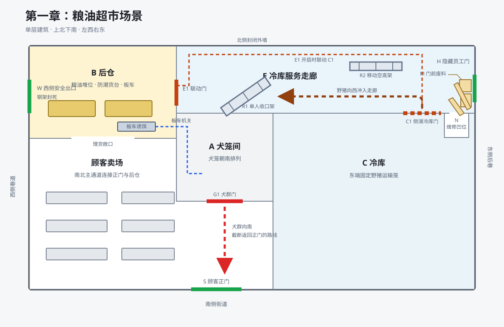

# 第一章粮油超市场景事实表

## 空间

- 超市只有一层。南面临街，西面窄巷，东面后巷，北墙封闭。
- `S` 是顾客正门；卖场主通道向北通往后仓理货口。
- `B` 是西北后仓。西墙为安全出口 `W`，东墙为冷库服务门 `E1`。
- `A` 位于 `B` 东南。犬群门 `G1` 朝南接卖场主通道。
- `E` 是北侧冷库服务走廊，西端接 `E1`，东端接暗门 `H`。
- `C` 是走廊南侧的一体式冷库，侧滑保温门 `C1` 朝北接 `E`。
- `E1` 是可从 `B` 直接推开的双开服务门；`E1`、`C1` 均可供运输笼通过。
- `E` 宽约三点五米。以 `E1` 为0米，`R1/R2/C1/N/H` 依次位于4/11/13/15/16米处。
- `R1` 南端铰接，北端以地销固定；北墙边留约零点七米过人缝，野猪含骨刺宽约一点三米。
- `R2` 是长约三点六米的空高架，带锁止脚轮，原靠北墙停放；转为斜跨走廊后，南端抵 `C1` 西侧门框，北端抵北墙。
- `N` 位于南墙，深约一点二米，入口宽约零点七五米，朝北开向走廊。
- `M` 为两块包铁边旧保温板和三摞套叠周转箱，交叠堆在 `H` 内侧并占住 `N` 口；遮住暗扣和落脚处，须分件清理。
- `H` 向外开启并带回位簧，门外接五级钢踏步和东后巷；外侧门缝和台阶被废弃冷凝机及围板遮挡。
- 室外为白昼，室内断电；老秦、大刘胸前挂手电，小文持手电。南侧地面湿滑，北侧较干；`N` 内高于积水。

## 初始布置

### 诱饵与封路

- 火花以完整粮油、伪造的巨熊标记和新近移动的面包车吸引搜索队。
- `W` 外焊钢架；内推仅开窄缝，封挡不可见。
- `H` 无标识、无内侧把手，接缝藏于墙板拼缝和 `M` 后。火花未发现门，保留原有废料；小文灾变前见员工开启过。

### 犬群机关

- 三只异化犬被诱入运输笼，经 `S—G1` 送入 `A`。
- `A` 为砖墙隔间，闭合的 `G1` 遮住犬笼。
- 装犬时鱼线脱开，锁笼后接入。
- 诱饵板车停在西斜防潮台，削薄的止轮片伪装成旧件。装货增重使止轮片断裂，板车西滑；后轴鱼线经 `A—B` 孔抽出释放销，配重开启 `G1` 和犬笼。
- 理货口另有空板车；老秦有五发箭匣、五支备用箭。
- `G1` 位于 `B—S` 之间；放犬后向北追人，截断南撤通路。
- 可轩布置后到对面楼顶观察。

### 野猪机关

- 二级野猪装笼，经 `S—B—E1—E—C1` 运入 `C` 后锚固。运输时拉索脱开，`R1` 贴南墙让路。
- `C` 的保温墙和闭合门遮住野猪。
- 装兽后斜置并锁定 `R1`，收窄回撤通路，把人员夹在架与野猪之间。
- `E1` 开过四十五度，释放限速配重；空行约十七秒后拉开 `C1`，脱扣笼门。
- 锁笼、关闭 `C1` 后接入 `E1` 拉索。
- 火花在搜索队到达前数小时完成布置，经 `S` 撤离。

## 总调度

板车拉线抽销为触发点，秒数均为约数。位置按西→东排列，南北侧另标；不变表示承接上一行。

| 时间 | 老秦、犬群及机关 | 五人位置与动作 | 野猪与通道状态 |
|---|---|---|---|
| 侦察 | 犬群在 `A`；老秦检查主通道和 `B`。 | 五人在 `S` 外。 | `W` 仅开窄缝，误判为杂物卡门；`E1` 闭合未锁，未深入；未听见兽声。 |
| 入场 | 老秦在 `B`。 | 五人进入 `B`；小文发现粮油无拆取、拖拽痕迹。 | 不变。 |
| 触发前约30秒 | 老秦发现鱼线；止轮片开裂，释放销未脱。 | 众人装货；小文提出疑点。 | 不变。 |
| 触发后0—8秒 | 止轮片断裂，诱饵车西滑抽销，配重先开 `G1`、再开笼门；三犬出笼、经 `G1` 转北，占住 `B—S` 通路；老秦推倒空板车堵理货口。 | 南撤受阻，改查 `W` 并确认封死，转向 `E1`。 | 不变。 |
| 触发后约8秒 | 老秦隔车射击。 | 小文在0米处推开 `E1`，其余四人跟进。 | `E1` 开过四十五度，配重启动；`C1` 仍闭合。 |
| 触发后8—25秒 | 老秦继续射击，间隙续箭。 | 五人依次穿过 `R1` 北侧窄缝向东；至约25秒，西→东为周勇（刚过4米）—大刘—沈蓉—阿慧—小文（12米）。 | 配重空行约十七秒；约25秒开 `C1`、放猪；`E1` 留开。 |
| 触发后25—28秒 | 不变。 | 小文撞向南墙，手电落地向东照；阿慧、大刘贴南墙，沈蓉、周勇贴北墙。 | 野猪出 `C1` 转西，獠牙划伤小文右大腿，肩背撞伤其右肋；越过四人，骨刺意外反钩 `R1`。 |
| 触发后28—40秒 | 箭将耗尽。 | 小文指出 `H`。阿慧压伤口、绑压迫垫，随后扶小文沿南墙到 `N` 外；大刘、周勇从 `R2` 西侧绕到东侧，松脚轮锁、合力横架，再锁脚轮；沈蓉沿走廊走过 `C1` 门位清理 `M`，将上层一摞箱移至东端北墙，再抽开门前挡路板。 | 野猪朝西卡住，`R1` 北端地销晃动；`R2` 南端抵 `C1` 西门框、北端抵北墙，横断走廊；移板后 `N` 口随之露出，板暂靠其西侧墙边；`H` 底层箱仍被另一块板压住，暗扣未露。 |
| 触发后40—45秒 | 累计杀一犬、伤一犬；两犬绕过板车边缘。 | 大刘偏南、周勇偏北，在 `R2` 东侧撑住首撞；小文坐靠 `N` 外南墙按住腿伤，阿慧与沈蓉合力卸板。 | `R1` 北端地销脱出，绕南端向西转开；野猪退身脱钩、转身东冲，撞上 `R2`。 |
| 触发后45—51秒 | 两犬杀死老秦，停留撕咬。 | 两人隔架顶住野猪；阿慧、沈蓉将第二块板靠在 `N` 西侧，再将一摞底箱移向北墙，清出落脚处；小文不变。 | 野猪从西侧持续顶推 `R2`，架体弯曲、架顶东倾；最后一摞套箱挡住暗扣。 |
| 触发后51—54秒 | 两犬循撞击声离开 `B`。 | 阿慧、沈蓉移开最后一摞套箱，`H` 前清空；沈蓉摸索暗扣，阿慧同时回身扶住小文。沈蓉按下暗扣、缓慢推门外开；周勇见门缝透光，突然松手冲向 `H`，大刘独托架顶。 | 周勇松手后只剩大刘独撑，架顶继续东倾；野猪退步，准备再撞。 |
| 触发后54—59秒 | 两犬经 `E1` 抵达倒架西侧。 | 大刘被倒架压住；周勇沿北墙冲至 `H`，半身出门；沈蓉留在门内南侧；阿慧扶小文留在 `N` 外。 | 二撞使 `R2` 南端脱离 `C1` 西门框并倒伏；野猪越架，沿北墙东追，贯穿周勇并顶落踏步；`H` 回弹撞其右肩，野猪回身扫飞沈蓉、沿南墙西冲；阿慧才推小文入 `N`，跟进时被挑向 `C1`。野猪擦动板脚，双板倒覆 `N`，铁边砸伤小文后脑。 |
| 触发后59—80秒 | 两犬越过倒架，咬死被压的大刘；一犬踩碎沈蓉滚落的冰糖，另一犬咬猪后腿；两犬随后退向 `R2`。 | 小文蜷在板后，昏迷十余秒，醒后不动。 | 板件抵墙遮住 `N`；野猪转身顶击犬群。 |
| 触发后80—95秒 | 两犬退向 `R1`。 | 小文听见追逐远离，挪上层板、挤出板缝，沿南墙开 `H`；跨过下层踏步尸体离开。 | 野猪追至 `R2` 西侧；下层板仍抵墙，`H` 回闭。 |

## 结束状态

- 老秦死在 `B`；一只异化犬死在理货敞口，另外两只进入 `E`。
- 大刘死在 `R2`，周勇死在 `H` 外下层踏步，沈蓉死在东南墙角，阿慧死在 `C1` 门框旁。
- `R1` 向西转开，`R2` 弯折倒地；`M` 的周转箱均移至东端北墙，两块板倒覆 `N`；`H` 前已清空。
- `C1`、`E1` 保持开启，`H` 回闭；野猪在 `R2` 西侧追逐两只犬，小文离开东端。
- 小文右大腿割伤、右肋撞伤、后脑砸伤，从 `H` 向南逃离。
- 小文的手电留在 `E`。
- 可轩确认一人逃脱。聂浩不追，让幸存者传播巨熊标记和袭击现场。
- 面包车底的受伤凶猫循小文血迹向南追踪。
