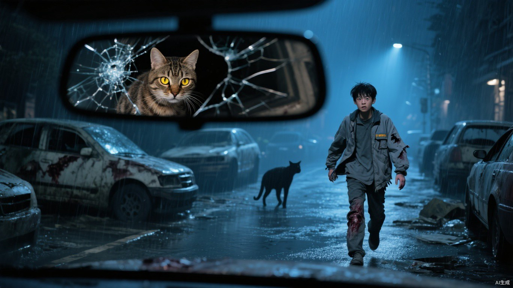
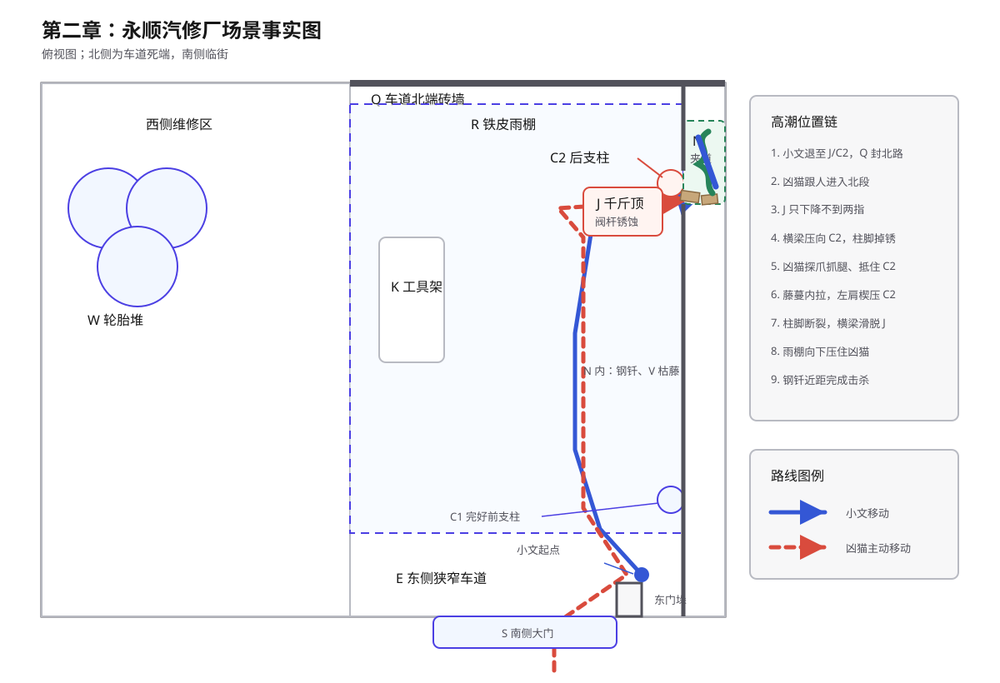

# 第二章 雨夜凶猫

雨比刚才密了。

它斜穿灰雾，敲在废车顶棚上，也打进小文后颈。冰水沿着脊骨往下淌，流到腰间时已经带上一点温热的血。

绕过东后巷那道南侧院墙后，他重新折向北，拖着右腿往猎鹰基地走。

阿慧缠上的纱布早已湿透，每次右脚落地，大腿伤口便在压迫垫下面重新张开。被野猪撞伤的右肋也在发疼，后脑被保温板铁边砸过的地方一跳一跳地胀。小文不敢停，只把每一步压到最短，尽量不让鞋跟在积水里发出太大的声音。

猎鹰基地还有不到一公里。

再过两个路口，就能看见外围民房的黑色屋顶。

父亲今晚七点要赶最后一轮治疗。没有小文背他，父亲连外围医务点都走不到。母亲自己的药也只剩半片；出门时她把那半片压在杯底，说等晚上难受了再吃。小文看见了，没有拆穿，只说天黑前回来。

现在天已经黑了。

他经过第一处路口。

屋檐水落进脚边的浅坑，圆形波纹向外推开。水面里除了小文晃动的肩膀，还掠过一道更低、更长的影子。

小文没有回头。

他的右手缓缓垂下，摸向腰侧。手电留在超市里，身上只剩一把折柄小刀，刀刃还没有食指长。

后方没有脚步。

也没有呼吸。

只有雨。

他继续向前，故意在一辆侧翻轿车旁放慢速度。破裂的后视镜朝向来路，镜面只剩巴掌大，雨珠正从裂纹中间往下爬。

小文从镜中看见了一双黄褐色眼睛。

狸花猫伏在二十多米外的公交站棚上。它的脊背几乎与栏杆齐高，湿透的毛贴着身体，显出一根根隆起的骨头。左腹裂着一道长口子，雨水从翻卷的皮肉上冲过；右前爪缩在胸前，只有另外三条腿压着棚顶。

小文握住小刀。

狸花猫没有扑。

他向前走了两步，它才从站棚跃下。落地时右肩明显向下一沉，受伤的前爪只在水面点了一下便重新缩起。

另外三只爪子却在水泥上压出浅白划痕。

小文停住。

它也停住。

黄褐色瞳孔隔着雨幕盯着他的右手。直到小文把小刀收回身侧，它才又向前挪了半步。

小文试着把刀抬起来。那双眼睛跟着刀尖移，他的手一晃，它便往前压低了半分。

不能等到握不住的时候。

前方岔路口已经露出轮廓。

左侧经过两排旧民房，通往猎鹰外围。父母就住在第一排最东头，门锁是小文用两块铁片改的，窗户内侧只钉了一层薄木板。

右侧通往废弃工业街。路更远，积水更深，夜里几乎不会有人经过。

小文走到岔路中央。

左脚已经迈向回家的方向。

那截被母亲拖鞋磨亮的门槛就在前方两排房后。小文的刀只有半掌长，他将它贴在腿侧，遮住还在颤的手。

小文收回左脚，转向右侧。

身后的狸花猫也改变方向。

这一次，他听见了爪尖划过水泥的轻响。

---

同一时刻，猎鹰基地外围。

机械钟的分针又跳了一格。

母亲听见齿轮咬合的轻响，手指在旧围巾上收紧。围巾是小文出门前留下的，边角还沾着一点早饭时溅上的粥渍。

窗外已经看不清路。

雨点打在铁皮棚上，起初杂乱，后来渐渐连成一片。每次巷口有人踩水，她都会抬头；脚步若没有在门前停下，她便重新看向墙上的钟。

“六点十二。”她说着，把门边木凳朝外挪了一点。

父亲坐在床边，浮肿的双腿藏在薄被下面：“粮油超市比城西药店远三公里。回程还要推板车，路一滑，晚一个小时正常。”

“六点零五的时候，你说晚半个小时正常。”

“雨又大了。”

母亲看向他手里的搪瓷杯。杯口早已没有热气。

“从五点到现在，你把这杯水端起来五次，一口没喝。”她说，“再编一个，我听着。”

父亲张了张嘴：“你这人……任务布告不是写了吗，六个人，两辆板车。真找到粮食，兴许先封仓库，再等基地派车。”

“你是在等儿子，还是在替任务处写解释？”

父亲没有回答。

母亲把围巾放到膝上，用还能活动的右手一点点抚平褶皱：“小文十二岁打碎碗，你替他瞒我，也是先讲三句道理，再漏一句实话。现在你告诉我，最坏是什么？”

杯底碰上床边木箱，发出很轻的一声。

“最坏……”父亲盯着自己肿胀的脚背，“搜索队没有回来。”

屋里只剩雨声。

过了片刻，他又开口：“家里现在有五十五点。我们下一次治疗要四十点。他接这个任务，是想尽快攒到二级治疗的八十点。要是没有我们两个，他做基地里的安全杂务，也能养活自己，不必——”

母亲把围巾搭上床栏：“又算这个。他不回来，你把我们俩减掉就够了？”

“我没这么说。”

“医院那回，我叫他自己走。他听了吗？”

父亲握杯子的手慢慢收紧。

父亲低下头：“那回他进来时，也说没事。”

母亲攥着围巾的手松了一瞬。

窗外一声铁皮震响，和医院消防门被撞开的声音叠在一起。十八岁的儿子浑身是血，背起父亲时两条腿都在抖，嘴里却只说“后门还能走”。

“七点。”父亲说，“七点还没有消息，我去北门问问。”

母亲看着他：“七点去北门，治疗不就赶不上了？”

“他不回来，我还治什么。”父亲把杯子放下，“我就在北门等。他什么时候回来，我什么时候回来。”

母亲看了一眼他的腿：“你先走到门口再说。”

父亲没接话，撑住床沿起身。母亲也没拦。

双脚刚落地，他的膝盖便开始发抖。

母亲伸手托住他的手肘，把他按回床上：“门口都没到，还北门。”

“我可以歇两次。”

“你歇到换岗，守卫正好回来告诉我，你晕在半路。”

父亲还想说话，母亲却先移开脸。窗板缝隙里漏进一线灰白雨光，落在她膝上的旧围巾上。她眨了两次，喉咙仍然发紧。

“他要是真回不来呢？”

父亲沉默了很久。

“那也得有人亲口告诉我们。”他说，“在那以前，等他。”

机械钟仍在走。

一格。

又一格。

---

猎鹰基地中央办公楼。

桌角的机械钟弹出一声轻响。

第七搜索队已经超过回程节点十分钟。天干翻开出勤册，闭上眼。六道由他在北门亲自标记的魂火浮进黑暗：五处已经冷透，最后一点已经偏离北侧回程线，落向东南。

那道微光比一刻钟前弱了大半。

它太弱，方向也在轻微摆动。

天干睁眼，把三次感知到的方向分别压在桌角地图上，只能圈出一道约七度宽的扇面。他合上出勤册，推开首领办公室的门。

马克站在窗前，正用一块白布擦拭指节。他没有回头。玻璃里同时映着他的手和天干绷紧的下颌。

“第七搜索队。”天干站在门内，“六道魂火熄灭五道，末道强度不足三成，偏离回程线向东南，方位误差七度。”

马克把白布折了一次：“为什么转向？”

“无法确认。路线连续，没有绕圈。按最坏情况处理，目标可能在主动避开基地，也可能被威胁逼离回程线。”

“能确认威胁数量吗？”

“不能。魂灯只记录被标记者。”

马克走到墙边地图前。指尖先落在粮油超市，再沿回程线移到东南工业区。

“方岳的小队出发。”他说，“先带人回来，再确认附近威胁。装备和现场都排在人后面。”

“是否授权白川使用储备药物？”

“授权。”

天干把两项授权记进出勤册。

马克看过那两行字：“变化随时报。”

天干转身走出办公室。

北侧训练场的探照灯没有亮。四个人借着门内的火盆光整理装备，影子在湿地上忽长忽短。

方岳扣上改装防暴盾，伸手压住要被风掀起的地图：“哪一条路？车能开进去吗？”

“车到不了这片塌房，走永安路，回来也走这条。”天干点住地图，“第七队剩下一人，具体是谁还不能确认。陈锋，你前出不超过一百米，也不能离开林夏的感知。失联三十秒退回，别等第二遍叫你。”

陈锋活动着十根手指，指节响成一串。食指忽然停住。

三个月前的街口，同行队友倒在血里，胸口已经不再起伏，嘴还张着。没有第二声。

“一百米对我只有几步。”他说，“等你们背着门板赶到，人可能都凉了。”

方岳偏头看他：“谁背门板？”

“你。”

“这是盾。”

“砸脚上都一样疼。”

林夏用指尖沿东南方向划过地图：“汽修厂、纺织仓、南侧居民楼。按失联时间和普通伤员的步行上限，先查这三处。”她抬头看陈锋，“雨大，我可能只能听见你的落脚。拐进屋里，我就未必接得住。”

陈锋把已经迈出门槛的脚收回来：“不钻楼。看见东西跑呢？”

“不追。”天干合上出勤册，“找到人，先确认周围能不能接近，再让白川上前。”

白川把两支抗生素、一卷止血带和剪刀依次塞入医疗包：“伤情？”

“魂火持续减弱，原因未知。”

“按重伤准备，失血、低温和污染都不能漏。”白川拉紧包带，转向方岳，“队长，我需要能蹲下止血的位置，担架也得进得来。”

方岳替白川把卷起的担架带移到盾后，转向陈锋：“位置和退路一起报。你快，先替担架找能走的路。”

陈锋先推开铁门，等白川跨过门槛，才朝雨里俯下身。

四道人影冲进雨幕。

---

小文已经走进东南工业街。

两侧厂房没有灯，破窗一扇接一扇掠过视野。雨水从断裂排水管里成股砸下，落地声盖住了身后偶尔出现的爪响。

一直替右腿承担重量的左脚也开始发麻。

每次身体向右歪，后方那道影子都会靠近几步；等他重新站稳，影子又停在废车或墙角后面。

小文将小刀往身后偏了偏。那几步爪响又停了，他没再回头。

转过旧五金厂，一辆厢式货车横卡在两堵围墙之间。车腹已经陷进碎砖，只在驾驶室与墙角之间留下一道不足半米的缝。

小文侧过肩膀挤了进去。右腿擦过砖角，纱布里的血立刻热了一层。

身后传来沉重落地声。狸花猫跃上车头，受伤的右前爪刚压住湿滑玻璃，肩背便猛地一沉。爪尖刮过车顶，又摔回路面。

它没有再跳。

黄褐色眼睛隔着车窗裂纹盯了小文一瞬，随即隐入侧巷。小文送餐时绕过这片厂墙，记得最近的缺口在纺织仓后门；从那里折回来，要多绕近五百米。

前方一块蓝色招牌从雨里显出来。油漆剥落大半，只剩“永顺汽修”四个模糊的字。

小文认得这里。

灾变前，他来送过三次饭。老板嫌最后一单慢了七分钟，把他堵在雨棚下骂到饭菜都凉透。小文站着听完，也记住了东侧窄车道、维修区的检修坑，以及那根被叉车倒车撞弯、靠立式千斤顶勉强撑住的后支柱。

他拐进南侧院门。

手电已经丢了。雨夜残余的灰光从院口铺进来，只照亮靠外半座院子。西侧轮胎堆泡在水里，黑色圆孔层层叠叠；维修间门前横着一条检修坑。东侧窄车道只能通过一辆轿车，铁皮雨棚压在上方，西边固定在维修间外墙，东边两根钢柱撑着，后半截明显低了一头。

墙边工具架歪着。几根拆轮胎用的钢钎斜插在铁桶里。

车道北端被一堵砖墙截死。东北角那根后支柱紧贴墙边，柱身弯向车道，柱脚只剩一圈锈黑的铁皮。柱旁的东侧隔墙上开着一个检修口，宽度只够成年人侧身挤过；墙后是一条不受雨棚遮挡的夹道。几根枯藤伏在里面的墙根，雨水正从砖缝间往下淌。洞口西南侧，一台没有锚固的立式千斤顶顶住横梁，托盘已经被压得偏向一边。

小文先看入口，再看西侧轮胎堆，最后看向东侧窄道。

南门太宽，拦不住猫。

西边遮挡多，但轮胎堆会替它藏住第二次扑击。

只有东侧窄道能逼它沿一条线进来。

他走到工具架前，抽出一根钢钎。钢钎比手臂长，尖端沾着旧锈。他侧身挤进检修口，把钢钎放在洞内墙根，伸手便能摸到。退出时，左手按过泥里的枯藤，一丝凉意沿掌纹刺进腕骨。他抬手看了一眼，只当是砖缝里灌下的雨水。

他退回车道，从架脚旁捡起一把活动扳手。

随后，他用折柄小刀撬开千斤顶泄压阀外面的锈壳，再将小刀折回腰侧。

阀杆能动。

只转了不到四分之一圈，千斤顶便发出一声低沉的金属呻吟。雨棚后缘向下沉了半指，积水从铁皮凹处倾泻下来。

小文立刻拧回去。

再往下是否顺畅，他没法试。横梁一旦真正卸力，凭他现在的身体不可能再把千斤顶顶回原位。

能塌。

可后支柱不倒，雨棚就只会沉下这一点。

南墙外传来爪尖刮擦水泥的轻响。

绕路换来的时间已经用完了。

小文退回南门，贴住东侧门垛内壁。活动扳手横在胸前，冰凉的金属硌着掌骨。

胸口起伏得太快。他用手背压住嘴，把咳嗽和喘息一起堵回去。

---

东南工业区外缘，陈锋刚踩进齐踝深的积水，鞋底便被水下的晾衣铁丝勾住。他硬生生收住速度，污水在身前掀起半面弧形水幕。

“永安路南口，水下有铁丝。”他按住耳侧的简易通话器，“我没摔。前面暂时安全。”

“你右边二楼还没看。”林夏的声音从后方传来，“车底也没动静，但静着的东西我听不出来。”

陈锋转向那排黑窗，没再往前：“路面没发现。楼里不知道。”

方岳踏进水里，盾牌先压住铁丝：“你离我三十米。等白川过线，再走。”

陈锋蹲下来活动脚踝，雨水顺着发梢往下淌。

白川跨过铁丝时扫了他一眼：“扭了就报，别等脚肿了再说没事。”

“没扭。”

林夏在积水边闭上眼，右手两根手指缓慢转向东南。五秒后，她才开口。

“东南，一百四十到一百七十米，两组落地震动。”她睁眼，“前一组一轻一重，右侧带拖擦，方向与魂火一致；后一组三重一轻。第二组无法确认种类。”

陈锋已经站起：“三重一轻，东西伤了。”

“别拿它当伤员。”林夏抬手叫他等，侧耳听了片刻，“同样少一下落地，踩空也会这样。雨又压过来了，后面这组我接不全。”

陈锋抹去脸上的水，脚尖仍朝着东南：“还在跟前面那个？”

“前后顺序没变。再近些才知道。”

方岳重新抬盾：“陈锋前出六十米。看见院门就停，先报出口。”

陈锋应了一声，身影从雨里骤然拉远。

---

汽修厂南门。

狸花猫出现在院门外。

它没有进来。

黄褐色眼睛先扫过西侧轮胎堆，又停在雨棚深处。受伤的右前爪始终蜷着，左腹伤口在一路跟随后重新裂开，血正沿着湿毛往下滴。

猫在门外来回走了半圈。

鼻尖先探过门槛，又转向门后。雨点忽然密起来，铁皮棚顶炸开一阵急响，它立刻退回门柱外，伏低身体，等那阵声音过去。

小文握紧活动扳手。

狸花猫绕到门柱另一侧，左前爪在门槛内点了一下，又缩回雨里；肩背始终留在门外。

冷意已经顺着湿衣服往骨头里钻。小文右腿抖了一下，鞋底在门后积水里擦出轻响。

狸花猫立刻伏低身体。

小文没有动。门外那双眼睛一会儿清楚，一会儿拖成两道黄线。

它仍然不进。

雨势又重了一层。铁皮凹处兜起一汪黑水，后支柱每承受一阵密集敲击，锈蚀的柱脚便发出一次细小呻吟。

他咬住舌尖，视野清楚了一瞬。可一松劲，院门又朝左歪了下去。

小文把压在门垛后的肩膀移出来。

半张脸刚进入门外的灰光，狸花猫的后腿便蹬开了积水。

小文提前向后倒去。利爪擦过胸口，撕开外衣，在皮肤上留下三道火辣辣的血痕。他挥出活动扳手，金属重重砸中猫的颧骨。

猫身从上方压过来，另一只爪尖扫中他的右肩。衣料和皮肉同时裂开，小文后背砸进水里，半边肩膀顿时失去知觉。

震力一路撞回虎口。

虎口裂开，血立刻抹上扳手柄。小文险些脱手，又用手指将它勾了回来。

狸花猫翻身落地，受伤的右前爪本能撑了一下，肩背顿时抽紧。它没有立刻再扑，只堵住南门，喉咙里挤出婴儿哭泣般的低叫。

小文退向东侧窄道。

猫用三条腿缓慢跟进。

他退一步，它跟一步；他握紧扳手，它便停下。那道腹部伤口越裂越长，它仍没有把身体交给一次没有把握的扑击。

血顺着猫的左腹滴在前爪边。小文将扳手抬到胸前，它没跟上这一步；他便又往窄道里退了半步。鞋跟碾过一块碎砖，北端已经没剩几步。

退路只剩后支柱旁那个检修口。

小文刚准备松开右膝，那条腿便先一步塌了下去。他顺着墙往下滑，活动扳手从指间脱落，砸进水里。

狸花猫的瞳孔缩紧。

它向前迈了一步。

右前爪仍然没有完全落地。

又一步。

它停在千斤顶西侧，离他只剩一次扑击的距离。

小文猛地转动泄压阀。

阀杆只走了半圈，便被锈死的螺纹卡住。

千斤顶下降不到两指。

头顶先是一声短促的金属呻吟。横梁压着托盘下沉，擦到盘沿时猛地一挫。后支柱随即朝车道内弓了一下，雨棚上的积水一齐涌向北角。

狸花猫被近处的异响逼得向西错开半步，千斤顶东侧露出一道仅够侧身的空隙。它耳朵压平，眼睛却没有离开小文。

没有塌。

后支柱又缓慢弹回半寸，大片铁锈落进积水，柱脚仍被最后一层金属连着。

小文松开阀杆，贴着东墙挤过那道空隙，向东北角挪。

检修口贴在后支柱旁。他侧过肩膀往里挤，胸前的抓伤擦过粗糙砖面，眼前一阵发黑。左掌按上洞边翘起的铁皮，掌肉立刻被割开。

身后响起一下拍水声。

小文收腹，拖进左腿。右腿最后往里缩时，小腿还贴在洞口。

右小腿骤然一紧。四根爪尖穿过湿透的裤腿，扎进小腿外侧。小文的膝盖撞上砖地，身体被拖得倒退半尺，胸口重重磕在洞沿。

狸花猫的头挤进检修口。湿毛擦着两侧碎砖，黄褐色眼睛近得能映出小文的脸。右前爪扣着他的腿，一寸寸往外收；左前爪留在外面，抵住后支柱柱身。它的肩背堵满了洞口，左腹裂口正压在砖角上，血和雨水一起淌进夹道。

小文用左肘往夹道深处爬。

猫爪又收了一次。

伤口被向下撕开，热血瞬间灌满鞋帮。小文的右膝从洞内滑回洞沿，碎砖在骨头下面碾动。

雨棚挡不住这里的雨。水顺着夹道墙面冲下来，钢钎躺在半步外，暗得只剩一线锈光。

水声在耳膜里数成家里那只机械钟的咔哒，分针越过七点。

父亲赴诊才穿的旧外套，今晚没能穿出门。母亲那半片药，还压在杯底。

小文没能再往钢钎那边挪。他的左手在墙根乱抓，五指陷进泥水，碰到几根冰冷干瘪的藤。

猫向外猛退。

爪尖带着他的右腿往洞外一扯。小文下巴磕上地面，牙齿间立刻漫开铁锈味。

灰雾随着小文下一次呼吸灌进肺里。先前擦过掌纹的凉意再次扎进腕骨，比雨水更冷，顺着手臂直抵胸腔。

泥水下面传来细小的断裂声。

不是铁。

枯藤贴着他的手背抬起。

一根，两根，更多细茎从泥水里绷直，穿过检修口，缠上狸花猫的后腿和腰腹。

猫的身体骤然一顿。

它向外挣，藤蔓便向洞内收。干瘪的茎秆一根接一根崩断，清脆的裂响混在暴雨里。猫的头和右前爪又被拖进来一截，肩背却过不了洞口，左肩死死楔在后支柱边缘。

狸花猫尖叫着向外拧身。

左肩撞上柱身。

一下。

柱脚落下一圈锈渣。

又一下。

锈铁里传出撕布般的长响。后支柱从脚下裂开，朝车道折过猫的肩背。头顶横梁猛地横滑，擦过千斤顶托盘。

千斤顶翻倒。

雨棚后半截向下砸进东侧车道。积水先整片泼落，紧接着是铁皮、生锈支架和断砖。轰鸣压碎了猫的尖叫，泥水从检修口灌进来，拍上小文的脸。

洞口暗了一半。

狸花猫的躯干被压在外面，头颈卡在砖口，右前爪仍在夹道里抓挠。爪尖刮过小文鞋底，刮上墙砖，留下一串刺耳的白痕。

小文缩起右腿，左手向墙根一摸，抓住了预先放下的钢钎。

第一下刺中眼眶边缘。

尖端沿着硬骨滑开，撞上砖面。猫头猛地一甩，犬齿擦过钢钎，发出一声短促的磕响。

第二下扎进眼角。

狸花猫疯狂扭动。外面的铁皮被顶起，又被雨水和断架压回去。右前爪在夹道里乱抓，离小文胸口只剩半臂。

小文用左手握住钢钎，失去知觉的右手压上尾端。

雨水顺着眉骨流进眼睛。

他看不清，只能感觉钢钎下面那颗头还在动，呼出的腥气一下下扑在脸上。

第三下。

小文把上半身全部压了下去。

钢钎穿过眼窝，刺入颅内。

嘶叫戛然而止。

雨水落在铁皮上的声音重新涌回来。

小文没有松手。

一下呼吸。

两下。

第三次，卡在洞口的头仍然没有动。

他这才一点点松开手指。

墙根的枯藤已经重新伏进泥水，只有断口处那点新绿覆着雨水，反出一线极淡的灰光。小文想伸手碰它，手臂却抬到一半便落了下去。

---

猎鹰基地北门指挥点。

最后一道魂火骤然缩小。

它没有熄灭，却从一小团摇晃的火苗压成了几乎看不见的光点。

天干按住通话器：“命令变更。陈锋，六十米限制解除。放弃威胁确认，放弃现场取证。全速救人。”

雨声里传回方岳的命令：“陈锋，直线前出。看见目标先报，不准独自接触未知威胁。”

“收到。”

陈锋没有再报步数，只把通话器往耳内按紧。第一处路口的积水从他鞋底向两侧炸开，通话器里随即只剩风声刮过麦克风的爆响。路旁废车的后视镜接连映出一道被拉长的人影。

“还有两条街。”林夏的声音追进耳机，“前方两排塌房遮挡视野，保持直线。”

---

汽修厂东墙后。

一截被拉断的枯藤从检修口滑下来，落进水里。

那点新绿在他模糊的视野里轻轻晃了一下。

随后，所有声音一起沉进黑暗。
