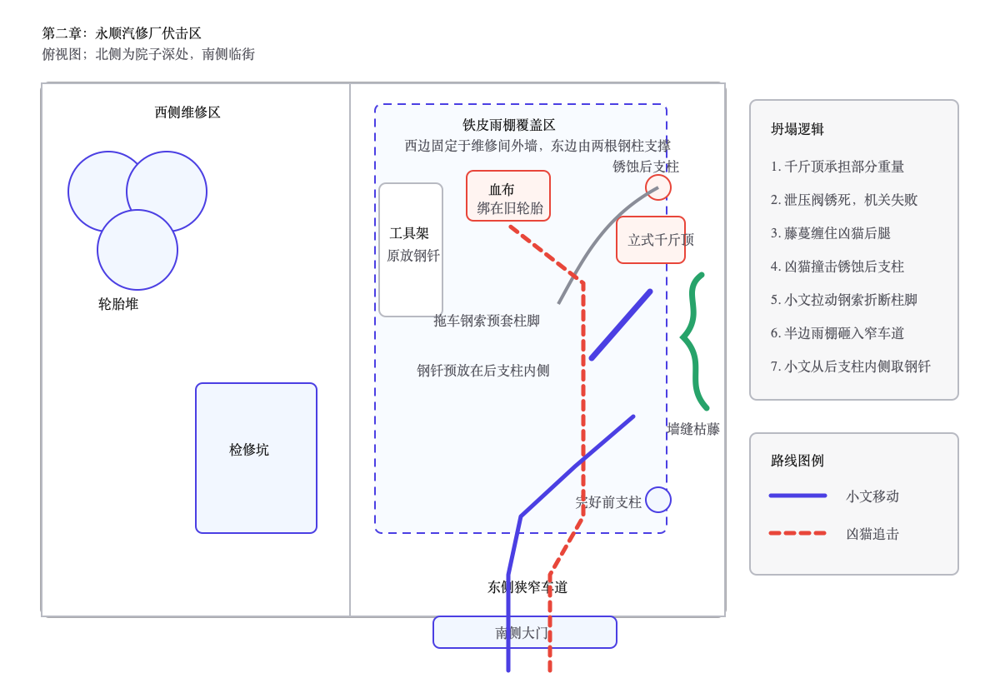

# 第二章 雨夜凶猫

雨比刚才密了。

它斜穿灰雾，敲在废车顶棚上，也打进小文后颈。冰水沿着脊骨往下淌，流到腰间时已经带上一点温热的血。

绕过东后巷那道南侧院墙后，他重新折向北，拖着右腿往猎鹰基地走。

阿慧缠上的纱布早已湿透，每次鞋底落地，脚踝伤口便在布条下面重新张开。从消防梯滚落时撞伤的左肩和肋骨也在发疼。小文不敢停，只把每一步压到最短，尽量不让鞋跟在积水里发出太大的声音。

猎鹰基地还有不到一公里。

再过两个路口，就能看见外围民房的黑色屋顶。

父亲今晚七点要赶最后一轮治疗。没有小文背他，父亲连外围医务点都走不到。母亲自己的药也只剩半片；出门时她把那半片压在杯底，说等晚上难受了再吃。小文看见了，没有拆穿，只说天黑前回来。

现在天已经黑了。

他经过第一处路口。

屋檐水落进脚边的浅坑，圆形波纹向外推开。水面里除了小文晃动的肩膀，还掠过一道更低、更长的影子。

小文没有回头。

他的右手缓缓垂下，摸向腰侧。钢管和手电都丢在超市里，身上只剩一把折柄小刀，刀刃还没有食指长。

后方没有脚步。

也没有呼吸。

只有雨。

他继续向前，故意在一辆侧翻轿车旁放慢速度。破裂的后视镜朝向来路，镜面只剩巴掌大，雨珠正从裂纹中间往下爬。

小文从镜中看见了一双黄褐色眼睛。

狸花猫伏在二十多米外的公交站棚上。它的脊背几乎与栏杆齐高，湿透的毛贴着身体，显出一根根隆起的骨头。左腹裂着一道长口子，雨水从翻卷的皮肉上冲过；右前爪缩在胸前，只有另外三条腿压着棚顶。

是超市外那只猫。

小文握住小刀。

狸花猫没有扑。

他向前走了两步，它才从站棚跃下。落地时右肩明显向下一沉，受伤的前爪只在水面点了一下便重新缩起。

另外三只爪子却在水泥上压出浅白划痕。

这样的体型和力量，至少一级。

小文停住。

它也停住。

黄褐色瞳孔隔着雨幕盯着他的右手。直到小文把小刀收回身侧，它才又向前挪了半步。

它不是追不上。

它在等。

等他腿上的血继续流，等他握不住刀，等他自己倒在离基地更近的地方。

前方岔路口已经露出轮廓。

左侧经过两排旧民房，通往猎鹰外围。父母就住在第一排最东头，门锁是小文用两块铁片改的，窗户内侧只钉了一层薄木板。

这只猫若跟到那里，门和木板都挡不住它。

右侧通往废弃工业街。路更远，积水更深，夜里几乎不会有人经过。

小文走到岔路中央。

左脚已经迈向回家的方向。

他看见母亲靠墙挪步时总会磨亮的那截门槛，又看见父亲床脚下摆着的搪瓷盆。那些东西只在脑中亮了一瞬，便被雨水压了下去。

小文收回左脚，转向右侧。

身后的狸花猫也改变方向。

这一次，他听见了爪尖划过水泥的轻响。

---

同一时刻，猎鹰基地外围。

机械钟的分针又跳了一格。

母亲听见齿轮咬合的轻响，手指在旧围巾上收紧。围巾是小文出门前留下的，边角还沾着一点早饭时溅上的粥渍。

窗外已经看不清路。

雨点打在铁皮棚上，起初杂乱，后来渐渐连成一片。每次巷口有人踩水，她都会抬头；脚步若没有在门前停下，她便重新看向墙上的钟。

“六点十二。”她说。

父亲坐在另一张床边，浮肿的双腿藏在薄被下面：“粮油超市比城西药店远三公里。回程还要推板车，路一滑，晚一个小时正常。”

“六点零五的时候，你说晚半个小时正常。”

“雨又大了。”

母亲看向他手里的搪瓷杯。杯口早已没有热气。

“从五点到现在，你把这杯水端起来五次，一口没喝。”她说，“刚才算路的时候看窗户，现在算雨，又开始看地。你还有什么最好听的，一起说完。”

父亲的拇指沿着杯沿蹭了一圈：“任务布告写了十个人，两辆板车。真找到粮食，他们可能先封好仓库，再等基地派车。”

“你是在等儿子，还是在替任务处写解释？”

父亲没有回答。

母亲把围巾放到膝上，用还能活动的右手一点点抚平褶皱：“小文十二岁打碎碗，你替他瞒我，也是先讲三句道理，再漏一句实话。现在你告诉我，最坏是什么？”

杯底碰上床边木箱，发出很轻的一声。

“最坏……”父亲盯着自己肿胀的脚背，“搜索队没有回来。”

屋里只剩雨声。

过了片刻，他又开口：“家里现在有五十五点。我们下一次治疗要四十点。他接这个任务，是想尽快攒到二级治疗的八十点。要是没有我们两个，他做基地里的安全杂务，也能养活自己，不必——”

“别拿贡献点给儿子标价。”

“我是在算他本来不用付出的东西。”

“那你漏了一笔。”母亲抬头看他，“灰雾落下来那天，整条街的人都往医院外跑，他逆着人群进去找我们。那时候谁给他贡献点了？”

父亲握杯子的手慢慢收紧。

“所以我才怕。”他说，“他总觉得自己能把所有人都带回来。”

母亲攥着围巾的手松了一瞬。

她想起医院消防门被撞开的那一刻。十八岁的儿子浑身是血，背起父亲时两条腿都在抖，嘴里却只说“后门还能走”。后来每次小文说“我有办法”，她都会先看他的手。

手越稳，事情往往越糟。

“七点。”父亲说，“七点还没有消息，我去北门问。”

“七点也是你最后一轮治疗。”

“他不回来，我连医务点都去不了。”父亲把杯子放下，“那就先问人。”

母亲看了一眼他的腿：“你先走到门口。”

父亲扶住床沿。双脚刚落地，膝盖便抖得撑不住身体。

母亲伸手托住他的手肘，把他按回床上：“门口都没到，还北门。”

“我可以歇两次。”

“你歇到换岗，守卫正好回来告诉我，你晕在半路。”

父亲还想说话，母亲却先移开脸。窗板缝隙里漏进一线灰白雨光，落在她膝上的旧围巾上。她眨了两次，喉咙仍然发紧。

“他要是真回不来呢？”

父亲沉默了很久。

“那也得有人亲口告诉我们。”他说，“在那以前，等他。”

机械钟仍在走。

一格。

又一格。

---

猎鹰基地中央办公楼。

桌角的机械钟弹出一声轻响。

第七搜索队已经超过回程节点十分钟。天干翻开出勤册，闭上眼。十道由他在北门亲自标记的魂火浮进黑暗：九处已经冷透，最后一点已经偏离北侧回程线，落向东南。

那道微光比一刻钟前弱了大半。

它太弱，方向也在轻微摆动。

天干睁眼，把三次感知到的方向分别压在桌角地图上，只能圈出一道约七度宽的扇面。他合上出勤册，推开首领办公室的门。

马克站在窗前，正用一块白布擦拭指节。他没有回头。玻璃里同时映着他的手和天干绷紧的下颌。

“第七搜索队。”天干站在门内，“出发时标记十道魂火，九道已经熄灭。最后一道仍在移动，强度不足三成，已经偏离北侧回程线，方向东南。方位误差约七度。”

马克把白布折了一次：“为什么转向？”

“无法确认。路线连续，没有绕圈。按最坏情况处理，目标可能在主动避开基地，也可能被威胁逼离回程线。”

“能确认威胁数量吗？”

“不能。魂灯只记录被标记者。”

马克走到墙边地图前。指尖先落在粮油超市，再沿回程线移到东南工业区。

“方岳的小队出发。”他说，“先带人回来，再确认附近威胁。装备和现场都排在人后面。”

“是否授权白川使用储备药物？”

“授权。”

天干没有立刻离开：“优先级确认：幸存者第一，威胁确认第二，现场证据第三。三项冲突时依次放弃后两项；不为装备和取证增加伤亡。”

马克看了他一眼：“你每次都要复述得这么完整？”

“完整的命令不容易死人。”

“去吧。”

天干转身走出办公室。

北侧训练场的探照灯没有亮。四个人借着门内的火盆光整理装备，影子在湿地上忽长忽短。

方岳先把改装防暴盾扣上左臂：“目标、停止条件、撤退线。”

天干展开地图：“目标是一名身份未知的幸存者。陈锋可以前出一百米，但不能脱离林夏感知；失联三十秒立即退回。发现目标后先确认威胁，不穿越未探明建筑，不追击主动脱离的威胁。撤退沿永安路原路返回。”

陈锋活动着十根手指，指节响成一串：“一百米对我只有几步。等你们背着门板赶到，人可能都凉了。”

方岳偏头看他：“谁背门板？”

“你。”

“这是盾。”

“砸脚上都一样疼。”

林夏已经蹲到地图旁。她闭上右眼，指尖沿东南方向的扇面缓慢移动：“按失联时间和普通人的步行上限，这个方向会扫过汽修厂、纺织仓和南侧居民楼。雨会削弱声音与气味，我只能确认你有没有离开感知范围，不能替你看见墙后。”

陈锋嘴角还带着笑，手指却停止活动：“明白。没发现，不等于没有。”

白川把两支抗生素、一卷止血带和剪刀依次塞入医疗包：“伤情？”

“魂火持续减弱，原因未知。”

“按重伤准备，失血、低温和污染都不能漏。”白川拉紧包带，转向方岳，“队长，接近前先确认附近威胁。我需要能蹲下止血的位置，担架也得进得来。”

方岳看向三人：“陈锋报位置和退路，林夏报数量与误差，白川走盾后。谁想临时改顺序，现在说。”

“我只想申请把盾叫门板。”陈锋说。

方岳推开训练场铁门：“申请驳回。出发。”

四道人影冲进雨幕。

---

小文已经走进东南工业街。

两侧厂房没有灯，破窗一扇接一扇掠过视野。雨水从断裂排水管里成股砸下，落地声盖住了身后偶尔出现的爪响。

一直替右腿承担重量的左脚也开始发麻。

每次身体向右歪，后方那道影子都会靠近几步；等他重新站稳，影子又停在废车或墙角后面。

小文不再回头。

那只猫已经把耐心摆给他看。回头只会告诉它，他还剩多少力气。

转过旧五金厂，一辆厢式货车横卡在两堵围墙之间。车腹已经陷进碎砖，只在驾驶室与墙角之间留下一道不足半米的缝。

小文侧过肩膀挤了进去。右腿擦过砖角，纱布里的血立刻热了一层。

身后传来沉重落地声。狸花猫跃上车头，受伤的右前爪刚压住湿滑玻璃，肩背便猛地一沉。爪尖刮过车顶，又摔回路面。

它没有再跳。

黄褐色眼睛隔着车窗裂纹盯了小文一瞬，随即隐入侧巷。小文送餐时绕过这片厂墙，记得最近的缺口在纺织仓后门；从那里折回来，至少多走三百米。

这不是摆脱，只是几分钟。

前方一块蓝色招牌从雨里显出来。油漆剥落大半，只剩“永顺汽修”四个模糊的字。

小文认得这里。

灾变前，他来送过三次饭。老板嫌最后一单慢了七分钟，把他堵在雨棚下骂到饭菜都凉透。小文站着听完，也记住了东侧窄车道、维修区的检修坑，以及那根被货车撞弯、靠立式千斤顶勉强撑住的后支柱。

他拐进南侧院门。

手电已经丢了。雨夜残余的灰光从院口铺进来，只照亮靠外半座院子。西侧轮胎堆泡在水里，黑色圆孔层层叠叠；维修间门前横着一条检修坑。东侧窄车道只能通过一辆轿车，铁皮雨棚压在上方，后端沉得比前端低。

墙边工具架歪着。几根拆轮胎用的钢钎斜插在铁桶里。

更里面，弯曲的后支柱离东墙不到半米。柱脚已经锈穿，柱子与墙之间留着一道刚够侧身的檐外窄缝，几根枯藤从缝底爬出，被雨水压在砖面上。立式千斤顶卡在横梁下，替那根柱子分走了一部分重量。

小文先看入口，再看西侧检修坑，最后看向东侧窄道。

南门太宽，拦不住猫。

西边遮挡多，但轮胎堆会替它藏住第二次扑击。

只有东侧窄道能逼它沿一条线进来。

他走到工具架前，抽出一根钢钎。钢钎比手臂长，尖端沾着旧锈。他把它平放进后支柱与东墙之间的窄缝，又从架脚旁捡起一把活动扳手，最后取下墙钩上的拖车钢索。

钢索绕过柱脚时，铁丝倒刺扎进掌心。

小文没有松手。他把索头沿墙根拖到千斤顶旁，留出一段能在倒地后抓住的长度。随后用折柄小刀撬开泄压阀外面的锈壳，再将小刀折回腰侧。

阀杆能动。

只转了不到四分之一圈，千斤顶便发出一声低沉的金属呻吟。雨棚后缘向下沉了半指，积水从铁皮凹处倾泻下来。

小文立刻拧回去。

再往下是否顺畅，他没法试。横梁一旦真正卸力，凭他现在的身体不可能再把千斤顶顶回原位。

能塌。

但必须让猫站到后支柱和窄道中央之间。

南墙外传来爪尖刮擦水泥的轻响。

绕路换来的时间已经用完了。

他撕下右裤腿上被血浸透的一块布，从院门开始，断断续续擦过东侧地面。最后将血布塞进后支柱旁一条废轮胎的裂口。

做完这些，小文靠上南门内侧。

胸口起伏得太快。他用手背压住嘴，把咳嗽和喘息一起堵回去。

狸花猫出现在院门外。

它没有顺着血迹进来。

黄褐色眼睛先扫过西侧轮胎堆，又停在雨棚下。受伤的右前爪始终蜷着，左腹伤口在一路跟随后重新裂开，血正沿着湿毛往下滴。

猫在门外来回走了半圈。

每次鼻尖朝向血布，它都会向前挪一步；每当铁皮被雨点砸出更重的响声，它又会立即退回门柱之外。

小文握紧活动扳手。

它也在检查入口。

一分钟过去。

小文右腿抖了一下，鞋底在门后积水里擦出轻响。

狸花猫立刻伏低身体。

小文没有动。

它仍然不进。

雨势又重了一层。铁皮凹处很快兜起一汪黑水，后支柱每承受一阵密集敲击，锈蚀的柱脚便发出一次细小呻吟。

冷意顺着湿衣服往骨头里钻。小文眼前的院墙开始轻轻晃动，连血布的暗红色都在变淡。

再等下去，先倒下的一定是他。

他弯腰摸到一枚螺母，朝西侧检修坑扔去。

螺母撞上坑沿。

叮。

狸花猫的耳朵转向西边，眼睛却仍盯着门后。

小文心口猛地一沉。

下一瞬，它蹬开地面积水。

没有扑向声响。

直扑小文。

小文提前向后倒去。利爪擦过胸口，撕开外衣，在皮肤上留下三道火辣辣的血痕。他挥出活动扳手，金属重重砸中猫的颧骨。

震力一路撞回虎口。

虎口裂开，血立刻抹上扳手柄。小文险些脱手，又用手指将它勾了回来。

狸花猫翻身落地，受伤的右前爪本能撑了一下，肩背顿时抽紧。它没有立刻再扑，只堵住南门，喉咙里挤出婴儿哭泣般的低叫。

小文退向东侧窄道。

猫用三条腿缓慢跟进。

他退一步，它跟一步；他握紧扳手，它便停下。那道腹部伤口越裂越长，它仍没有把身体交给一次没有把握的扑击。

小文现在确定了。

它不是不想扑，而是同样赌不起第二次重伤。

这就是小文唯一能利用的东西。

---

东南工业区外缘，陈锋踩进一片齐踝深的积水。

第一步落下时，他便察觉鞋底被什么东西勾住。速度硬生生收回，污水在身前掀起半面弧形水幕。

一根晾衣铁丝横在水下，另一端缠着倒塌的电动车。

“永安路南口，水下有铁丝。”他按住耳侧的简易通话器，“我没摔。前面暂时安全。”

“改成视野内没有发现威胁。”林夏的声音从后方传来，“雨棚、车底和二层窗口都不在你的有效视野里。”

“行。视野内没有发现威胁。”

方岳踏进水里，盾牌先压住铁丝：“你离我三十米。等白川过线，再走。”

陈锋回头看见那面盾，嘴唇动了动，最终没再叫门板。他蹲下来活动脚踝，雨水顺着发梢往下淌。

白川跨过铁丝时扫了他一眼：“扭了？”

“没有。”

“先踩实，别急着跑。要是疼就报给方岳，别等肿起来才说。”

林夏在积水边闭上眼，右手两根手指缓慢转向东南。五秒后，她才开口。

“东南，一百四十到一百七十米，两组落地震动。”她睁眼，“前一组一轻一重，右侧带拖擦，方向与魂火一致；后一组三重一轻。第二组无法确认种类。”

陈锋已经站起：“三重一轻，东西伤了。”

“可能受伤，也可能路面不平。”

“你就不能让我高兴半句？”

“错误结论会让你多跑一步。”林夏说，“那一步可能正好跨进攻击范围。”

方岳重新抬盾：“陈锋前出六十米。看见院门就停，先报出口。”

陈锋应了一声，身影从雨里骤然拉远。

---

汽修厂东侧窄道里，小文的后背碰到了湿冷砖墙。

不能再退。

钢钎在后支柱内侧，离他还有三步。千斤顶的泄压阀就在右手边，拖车钢索贴着墙根，一直延伸到脚下。

狸花猫停在雨棚中段。

血布就在它前方。

小文让右膝软下去。

不是假装。

失血已经抽空了腿里的力气。他顺着墙往下滑，活动扳手从指间脱落，砸进水里。

狸花猫的瞳孔缩紧。

它向前迈了一步。

右前爪仍然没有完全落地。

又一步。

鼻尖已经碰到血布。

小文猛地转动泄压阀。

阀杆只走了半圈，便被锈死的螺纹卡住。

千斤顶下降不到两指。

头顶横梁重重一沉，却没有塌。

狸花猫受惊后撤，脊背撞上弯曲的后支柱。铁锈簌簌落下，柱脚仍被最后一层金属连着。

没有断。

小文抓住钢索，用尽力气向外拉。

掌心伤口被倒刺重新撕开。钢索绷直，柱脚发出刺耳摩擦，却只向外偏了半寸。

猫的耳朵转向钢索摩擦声，视线随即沿着绷紧的钢索扫到墙根。

它舍弃血布，转身扑向墙根。

小文来不及够钢钎，只能侧滚。受伤的前爪从背上擦过，另一只爪子却结结实实抓进右肩，将他整个人掀向东墙。

肩胛撞上砖面。

眼前白了一瞬。

狸花猫落地时腹部伤口撞上碎砖，暗红血液一下涌出来。它发出尖叫，却没有退，三条能用的腿重新压低。

小文的右臂已经抬不起来。

他用左肘向北挪，把半边身体塞进后支柱与东墙之间的檐外窄缝。狸花猫的肩背进不来，但从窄道起跳，前爪仍能探到墙根。

钢钎躺在两米外。

钢索还缠在左手腕上。

头顶雨水沿着没有落下的铁皮边缘成排滴落。每一滴都砸在泥地里，冲出一个小坑。

父亲今天还没有治疗。

母亲那半片药还压在杯底。

小文用左肘撑住地面。

“我不能死。”

声音刚出口便被雨打散。

狸花猫向前挪动，在一步可扑的位置停下。身体的重量全部压在三条完好的腿上。

小文的左手陷进墙根泥水。

指缝碰到几根冰冷的枯藤。

猫的后腿猛地绷紧。

灰雾随着小文下一次呼吸灌进肺里。胸腔深处有什么东西同时裂开，冰冷、尖锐，顺着肩膀和手臂一直扎进掌心。

泥水下面传来细小的断裂声。

不是铁。

枯藤贴着他的手背抬起一寸。

小文看见一截原本干瘪的茎秆重新鼓胀。雨水被迅速顶开的表皮推向两侧，一点极淡的新绿从裂口里探了出来。

狸花猫扑来。

枯藤同时窜出泥水。

第一根缠住它的左后腿，第二根从腹下穿过，勒进右侧腰腹。藤条太细，刚一受力便接连崩断，却将它扑击的方向硬生生扯偏。

猫的身体横着撞上后支柱。

锈蚀柱脚发出一声脆响。

小文左手抓死钢索，向怀里猛拽。

最后一层锈铁撕开。

失去东侧支点的横梁向西侧车道内折落，千斤顶被挤得侧翻。雨棚上的积水先整片泼下，紧接着是铁皮、砖块和生锈支架。

轰鸣压住了猫的嘶叫。

泥水从地面炸起，拍上小文的脸。

他伏在墙根，等坠落声稍停，才拖着右肩爬向钢钎。

狸花猫被压在扭曲铁皮下面。

它还活着。

一只前爪从缝隙中猛地探出，在小文右小腿上撕下一片皮肉。小文扑倒，手指却碰到了钢钎尾端。

他把钢钎拖进怀里。

第一下刺中眼眶边缘。

尖端沿头骨滑开，火星在雨里亮了一点。猫爪擦过他的手臂，留下四道翻开的血口。

第二下扎进眼角。

狸花猫疯狂扭动，压在背上的铁皮被顶起半尺。右前爪因为承重再次折向内侧，腹部伤口也被支架撕开。它没有退路，小文同样没有。

他用还能活动的左手握住钢钎，右手只负责压住尾端。

雨水顺着眉骨流进眼睛。

他看不清，只能感觉钢钎下面那颗头还在动。

第三下。

小文把上半身全部压了下去。

钢钎穿过眼窝。

嘶叫戛然而止。

雨水落在铁皮上的声音重新涌回来。

小文没有松手。

一下呼吸。

两下。

第三次，压在钢钎旁的胸腔仍然没有起伏。

他这才一点点松开手指。

墙根的枯藤已经重新伏进泥水，只有断口处那点新绿覆着雨水，反出一线极淡的灰光。小文想伸手碰它，手臂却抬到一半便落了下去。

---

猎鹰基地北门指挥点。

最后一道魂火骤然缩小。

它没有熄灭，却从一小团摇晃的火苗压成了几乎看不见的光点。

天干按住通话器：“命令变更。放弃威胁确认，放弃现场取证。全速救人。”

雨声里传回方岳的命令：“陈锋，直线前出。看见目标先报，不准独自接触未知威胁。”

“收到。”

陈锋踏过一处积水路口。雨水从鞋底向两侧炸开，路旁废车的后视镜接连映出一道被拉长的人影。

“还有两条街。”林夏的声音追进耳机，“前方两排塌房遮挡视野，保持直线。”

---

汽修厂雨棚下。

墙后，钢钎从小文掌心滑落。

当啷。

那点新绿在他模糊的视野里轻轻晃了一下。

随后，所有声音一起沉进黑暗。
