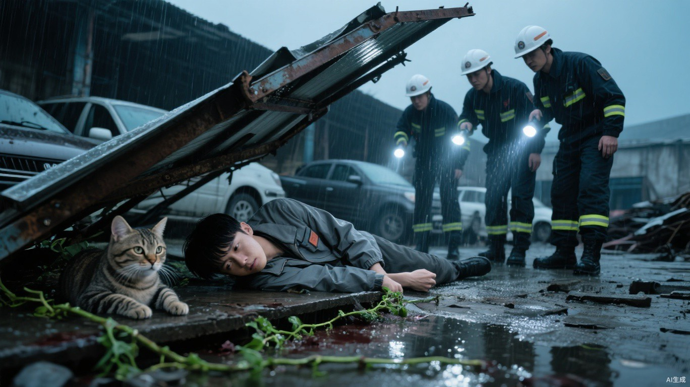

# 第三章 一线生机

手电光从半堵死的检修口切进来时，小文又睁开了一次眼。指尖还贴着钢钎露在外面的铁杆，已经攥不住了。

洞外，铁皮雨棚压住狸花猫大半截身体；洞内，钢钎从眼窝没入颅内，雨水沿着铁杆往下淌，把小文掌心里的血冲成一缕一缕。

盾沿抵住猫的下颌。刀背挑开仍伸在夹道里的右前爪，没有回缩。

“确认死亡。”

四个字隔着雨声落下来，像是从街对面传来的。

外面响起铁架相互摩擦的尖声。压在猫背上的残架被抬开一点，卡住洞口的头颈缓缓退出去，钢钎也从小文指尖滑走。下一束光随即铺进夹道，落到小文脸上。

白川侧身进来，跪进积水。剪刀贴着小文的裤缝往上走，剪开早已和伤口粘在一起的布料。

“右腿两处撕裂，右肩和胸前抓伤，右侧胸壁挫伤，后脑肿胀，双手破损。呼吸浅，低温，脉搏快而弱。”白川伸出手，“止血带。担架铺平，别扶他坐。”

冷白色的光从白川掌下漫开，贴住小文腿根和颈侧。伤口仍旧翻着，血流却像被一只手从里面攥住，慢了下来。

小文的眼皮动了动。

雨声从四面八方压下来。他看不清白川的脸，只看见光里一截洗得发灰的袖口。

“几点了？”他喉咙发紧，“我爸……七点要治疗。”

“先别说话。”白川低头看他，把那只抓着袖口的手拢进保温毯，“七点过了。先看着我，别抬头。”

小文还想问七点的治疗，喉咙里却只挤出半声“爸”。那截灰袖口凑近了。

“听见了。先送你回去。”

小文的手指松开。

白川护住小文的肩颈和右腿，两双手从洞外接住他，将他侧着移出检修口。两根钢管已经穿进拆下的门板，临时担架就铺在车道积水里。

手电光随之一晃，扫过凶猫睁大的独眼，也扫进墙后的夹道。几根断藤从墙根一直拖到洞口，外侧的细茎还缠在凶猫后腿和腰腹上。断口被雨冲得发白，正往外渗透明汁液。

有人蹲下割了一截，塞进证物袋。

白川没有回头：“先送人。”

门板抬过门槛时晃了一下，白川的手一直压着他的腿。

雨点敲在毯外的铁杆上。

一下，又一下。

金属碰响隔着雨砸进来，夹着白川压低的指令。雨棚外的白光在小文眼前拉成长线，随后全部沉进黑暗。

再有声音钻进来，是车轮碾过地缝。身下已经换成推床，头顶发黄的天花板缓缓往后退。

推床停在窗边。窗户被木板封住大半，一道午后的灰光斜落在床尾。隔帘后有人咳得喘不上气，塑料药瓶从水泥地上滚过来，撞住铁床脚，又慢慢转了半圈。

小文动了一下右手。

白川坐在床边削苹果。那只苹果皱得厉害，一侧已经发黑，他用小刀把坏掉的部分一点点旋下来，只留下薄薄一圈果肉。

“下午了。”白川顺着他的目光看向窗缝，“昨晚送进来的。别急着动。”

小文撑住床板。

白川托住他的左臂，把他按回去：“躺好，别把刚缝好的地方挣开。”

“我爸昨晚……赶上治疗了吗？”

“没去成。”白川搁下刀，“你母亲托附近医务点的人来问过，她走不到这边，也抬不动你父亲。我已经让人回话，说你抢救过来了，还得观察。”

疼痛从肩后一路烧到脚踝。小文躺回去，呼吸停了半拍。

“他们知道我在这里？”

“知道你活着。伤成什么样，等你回去自己说。”

他把削净的半只苹果放到床头，又从病历夹里抽出一张纸，压在苹果下面。

“先吃，再看。”

小文已经看见纸上的数字。

**家庭账户：55。**

**濒死抢救及用药：100。**

**粮油任务：失败，不结算。**

“一百？”

“昨晚我连续用了两次光系治疗，才勉强把你稳住。再加上药和材料，这一百点没多算。”

负四十五。

账单底下还有一枚灰章：欠款未清，暂停家庭治疗排程。

小文把单子翻过来，背面空白。他翻回去，指腹停在“家庭”两个字上。

“先停我的。”他说，“我爸昨晚没治成，我妈三天以后还要去。能不能只记在我一个人名下？”

白川把夹在病历里的家庭账户底单转向他。三个人的名字挤在同一栏里，抢救扣款记在栏外。

“现在挂的是这一个账户。”他等小文看完，才把底单夹回去，“拆开记，我这里办不了。你刚才说的，我可以写进申请。”

小文掀开被子。右脚刚碰到地面，绷带下面便猛地一热。新血沿着小腿内侧钻出来，在脚背上积成一滴。

白川托住他的膝弯，把腿送回床上：“血又出来了。你要去哪？”

“后勤。”

小文仍抓着床沿：“那只凶猫是我杀的，尸体和晶核应该能换些分数吧。”

白川拆开重新渗血的绷带：“已经入库了，但是算在救援队头上。后勤不相信是你杀的。”

“钢钎还插在它眼睛里。”小文摊开手，掌心那道磨烂的血口正对着白川，“那是我压进去的。”

白川没让那只手悬着，取了一块干净纱布垫在下面。

“方岳写进复核单了，还没回。你自己做了什么，等能坐稳了再补一份。”他把新绷带压住，“先别够衣服。刚才一落地，这里就重新出血了。”

小文收回够衣服的手。白川压着绷带，等那点新血不再往外洇。

门外响起脚步。不是伤员拖鞋摩擦地面的声音，靴底落得整齐，走廊里的交谈声随之低了下去。

靠门的人把敞开的衣领拢好。隔壁床那个一直哼疼的男人咬住被角，硬把声音压了回去。

门帘被守卫掀开。

马克先走进来，天干落后半步。马克的黑色风衣扣到领口，袖口干净；天干左眉那道断疤还沾着湿气，怀里夹着出勤册和一个透明证物袋。

马克走到床边，先问白川：“小文现在情况还好吗？”

白川答道：“经过两次光系治疗，病人的血已经止住了，腿和肩背的伤现在也稳定下来了。不过伤得还是比较重，今天恐怕还是下不了床。”

马克点了点头，这才对小文说：“安心养身体。阿慧和老秦昨晚出了什么事，你清楚吗？”

小文沉默了一会儿：“老秦为了让我们能走，一个人留下来挡那些异化犬。后来……我们再也没有见过他。”

他停了一下：“后来有一头异化野猪朝我们冲过来。阿慧刚把我推进旁边的凹槽，自己就被撞飞了。”

马克看向身边的文员：“老秦和阿慧的事情都记清楚。去见他们家人的时候，把小文刚才说的这些也告诉他们。”

他接着说：“任务虽然失败了，抚恤照常发放。他们的欠账也一起清掉，不能让家属还。”

马克接过小文的抢救单，看了一眼上面的费用：“这一百点医疗费，减免一半。”

他稍稍转过身，正对着病房里的人：“另外再给十点奖励。小文把凶猫引离了居民区，没有让它冲进去伤人。这份奖励是他应得的。”

马克在抢救单上盖下印章。

靠门那个吊着胳膊的人先拍起了床栏，另一边很快也有人跟着鼓掌。

小文紧攥着床单的手慢慢松开，嘴角爬上了一缕笑意。

白川接过抢救单，重新算了一遍，然后递给小文。

**55-50+10=15。**

小文抬头看向马克：“我母亲三天后有一次治疗，就只差五点。能不能先让她治？差的五点，我一定想办法补上。”

马克看了他一会儿：“虽然只差五点，但这个先例我们不能破。一旦破了例，就会有第二次、第三次。”

小文撑着床沿坐直了些，疼得眉头一紧：“只有三天了。我现在下地都困难，很难凑齐这五点。”

马克看着他的伤腿：“你的情况我理解，但基地里还有很多人等着治疗，我不能只给你一个人通融。”

马克转向天干：“你不是还有事情要问他吗？”

天干把出勤册放到床尾，透明袋也跟着放在旁边。里面那截枯藤已经被雨泡得发黑，断口却还留着一线青白。

天干拉过一把椅子，在床边坐下：“你刚才说，老秦留下来挡异化犬。你们进去搜索之前，没有查过附近的危险情况吗？”

“查过，当时没发现什么危险。”小文说，“不过那地方有点怪。上面有刚留下不久的巨熊基地标记，里面的粮袋几乎没被动过。还有老秦在板车下面发现了一根鱼线，一头系着后轴，一头钻进墙里。我们装完货，板车一动，鱼线就被拉紧了。几乎同时，那些异化犬就冲进后仓了。我们逃进走廊以后，一头异化野猪突然从死角冲了出来。”

天干低头记了几笔：**超市勿入，复查。**

他拿起透明证物袋：“救援队找到你的时候，这些藤缠在凶猫身上，是怎么回事？”

小文看着袋子里的断藤：“那只猫把我拖到洞口的时候，我好像碰到过类似的藤。后来雨棚塌下来，我就看不清外面了。具体那些藤怎么缠在凶猫身上的，我不知道。”

马克对白川说：“这件事也记进病历。等他的伤稳定一些，再看看是不是觉醒了。”

白川点头，从柜子里抽出一张《初醒者须知》，递给小文。

“先拿回去看看。”她说，“身体有什么变化，记得回来告诉我。”

马克起身：“好好养伤。”

天干收起出勤册和证物袋，跟着他出了病房。

傍晚，白川重新给小文换了绷带。

“可以回去了。这三天少走路，更别想着出去干活。”她在医疗单背面写下“三天观察”，“伤口发黑、发热，或者肿得更厉害，就回来找我。明天还需要过来换一次药。”

小文接过短拐：“明天能不能先不换？要是没再流血的话。”

白川抬起头：“想省点数？”

小文低下了头。

“换药的钱我先给你垫着。”白川说，“明天过来，我得看看里面的伤口。”

她朝门口抬了抬下巴：“走两步我看看。拐别放那么远。”

小文把拐往脚边收了半寸，慢慢站稳。白川跟到门口，等他迈过门槛，才松开扶着左肘的手。

小文把父母的两张治疗凭证、医疗单和《初醒者须知》塞进贴身衣袋。那半只苹果用干净纸包好，放进外侧口袋。扶住短拐时，又伸手按了按装苹果的口袋。

回到住处时，门虚掩着。

小文推开门。旧布帘将不大的房间隔成前后两块，父母的木床在帘后，自己的窄褥铺在帘外靠窗的位置。

坐在布帘旁矮木凳上的母亲一下站了起来。动作太急，左腿没能跟上，身体往旁边一歪。

小文赶紧伸手：“妈，你慢点。”

母亲扶住墙，拖着左腿来到他面前：“我没事。站稳了，让我好好看看。”

她先看了看小文肩头衣服破口下露出的绷带，视线又顺着衣服上残留的血迹慢慢往下，最后停在右腿缠着的绷带上。

“腿伤得重不重？”

“没事，就是被抓了一下。”小文把短拐撑稳了些，“医生让我这几天少走点路，明天再去换换药就好了。”

母亲的眼眶开始泛红：“你出门的时候明明说只是去搬粮，怎么回来就伤成这样了……这一路上，你到底遇上了多少危险？”

小文握紧短拐：“本来都还算顺利。后来异化犬突然冲了出来，老秦为了让我们能走，一个人留在了后面……”

屋里的机械钟咔哒了几声。母亲问：“阿慧也和你们在一起吧？她呢？”

小文低下头，嘴唇几度张合，却没能说出话。

“好了好了，不说了。”母亲打断他，“那些事别再回忆了。”

她回身把刚才坐的木凳往矮桌旁挪了挪：“慢点，别急。”

小文拄着短拐过去，一手扶住矮桌，慢慢坐下。

布帘没有合严。父亲撑着床慢慢坐起身，把紧挨床沿的矮桌上几个药盒往里收了收。

他看着小文悬着的右脚，过了一会儿才说：“都这样了，就在家好好歇几天。腿没养好之前，别想着出去干活。”

小文低着头，没有应声。他从贴身衣袋里取出医疗单和两张凭证，放到父亲刚腾出来的地方。

父亲的目光落到那两张凭证上：“家里的也带回来了？”

“嗯。我的抢救费也从里面扣了。”小文把医疗单往父亲那边推了推，“本来要扣一百点，白医生帮我去找了首领，最后只扣了一半。首领还给我们补了十点奖励，所以现在还剩十五。”

父亲低头看着医疗单，手指停在最后那行数字上。

母亲也凑近了些：“只剩十五了？”

小文点了点头。

父亲看着桌上的两张凭证，伸手把自己的那张往旁边推了推：“我的可以先放放。你妈三天后还得去，你腿上的伤也不能拖，家里这些点数，你们先用。”

“你已经耽误一晚上了。”母亲没有去拿自己的凭证，“昨晚喘成什么样你忘了？躺都躺不平，垫了两个枕头才勉强睡着。”

父亲低头理了理凭证的纸角：“我晚几天没事。缸底还有些粮，晚上那份先别去取了，小文腿脚还不方便。”

母亲看着他：“粮的事先不说。你昨天晚上都成那样了，今天好一点，就觉得自己没事了？”

父亲没有回答，只把自己的凭证折起来。

小文伸手按住了纸：“爸，你别收。妈的治疗还有三天，我明天也只是去换药，现在还没到非得决定停谁的时候。”

父亲的手停了一下，目光落到他的伤腿上：“你现在走路都得拄着拐，就别替我操心了。我的治疗晚几天没什么，你先把自己的伤养好。”

小文按着凭证没有松手：“可你昨晚已经没去成了。我没说现在就出去挣点数，你先把纸留着，过几天到底怎么用，我们到时候再算。”

父亲握住凭证的一角，慢慢往回抽：“就是留在这里，你才会一直惦记。你这孩子什么性子，我还不知道？真差那几分，你腿没好就敢往外跑。”

母亲伸手压住两个人中间的凭证：“行了，都别抢。小文刚回来，饭还没吃，你们爷俩先为这个争起来了。两张都放这儿，谁的也不收，等吃完饭再慢慢商量。”

父亲还握着纸角。小文怕他真的收回去，身体往前探了一点。右腿使不上力，左手一下按进桌角花盆的湿土，右手扣住了父亲的手腕。

皮肤相触的一瞬，小文指尖忽然一麻。

左手掌下像有什么东西动了一下。花盆里那株半蔫的葱轻轻颤了颤，原本还带着一点青色的叶尖迅速失了颜色，软软地垂向盆沿。

几乎同时，一股温热顺着小文的手臂掠过去。

他还没反应过来，右手掌下父亲冰凉的手腕已经开始回温。浮肿没有立刻消退，原本僵着的三根手指却一点点松开。

父亲低头看着自己的手，试着弯了弯中指。指尖碰到了掌心。

小文愣住了。他先看父亲的手，目光很快落到花盆里。刚才还勉强立着的葱叶已经塌了下去。

母亲顺着他的目光看过去，随即握住父亲的手，让他再动一下。

父亲慢慢张开五指。原本僵着的中指和无名指跟着舒展开来。他试着握拢，动作虽然还有些迟缓，手指却已经能碰到掌心。

母亲摸了摸他的手背：“真的暖了……刚才还是凉的。”

父亲没有把手收回去，又握了两下，动作比刚才利索了不少。他看着自己的手，过了一会儿才抬头问小文：“刚才你碰到我的时候，做了什么？”

“什么也没做。我就是扶住你，手里突然像有东西过去了。”

父亲的目光落到桌角。花盆里那株葱已经彻底垂了下来。

母亲这时也看见了：“这葱刚才还不是这样的。”

三个人的目光都落在花盆上。

小文顺着那片新绿看过去。汽修厂检修夹道里，也有一截这样湿亮的断口。他将被母亲握住的手轻轻抽出来：“妈，只碰土。难受就停。”

小文把花盆挪到面前，指腹贴住湿土。那股凉意还在，细得几乎抓不住。他闭上眼，听见父亲的呼吸、母亲衣袖擦过桌角，以及机械钟一步一步往前走。

三次呼吸后，另一片枯叶也抬了起来。

小文收回手，右耳后面拖起一线细痛。他趁母亲去抱花盆，用拇指压住耳根。父亲拿过药盒纸，在背面写下日期，又画出三栏：时间、效果、反应。

“头疼没有？手呢？”

小文把手放回桌上：“肩后的伤口扯着了。别处没事。”

父亲在“反应”下面写：无明显反应。写完，他拿过医疗单，核对背面的观察期限：“就按这三天记。今天不试了，明天先看你怎么样。要试，我们都在。”

父亲将湿凭证展开，铺在膝上。小文看着那三根又僵住的手指，身体往前挪了些。

“先走到门口。”他说，“爸，能让你走到门口就行。”

母亲拾起《初醒者须知》，指甲停在“轻微”下面。

“疼得睡不着、手拿不住东西，都不叫轻微。到那一步就停，去找白川登记。听清楚没有？”

小文看着下面“统一安排施术”几个字：“登记以后，还能让我先给爸治吗？”

母亲张了张口，把纸翻到背面。那里没有写家属。

“那也不能硬撑。”她把花盆移到窗边，“你爸晚一次治疗，你急成这样。轮到你自己，就能瞒着？”

小文低头，把两张湿凭证分开晾在桌上。母亲等着，他才低低应了一声。

当天夜里，走廊灯从门板的缺口漏进来。小文等父母睡熟，抱来花盆，借那道窄光又试了三息。叶尖抬高了一寸，他收手时，右耳里却像灌进了水，细细地响个不停。

帘缝里，父亲的嘴唇动了动。

“爸？”

他侧过左耳，仍听不清，伸手想掀帘。父亲却已摸到水杯，自己端了起来。小文就这样等着，直到杯底重新碰到木板，他才听清那一声轻响。

他从药盒上撕下一块纸板，借门上的漏光写下“耳鸣，听不清说话”，又把傍晚那阵刺痛补在前面，藏进褥子底下。

第二天清晨，他在共同记录上写下“新叶一寸”，笔移到反应栏，停了停，落下“轻微头痛”。父亲看见多出的一行：“昨晚又试了？”

“早上。”

母亲正在倒水，闻言转过身：“我还没起来，你就动手了？昨天怎么答应的？”

“只试了一次。头痛已经没了。”

母亲把盛着稀粥的碗往他面前推：“先吃。不吃完，今天什么也别试。”碗沿缺的那一块转到了外侧。小文端起来喝了一口，仍看着父亲搁在被面上的手。

父亲把机械钟移到床边的矮桌上，用拇指将翘起的薄铁后盖按回去。小文吃完后伸手，他却没有立刻递出腕子。

“今天只试三息。你妈看着你，我计时。”父亲按住机械钟，“叫停就松开。做不到，今天就不试。”

母亲把花盆从褥子边抱回桌角：“把后半句也写上。省得有人只记效果。”

小文没有去拿笔，左手贴住湿土，右手才托住父亲的手腕。

三息一到，父亲便叫停。小文松开他的手腕，还没来得及问，父亲已经扶着床沿将双脚放到地上。

母亲伸手去托，被他避开：“让我自己试。”

父亲试着把重量压到双脚上，臀部慢慢离开床沿。膝盖颤着，脚跟却始终踩在地上。母亲的手悬在他肘边，没有收回去。

“够了。”她说，“脚落过地也算，别今天就惦记走。”

父亲重新靠回枕头，额头出了一层汗：“脚跟也落了。两只脚，你都看见了吧？”

小文点头，手还悬在父亲膝边。

“写五息。”父亲伸手比了一下，五根指头没能全张开。

小文收回手：“只用了三息。”

“站了五息。”父亲把比着的手搁回膝上，“你用多久，我能站多久，分开写。以后才知道有没有多一点。”

小文把铅笔推给父亲，接过母亲倒好的水。搪瓷杯到了右手，竟摸不出杯把的形状。他伸向父亲时，杯沿一歪，水洒在被角上。他赶紧用左手兜住杯底。

母亲接了过去：“我来。怎么连杯水都端不稳？”

“有点累。”小文把右手压在裤缝上，“刚才没抓好。”

母亲将杯子放到父亲够得着的地方，向小文伸出右手。

“手给我。昨天才说过，拿不住东西要停。”

小文将右手放上桌。她让他张开五指，看过掌上的伤口，再握住她的食指。他先用中指和无名指扣住，食指贴上去时，才迟迟觉出她指腹的粗糙。

“刚才麻不麻？”母亲握着他的手指没松。

“现在能握。”

她等了一会儿，才把手抽出来。小文松开，掌上的伤口又能觉出疼了。

“我问的是刚才。”母亲盯着他，“午后换药，把洒水这事也告诉白川。别只让人看腿。”

小文低低应了。水杯就在桌边，他没再伸手。父亲将“端杯失手”也记了进去，落笔时看了他一眼。小文把右手留在桌面上。

床前的地砖上，父亲刚踩过的两个鞋印还并在一起。小文把伸直的伤腿往旁边挪，没擦过那两道灰印。

午后换药回来，小文将短拐靠在门边。医疗单背面多了一次换药记录，除此之外没有新字。

母亲坐在木凳上，抬头看了一眼新换的纱布：“手也问了？”

“看过了。能握。”

母亲接过医疗单。等他回到褥子边，她扶墙起身，将凳子拖到床与门之间，凳腿刚好压住地砖中间那条裂缝。

“为什么放这里？”

“放门口也没人坐。”母亲拍掉凳面上的灰，又往父亲那边挪了半寸，“先放这儿。他要下来，别让他去够桌角。”

父亲靠在床头看了半天：“你挪近了一半。”

“先走到这里再嫌。”

“没嫌。”父亲的目光仍停在凳子上。

等母亲去洗碗，小文才在藏着的那张纸上补全：食指到虎口麻，端不住水杯。

第三天清晨，母亲替父亲换袜子，袜口在脚踝上勒出一道发白的深痕。她按了按那道印子，没说话。

午后，母亲再替父亲换袜子，指尖在脚踝上停住。袜口留下的深痕比早晨浅了一层，白边也淡了。她又托起父亲的手，拇指沿手背慢慢按过去，那层浮肿下重新露出一小截青色血管。

“还在。”她朝机械钟偏了偏下巴，“这都午后了。”

父亲把共同记录拉到膝上，在第三日那一格补下时间。小文盯着那截青色，直到父亲放下笔，它还露在皮肤下面。

母亲从桌上拣出自己的治疗凭证，折好，放进床尾的小布袋。绳结拉到一半，小文伸手碰了碰袋角。

“明天？”

“嗯。先收好，别又弄湿。”

父亲看了一眼桌上的医疗单。母亲把布袋放回床尾，没有再说那二十点。小文的右手在袋角停了停，才移向父亲的手腕；左手同时按住桌角花盆的湿土。

掌下那团凉意时聚时散。他想把它留在指腹按着的地方，刚抓住一点，另一处又散了。父亲数满三息叫停时，那股滞涩的凉意才开始往前移动。

差一点。

父亲用另一只手按住他的指节：“小文，松开。”

多出的一息过去，他才放手。机械钟还在矮桌上，齿轮的细响却仿佛进了右耳。小文把手压在腿侧，指尖隔着裤布不停地抖。

母亲已把木凳扶稳。父亲撑起身，朝她摆了一下手。

“你扶着凳子。先让我自己走。”

她没走开，右手留在凳面边缘，身体向父亲那侧倾着。

父亲迈出第一步。

鞋底擦过地面，拖出很轻的一声。

第二步落下时，他的膝盖向内弯了一下。小文刚抬起手，父亲已经自己撑住桌沿，缓慢转身，坐到半程的木凳上。母亲扶着凳子，直到他的重量全落下去，才直起腰。

凳腿晃了一下。

小文弯下腰。凳面底下的绑绳松了，他坐在地上，将伤腿伸向一侧，试着把旧结拉紧。右手按不住绳头，只能把它抵在横撑上，一点点往回勾。粗糙的木纹擦过指腹，沙沙作响。

“给我。”母亲伸手。

“快好了。”

他咬住绳头，左手绕结，右手藏在凳面下面。母亲没再催，手却没有收回去。绳结刚收紧，右手忽然一松，绳头从横撑上弹开。小文松了嘴，把它放进母亲掌心。右手仍压在凳下的横撑上。

“刚才又疼了？”父亲俯身看他。

小文点了一下头，避开父亲的眼睛：“停下就轻了。”

“今天不试了，明天也歇一天。”

小文抬起头：“明天不疼就——”

“刚才三息叫你停，你没松手。”父亲看着他，“明天不试。不是问你疼不疼。”

小文把下巴搁在凳沿。耳里的细响还在，父亲一只手落到他头上，没有催着要回答。

两只布鞋就在眼前，鞋跟都稳稳落地。小文慢慢吐出一口气，用左手将父亲卷进鞋口的裤脚拨出来。

“嗯。”

母亲把绳头收死，才去端水。父亲接过杯子，喝了一口，又望向门槛。

“凳子先不挪。”

母亲在凳前用鞋尖点了点：“原来还说，再过去一块砖。”

“留着。又不是明天就没了。”

父亲收回目光，将杯子放稳。小文藏在凳下的手终于不再抖，他试着松开横撑，没有往前看。

母亲从药盒旁取出白川给的半只苹果。包纸已经潮软，她削去发褐的薄面，剩下的切成三份，放在盘里。

“盘子给我。”父亲伸出手，母亲没立刻松，他便用另一只手托住盘底，“端个盘子，总还行。”

他把盘子接到膝上，自己挑了一片。小文坐在地上仰头看他，父亲又把最厚的一片递下来。汁水沾在凳沿，小文用指腹抹了一下。

“这块给你。”小文指着父亲手里的苹果，“我拿小的。”

父亲的手不大稳，苹果在指间轻轻晃。小文赶紧接过来，另一只手仍托在下面。

母亲咬了一小口，皱起眉：“有点绵了。”

“还甜。”父亲说。

“你算账也这样。”母亲把苹果翻过来，看了看削去的褐边，目光又滑过桌沿那张逾期凭证，“没烂完，就说还能吃。”

“本来就还能吃。”

“早说拿出来，一个推一个。再放一天，就只剩这张纸了。”

父亲低头去捡盘里的碎屑。小文咬了一口，黏软的果肉贴住上腭，他咽了两次，才咽下去。

“别低头吃，噎着。”

母亲伸手替他拨开汗湿的头发。小文往她掌心靠了靠，那只手在发顶停了片刻。

当晚，木凳留在半程，没有搬回门口。父亲的布鞋并排搁在朝床的一侧，鞋尖对着门。

母亲将半盆洗脸水放到窗下，布条搭着盆沿，回床边时又把父亲的逾期凭证压进共同记录和《初醒者须知》下面。

临睡前，小文在共同记录第三日一栏写下“轻微头痛，休息后缓解”。父亲接过，在下一行添了“停练一天”，把笔放进药盒。

母亲又拿起来看了一遍，将花盆移到窗下离褥子更远的一头。

“不碰人，也别碰这个。头还疼就告诉我。”

小文应着。窗板的木楔松了，他用左手推紧；外面闷得一点风也没有，走廊里晾衣服的铁丝垂着，傍晚还在晃的衣袖贴住了墙。

十一点半，隔帘后的说话声停了。

等父亲的咳嗽也歇下，小文摸出藏在褥下的纸板，补下“手抖”，另起一行：第二次，三息，不散。白天若能早一息把那股凉意稳住，也许就不必硬撑到第四息，父亲仍能走到凳边。

母亲的凭证就在帘子那边。他把花盆移近些。

他把花盆放在木凳旁，用短拐支着身体退开。两步，泥土里的根须还在；三步，那点凉意散了。他往回挪半步，不再往远处试。

手不碰土，最外面那条细根仍往盆沿挪了一点。他屏住气，只催这一条越过盆沿。根尖刚抬起，旁边两条细根也跟着动了。耳后的疼痛同时追了上来。

三息，他停手，无名指却还蜷着。小文用左手扳开它，一松，又弯回原处。他借短拐慢慢坐到地上，伸直伤腿，耳内的嗡声始终不散。

钟的分针挪过两个大格，无名指才终于能够自己伸直。

他在纸板上写下“僵直十分钟”。写完，笔杆从右手指间滑下去，他用左手按住。

**再用，可能自己缓不过来。**

下面是两个字：停止。

小文把花盆放回窗下，将写着“停止”的纸扣在褥边。躺下后，他隔一会儿便试着张开一次右手。

过了两点，窗外的晾衣铁丝被第一阵风扯响，父亲又咳起来。

床板轻响。母亲压低声音：“慢点，我把枕头垫高。”

小文在帘子这边撑起身。那边已经响起一下下拍背声。

“要不叫小文——”

“别叫。好容易睡着。”

父亲又咳了半声，硬压回去。小文已经摸到帘边的手停下来，指尖只夹住一根脱出的布线。

拍背声停下后，小文仍坐着。母亲探身从床尾取回小布袋，经过帘缝时，白纸角在漏光里一闪。她把露出的凭证塞回去，放到枕边。

天亮就到日期了。

小文朝桌上的共同记录伸出手，碰到纸边，又缩回来。他拖出身边的纸板，用笔划掉“停止”。划得太轻，两个字还看得见，他又描了一遍。

三点，远处滚过一声闷雷，窗板在木楔上轻轻撞了一下。小文按了按右耳后面，头痛只剩这一小片。他在纸上写好“第三次”，将纸藏回褥子下面。

三息，只让一条根缠住绳结。

小文拄着短拐起身，把花盆挪到木凳脚边，自己坐到凳旁的地面上。伤腿伸直，左手扶着凳沿，右手悬在盆口。

第一息，细根从土里露头，一滴雨敲在窗板上。第二息，它碰到盆沿，又滑了回去。

他将掌心压低。

第三息，根尖终于越过陶片。右耳后面那点痛突然加深，绳结在眼前晃成两个。

到了该停的时候，根尖还差一点才碰到绳头。他刚要收手，细根又滑回盆边。

小文把掌心往下压了一点。

细根贴上绳结，绕住了第一圈。钟声骤然变近，像从耳朵里面敲出来。小文一缩肩，右手五指跟着抽动，根尖失了方向，向凳脚底下钻去。

第六息，他松开掌下那股凉意。绷紧的根须牵住绳结，花盆在回弹中擦过地面。

沙。

帘后拍被子的声音停住。

小文屏住呼吸。盆里的新叶停了，右手却还在向掌心收。他侧身想挪远些，身体一歪，伏倒在木凳边沿。

白天父亲坐下时，凳腿也这样轻轻晃过一下。

他用左手捏着右手指节，挨个往外推。

“小文？”

“没事。”他尽量把牙关松开，“您睡。”

床板又响。隔帘被掀开一角，门上的漏光只照出母亲搭在帘边的手。

“怎么不在床上？”

“醒了……坐一会儿。没试。”

他用左脚跟将花盆往凳下轻推，陶片碰到凳脚。他停住，连下一口气也含在嘴里。

滴答。

小文猛地转头。矮桌就在木凳旁，那只钟的响声一下一下顶在牙根上。他伸出双手包住钟壳，将它抱到胸前，想把声音闷在衣服里。

右手骤然合紧。

薄铁后盖从接缝处弹开，硬边深深硌进掌心。响声还在。他举起钟，目光落在凳脚旁那块硬砖上。

“别摔，给我。”母亲的声音贴着帘子传来。

他抬起的胳膊停住。

滴答。

小文一点点垂下胳膊，却没能将钟递出去。左手松了，右手还死死扣着钟壳。汗从额角流过眼皮，他低头，鼻下落了一滴。

落在凳腿边，颜色比汗深。

他用左手抹了一下，指腹立刻湿了。再擦，温热的血已经淌到嘴角。

拖鞋在帘后擦地，一轻，一重。小文向窗边偏过身，把左手按到嘴上。

“别过来。”

话一出口，他便咬住了。隔帘停了一瞬，母亲没有退。

“是不是疼得厉害？把手给妈。”

他张了张嘴。右臂一直抽到肩窝，背后的伤处被牵得发烫。他只能向前弯腰，把脸埋低，不让漏光照到鼻子下面。

帘布擦过母亲的衣袖。

窗板忽然震了一下。

木楔落地，横风将板子撞开。冷雨劈头灌进来，打在矮桌上，治疗凭证从折页底下掀出一角。紧接着雷声压过屋顶，地面也跟着闷响。

雷震得右耳一阵尖痛，小文喉咙里那声低吟终于漏出来，被屋顶密集的雨声盖住。

“窗开了。”

他用左手撑住木凳起身，伤腿一沾地就往下软。左手赶紧攀住桌沿，右手连钟一起抱在腹前，他挪过水盆，背对母亲抵到窗前。

“我关一下。您别踩水。”

斜雨打进眼窝。他把脸偏向窗外，让那股冰冷的水冲过鼻下，嘴里仍是一阵阵血腥。左肩抵着板边，没敢合严，痉挛的右手藏在木板与窗台之间。

身后的脚步停了一次，又继续靠近。小文听见母亲扶住桌子，搪瓷杯轻轻一响。

他试着松开牙关，嘴唇却随着右臂的抽动往里一缩。

肩后落下一只手，和白天替他拨开头发时一样轻。小文没有靠过去，额头反而更紧地抵住窗板。

闪电骤亮。他闭紧眼，眼皮底下仍白得刺痛，咬紧的牙齿从唇间露出来。雨点砸过额角，细密的汗和鼻下的淡红一起淌过下巴。

“小文，”母亲说，“你转过来。”
