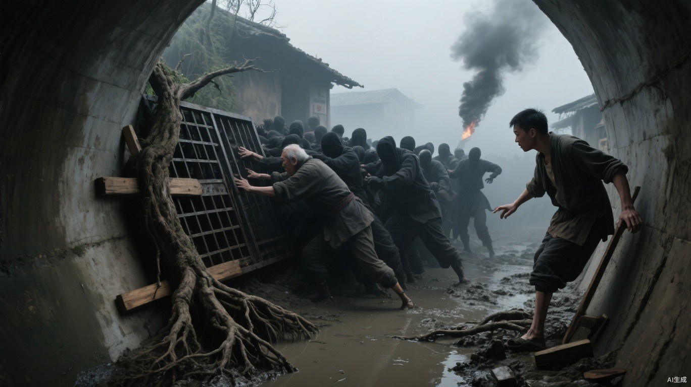

# 第四章 尸潮旧影

小文的左肩在母亲掌下抖了一下。

“窗还没关。”他说。

母亲没有收手。斜雨从板缝打进来，她袖口已经湿了一片。小文用左手推合窗板，将掉落的木楔塞紧。雨声被挡在外面，屋里安静下来。

右手仍松不开。

他从水盆边扯起布条，按住鼻子，慢慢转回身。

“撞着哪儿了？”

“鼻子。板子弹回来的时候……”

母亲伸手要看，他把布按得更紧。血浸过了布，温热地贴住指腹。

帘后传来父亲的声音：“先让他坐下。小文，别硬撑。”

母亲托住他的左肘，扶他退到褥边坐下。伤腿伸在褥外，钟还扣在右手里，他把钟放到腿上，衣角盖住了翻开的后盖。

母亲起身把木凳拖到褥边。凳脚刮过地砖，小文右耳深处跟着一阵刺痛。

她坐下来，伸手来接钟：“给我，别硌着伤口。”

小文把钟递过去，试着松开手指。指根绷得发疼，指尖却还贴在钟壳上。

她没有催，把伸出的手停在半空。小文低着头，汗从鼻梁两侧往下淌。帘后的父亲又问了一声怎么了，小文还没回答，母亲轻轻碰了碰他的手背。

“又麻了，是不是？”

小文点了一下头。

她没有再伸手，只说：“下午才答应今天不试了。你等我们睡着，又起来试。”

小文盯着她袖口的水，说：“我真的没试了。”

“那怎么还松不开。”

他没再出声。机械钟隔着衣服咔哒、咔哒地走，母亲的手一直托在下面。

过了好一阵，小文的小指先松开。母亲没有催，等其余几根也一点点抬起来，才接走钟。掌心留下半圈深紫的压痕，碰到衣料时疼得他缩了一下。

母亲把钟放远，回身看他的脸。鼻血已经止住，小文将湿布攥在左手里，迎着门缝漏进来的光抬起头。

“好了，能动了。你看。”

他张开五指，又合拢。

母亲握住他的手，没让他再试：“行了行了，别使劲了，歇着吧。”

那一夜她没有回帘后睡。小文闭着眼，偶尔感觉她在旁边动一下。父亲也没睡沉，隔一阵便翻一次身。布条攥在左手里，湿冷渐渐透进指缝。

天快亮时，父亲咳醒，母亲扶着矮桌起身，进帘后给他垫高枕头。小文这才撑起身，把花盆挪回窗下。

凳面上昨夜留下的苹果汁被雨水泡得发黏。他用衣角擦过，把凳子放回父亲昨天落脚的位置。

小文把私密记录塞进褥子最深处，只在共同记录第三天的反应栏里留下：

**轻微头痛，休息后缓解。**

***

早饭摆上桌时，小文把共同记录递给了母亲。

母亲念到“轻微”，没有往下念。

“昨晚那样也叫轻微？”

小文用右手端起碗。掌心的压痕碰到碗底，隐隐发疼，碗却没有歪。

“后来就能动了。”

“我就在你旁边坐了一夜。”母亲把纸放下，“什么时候能动的，我不知道？”

他低头喝粥。父亲从帘内伸来手，母亲把记录递过去。父亲翻过一面，又翻回来。

“昨晚手松不开的事，怎么没写？”

小文把空碗放到桌上，朝门口偏了偏头：“你听，走廊里是不是又在喊人？刚才说西墙清理组今天缺人，我去看看哈。”

母亲伸手按住他撑向桌沿的左手。

“你今天还去干活？不是还得去医院复查吗？”

“我记着呢，干完就去找白医生。今天就是清一清菜地里的枯秧，我坐着也能做，不用搬东西。”

“上回去搬粮，回来就伤成这样。你这腿还没养好呢。”

“妈，我去做一天还能挣三点，总比在家待着强。”

父亲说：“这三点就算加上，也不够给你妈治病。”

“那也得把今天的口粮带回来呀。一点都不挣，咱们不就坐吃山空了嘛。”

走廊里又有人喊：“西墙清理组还缺人，愿意干的到楼下报名！”

小文起身走向门口，母亲叫住小文：“先把右手伸过来，让妈看看。”

小文转身伸出右手。母亲摸过掌心那圈压痕：“握一下妈的手，试试还麻不麻。”

小文握住母亲的手指，又慢慢松开。

“要是手又麻了，就赶紧把活放下去找白医生，别非得等到收工。”母亲松开小文的手，“晚上回来把这张记录补全了，别让我问一句，你才往上添一句。”

小文应了，继续往门口走。经过木凳时，右脚没抬够，鞋尖碰了一下凳腿。他停下来，等那阵疼过去，才拿起门边的短拐。

母亲一路扶着墙送到门口。小文走出几步，回头看见母亲还站在那里。

***

临近正午，菜畦之间还积着昨夜的雨水。小文蹲在泥地上，左手握着镰刀，慢慢割开缠在豆秧上的旧绳，右手拢住秧子，偶尔没抓稳，秧子掉回脚边。

老杜坐在旁边的木箱上补育苗架，木拐靠在箱边。他将拆下来的旧钉一颗颗敲直，再钉回松开的接头。小文清完一小片，试着往前挪，右腿绷带底下忽然一阵热痛。

他撑住地，没有站起来。

老杜搁下锤子，把脚边一只空箱推了过来。

“坐箱子上歇会儿吧，别一直蹲在泥地里。”

小文用手背擦了擦下巴：“还剩很多，下午交不出来，今天的点数就拿不到了。”

“等我把架子钉好，剩下的我帮你一起弄。”老杜将散落的枯秧拢到箱子旁，“你先坐下，帮我把这些绳子解出来，待会儿捆架子用。”

老杜扶住箱子，小文撑着箱沿，慢慢坐了上去。

小文解开一根，把绳头递过去。老杜接过来一拉，绳子断在中间。

“这绳子都沤烂了，剩下的也得挑一挑。”他把两截扔进枯秧堆，又接过下一根，拉了拉，放到架子旁。

镰刀柄换回右手时，小文试着握紧。无名指仍有些发僵，他用左手将它慢慢捋开。老杜的目光落过来，小文把刀放下，低头去找绳结。

三声长鸣，一声短鸣。

老杜手里的锤子停在半空。

警报穿过一排排铁皮屋顶。小文撑着箱子站起，短拐陷进湿泥里，拔出来时带起一团黑水。

第二轮警报响起，菜地尽头的守卫开始奔跑。

“西环高架那边分出一股尸群，正往西墙来！”墙头有人朝下喊，“大约两百只！”

空气里很快多出一股刺鼻的化工燃烧味。菜地尽头就是西墙，墙头的弩手已经沿着女墙散开。往南，正门前的守卫正把最后一辆板车拖回墙内；更近的墙脚，旧灌溉涵管从墙基下穿过，内口的两扇厚木门紧闭着。

身后有人往内墙门跑，内墙门口的守卫一边挥旗，一边催人进门。体育馆的地下入口还在内墙后面。

小文转头望向西墙。黑烟从西墙外的西北方向升起，湿冷的风里混进一股灼热。西墙上有人指着烟柱南侧喊：“放火的往那边跑了！”

小文握紧短拐。上回也是这股味道。东侧通道上，运水的桶磕着他的膝盖；远处物流园烧成一片暗金，马克背着天干从火里走出来，衣角还带着火。高架阴影里，那只中箭倒下的丧尸身边乱了一阵，三路尸群随后一起转了向。

“清理组撤进内墙！”守卫挥旗，“工具留下，人先走！”

墙头传下天干的命令：“西墙各处就位！别追放火的人，先守住防线！”

老杜已将木工凿抵住架旁一截废床腿，锤子连落几下，劈下几块斜尖的木头。他把锤、凿和木楔收进腰间的工具袋，撑起木拐。小文伸手去扶，他朝内墙门偏了偏头：“你拄好自己的拐，跟着他们走，我就在后头。”

弩弦在头顶接连绷响。墙下搬工具的人丢下木箱，跟着人群往内墙门跑。小文拄着短拐跟在后面，老杜落在更后头，木拐急促地敲着地面。泥路每塌下去一步，小文便要停一下，才能把伤腿带过去。

头顶的广播忽然炸响。

“涵管最多再撑五分钟！西墙前沿全部撤进内墙，快！”

小文停住。

五分钟，对父母来说太短了。

小文转过身，逆着撤退的人流往涵管走去，迎面碰上了还落在后面的老杜。

“小文，你怎么往回走？涵管只剩五分钟了，你还不赶紧往里撤？”

“五分钟我爸妈肯定赶不到体育馆。我得想办法多拖一会儿，给他们争取点时间。”

老杜望着他，一个月前女儿挡在他身后，催他快走的画面爬上了记忆。

“关键时候我这个老头子还有点用。”他把木拐一转，“那道木闸后面留了个加固的横木槽，我有办法让它多撑几分钟。”

“我知道地方就行了，你不用跟我去。你腿脚不方便，那边丧尸又多。”

“知道地方还不够。那道门以前就是我修的，横木怎么架、卡在哪里都有讲究。就剩这么点时间，你自己摸索肯定来不及。”老杜催了一声，“快点，横木架起来还要工夫，去晚了怕是来不及。”

小文扶住他，两个人一起往涵管赶去。

离涵管还有十几步，木头受撞的闷响已经一声接一声传来。

墙内的涵管口就在前面。门外猛地一撞，两扇木门向里鼓起，门后的门栓被顶得一弯，槽口崩下几片木屑。

“横木，快！先把左头插进槽里！”

小文往横木左端去，老杜拄着木拐去了右端。小文抬起左端，送进墙槽；右端仍搁在地上，老杜已经取出木工凿，削起木头。

“右头长了，得削掉一块。”老杜手里的凿子没停。

小文走到右端时，老杜也削完了。他收起凿子，扶稳木拐：“来，抬！”

小文握住横木右端，老杜腾出一只手托住木头。两人刚将右端抬到槽口附近，门外又是一撞。门板向里鼓起，抵住横木，右端被挤得向后偏，进不了槽。

“放下，等门退回去！”老杜说。

两人把右端放回地上。可门外的撞击没有停，门板也没能退回原位。小文看了一眼门栓上越裂越大的槽口，伸手按住墙脚的泥土。

细根从门旁的土缝钻出，沿着两扇门的背面交错伸展，连成一张网，根须的末端扎进两侧墙脚。小文收紧根网，门板被兜住，向外退回少许。

“抬！”老杜喊。

小文和老杜重新抬起横木右端。小文将木头送进右侧墙槽，老杜随即松了手，重新握紧木拐。

门外又是一撞。横木在两侧墙槽里狠狠一震，根网也跟着绷紧。老杜看见门背上那些还在收紧的细根，转头看向小文。

门板被横木和根网抵住，外面的撞击一时没能再将它顶开。

小文松开横木，老杜也退开半步。两人还没来得及说话，墙头传来一声急喊：

“撞城过来了！硬肩尸往涵管去了！”

门外杂乱的抓挠声忽然低了下去。紧接着，一记沉重的撞击砸在门板上，横木中央猛地一颤。

老杜抬头看去。木头表面绽出一道细白的裂纹。

“小文，横木要裂了！”

第二记撞击紧跟着压上来。门板向里鼓起，根网被拉得笔直，那道白缝又长了一截。

小文蹲到墙脚，重新将手掌按进泥土。门背上的细根一齐收紧，更多根须沿着墙脚扎进土里，硬生生兜住了向内鼓起的门板。

横木还卡在两侧墙槽里，中央的白缝却没有合上。

小文继续催动根须。后脑骤然一疼，眼前黑了一瞬。右手无名指不受控制地向掌心蜷去，指尖抠进泥里。

“小文！”老杜看见他的手，又抬头看向那道裂纹，“别再加力了！”

横木上的白缝猛地向两头窜去。

下一撞到了。

啪！

横木从裂口处劈开，一片长长的断木斜着折向墙内。

小文右手彻底蜷住，身体却没能跟着动。

衣领骤然勒住喉咙。

老杜在他身后一把揪住他，借着全身重量往后一倒。

小文被硬生生拖离门前。

断木擦着他胸口扫下去。

一声闷响。

老杜身体猛地一僵。

那片尖锐的断木扎进了他的断腿残端。

血顺着木茬一下涌出来。

“老杜！”

小文翻身要过去。

轰——

木闸又向里鼓了一下。

断掉的横木已经失去支撑。原来的门闩发出令人牙酸的裂响。根网被整扇门扯得向墙内凸起。

小文只爬出半步。

第一根细根断了。

啪。

很轻的一声。

他停住。

老杜就在几步外，手压着残端，指缝里全是血。

第二根也断了。

木闸中央裂开一道窄缝。

一只灰黑的手硬生生从缝里挤进来，五指在半空乱抓。紧接着，另一只手从下面探出，指甲刮过门板，发出刺耳的摩擦声。

小文看了老杜一眼。

老杜脸已经白了，额头全是冷汗，却冲他骂：“看我干什么？我这条腿还能再少一截，你爹就你一个！”

小文转身扑回泥里。

双掌按下去。

地下所有还能回应他的根同时收紧。

木闸猛地一顿。

那两只伸进来的手离他不到一臂远，抓了个空，又疯了一样往里探。

小文右臂开始抽搐。

鼻血滴下来，在手背上砸开一个深红的小点。

又一根根须崩断。

然后又一根。

门缝一点点变宽。

外面的嘶吼已经不是从门后传来，像贴着他的脸。

小文死死按着地。

不能松。

父亲还在路上。

老杜还在后面。

再撑一下。

整张根网突然被拉得笔直。

尸群的下一次撞击压了下来。

小文闭紧眼，肩背本能地绷住。

——没有撞上来。

只有根须还在他的掌下发抖。

那只几乎碰到他脸的手停了一瞬。

缩了回去。

另一只也消失在门缝后。

涵管外密密麻麻的嘶吼开始远去。

墙头忽然有人喊了马克的名字。

小文抬起头。

越过涵管外退散的尸群，西环高架的灰雾里，那道高瘦身影仍站在护栏边。

而西墙上，暗金色的火刚刚亮起来。

它们转向，沿着燃烧化工仓与高架之间的空隙退往无人厂区。

马克登上西墙。暗金火焰沿墙头铺开，弩手重新上弦，箭锋齐齐转向高架。

尸王没有退。它先指向黑烟，又指向涵管，最后张开一只手。

五根手指。

马克向前一步，火焰顺着墙砖窜起。

几息后，尸王先收了手。它退进灰雾，桥上的尸群也开始后撤。

墙下的欢呼声轰然炸开。

断木还扎在老杜的残端。白川赶到后让小文继续压紧伤口周围的布，自己托住外露的木茬：“先别拔，送进救治线再处理。”

尸群退出西墙后，守卫和年轻工人抬起老杜，沿墙内通道送过内墙门。小文一路跟在担架旁，双手没有离开压住残端的衣摆和木楔。

救治线就设在门后。白川剪开老杜裤管，先用垫布压住伤口周围，才小心取出木茬。血立刻洇透垫布，她随即加重手下压力：“动脉伤了，不能再拖三分钟。小文，帮我托稳这条腿，别晃，先止血。”

手臂烧伤的火系异能者罗炽挡住药箱，焦黑药布已经黏在皮肤上：“名单上写的是我先。不是我跟一个老人争命，是今晚西墙还要有人点火。你现在把药全给他，半夜谁替我把这只手接回去？”

“你的烧伤要处理，先包扎可以等半小时。”白川手没离开老杜的伤处，“他还在出血，等不起。把药箱让开，止住血就看你的手。”

“我倒下，墙上少一个火系。尸群再回来，你拿病历去烧它们？”

“今晚能不能上墙，处理后再看。”白川抬起眼，声音沉了下来，“现在退开，别碰药箱。你挡着，我两个人都治不了。”

对方伸手抢药，方岳的盾沿横向一推，将人压回墙边。天干从伤员间走来，只说：“按伤情处置。命令由我承担。”

白光封住老杜残端的喷血。白川松开一根压着的手指，看了看重新冒出的血，又将手按回去。

“小文，拿干净垫布来。不是止住血就没事了，断木把木屑和泥带进了旧伤。”她示意小文看伤口边缘，“得清创，还要足量抗生素。四十八小时内处理不上，感染就可能压不住。”

她检查药箱。剩余抗生素只够一次基础处理。

当晚，小文去看老杜。

老杜替他关紧窗板，先看了一眼门缝，才把伤腿放到凳上：“白天那几根草根，不是楔子。”

小文没有否认。他将手按在发黑的伤口旁，墙角杂草迅速枯黄。坏死边缘收缩了一点，更深处的感染却仍像钉进木料的霉斑，拔不出来。

“只能拖慢。”小文额头冒汗，“治不好。”

“能多留几天，就多做几天人。”老杜把木工凿塞进他手里，“别摆那张欠债脸。好木头也怕赶工，你再使劲，先坏的是你。”

父母都跟来守在门边。父亲每报一息，钟表声都像贴近一寸。报过第四息，他问了一句停不停。小文盯着伤口边那层发黑的皮肉，只觉得这句话碍事，掌心反而又往下压。母亲直接按住他的手腕：“够了。你现在看谁都像根该劈开的柴。”

能力停止后，老杜把木拐横过来，教小文如何沿纹路凿出不易被发现的夹层。

“想藏东西，别挖得四四方方。”他说，“木头不是账本。顺着纹走，才不会一眼露馅。”

回到住处已过熄灯时分。小文把木工凿塞进枕下，母亲只看了他一眼：“记录明天再说。今晚先把你这只手洗干净。”

小文没接话，趁母亲去倒水，把褥子下的纸板又往里推了推。父亲在床沿咳了一阵，没有回头看他。

次日，裁决处传来通知。白川、烧伤异能者、批准改变次序的天干和最早为老杜止血的小文，都要说明西墙救治经过。

小文走进挤满旁听者的大厅。左侧坐着白川和天干，右侧是手臂缠满药布的火系异能者罗炽。老杜躺在后方担架上，断腿残端已经不再喷血，绷带下却透出一层暗黄脓液。

高处裁决席后，马克刚刚换下沾着烟灰的外衣，面前摆着四份互相矛盾的记录。大厅里石灰气很重，旁听者身上还带着从西墙沾回来的焦味。

大厅上方那台旧风扇每转一圈，轴心便发出一声干涩的吱呀。旁听席有人低声咳嗽，有人挪动长凳，老杜担架下的输液瓶则以极慢的速度往下滴水。

马克一页一页翻过记录。

衣摆止血。

木楔压迫。

白川封血。

天干改变救治顺序。

每一页都能解释一部分。每一页中间，又都空着同样一段时间。

纸页翻到最后，风扇正好吱呀一声。

“小文。”

小文拄着临时木杖走到中央。杖尖敲在石地上，一下，两下，旁听席的私语随之从前排往后熄灭。

老杜在担架上动了一下。绷带边缘渗出的脓血沿着纱线下坠，在白布上洇开一枚硬币大小的暗斑。

小文盯着那枚暗斑。

菜地下枯死的根须仿佛仍缠在指间。它们替老杜收紧血管时，曾在泥土里一根接一根绷断。

这些不在任何一份记录里。

高处，马克将四份记录缓缓并齐。

纸角碰在桌面上，发出一声轻响。

“老杜为什么能撑到救治线？”
