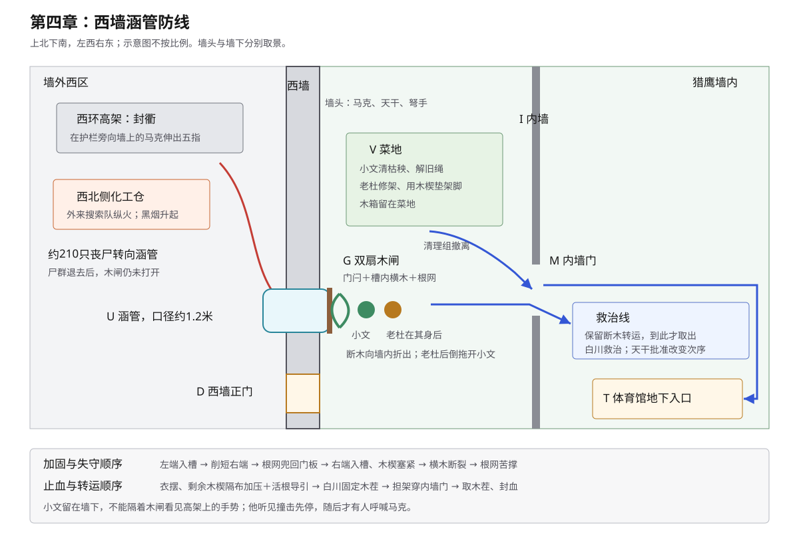

# 第四章场景事实

## 空间

- 住处沿用第三章布局。父母床在帘内；窄褥、矮桌、木凳、花盆、水盆和窗板在帘外。
- 西墙南北延伸；墙内前沿由北向南分布菜地、涵管、西墙正门。
- `V`：墙内菜地。小文清除豆秧；老杜修育苗架。
- `U`：旧灌溉涵管，穿过西墙，口径约一点二米；墙内出口装厚木闸门 `G`。
- `G`：门后两侧留有横木槽。粗横木两端入槽后可从墙内加固木闸。
- `R`：涵管附近地下有活根，小文可催动。
- `D`：西墙正门，位于涵管以南。
- `I`：内墙，位于西墙后方；设出入口 `M`。
- `T`：体育馆地下入口，位于内墙之后。
- 撤离方向：西墙前沿 → `M` → `T`。
- 救治线设在 `M` 后。

## 初始状态

- 小文未登记；能力逼近1级，发动范围近，必须借活植物。
- 小文右腿不能完全承重；右肋、后脑、右肩和双手未愈；右手仍有强直反噬。
- 老杜：61岁，独腿木匠；此前在菜地修育苗架，与小文一同撤离但速度较慢。
- 老杜参与修过涵管木闸，知道门后的横木加固方式。
- 外来搜索队点燃化工仓。约二百一十只低阶丧尸转向西墙。
- 主群约一千七百只，继续沿高架东移。
- 封衢停在高架，不参加冲击。
- 罗炽手臂烧伤，原排在老杜之前治疗。

## 总调度

| 阶段 | 小文与老杜 | 西墙、尸群与基地 | 连续结果 |
| --- | --- | --- | --- |
| 第三夜 | 小文隐瞒反噬。 | 母亲发现异常。 | 小文只保留轻症公开记录。 |
| 次日清晨 | 小文领取墙内轻工，与老杜在 `V` 干活。 | — | 两人都带伤/行动不便。 |
| 正午警报 | 两人随清理组撤向 `M`。 | 约二百一十只丧尸转向西墙。 | 小文、老杜落在撤离人群后段。 |
| 五分钟广播 | 小文得知涵管只能再撑五分钟，折返 `U`。老杜因放心不下跟回；以自己修过木闸、知道加固方法说服小文让他同行。 | 墙头继续防守；涵管下方人员已撤。 | 两人一起到 `U`。 |
| 木闸加固 | 木闸原有门闩仍在，但已接近极限。两人抬起门后的粗横木；一端入槽，另一端因门体变形差少许。老杜削修横木端部，小文扶住，最终将横木卡入两侧槽内。 | 尸群持续撞门。 | 横木成为门闩之外的第二层加固。 |
| 根网加固 | 小文暗中催动涵管四周活根。根须从门后四周交错爬过木闸，再扎回涵管边缘土层，形成兜住整扇门的根网。老杜发现但不揭穿。 | 撞击使木闸向墙内鼓起，根网随之绷紧。 | 横木与根网共同拖延破门。 |
| 老杜受伤 | 横木达到极限后劈裂，形成向墙内斜下方折出的尖锐断木。小文仍在近处维持根网，未能及时避开；老杜将他拖离，自己倒地，断木刺入断腿残端。 | 原门闩仍在；木闸没有完全打开。 | 横木加固失效，老杜受伤，只剩门闩与根网继续承压。 |
| 最后苦撑 | 小文不能去救老杜，只能继续维持根网。木闸与门闩继续变形，局部裂缝扩大到足以伸入丧尸手臂，但不足以让身体通过。根须开始逐根崩断，小文反噬加重。 | 尸群持续挤压木闸。 | 再承受少数撞击即会彻底失守。 |\n| 封衢退兵 | 小文苦撑根网直到撞击突然停止。 | 同一时刻马克登上西墙；封衢与其对峙后召回尸群。伸入裂缝的手退回，尸群撤离。 | 小文和老杜争取的时间恰好撑到退兵。 |
| 救治线 | 小文为老杜压迫止血，随其到 `M`。 | 尸群撤离。 | 老杜进入救治线。 |
| 救治 | 小文协助白川。 | 天干批准优先救治老杜。 | 动脉止血；深层污染；抗生素窗口约四十八小时。 |
| 当日晚间 | 小文对老杜施术，只能减慢坏死。老杜交出木工凿并教授夹层。 | — | 感染未解除；小文反噬加重。 |
| 再下一日 | 小文进入裁决大厅。 | 公开记录缺失根须介入。 | 马克追问老杜存活原因。 |

## 结束状态

- 西墙守住；涵管木闸受损，横木已断。
- 封衢退向无人区；五指含义未公开。
- 老杜因救小文受伤；动脉出血暂止，深层感染进入四十八小时窗口。
- 小文能力未公开；反噬未恢复。
- 小文持有木工凿，并学会制作木拐夹层。
- 第五章开篇直接承接马克的提问。
