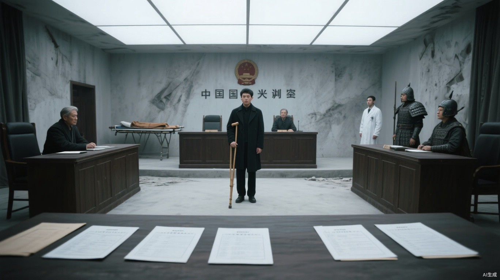

# 第五章 秩序的两面

“钢筋拔出后，我用衣摆扎住残端，又拿木楔压住出血点。”小文回答。

这两件事都是真的。

根须怎样沿着血管收紧，生命力怎样从菜地下的老根流进老杜身体，他一个字也没说。

“木楔是谁做的？”

“老杜。他原本在菜地修育苗架，警报一响就把废床腿劈了。”小文看向后方担架，“楔子的角度也是他教守卫钉的。我只是用了他塞给我的东西。”

“也就是说，他先补住涵管，又用自己做的东西保住了命。”马克看向旁听席，“猎鹰的墙不只由异能者守。有人抬钢板，有人削木楔，有人发现我们没看见的裂口。少了哪一种，墙都会倒。”

罗炽忍不住开口：“我不是说他该死。昨晚轮到我上墙，烧伤拖下去，西侧就少一个能点火的人。”

白川把两份伤情记录摊开，先指给马克看：“首领，老杜送来时还在动脉出血，再拖三分钟就可能救不回来。罗炽的烧伤也需要处理，但先包扎，可以等半小时。”

罗炽还要开口，白川将他的记录往前推了半寸：“你的手没从名单上划掉。改的是先后，不是不治。”

马克点了点白川摊开的用量表：“你动用了最后一支储备止血药。按原排程，那支药应当留给罗炽当晚换药。”

“是，首领。我用了三分之二，剩下三分之一还在药箱。”白川把记录翻到签名处，“批号、用量和时间都在这里。这次用药是我作的判断，经手一栏也是我签的。”

“天干当场批准你越过既定名单？”

天干回答：“确认。急性动脉出血优先级高于稳定烧伤，命令由我签发，误差不超过一分钟。”

马克逐页看完记录，才宣布结果：“白川分诊正确，天干授权有效。罗炽强抢药箱，扣除十五点贡献，停墙外任务三日。猎鹰若只认拳头，我们没有必要建这堵墙。”

旁听席响起掌声。

马克甚至能说出老杜替西墙工人补过六张床、给地下层做过两副腿架。老杜自己听着，脸上没有感动，只有木匠检查接缝时那种缓慢而警惕的神情。

裁决结束后，人群仍在议论马克如何公正。小文拄杖跟着人流离开大厅，沿医务走廊往病房方向走。药房就在临时手术间旁，门朝走廊敞着；两名守卫一前一后跟白川进去，一人停在药柜边，一人守住门口。

小文走到药房门外时，地支从走廊另一端的墙角暗面里出现。经过临时手术间时，四头无影灯恰好同时亮起，他脚下原本完整的影子被切成数片。地支没有继续贴墙移动，而是离开暗面，从灯下正常走过。变化只有几步，小文仍把它记了下来。

医疗主管把一张新表放在桌上：“从今天起，药柜钥匙统一保管。你每次使用异能，先由我签字，守卫陪同。”

白川的手停在钥匙上，看向马克：“首领，是今天的处置还有问题？”

“不是。”马克语气温和，“昨天如果天干晚到一步，罗炽和伤员可能在救治线动手。治疗者不该承担这种压力。你只负责判断，资源调度由基地承担。”

白川没有立即摘钥匙。他把新表翻到背面，又翻回来：“再送来一个动脉出血的，主管不在怎么办？人等不了这么久。”

医疗主管将签字栏推到他面前：“按新流程报。”

白川看了马克一眼。马克的手仍放在移交表旁，没有拿开。

白川低头解下钥匙，压在待治患者名单上。

“药量请逐项点清，这几个人今天还等着换药。”他把名单也推过去，“急救申请什么时候递的，什么时候批准，谁接的，都得记。出了延误，要查得出人在哪一步等着。”

主管脸色一沉。马克却亲自接过钥匙，让人在移交表上签名。

“每一笔都记。”他说，“没有记录的秩序，只是另一个人的脾气。”

大厅里的旁听者散进走廊时，还在重复裁决里的“分诊正确”和这句“每一笔都记”。白川没有被押走，只是灰白外套两侧多了两名守卫。药柜钥匙留在待治名单上，谁也没有再递回给他。

小文离开药房门口时，大厅侧门正合到只剩一条缝，天干被单独留在里面。

小文拄杖经过时，门内先传出纸页推过桌面的窸窣声。前面的话被厚门挡住，他只听清马克最后一句：

“职责是不能只看见自己亲手碰到的人。”

他的杖尖已经抬起，又在门外停了一息，才重新落下。

回到住处后，父亲把共同记录放到矮桌中间。母亲没有问裁决，只问：“你自己写的那些呢？”

小文看了一眼门外，把门闩推实。他靠着短拐坐到褥边，伸手探进褥子深处，取出折过几次的私密纸板。

“要决定报不报，不能只看那一本。”

父亲接过纸板，和共同记录并排摊开。

父亲先把共同记录压在左边。上面写着“新叶一寸”“站立五息”“端杯失手”和“轻微头痛”。私密纸板摊在右边，食指到虎口发麻、耳鸣、无名指僵直十分钟一项项露出来，最后那个被涂黑两遍的“停止”仍能辨认。

父亲用铅笔点了点自己每次站立的时长，又移到右边的“强直”：“三步以外，根不再动。每次碰人都得借着活根，停手以后效果会退；连着几次，才留下一点。前面的负荷没退，三四个呼吸也可能让这只手先不听使唤；超过四个呼吸，风险更高。”

母亲把铅笔从他手里抽走，搁在两份记录中间：“先别替他把本事算得这么好听。这两张哪一张都不能原样交。只报枯葱，人家当他会催苗；把你站立、退肿和右边这些症状一起交出去，谁都知道他还能碰人。”

“登记以后，至少有晶核配额。”父亲说，“也可能换到你的伤药和我们的治疗。”

母亲问：“登记什么？植物系，还是治疗系？”

父亲没有回答。

“普通植物系不会让人的浮肿退。”母亲点了点那张记录，“报植物系，他们会追问你爸的手；报治疗系，他们会追问那盆枯葱。两样一起交上去，来的就不只是医疗队。”

父亲看着纸上并列的两组记录：“先做专项复核，再决定编到哪里。”

“白川今天救谁都要先拿签字。小文登记以后，谁能治、治几次、什么时候停，也会变成别人手里的表。”母亲看向儿子，“他们再把我们搬进内区，说是保护。你敢不照名单来吗？”

父亲沉默了很久，把纸上“三天后决定”划掉。

“除非公开使用到无法解释，否则不登记。”他说，“治疗次数仍由三个人共同决定。每次记录副作用，出现失控立刻停。”

小文问：“如果来不及商量？”

母亲说：“救命的时候你自己判断。活下来以后，我们三个一起算账。别拿紧急情况当以后什么都由你决定的借口。”

父亲把两份记录分开。记着植物、人体效果和较轻反应的共同记录压回《初醒者须知》下面；耳鸣、麻木和强直留在私密纸板上，折了两次，递回小文手里。

“这份不出门。”他说。

小文把纸板重新塞进褥子深处。

***

夜里，马克办公室只亮着桌灯。公开救援册摊在光下，天干把最近一个月的十七份失踪记录逐张插进对应页码。

“十七人登记为自愿离开，其中十一人没有领取路粮，六人患病或失去劳动能力。”他把数字逐项报出，“记录无法互相印证。我申请查看原始去向。”

马克没有否认异常：“南边小聚居点不愿公开接收猎鹰成员，身份需要保密。我会让后勤整理完整记录。”

天干把手按在那叠记录上：“我需要原始离城申请、路粮领取和西门交接三份记录。后勤如果只给整理后的汇总，我无法复核。”

“给你三天。”马克说，“后勤今晚开始调册，缺失页由经手人说明。你可以带一名记录员，不得公开失踪名单。”

“确认。”天干没有立即收走汇总表，“第三天日落前没有原件，我会按记录失实重新申请调查。”

天干离开时，救援册仍停在十一名未领取路粮者那一页。

***

走廊里的脚步彻底听不见后，马克才抬眼看向没有灯光的墙角。

地支从暗面里走出，把一只装有居民名单的信封压在摊开的册页上，正好盖住那十一个人的名字。

“泄密路径已确认。名单尚未出城。”

马克没有先问如何处置，只问：“泄密链停在哪一环？下一次交接是什么时候？”

“西门守卫一人，明晚与外部商队交接。他尚不知道线路已经暴露，名单也没有离开控制区。”地支回答，“继续观察可以确认收购者。”

马克没有要求提前处决。他拿起信封，又将救援册里的十七份记录一并抽出来，递给地支。

“把朝贡名单从公开人口账里剥离。”

地支问：“天干继续查，如何处理？”

“他相信不放弃任何人，别人才会相信猎鹰。”马克合上桌上的公开救援册，“脏账有一个人记就够了。”

***

第二天清晨，老杜开始高热。

小文赶到医务区时，晨光刚从高窗挤进来。老杜缩在两床旧毯子下面，身体仍冷得发抖，呼出的气却烫得发干。床边搪瓷缸里的水一口没动，缸壁已经被他无意识抓出几道带血的指印。

白川站在窗下，手里捏着一张刚退回来的抗生素申请。

纸很薄，红墨却很重。

申请、接收和药量复核三栏都填着时间，后面各有经手人的签名。最下方的审批栏盖了退回章。

一道叉从“感染可控”斜着划到“建议继续治疗”，笔尖在末尾停得太久，墨水已经洇透纸背。

红叉下面只有四个字：

**停止投入。**

白川把纸递过来。小文接住时，纸角被窗缝灌进来的风吹得发颤，那道红叉便在老杜胸口上方来回晃动。

“四十八小时的处置窗口，现在还剩九小时。”白川看了一眼门外守着药柜的人，“退回栏写的是库存不足，凑不出完整疗程。现有的药压不住。我先给他处理伤口，足量的抗生素还得找。”

“哪里还能拿到药？”

“今天是交换日。客运站可能有外来药商。”白川看了一眼老杜持续发抖的身体，“第二声汽笛以前带回来，还有机会。再晚，药给够也未必拦得住。”

远处忽然传来第一轮开市汽笛。

声音穿过灰雾和层层屋墙，抵达医务区时已经不响，却拖得极长。搪瓷缸里的水面随之震开一圈细纹。

开市了。

小文攥紧那张申请单，红叉在掌心揉成了一团。
