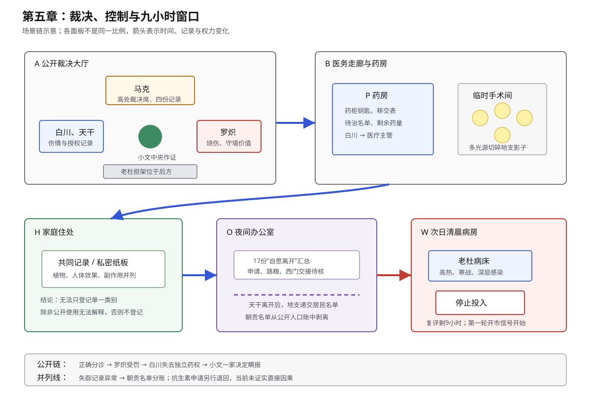

# 第五章场景事实

## 空间

- `A`：裁决大厅。马克在高处；小文在中央；白川、天干在左；罗炽在右；老杜在后方担架上。
- `A` 内有四份记录：衣摆止血、木楔压迫、白川封血、天干改序。
- `B`：裁决大厅 `A` 的侧门外是一条通往医务区的短走廊。药房 `P` 和临时手术间都开在同一侧；从大厅往里依次是药房、临时手术间。
- `P`：药房离大厅较近。小文从大厅出来后停在药房门口；桌上有移交表、患者名单、药柜钥匙和药量记录。
- 临时手术间在药房更深处，四盏无影灯可切断连续暗面。
- 地支从医务区深处朝大厅方向走来：先经过临时手术间，再朝药房和大厅靠近。小文站在药房门口面朝走廊深处，因此无需回头即可看见地支经过手术间。
- 本段不使用“往病房方向走”作为定位；病房 `W` 属于次日场景，不参与这一段的即时空间关系。
- `H`：小文住处。矮桌用于核对共同记录和私密纸板。
- `O`：马克办公室。桌上有救援册、失踪汇总和居民名单。
- `W`：医务区病房。老杜床靠高窗；守卫控制药柜。

## 初始状态

- 第四章已提出裁决问题。第五章从小文回答开始。
- 老杜动脉出血暂止；深层污染仍在；抗感染窗口持续缩短。
- 小文使用衣摆、木楔、根须和生命力。公开记录只含前两项。
- 老杜送达时只能再等约三分钟。罗炽烧伤可先包扎，约可等半小时。
- 白川使用储备止血药三分之二；剩余三分之一。
- 小文可催动三步内植物，并暂时减缓浮肿和坏死。
- 治疗效果会回退；重复治疗可留下有限改善。
- 连续使用和累计使用会加重头痛、听觉敏感和躁意；越往后，越少的息就犯得越重，非线性累计。晶核只能减轻症状。
- 父母只知道共同记录和部分外显异常。私密纸板仍藏在褥子内。
- 最近一个月十七人登记为自愿离开；十一人未领路粮；六人患病或失去劳动能力。
- 次日为交换日。第一轮汽笛开市；第二声汽笛收市。

## 总调度

| 阶段 | 小文与家人 | 马克、白川与天干 | 记录、资源与结果 |
| --- | --- | --- | --- |
| 裁决作证 | 小文只承认衣摆和木楔。 | 白川提交伤情记录；天干确认改序；罗炽说明战力需求。 | 根须和生命力未公开。 |
| 公开判决 | 小文在场。 | 马克认可分诊和授权；处罚罗炽抢药。 | 罗炽扣15点，停墙外任务三日；烧伤仍治疗。 |
| 药房移交 | 小文从 `A` 经 `B` 到 `P`；看见地支避开多光源。 | 马克收回药柜和施术审批权；白川要求完整留痕。 | 白川失去独立施术和药柜控制权。 |
| 天干留谈 | 小文离开 `P`，经过 `A` 侧门；只听见末句。 | 天干与马克讨论救援成本和职责。 | 分歧未公开。 |
| 家庭决定 | 母亲追问私密记录；小文锁门后主动取出。母亲先质问划掉“停止”一事，父亲再核对隐瞒症状。 | 无基地人员在场。 | 暂缓登记、先观察手部反应，不设决定期限；母亲要求“停止”二字不得再划，小文含糊承诺，仍有所隐瞒。 |
| 当晚查账 | 小文不在场。 | 天干索要三类原始记录；马克给三日期限。 | 天干开始复核十七人。 |
| 地支汇报 | 天干已离开 `O`。 | 地支报告泄密链；马克要求继续观察，并分离朝贡名单。 | 小文、家人和天干均不知朝贡名单。 |
| 次日清晨 | 小文到 `W`，接过退回申请。 | 白川继续清创；守卫控制药柜。 | 老杜高热；窗口剩九小时；现有药量不足完整疗程。 |
| 章末 | 小文询问外部药源。 | 白川指向客运站药商。 | 第一轮汽笛响；须在第二声前带回药物。 |

## 结束状态

- 公开记录含衣摆、木楔、白川封血和天干授权；不含根须。
- 罗炽扣15点，停墙外任务三日；烧伤继续治疗。
- 白川交出药柜钥匙；施术须主管签字并由守卫陪同。
- 父母首次看见私密记录，知道纸板所记症状。
- 一家决定瞒报能力；紧急救命由小文先判断。
- 天干取得三日查账期限。
- 地支继续追踪泄密链；朝贡名单与公开人口账分离。
- 老杜高热；抗生素窗口剩九小时。
- 第一轮汽笛已响；第二声汽笛为买药期限。
