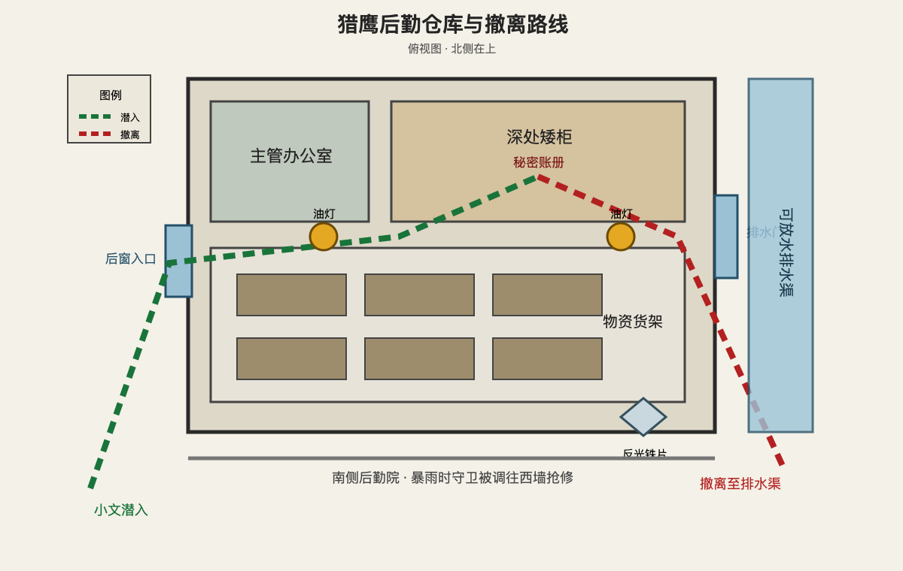

# 第六章 影子留下的印记

老杜死后的第十二天，雨从下午一直下到深夜。

后勤仓库西侧的排水沟很快被落叶堵住。积水漫过院子，几名守卫骂骂咧咧地搬来沙袋，又被主管赶去抢修快要倒塌的西墙。

没有人知道，堵住排水口的树根来自三十米外。

小文蹲在尸体转运车下面，手掌贴着泥水。

根须一点点收紧。

最后一截枯枝被拉进管口，水位再次上涨。

“西墙又进水了！”有人喊。

仓库门口只剩两名守卫。

小文没有立刻行动。

过去十二天，他主动接过两次清理仓库外墙的任务。第一次记下主管打开矮柜的时间，第二次从通风窗反光里看见灰色文件袋被誊入无封面账册。

那本账册就在仓库最深处。

他不知道里面究竟写了什么。

也不知道地支今晚在哪里。

最危险的不是门锁，而是这座基地里每一片连在一起的阴影。

两个守卫终于被叫去搬货。

小文从车底滑进墙边，沿预先松动的砖缝爬到后窗。他用细根缠住窗内插销，缓慢抬起。

金属摩擦声被雨水掩盖。

仓库里没有灯。

他没有点燃手电，只把两盏提前藏好的油灯留在走道拐角。灯芯尚未点燃，旁边各放着一片打磨过的铁皮。

一旦地支出现，它们只能替他争取几秒。

小文穿过物资货架。

大米、药品和罐头整齐堆放在木架上。外面的人每天为了三点贡献排队，仓库深处却仍有成箱的肉罐头没有拆封。

他没有碰。

多拿一样东西，撤退时便多一分重量，也多一条罪名。

矮柜上了锁。

小文将木工凿插进锁扣，裹着布一点点撬动。老杜磨过的木柄贴在掌心，粗糙而温热。

咔。

锁扣松开。

柜内放着三本普通物资账，还有一本没有封面的厚册。小文翻开第一页，没有看见“朝贡”或“尸王”。

只有一串代号。

北区安置，五人。

资源止损，三人。

稳定人口，二人。

日期与他记录的黑布货车完全对应。每一次记录末尾，都盖着马克私用的鹰形印章。

小文向后翻。

两天后的名单上出现父亲的名字。

备注：长期消耗治疗资源，无劳动价值。

母亲紧随其后。

备注：行动受限，可作为补充。

最后一行写着他。

家属反抗时一并处理。

雨声仿佛突然远去。

小文的手停在纸页上，指节一点点发白。

他早知道猎鹰会牺牲别人。

直到这一刻，他才明白，规则从来没有暂时放过自己一家，只是还没轮到。

小文撕下三页关键记录，用油布卷紧，塞进老杜木拐被他提前挖空的木柄。缺口重新用木塞和蜡封住，从外面看不出变化。

账册主体必须带走。

如果追踪者发现少了几页，却找不到账册，会立刻封锁所有出口。一本完整的账册，反而可以成为更明显的诱饵。

小文合上柜门。

仓库外的雨忽然变轻。

油灯旁的影子动了一下。

不是火焰。

一只苍白的手从货架阴影里伸出，五指贴着地面，像另一个人正从黑暗底下爬上来。

地支站在走道尽头。

“目标确认。”他说。

小文没有问他什么时候来的。

他把账册夹在腋下，撞翻最近的货架。木箱砸向地面，尘土与药瓶同时炸开。

地支没有躲。

身体在阴影中虚化，木箱从他胸口穿过。

一道影刃贴地掠来。

小文向前翻滚，肩背仍被割开。伤口没有立刻流血，直到他撞上墙，热意才沿脊背漫开。

“你调查了十二天。”地支缓步靠近，“记录失踪者，观察车辆，进入仓库。不是临时起意。”

小文抓起油灯：“所以呢？”

“同谋数量。”

“一个。”

“名字。”

“杜成。”

地支停了一瞬：“已处理目标不能成为同谋。”

“那就是没有。”

小文把油灯砸向铁片。

灯油泼开，火焰被反光放大，狭窄走道骤然亮成一片。地支的身体被迫从影化中凝实。

小文没有攻击。

他转身冲向排水门。

地支抬手，影刃割断一排货架。沉重木箱堵住出口，也挡住小文去路。

“路线错误。”他说。

小文用脚踢开排水闸的木楔。

积蓄半夜的雨水轰然灌入。

水流沿仓库地面铺开，把货架阴影切得支离破碎。地支刚踏入墙影，身体便在流动水光中重新出现。

小文翻过木箱。

第二盏油灯在前方亮起。

地支没有继续追。

小文回头看见他站在水中，半张脸明明灭灭。

“你不怕我把账册带走？”

“你会带我去找剩下的人。”

小文心里骤然一沉。

地支抬起手指，像是在账册封面轻轻点了一下。

“继续跑。”

小文冲出排水门。

仓库外暴雨重新压下来。他按照准备好的路线越过矮墙、穿过两条亮着公共火盆的街道，又从医务室无影灯下绕行。身后始终没有脚步。

这比追赶更可怕。

他没有直接回家，而是进入一间废弃洗衣房，将账册放在窗边。

墙角杂草以肉眼可见的速度发黑。

那种枯萎不是来自火，也不是来自毒。

是某种依附在物体上的阴冷力量。

小文终于明白，地支为什么放他离开。

他想抓的不是一个偷账本的人。

他想看小文会把账册交给谁，会去找谁，会逃向哪里。

小文从后窗离开，回到住处。

父母没有睡。

父亲看见他肩上的伤，先问：“被发现了？”

“地支在账册上留了东西。”

小文把木拐递过去。

“真正的记录在里面。账册封皮是饵。”

母亲接过木拐，手指抖了一下：“名单上有谁？”

小文没有回答。

父亲已经从他的神情里看懂。

“什么时候？”

“两天后。”

“原来的计划呢？”

“作废。”

小文把地图铺在桌上，手指落向医务区旁的废弃浴室。

“今晚走。”

父亲看着地图：“地支正在等你带他回来。”

“所以要让他亲眼看见我们死。”

屋外没有风。

墙角烛火却突然向门边偏了一下。

一层极淡的阴影贴着门缝，缓慢向屋内延伸。

小文卷起地图。

“他来了。”
