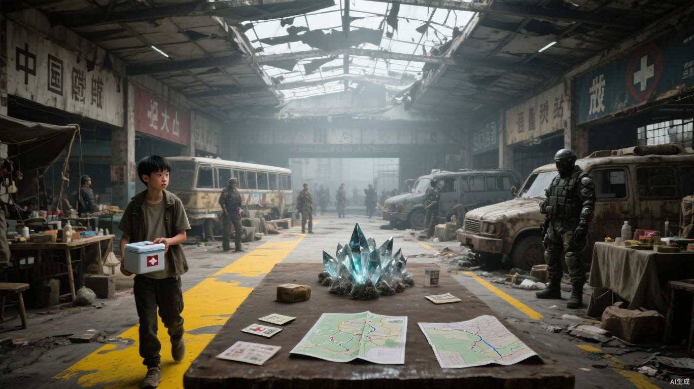

# 第六章 客运站棋局

第一轮开市汽笛响起时，小文还在医务区。

老杜控制感染的窗口只剩九小时。猎鹰药柜已经拒绝投入，白川能做的只是重新清创。旧客运站交换市场是当天唯一可能出现抗生素的地方。

小文接下搬运任务，跟车抵达时先记住四个方向。

南侧车道是唯一能通过货车的入口；东候车厅属于猎鹰，西厅被巨熊占据；火花摊位沿中央检票通道排开，任何货物进出都要经过他们的视线。翠竹被挤在北侧封闭站台旁，只带来种子、修理零件和几袋干菜。

候车厅穹顶破了三块，灰光从钢梁间落下，把不同势力切成泾渭分明的四片。猎鹰用白布铺桌，药箱按批次垒齐；巨熊直接拆下车门当盾，带血轮胎没有清洗；火花的人不占最大位置，却守住每一条推车必经的检票口；翠竹的木箱最旧，箱角却逐件写着重量和经手人。

谈判桌设在售票大厅中央。四方都需要让商人看见协议，争执因此没有藏进密室；真正涉及路线的地图却被竖板遮住，只允许首领和记录员查看。护卫停在闸机外，搬运工沿地面黄线往返。小文能够听见公开报价和争论，却看不见地图上的具体节点。

外来药商最初开价一天口粮换半盒过期抗生素。

小文付得起。

药箱刚要拆封，西侧汽笛突然长鸣。熊震的车队横在南门，扣住了经过北路的三辆药车。

“北路是巨熊的人在清。”熊震把一箱晶核放上桌，“护送费加一成。谁不同意，自己从尸群里把车开回来。”

他没有虚构危险。药车底盘仍挂着丧尸手指，巨熊也确实死了两名护卫。

马克没有与他争谁更强，只把一张治疗配额推给贺岭：“你左膝的旧伤还能撑多久？”

贺岭看了一眼熊震：“最多两次正面任务。”

“猎鹰提供一次二级治疗，巨熊放行药车。路税加半成，不加一成。”

熊震问：“用药换路？”

“用你们离不开的东西，换我们也需要的东西。”

“谁守得住，路就归谁。”

“那你可以继续守。”马克语气仍然温和，“只是没有药的人，通常守不了太久。”

熊震盯了他几秒，收下治疗配额。

药车放行。

第一轮开市信号的最后一声恰在此时落下。药商重新拆箱，半盒抗生素已经从一天口粮涨到一天半，新增部分叫“道路损耗”。

小文把自己能付的东西重新算了一遍。

还差一次修理劳动。

火花首领梁肃走到谈判桌前，金属短杖在掌心跃起雷弧。耀眼电光让周围人主动后退，也让所有目光集中到他身上。

“货堵一次，价格就涨一次。以后都由火花中转，谁再扣车，赔双倍。”

熊震冷笑：“你拿什么保证？”

梁肃正要回答，聂浩从他身后半步开口：“猎鹰提供药品，巨熊负责北路护送，火花承担仓储和损耗。路税不变，交货失败由我们补齐。”

“你们拿什么补？”马克问。

“先把各方交货时间、护送路线和入城口令交给我们。”聂浩说，“没有这些，谁的承诺都只是一句话。”

站在火花护卫前列的沈砺没有因首领已经开口便默认接受：“任务终点怎么算，护卫伤亡到多少撤，南门被封以后走哪条退路？”

梁肃皱眉：“现在还在谈，你非得当着所有人问撤退？”

“等死人以后再问，只能问尸体。”

聂浩替梁肃接下问题：“药箱按封条和重量交到各方仓门，签字才算结束；护卫伤亡两成即停，不为货物追加人命；南门失效，车辆从北侧维修坡道空车撤离。三项写进协议。”

沈砺这才退回原位，没有说效忠，也没有替方案鼓掌。

方案听起来各退一步。

猎鹰保住药品定价，巨熊得到道路收益，梁肃获得调停者声望。聂浩只收走三张纸，却把以后每批货物何时出发、走哪条路、由谁接应全握在手里。

梁肃抬高短杖，让最后一缕雷弧沿售票窗跳过：“这就是火花给各位的保证。路到了我手里，谁再伸手，我让他的车轮先停。”

掌声主要来自火花商队。聂浩没有抢这句话，只在众人看向梁肃时，将三张记录纸分别盖章、折叠，再收入贴身防水袋。

小文搬着药箱沿黄线经过，只看见纸张数量和不同颜色的封边。他无法知道上面的路线，却记住了聂浩拿走信息、梁肃拿走掌声的先后。

第二声汽笛前，药商再次改价：半盒过期抗生素，两天口粮，外加一次修理劳动。

小文把未来两天的口粮票放上桌。

“我不会修车。”他把双手摊开，“现在肩膀也抬不动扳手。那一次修理劳动，我做不了。”

药商捏了捏他的指节，又看向绷带：“手倒是没废。不会修，就去搬一日零件，账一样抵。”

“药我现在带走，工明天补。”小文把欠条拉到自己面前，“病人等不了一日，你也不用等我干完才收账。”

药商没松开药箱：“每个来买药的人都说自己等不了。有人拿了药就死在半路，欠条最后只能拿来生火。”

“写我的住处、任务号和父母配给账户。三处都能扣。”小文说，“我若死了，账户里的十五点先归你。”

药商这才把笔递过去：“你们猎鹰的人，连欠命都要写得像仓库清单。签吧。所以药才值这个价。”

小文最终签下欠条。

北站台旁，翠竹使者正用一袋耐旱种子换消炎药。猎鹰要求他们交还几名主动投奔的普通人，对方拒绝。

“翠竹暂扣入境武器、登记物资、安排岗位。”使者说，“人可以申请离开，但不会被强制遣返。”

猎鹰守卫只把前半句传回市场。

当天，“翠竹没收私产、强迫劳动、扣押人口”的说法便在摊位间传开。没有人提它仍给伤病者发最低配给，只嘲笑那是一座连肉都吃不起的监狱。

小文也没有替一个陌生基地辩护。

他只关心手里半盒药。

返程前，聂浩在货车旁叫住他：“粮油超市唯一活下来的人。”

小文怀里的药箱不重，纸绳却正好勒在肩背伤口上。他停下来换了一次手：“如果是问超市，猎鹰的人已经问过三遍。你想知道哪一段？”

“今天不问超市。”聂浩看了一眼他被血洇深的肩带，“伤还没好，先欠两天口粮，又签一天搬运。那半盒药里装着谁的命？”

“一个替我挡过断木的人。”小文把药箱往上托了托，“感染窗口只剩九个小时。你要是只想确认我为什么缺贡献，现在确认了。”

可轩靠在摩托车上，闻言伸长脖子去看欠条：“两天口粮加一天搬货，就换这么半盒过期药？这药商的秤怕不是长了牙。要不要我替你去讲讲？我讲价快，跑得也快，挨打以后还能跑。”

小文看了他一眼：“刚才路税涨半成的时候，你怎么不去讲？”

“那是几位首领谈生意，我一个跑腿的插嘴，梁首领能让雷追着我头发劈。”可轩摸了摸自己褪成杂色的发梢，“再说了，我只管送风，不管风把价格吹到哪儿。”

“可轩。”梁肃在不远处叫了一声，声音压过半个站台，“你要是闲得能替药商重新开价，就先把三辆车的封条查完。别什么话都往自己头发上扯。”

可轩立刻举起双手：“听见了。头发归我，封条归火花，价钱归他们自己倒霉。”

周围几名搬运工笑出声，梁肃瞪了他一眼，自己也没真走过来。

聂浩等笑声过去才问：“如果今天没有这半盒药，你准备怎么办？”

“再找卖药的人，或者接更危险的任务。”小文说，“都没有，就想办法拖住感染。反正不会因为谁替我列了三个选项，我就把它当成自己选的。”

聂浩笑意深了一点：“不够的时候，人最容易接受别人替自己做决定。你倒是先学会挑菜单上的字。”

“你拿走交货时间、路线和口令，再告诉三座基地可以自己选。”小文看向他收进袖口的三份纸，“桌上那份菜单，本来就是你写的。”

可轩吹了声口哨：“聂哥，今天总算有人看见你拿纸了。平时大家鼓掌都冲着雷光，我还替你觉得亏。”

梁肃这次真的回过头：“可轩，你再多说一句，返程就用两条腿跟车。”

“那我闭嘴。”可轩跨上摩托，又忍不住补了半句，“我改用风说。”

聂浩没有制止他，也没有因小文点破路线而变脸，只侧身让开货车通道：“菜单是谁写的不重要。饿的人最后拿了哪一份，才会决定下一顿还找不找这张桌子。”

小文抱着药箱经过他身边：“药我会拿，人也得救。可今天路税、仓储、口令一层层塞进这半盒药里，我不会因为最后买了，就说这些价都合理。”

回到住处，小文先让老杜服下第一剂药，再把手按在伤口旁。墙缝里的野草从叶尖开始发黄，根须贴着地面收紧；老杜的高热暂时下降，膝下红肿却没有明显后退。

白川看过药盒上的日期，又检查了老杜的伤口：“药过期了，剂量也只够半个疗程。能争几天，要看反应，不能当作感染已经控制住。”她把药盒交回小文手里，“今晚留意体温和红肿，热退了也别自行停药。”

老杜靠着床头，把木拐放在一旁：“几天够做不少东西。”

“明早我再来。”小文说。

“带上凿子。夹层还没磨完。”

小文走到巷口时，身后传来木凿敲击的轻响。

笃。

停一下。

再一声。

老杜还在磨那根木拐的夹层。

一名后勤登记员迎面走来，在门前停下。他没有敲门，只借着墙边昏黄的灯翻开名册，手指从一排姓名上慢慢滑过。

木凿声又响了一次。

登记员的手指停住。

杜成。

笔尖蘸着红墨落下，从名字末尾轻轻拖过。纸页纤维吸住墨水，细线先是鲜红，随后一点点向两侧洇开。

门里，木凿仍在敲。

门外，那支笔已经抬了起来。

墨迹很新。

像一道刚刚落下、还没有见血的刀口。
