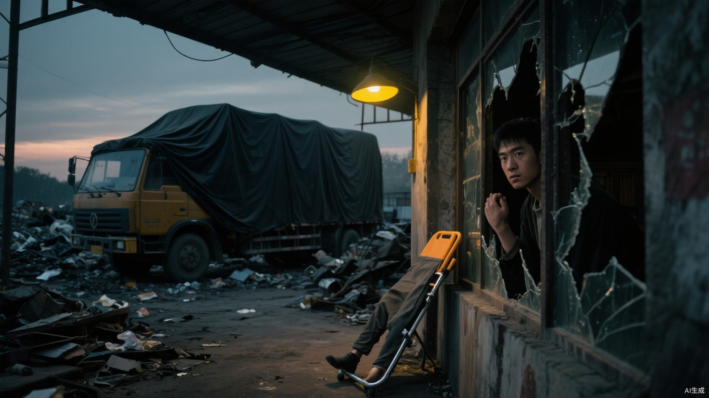

# 第七章 消失的人

第二天清晨，小文带着清水和纱布去找老杜。

门没有锁。

桌上的粥已经结了一层灰白薄皮，床铺被人掀开，柜门半敞。老杜的木拐仍靠在墙边，拐头朝外，像主人只是临时腾手去拿什么东西。

床脚却有两道新鲜拖痕，一直延伸到门外。

小文蹲下摸了摸。灰尘被擦开的边缘还很湿，拖痕之间没有木拐落地留下的圆点。

一个只有一条腿的人，不会不带木拐自愿离开。

登记处的人把册子翻得哗哗响，第二遍才用指甲点住一行：“杜成，凌晨四点，自愿离开基地投亲。字在这里，不是我临时给你编的。”

“他妻子早死，女儿在外地，灾变以后一次消息都没有。”小文把木拐横在柜台前，“而且他只有一条腿。你告诉我，他凌晨四点不带拐，投的是哪门亲？”

登记员瞥了一眼木拐，又立刻把视线移开：“我只管照交接单登记。有人说去投亲，我不能追出去替你查族谱。”

“那交接单是谁送来的？谁看着他出门？”

“后勤的人。具体哪个，我没记。凌晨一口气来了好几份，我还得给你把每个人的脸都画下来？”

小文指向纸页末尾：“这道红线是什么意思？”

登记员啪地合上册子，语气硬起来：“内部分类。你要查，拿管理处批条；没有批条，就别拿根木拐堵我的窗口。后面还有人等着办事。”

对方袖口沾着黑色机油。那不是登记处会有的东西，和后勤废料车底盘上的污迹一样。

小文没有继续争。他道了谢，转身时故意让木杖在门槛上滑了一下。登记员下意识伸手扶桌，目光却越过他看向门外守卫。

有人在等他闹起来。

他偏偏没有。

上午，小文照常去运水，问老杜的人只说一句“可能真有远亲”。中午，他用半块干饼和后勤修理工换了半天推车工作。傍晚，袖口带机油的登记员离岗，穿过两条巷子进入废料场。

小文没有跟得太近。他把空桶留在岔路口，自己绕进一间塌顶商铺，从后窗观察。

一辆平时运炉灰和废铁的货车停在仓棚下。车牌被泥抹住，车厢四周蒙着黑布。两名守卫先抬上三个不会反抗的人，随后又拖来一个不断咳嗽的女人。

最后抬出的担架上，一截空裤管从黑布下滑出来。

守卫立刻塞了回去。

小文握着窗框的手骤然收紧。

老杜还活着。

车厢底部滴下一串液体，混着血和消毒水味。那不是废料车该留下的痕迹。

小文数了人数，五个。

守卫没有把他们送往南门。货车在天黑后调头向西，驶向地图上已经被尸群占据的区域。

同一天下午，城北争议水站也发生了第一次真实流血。

巨熊的人拆掉猎鹰挂在泵房外的木牌，声称交换日已经确认北路归清路者使用；猎鹰守卫拒绝交出抽水机。双方都没有接到开战命令，推搡中却有人先抡起扳手，另一边随即放箭。一名巨熊工人肩头中箭，一名猎鹰守卫被砸断手指。

火花调停队赶到后没有追问谁先动手，只分别记录伤口、武器和在场姓名。可轩把两份口供拍到聂浩面前：“猎鹰说巨熊抢水，巨熊说猎鹰先放箭。两边都写得跟亲眼看见天亮似的，可箭先飞还是扳手先抡，总不能各有一个答案吧？”

“都送。”聂浩看完便封好，“让每一边先看见自己流的血。”

可轩拿起两个信封左右掂了掂：“我一辆摩托跑两个方向，还得保证谁也别看见我从另一边回来。腿跑细了算谁的？”

“算在火花损耗里。”

“那能多领半碗饭吗？”

“不能。”

可轩啧了一声，把信封塞进夹克：“这买卖听着就亏。再说，就断几根手指、挨一支箭，真烧得起来？”

“假的柴只能冒烟。”聂浩把粮油超市的旧记录压在水站口供下面，“等他们自己添上一根真的，火才灭不了。”

与此同时，南门外响起求救信号。

天干在城墙上确认三道微弱魂火，其中一道正在迅速衰减。他请求带队出城。马克没有拖延，甚至亲自解下备用弹药交给他。

“任何还有呼吸的人都带回来。”马克说。

“西侧今晚是否有运输？”天干在出发前问。

马克看向远处：“后勤常规清运。你的目标在南门，不要让不相关的信息分散判断。”

“确认。南门救援优先。”

天干带走了能够感知全城生命波动的魂灯。

西侧后勤区，地支逐一核对黑布车中的姓名、伤势和呼吸。他不催促，也不辱骂。一名女人抓住他裤脚，问自己究竟要被送到哪里。

“交接单写的是西区安置。”地支把她的木牌翻到正面，“路线、人数和到达状态由我负责，安置内容不在命令说明里。”

“那里全是丧尸，你还跟我说安置？”女人抓得更紧，“你们要杀人，至少别拿两个好听的字盖在上面。”

地支低头看她：“我没有更改记录名称的权限。”

“求求你，我女儿还在基地。她今晚会去第三食堂等我，我不回去，她会一直等到关门。”

地支重新翻过名单：“她不在本次转运中，居住和口粮登记也没有注销。你被带走以后，她仍可领取原配给。”

女人愣了一下，随即哭得更厉害：“我问的不是她有没有口粮。”

“我能确认的只有这些。”

他说完便让守卫把女人抬上车，仿佛这已经是能够提供的全部宽容。

出发前，他还要处理另一件事。

一名西门守卫把居民名单卖给外部商队。地支没有看见交易，却从稳定路灯下残留的影迹读出两个人站立的位置、伸手的方向和离开先后。他把守卫当前的影子缝回收钱时的姿势，右手被迫抬起，五指像仍握着那只信封。

“目标确认。”地支说。

影刃割开喉咙。

门后，一个孩子死死捂住嘴。地支看见了他，却只收回影线。

地支回报时，马克先看了交接点的草图，又看了一眼他刀锋上尚未擦净的血。

“交易双方都处理了？”

“名单出售者一人，收购者一人。目标确认后执行。”地支把两人的站位、接触时间和尸体位置逐项报完，最后才补充，“门后有一名孩子，约十岁，目击全过程。”

马克抬起眼：“你看见了，却没有处理？”

“命令目标只有参与交易者。孩子没有接触名单，没有武器，也没有阻碍执行。”

“他记得你的脸，也会记得是谁杀了他父亲。再过几年，他可能回来找你。”

地支用布缓慢擦过刀锋：“届时会出现新的行为、新的痕迹和新的目标。那属于下一份命令，不能倒填进今天的名单。”

马克沉默片刻，重新合上草图：“不用补命令。父亲犯的罪不自动落到孩子头上；何况一个只会讲述、拿不出名单的孩子，掀不翻猎鹰。”

“确认。”地支收刀，“证人保留。”

午夜前，西门只开了能容货车通过的一道缝。

绞盘每转一格，铁链便绷出一声沉响。黑布车缓缓钻过门缝，车厢里的重量压得后轮深陷，积水从轮胎两侧漫出来，又被尾气吹出细密波纹。

小文躲在废弃岗亭后，看见副驾驶窗内掠过地支没有表情的侧脸。

黑布下方，一截空裤管被风掀出来。

只露出一瞬，便又被守卫塞了回去。

老杜还在里面。

小文把写有车牌、人数和出发时间的纸压在运水桶下。笔尖停在最后一行时，他想起母亲说过的话：这个家还轮不到谁一个人替三个人签字。

他仍然写下：

**天亮前没回来，不要找我。**

木工凿插进腰后时，门外的货车已经只剩两点暗红尾灯。

守卫开始关闸。

小文借墙根杂草感知脚步间隔，在两人转身推动绞盘的瞬间贴过门缝。锈蚀铁板从背后压来，外套被凸起的铆钉勾住。

布料撕裂。

他向前扑倒。

下一刻，铁闸轰然砸进泥地。震动从膝盖一直撞进胸腔，墙内最后一线灯光也被切断。

墙内还有灯，父母还在等他。

墙外没有路灯。

只有黑布货车的两点尾灯浮在灰雾里，忽明忽暗，像一双正在闭上的眼睛。

左边那一点先消失。

右边也快了。

小文抓起木工凿，一瘸一拐地追了上去。
