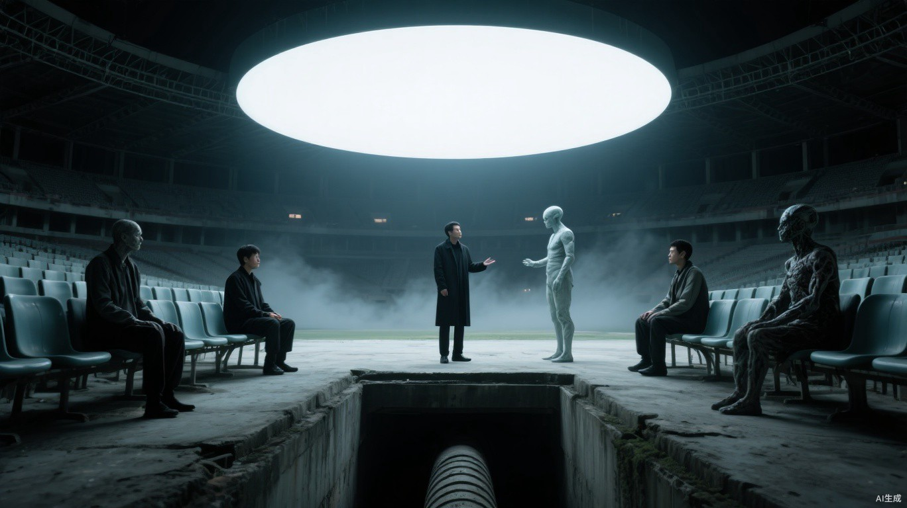

# 第八章 活人之贡

黑布货车没有走直线。

它在废车与塌楼之间反复绕行，像在确认身后没有尾巴。小文不能跟着车灯跑，只能穿过送外卖时记住的窄巷，提前赶到下一个路口，再凭发动机声重新判断方向。

他的右脚尚未痊愈。每翻过一道矮墙，旧伤便像被重新撕开一次。

货车最终驶向西部旧体育场。

那里曾是城市最热闹的地方，如今看台塌了半边，场外停满锈蚀车辆。四周空旷，没有能够连续靠近的遮挡。小文绕到北侧，从坍塌看台下方的排水口钻进去，伏进混着腐叶的冷水里。

他不能借植物看见远处，只能从裂缝观察场内。

黑布掀开，五个人被拖下车。

老杜排在最后。断腿换过干净绷带，血也止住了。那不是救治，只是确保他不会死在路上。

地支逐一报出名字。每报一个，守卫便在册上划掉一个。

场地西侧的铁门随后打开。

先出来的不是尸王，而是四只形态各异的丧尸。肩背畸形隆起的撞城停在正面；听线用指骨敲击看台钢架，声音沿结构传向远处；疫手指间垂着黑色黏液；壁行则倒挂在墙面，四肢像钩子一样嵌进水泥。

普通丧尸全被压在体育场外，没有一只敢越过地面的抓痕。

最后出现的封衢仍保留着人形轮廓。它没有先看贡品，而是侧耳听完听线敲出的车流数量，才望向马克。

“东线，十九车。多三。”

马克站在灯下，衣服干净得不像来过西区：“新增的是交换车，没有扩张据点。医院、水塔和西门运输线仍按原界限。”

封衢抬起手，指向五个人。

疫手依次触摸他们颈侧。轮到老杜时，黑色黏液覆盖残端，使原本急促的失血重新慢下来。

“五。”疫手开口，“四热，一冷。都可变。”

“五个活的。”封衢说，“路，空七天。死肉，不算；晚一天，西仓堵。”

马克回答：“他们都能撑过感染。”

小文把脸贴在冰冷水泥上，才没有让呼吸变重。

白天，马克刚在裁决席说猎鹰不会只认拳头。夜里，五名失去劳动能力的人被列队送给尸群。医务室替他们消毒、止血，不是为了让他们活下去，而是为了让这批货物保持价值。

一名女人开始哭，挣扎着往前爬了半步：“我女儿才九岁，晚上不点灯就睡不着。她不知道我在这里，早上还问我什么时候回去。你把我送走，总得让她知道不是我不要她。”

马克准确说出孩子所在的居住区和年龄：“她会得到三十点抚恤，未来两个月优先安排安全杂务。”

“她不会缺口粮，也不会被赶去墙外。”

“我说我要见她！”女人哭得声音发劈，“她怕黑，你给她三十点，三十点会替她点灯吗？”

马克停了片刻：“不会。今晚会有人陪她，明天才告诉她你去了哪里。你想留一句话，我让人记。”

“我要自己说。”

“我知道。”马克说，“但我只能把你不能带回去的东西，换成她以后还能用的东西。”

老杜忽然笑了。

“账不是这么算的。”

马克转向他：“你以前做木工。坏掉一根承重料，难道要让整张桌子一起塌？”

“烂木头可以扔，人不是木头。”老杜坐在地上，声音因高热发哑，“你真觉得这是大家一起付的账，就把你、天干、地支也写进去抽。为什么红线永远画在病人和残废后面？”

守卫抬手要打，马克制止了。

“抽到医生，病人会死。抽到水井工，所有人会渴。抽到守城异能者，下一次尸潮死得更多。”马克平静地说，“首领的职责不是让每个人觉得公平，而是决定这座基地付得起什么。”

“所以你的名字永远最贵，贵到付不起。”

马克没有发怒：“你可以恨我。你的家属不会因此少领一粒粮。”

这句话比威胁更冷。

老杜看向排水口方向。

小文不知道他是否真的看见自己。裂缝边几根杂草正在愤怒中逆风生长，老杜的目光只在那里停了一瞬。

随后他挣开守卫，抽出藏在袖中的木片。那是黑布车上固定断腿的夹板边角，被他一路用指甲磨出尖端。

他握着它冲向封衢。

“这笔账，总会有人记着。”

封衢没有像野兽一样扑咬。它侧身避开木片，折断老杜手腕，再用指甲划开肩颈皮肤，刻意避开动脉。

感染纹路从伤口向胸口蔓延。

小文能够感觉到老杜体内的生命正在被另一种东西改写。心跳越来越慢，一股本应随着死亡消散的力量却沿感染联系流向封衢脑内。尸王皮肤上的灰纹渐渐亮起，先前的细小裂口随之闭合。

老杜再次睁眼时，瞳孔里已经没有认识小文的光。

封衢把他推给疫手。其余四人则依照撞城、听线、疫手和壁行近期完成的任务分配，并非固定一尸一人。撞城得到身体最强壮者，壁行得到四肢完整者，听线只分到一个衰弱老人，显然因近期侦察结果被削减份额。

一只附壁枝印节点被血味诱惑，越过壁行划下的停步痕。

封衢按住它后脑。黑纹从那只丧尸晶核方向退回掌心。它眼中的聚焦瞬间消失，仍有尖爪，却忘记如何附壁，也忘记等待，只会扑向最近的血。

壁行一爪将它拍开。

封衢又从新感染者中挑出适配者，用刚吸收的生命力写入一缕枝印。新丧尸停止挣扎，转身伏上墙壁，等待敲击命令。

小文终于明白，尸王统治的不是一群偶然聚集的怪物。它能赋予、削弱和收回部分灵智与异能，也掌握所有活人贡品的分配。那些高阶丧尸服从它，因为力量本身就是套在晶核上的锁链。

马克问：“七天后仍是五人？”

“灰雾，只养到二。”封衢指向自己，又指向四名尸将，“上面，要活的。五个，七天。少一个，路改回来。”

超过二级的尸群需要感染活人、吸收尸变时流失的生命力，才能维持力量与尸印。人类越少，剩下的活人反而越珍贵。猎鹰不是驯服了尸群，只是被允许继续经营这座活体蓄水池。

小文握紧老杜留下的木工凿。

冲出去，他救不了已经尸变的老杜，只会让父母进入下一张名单。他把指甲掐进掌心，强迫草叶停止生长，也强迫自己看完每一个名字被划掉。

分配结束后，地支走到排水渠附近。

“植物有异常。”他说。

马克看了一眼封衢尚未离开的背影：“现在搜索会惊动尸群。”

“观察者可能带走信息。”

“若他有值得保护的人，就一定会回基地。”马克整理袖口，“家比荒野更适合关住一个人。”

地支记下草叶朝向和水流，没有继续靠近。

天干完成南门救援返回时，马克已经换下沾血外衣，亲自在城门接收三名获救者。

“南门信号的三个人，都带回来了？”马克先看担架，再看跟在最后的救援队员，“有没有留下追兵或无法确认的魂火？”

“三人全部存活，一人失血，另外两人脱水。撤离路线已封，没有魂火继续跟随。”天干的视线停在他袖口残留的一点暗红上，“你没有出城。血从哪里来？”

马克低头看了一眼，像是这时才发现：“西侧清运有人挣扎，后勤叫我过去压住担架。不是我的伤。”

“西侧今晚清运了几人？”

“常规废料和转移人员。详细名单后勤明早送你。”

天干没有继续追问。他接受了能够当场核验的解释，却把“西侧清运”和当夜五名“自愿离开者”一起记进私人记录。

体育场彻底安静后，小文才从排水渠爬出。他在泥地里找到老杜折断的木片，又沿车辙记下每一道轮胎纹路。

西门已经落闸，原路无法返回。小文沿排水渠继续向南，绕到猎鹰处理炉灰的下游缺口。每天清晨，后勤会在那里收回空车和推车；他把外衣翻到没有血迹的一面，混在提前回城的清尸工后方，用木工凿撬开一段没有完全复位的铁丝网。守门人只清点车辆和木牌，没有逐张核对满身污泥的脸。

天亮前，他重新进入基地，取走老杜留下的木拐，把“杜成”写在失踪记录第一页。

广场上，马克正在宣布南门救援成功。

“猎鹰不会放弃任何人。”

高台四周的火盆同时添过油，火焰沿旗杆向上蹿了一截。三个被救回的人躺在担架上从人群中经过，每经过一排，掌声便高一层。

欢呼越过广场，钻进地下层狭窄的通风口。

阴暗住处里，小文坐在桌前。

木拐横在膝上，折断处还沾着体育场排水渠里的黑泥。他摊开一张药盒纸，把刚刚被猎鹰主动放弃的五个名字一个个写下来。

写到杜成时，笔尖戳破了纸。

广场上的掌声正好响到最盛。

同一刻，基地另一端没有窗的房间里，地支也落下了笔。

他把老杜过去十二天接触过的人逐一列出。第一行是小文，后面依次写着父亲的治疗日期、母亲领取康复药物的时间。

两张纸。

两盏灯。

一边记录猎鹰放弃了谁。

一边决定猎鹰接下来要放弃谁。

地支在最后一行写下：

**家属固定，必然返回。**

笔尖向右一拖。

一道细线横过三个人的名字。
