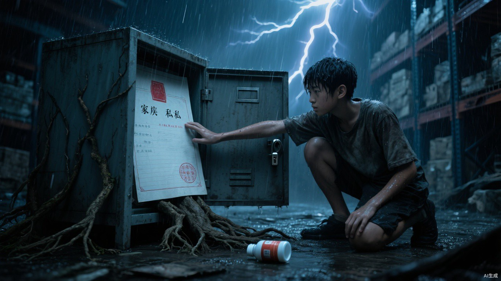

# 第九章 红线

老杜死后的第三天，小文照常去任务处领活。

他没有揭发马克，也没有寻找能够替自己主持公道的人。体育场里站着三级尸王、四名尸将、马克和地支；而他只是一个必须按时给父母领药的一级植物系。把真相喊出来，不会让任何人获救，只会让父母先消失。

回来的第一夜，他已经把体育场里看见的事逐项告诉父母：五个人、七天、封衢伸出的手，以及老杜最后冲出去前留下的那句话。他没有说“老杜牺牲了”，只说感染完成后，老杜没有再认出任何人。

父亲先在药盒纸上写下日期和下一次七天期限，写到“杜成”时停了很久，最终没有在名字后面补上“死亡”。

母亲把老杜削木拐时落在桌缝里的几片木屑拢进纸包：“他教你做夹层，不是让你把自己也藏进去。要查可以，先把我们两个算进计划。”

“我知道。”小文把纸往她面前推近，“这次问题、路线和最晚回来的时间都写在上面。我不会只留一句‘别找我’就消失。”

“你每次说这三个字，都只代表你听见了。”母亲看着他，“这次要代表你会回来。”

小文没有许诺一定回来。他把纸推到三个人中间，开始写必须查清的问题。

他在药盒背面写下三个问题。

红线按什么条件画。

下一批名单何时确定。

父母是否已经在名单上。

第四行只有两个字：原件。

没有原始记录，一家三口即使逃到别处，也只是三个被猎鹰通缉的叛逃者。其他基地未必愿意为他们得罪马克。

地支没有抓他。

这反而说明怀疑已经开始。小文去医务区时，总能在同一个距离看见陌生面孔；他接清尸任务，回程路线旁会多一名修鞋匠；父母领药的窗口，也换成了从不离开座位的记录员。

小文继续抱怨贡献太少，继续接最脏的活，继续在公开治疗日排队。他让自己看起来像一个只会为药费焦虑的普通家属。

第一次观察发生在停尸房。

他负责把无人认领的尸体送往焚烧场。十七张空床对应十七个名字，去向却分成“投亲”“主动离队”“转入翠竹”三类。三种字迹来自不同登记员，末尾都有同样一笔细红线。

小文没有抄名字，只记床位。

三天后，带红线的床全空了。

第二次观察在第七天。登记员把红线姓名抄到一张薄纸上，塞进灰色文件袋。当天午夜，黑布货车运走五个人，人数与纸上完全一致。

红线不是病情分类。

是候选。

小文开始筛选尸体。他不能临时指望三具恰好相似的尸体出现，只能利用搬运工作一点点调换位置。第一批没有接近母亲骨架的人；第二批留下一个肩宽相仿的女人；下一轮出现更合适的，他便把旧候选重新送回焚烧批次。每一次调换都保持尸袋总数与木牌数量一致。

第四轮筛选发生在一间渗水冷库。十一个尸袋分成两排，白霜从坏掉的制冷管一路爬到墙角。小文没有碰木牌，只将一具与父亲身高接近的男尸从当日焚烧架移到待核验架，再把原先候选推回相同编号的位置。

看守听见轮子响，隔门问：“为什么换架？”

“右边排水口堵了，最下面两个尸袋已经进水。”小文把沾湿的手套举到门缝能看见的位置，“继续放，明早袋底会漏。”

他说的都是真的，只没有说明自己先拔松了排水塞。看守嫌尸水沾鞋，站在门外挥手让他处理。小文重新罩好防水布时，看见地支的影子从磨砂玻璃外停了片刻。

对方没有进来。

小文也没有在当天再动任何一个尸袋。

地支在远处看着，没有阻止。

他想知道这个少年在替谁做事。

小文也知道自己被看着。他每取得一段信息，便用两三天正常劳动隔开。跟踪者换了三次，站位不同，却都避开正午没有清晰影子的时段。

第三次观察发生在后勤仓库。

灰色文件袋被送进深处登记室。主管打开一只没有编号的矮柜，取出无封面厚册。小文借外围清理任务经过两次：第一次从通风窗倒影里看见“西区安置”和“资源止损”；第二次趁主管脱外套搬箱，用藏在手套里的软蜡压下钥匙两面。

他听见主管说：“下一批还是五个。名单明晚封存。”

小文回家后，用老杜留下的细锉修整废铜钥匙胚。父亲负责比较齿痕，母亲则把门外每一次停步都记在纸上。

父亲把铜胚压在药盒纸的蜡痕旁，眯着眼比了两遍：“左边第二齿浅了，不到半个指甲。现在硬拧，能进去，转不过锁舌。”

“铜太脆，再锉会断。”小文把细锉停在半空，“断在锁里，主管不用查人，先查谁做过钥匙。”

“那就磨锁，不磨钥匙。”母亲把两人的脑袋从纸上推开一点，“你们这是去开柜子，不是拿去参加钥匙选美。能转就行，长得丑不会报警。”

父亲看了她一眼：“磨锁的声音更大。”

“所以你负责算他什么时候动手，我负责提醒你们别把一把钥匙修到天亮。”她指向门外，“刚才那个人停了十二息，你们谁记了？”

小文和父亲同时低头看纸。

母亲哼了一声：“看吧。两个会算的，耳朵还没我好使。”

第三夜，钥匙终于能转过第一道锁。

同一时期，小文在废弃浴室清藤时发现旧锅炉房。排水格栅下有一条运煤通道，向北连着焚烧场灰坑。他测过宽度、积水和空气流向，又在地图上记下三个没有解释的符号。

地支在那天下午来过一次。他站在南门唯一还亮着的灯下，看着小文把烂叶从排水沟掏出来。小文故意拔掉堵水的破布，锅炉房积水立刻漫过地砖，将地支投向北墙的长影切成一段段晃动暗斑。

墙面原本向前延伸的影线停住了。地支没有踏进水里，而是沿干燥池沿绕到另一侧。

小文低头继续清沟，没有回看。医务室四头无影灯曾让地支放弃贴墙潜行；现在流动积水又切断了影线。两次都不能证明完整规则，却足够成为遇上他时值得一试的两种东西：多向变化的光，以及无法保持稳定投影的水面。

尸体、焚烧日、地下通道。

此时它们仍只是直接逃亡失败后的备用方案。

雨季第一场暴雨到来前，小文完成最后准备。他用根系和垃圾逐步堵住仓库西侧排水口，让故障看起来是长期淤积；在东巷预藏三盏油灯、反光铁片和排水绳；又把铜钥匙藏进木拐夹层。

暴雨落下时，西侧仓库开始进水。主管带人抢救底层药箱，小文换上搬运工雨衣，从通风窗进入登记室。

矮柜有两道锁。

第一道被铜钥匙打开。第二道没有钥匙孔，插销藏在柜内。

小文让一根细根沿柜背裂缝钻进去。第一次顶偏，里面传出轻响；屋顶恰好落下一股雨水，盖住声音。第二次，药瓶从倾斜木架滚落。第三次，细根终于勾住插销。

柜门打开。

柜底没有成箱药品，只有一本被防潮油布裹住的无封面账册。纸边被翻得起毛，外侧却没有分类签，像有人刻意让它在清点时看起来只是一沓废表。

走廊里传来木箱拖过积水的摩擦声。

“西排再垫高一层！”主管隔着两道门喊，“登记室别开，水漫进去谁都赔不起！”

小文没有立刻碰账册。他先用衣角擦干手指，又看了一眼门缝。油灯的橙光正在外面晃动，负责搬运的人还在西排，距离这里最多隔六列货架。

他掀开油布。

第一页没有标题，只有姓名、年龄、身体状况和离城日期。部分名字末尾画着与老杜门牌上一模一样的细红线；“去向”一栏却统一写着自愿投亲、外出谋生或西区安置。

纸页被窗外闪电照亮，又迅速暗下去。

小文往后翻。

第七页是杜成。

年龄、断腿时间、菜地床位、抗生素申请被拒日期全部相符。离城原因写着“自愿投亲”，交接时间正是他在黑布车上看到那截空裤管的夜晚。姓名右侧另有一个极小的黑点，对应体育场里第一个被疫手感染的人。

不是某个后勤人员私自卖人。

从门牌红线、停止投入、黑布车到公开账目的“自愿离开”，每一步都有不同的人经手，又恰好在这本账上闭合。

远处雷声滚过屋顶。震动传进木架，一只空药瓶从第二层滚落。

小文伸手接住。

玻璃瓶停在掌心，没有砸上地砖。门外拖动木箱的声音也停了一瞬。

“什么响？”有人问。

“上面漏水，瓶子倒了。”另一人回答，“先搬西排。”

脚步重新远去。

小文把药瓶放回原处。

瓶底碰上木板。

嗒。

小文的手还停在瓶口上，窗外的风突然变了方向。

积在屋檐上的雨水被整片掀起，轰地泼上通风窗。玻璃向内一颤，锈缝里挤出几股冰冷水线，其中一滴正落在他手背上，沿着指骨滑进袖口。

门外的油灯被风压低。

橙黄色的光从门缝底下探进来，只剩细细一线，贴着地面积水颤动。

账册摊在那线光的尽头。

小文低下头。

纸页受了潮，两张紧紧粘在一起。他的指甲插进页缝，第一次只刮起一层发白的纸毛。

门外，铁皮箱角拖过地砖。

刺啦——

他停住。

声音也停住。

隔着一扇门，谁都没有说话。只有雨点砸在铁皮顶棚上，越来越密，仿佛有无数根手指正在外面敲门。

几息后，木箱再次移动。

刺啦——

更近了。

小文用拇指压住账册，指甲再次探进页缝。纸边被挑起，又被窗口灌进来的湿风压回去。他手上全是汗，指腹在纸面滑了一下。

第三次。

纸页终于分开。

就在这一刻，窗外的世界忽然白了。

没有雷声。

一道惨白电光无声地劈开云层，穿过满是雨痕的玻璃，把登记室照得纤毫毕现。墙上的霉斑、柜门翘起的木刺、半空中飞散的纸屑，还有小文骤然收缩的瞳孔，全被钉死在那一瞬。

他的目光落下去。

日期：两天后。

第一行，父亲。

小文眼前闪过一双浮肿的手。每天夜里，那双手都会把仅剩的药片倒在桌上，一枚一枚分成早晚两份。父亲总说够了，桌角却永远压着下一次治疗还差多少贡献点。

第二行，母亲。

鞋底拖过地面的沙沙声忽然贴着耳边响起。母亲每次听见他回家，都会扶着墙挪到门口，嘴上先骂一句怎么又淋湿了，右手却已经伸过来摸他的额头。

第三行，小文。

三个人的名字挨在一起，排列得那样整齐。

像灾变前的户口簿。

像他们仍住在那间漏雨的旧房子里，父亲没有病，母亲还能用两只手做饭，他也从来没有穿上过染血的外卖服。

可这一页的抬头不是户籍。

是“两日后西区安置”。

小文的指尖开始发抖。

不是害怕被写进去。

是因为那张纸连他会做什么都已经替他想好了。

他的名字后面，只有一行备注：

**家属反抗时，一并处理。**

原来他们知道他一定会拦。

知道他会抱住担架，知道他会挡在父母前面，知道他宁愿一起死，也不会站在原地看着黑布车开走。

然后，他们把这一切写成了一行处置条件。

雷声终于落下。

整座仓库仿佛被从天上砸了一拳。窗框猛震，柜门弹开，药架上的空瓶同时跳起，又噼里啪啦撞回木板。暴雨紧跟着压下来，砸穿屋檐所有缝隙，将远处的呼喊、脚步和喘息一口吞没。

小文却什么都听不见。

震耳欲聋的轰鸣里，他听见的反而是马克站在裁决大厅说过的那句话。

“猎鹰若只认拳头，我们没有必要建这堵墙。”

当时四周全是掌声。

现在，那句话也落在这张纸上。

雷光退去，登记室重新沉入黑暗。父亲、母亲和他的名字却仍烙在视野里，惨白得怎么也擦不掉。

门外的油灯晃了一下。

一点暗红从纸页最下方重新浮出来。

圆润，完整，端正。

马克的私人印章。
