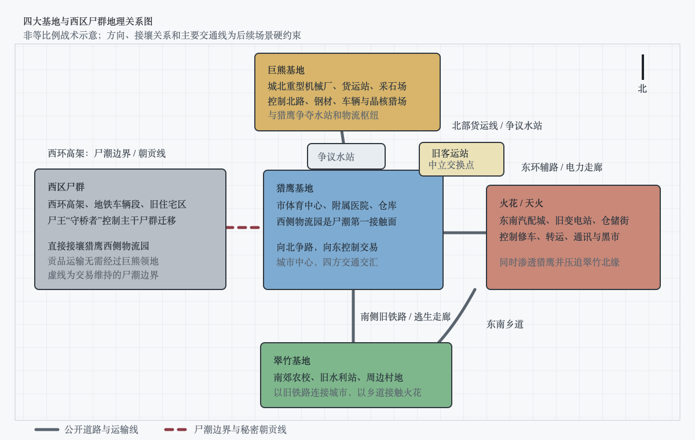

# 背景
## 写作与审稿根本指标
- **剧情紧凑性：**每章必须有当下目标、阻力、选择、结果和下一章钩子。时间线与背景只在改变人物当前判断时插入，不以“交代完历史”为成章理由。
- **人物丰满性：**主角、盟友和反派都必须拥有独立欲望、底线、误判与代价；同一事件中，不同人物应基于各自经历作出不同但自洽的选择，不能为推进剧情临时降智。
- **台词信息性：**对白应同时承担人物态度、事实依据和隐含目的中的至少两项。除紧急命令外，避免可互换的短句；删去名字后仍应能凭词汇、语序和关注点判断说话者。
- **场景完备性：**关键场景必须明确入口、出口、遮挡、距离、资源、机关和撤退条件。人物只能使用此前看见、携带或合理取得的物品，环境变化必须反过来影响战术。
- **画面真实感：**每个核心场景至少建立空间锚点、感官锚点和动态变化。描写优先选择角色当下会注意的细节，使读者能持续判断人物在哪里、看见什么、下一步为何可行。
- **情绪与氛围：**逻辑成立只是底线，关键揭晓和高潮必须先蓄积感官压力，再让环境变化与人物情绪在同一瞬间爆发。雷、雨、灯光、声音和身体反应不能只为机关服务，也要承担恐惧、愤怒、悲痛或希望。章末钩子若依赖震惊，应在真相显现后立即断章，把分析、核验和行动留给下一章，禁止用解释稀释第一击。
- **智斗严密性：**计谋必须包含信息来源、准备成本、执行窗口、失败预案和对手复核。胜利来自更早准备、信息差或承担更高风险，不来自巧合与对手失常。
- **伏笔与回收：**重要能力、道具、路线和制度至少提前出现一次；回收时既解决眼前问题，也应改变人物关系或势力格局，避免只有设定展示而无剧情后果。

## 叙事基调
这是一个资源持续减少、旧秩序已经失效而新秩序彼此竞争的末世。丧尸与异化生物提供外部生存压力，不同基地如何分配食物、危险和人的价值，才是长期冲突的核心。

人物不能简单分成善人与恶人。残酷制度必须解决过真实问题，理想制度也必须支付资源、效率和牺牲的代价；善意需要落实为行动，野心也应建立在可以理解的经历与利益上。

整体氛围压抑而不绝望。希望不来自突然出现的救世主，而来自普通人在看清代价后仍愿意共同承担、修正规则，并拒绝把弱者当成可以悄悄删去的数字。

## 灰雾灾变
一颗彗星逼近地球后在高层大气中解体，释放的未知物质扩散全球，形成长期不散的灰雾。接触灰雾后的半小时内，约50%人类失去意识并停止呼吸，又在数分钟后以丧尸形态重新站起。剩余人类能够抵抗空气中的直接感染，却仍会因抓咬和体液进入伤口而尸变。

灰雾同时改变了其他生物。部分植物获得异常生命力和捕食能力，动物体格、骨骼与感官迅速异化，并逐渐出现水、火、雷电等能力。幸存人类也可能在强烈刺激下觉醒异能，但觉醒速度与能力强弱差异巨大，无法在灾变初期迅速形成统一反击。

人口骤减、感染扩散和基础设施瘫痪使原有政府与供应体系迅速失效。食物、燃料、药品和安全据点成为不可再生的争夺对象，幸存者被迫组成小型团体；部分势力开始以家属和配给控制普通人，把未觉醒者、老人和伤员推向高风险任务。

# 势力建卡
四座基地并不只是实力和资源不同，也代表四种不同的末日秩序。猎鹰以道德包装控制，巨熊公开崇拜力量，火花利用并背叛一切规则，翠竹则以严格管制维持最低限度的共同生活。

## 势力地理关系

- 本图为非等比例战术地图。方向、相邻关系和主要交通线属于后续场景硬约束；具体距离可按章节需求细化，但不能随意改变谁与谁接壤。
- 西区尸群占据西环高架、地铁车辆段和旧住宅区，直接接壤猎鹰西侧物流园。秘密朝贡车只需穿过猎鹰西侧封锁线，不经过巨熊领地。
- 巨熊位于城北，通过北部货运线与猎鹰相连，双方争夺水站、道路和物流枢纽；北区仍是猎鹰与巨熊战争的主要正面战场。
- 火花位于东南汽配城和旧变电站，一面通过东环辅路渗透猎鹰，一面沿东南乡道压迫翠竹北缘。
- 翠竹位于南郊农校和水利站，通过南侧旧铁路连接猎鹰；这条铁路也是猎鹰覆灭后天干与普通人撤往翠竹的主要走廊。
- 旧客运站位于猎鹰东北侧、北部货运线与东环辅路的交点。四方都能抵达，却没有任何一方可以不惊动其他势力长期驻军，因此适合作为固定交换场。

## 猎鹰基地：伪善的秩序
**据点与资源：**占据市体育中心、附属医院和两座大型仓库，是四基地中人口最多、药品和治疗能力最强的一方。城墙、巡逻和任务体系最完整，能够向普通人提供相对稳定的治安，却依赖外出搜索补充粮食、燃油和药物。

**权力与部门：**马克兼任军事首领与最终裁决者；天干负责公开救援、人员标记和重大调查；地支负责秘密监视、清除与朝贡。任务处、后勤处和医务室保留书面流程，但关键岗位、治疗资格和战利品解释权最终集中到马克手中。

**分配与成员生活：**贡献点名义上按劳动、风险和成果发放，普通人可排队接受治疗并提出申诉。实际定级和估价不透明，普通人承担死亡率最高的搜索任务；登记异能者得到较好口粮和住处，其家属却会以“保护”为名迁入内区，成为软性人质。

**军事与对外关系：**猎鹰依靠纪律化搜索队、异能者救援队和马克的特殊火系“烬印金焰”控制城市中部，向火花提供庇护，以药品制约巨熊，以“不遣返投奔者”为由持续打压翠竹。马克不会因一枚标记发动战争，而会用交叉情报、试探路线和后备兵力逐步确认敌人。

**公开叙事与真实代价：**口号是“众生平等”“不放弃任何一个幸存者”。马克确实救援普通人、维护公开秩序，也因此获得真实拥护；但无法继续创造价值的人会从公开记录中变成“自愿离开者”，被秘密献给西区尸王。猎鹰的危险不在于毫无规则，而在于只有马克有权决定规则何时不适用于某个人。

## 巨熊基地：强者的秩序
**据点与资源：**占据城北重型机械厂、货运站和采石场，人口与综合实力仅次于猎鹰。基地缺少医院和精细药品，却掌握工程车辆、钢材、晶核猎场及北部道路，因此重装、防御和短途运输能力最强。

**权力与部门：**熊震以特殊变身“撼岳巨熊”和建基地时的战功担任首领，贺岭的“铁墙战团”负责重装与近战，魏川的“长辕队”负责运输、侦察和道路控制。各战团保留自己的物资与人员，重大行动由首领召集头目议价；任何人都可以凭公开挑战争夺位置，但败者必须交出队伍、物资或生命。

**分配与成员生活：**战利品先扣除车辆、武器和公共防御成本，余下部分按战功分配，规则公开且很少事后克扣。异能者、技术骨干和战功成员优先获得食物、医疗与家属保护，但家属额度按成员当前战力和预期产出核定，不能覆盖长期消耗稀缺药物或治疗异能的人；额度不足时，成员必须放弃该名家属，或者连同家属一起退出庇护。普通劳动者能凭成果上升，失去劳动和战斗价值的人却只有最低口粮，也可能被当成诱饵或留在撤退线后方。

**军事与对外关系：**巨熊的正面体系由三人闭合：熊震以撼岳巨熊撕开阵地，贺岭以“铁脉连城”把车辆、钢板和工事组成可承伤反震的金属网络，魏川以“动量回廊”赋予重装部队不合常理的推进与撤离速度。贺岭、魏川个人战力均与猎鹰的天干、地支同档，因此巨熊的第二基地地位并非只靠熊震一人支撑；熊震阵亡后，两个战团仍能保持完整组织和威慑。巨熊不擅长医疗、情报渗透与长期治理，与猎鹰争夺北区高架、水站和物流枢纽，与火花交易晶核和运输情报，对翠竹的平均配给制度抱有轻蔑，却会履行已经公开谈定的交换。

**公开叙事与真实代价：**巨熊从不宣称平等，口号是“谁守住，谁分配；谁拿走，谁负责”。它的吸引力在于赏罚直白、强者可以自由上升；代价是人的价值被战斗力和产出直接衡量，家属安全依附于强者，弱者连被欺骗的必要都没有。熊震死后，战团制度既能让残部保持组织，也会令贺岭与魏川难以服从同一个外部首领。

## 火花基地：寄生的秩序
**据点与资源：**占据东南部汽配城、旧变电站和数条小型仓储街，正面兵力弱于猎鹰与巨熊，却掌握修车、转运、通讯和黑市渠道。它缺少独占的大型资源点，因此把路线、口令、债务和秘密本身经营成资源。

**权力与部门：**梁肃是公开首领，负责集会、外交和维持名义上的指挥权；聂浩以外勤与情报负责人的身份控制真实决策；第三号人物沈砺掌握正规战斗队、营地防务和战时纪律。情报被故意切碎，沈砺能知道行动目标、兵力上限和撤退线，却接触不到聂浩完整的渗透网络。

**分配与成员生活：**火花沿用猎鹰式贡献点和救助口号，但大量资源通过私人债务、情报交换和临时合同重新分配。成员可以靠办事能力迅速上升，也可能在失去利用价值时被连同证据一起舍弃。帮助从不免费，接受一次药物、护送或调停，往往意味着未来要交出路线、口供或人情。

**军事与对外关系：**火花避免正面决战，擅长诱兽、伪造标记、安插后勤人员、污染命令和接管战后运输。聂浩与熊震真实实力处于同一水平，二人都只逊完整状态的马克；若聂浩提前暴露，马克会先清除这个卧榻之侧的威胁，熊震也会把他视为必须挑战的同级强者。因此他让雷系梁肃在台前承担首领声望，自己维持“二级冰系谋士”的形象，再持续向猎鹰和巨熊投递真假混合的证据，驱使两个强于火花表面战力的基地先行火并。火花同时借冲突扩大物流权，并对翠竹传播“没收财产、限制自由”的单面叙事，削弱其吸纳人口的能力。

**公开叙事与真实代价：**口号是“弱者联合起来才有活路”，实际原则是让别人先支付风险。聂浩不追求立刻胜利，而要让每个对手都主动走进成本更高的选择。吞并猎鹰后，火花改名天火，保留救助宣传和贡献制度，却以清除隐患为由强化审查、征调与战争，成为比猎鹰更不稳定也更具扩张性的政权。

## 翠竹基地：受限的共同体
**据点与资源：**占据南郊农校、旧水利站和周边村地，是四基地中物资最少、人口和军事力量最弱的一方。缺少大型医院、成品药和工业库存，但掌握种子、农技、维修人员与小型水利系统，具备缓慢恢复生产的潜力。

**权力与部门：**许岚、苏禾、韩拓、顾衡四名最强异能者组成最高军事会议，分别负责城防、外勤、工事后勤与情报治安。战争、迁移、外交和三级资源调动必须表决；日常生产、医疗、教育和配给由部门代表组成的民政委员会管理。两票对两票时许岚拥有最终决定权，却不能私自改配给、征用个人物品或处决居民。

**分配与成员生活：**土地、水源、发电设备、车辆和大型仓库归公共所有，衣物、生活用品、小型工具和登记武器归个人。贡献点按劳动、风险、技能和成果发放，保存一年后逐月衰减；无劳动能力者仍有完整的最低生存配给，儿童、孕妇、伤病者按需要追加。急救、传染病和工伤由公共医疗承担，稀缺治疗按病情、贡献和排队顺序共同决定。

**军事与对外关系：**翠竹没有三级强者，四名军事委员却都与沈砺处于同一综合战力档，并能组成闭合防线：许岚以“定锚”守住城门与承重节点，苏禾用风场侦察、救援和切割敌阵，韩拓改变地形、工事与水路，顾衡以“证伪”识别渗透和打断关键行动。四人联手能够依托既有工事短时牵制三级个体，但任何一人离开职责位置都会形成明显缺口。翠竹因此依靠协作而非首领碾压弥补高阶战力不足，不主动争夺城市核心物资点。它要求入境者缴械、登记、隔离并服从宵禁，也拒绝把投奔者强制遣返。对外以种子、修理和少量农产品换药，因不愿交人且不接受强者特权，被其余基地共同描述成“没收财产、强迫劳动的监狱”。

**公开叙事与真实代价：**翠竹不承诺自由富足，只承诺规则也约束强者，最弱的人仍被视为成员。代价是真实的贫困、缓慢决策、严格登记和战时征调；公共保障还会让所有人的平均生活水平下降。它不是没有权力斗争的理想国，而是试图把争论、成本和牺牲放到可记录、可质询的程序中。

## 西区尸群：经营猎场的灾害
**活动范围与资源：**以西环高架、旧地铁车辆段和周边住宅区为巢域，依靠灰雾、游荡尸群和活人感染维持。绝大多数普通丧尸仍只会追逐声音与血腥，封衢却能通过“尸脉敕封”从中建立指挥骨架：四名主印尸将负责理解局部战术，主印下属的枝印节点负责约束小股尸群，剩余普通丧尸才作为被气味、嘶鸣和节点动作驱赶的兵源。

**权力结构：**不存在人类式官职。封衢通过等级压制、尸脉敕封和对活人资源的分配权控制尸群。它将最高规格的四枚主印分别写入四名尸将晶核，赋予稳定的局部判断力、克制捕食本能的能力及一种定向异能：
- **撞城：**统领正面尸群，负责破门、撞墙和吸收第一轮火力。
- **听线：**负责远距离感知、选择迁移路线和向其他尸将传递方向。
- **疫手：**负责维持俘虏生命、控制感染速度和筛选能够提供更多生命力的活体。
- **壁行：**负责攀爬侦察、绕后渗透和追杀脱离尸群包围的目标。

每名尸将统辖少量由封衢亲自写入的枝印节点，主印则作为复制异能的模板：撞城麾下产生只会列队冲门的硬肩尸，听线麾下产生沿钢轨接力敲击的听震尸，疫手麾下产生能够压制饥饿并搬运活人的保鲜尸，壁行麾下产生具备基础附壁能力的爬行尸。枝印只提供一两项指令和削弱后的能力，不能使普通丧尸获得完整人格或自行制定战术；节点一旦被击杀，其约束的小股尸群便会恢复混乱。

四尸将服从封衢，不是出于人类式忠诚，而是主印既是力量来源，也是可以被剥夺的锁链。封衢能令印记先关闭异能、再压低灵智，使失去主印者重新被捕食本能支配；距离过远或尸王衰弱时，剥夺速度会下降，尸将也可能在印记衰退前优先满足自身需求。只有封衢有权决定谁可以感染高价值活体，并根据侦察、攻坚、俘获和护卫贡献分配生命力；它也会削减强势尸将的份额或收回枝印，避免任何下属脱离控制。普通丧尸不得参与朝贡。

**行为逻辑：**灰雾只能让丧尸自然成长并维持到2级，三级尸王若长期得不到活人会逐渐衰退。因此它既需要人类，又不能允许周边人类被低阶尸群彻底吃空。它把猎鹰、巨熊和零散聚居点视为彼此隔开的活体蓄水池：哪一处人口下降过快，便调走附近尸群；哪一处试图扩张或统一道路，便让听线寻找运输节点、让壁行试探薄弱入口。它接受马克定期送来的活人，不是被人类驯服，而是用较低损耗换取稳定收益，并借尸群改道维持多个互相竞争、无法合力清剿西区的基地。

**力量对比：**灾变三个月时，西区尸群拥有一名3级尸王、四名2级高段至顶峰主印尸将、若干承担传令和局部异能的枝印节点及数千只低阶丧尸。主印负责决策，枝印把命令传到百米尺度的小股尸群，普通丧尸提供数量，三层结构使其正面总战力明显高于任何单独的人类基地。猎鹰能够生存，不是因为与其势均力敌，而是依靠城墙、燃料、地形和封衢不愿一次吃空猎场；若交易中断，任何人类基地都不能在无准备的野战中独自挡住完整西区尸群。

**军事与剧情作用：**第一次西区尸潮不是单纯饥饿暴动，而是封衢对猎鹰人口、火力、出口和补给能力的一次压力测试。它用低阶尸群逼出火力位置，四尸将分别确认城墙、道路、伤员和撤离线，自己始终保留退路；确认强攻代价高于长期收割后，才转入谈判。朝贡建立后，它仍让听线记录猎鹰车流、让壁行抽查边界，不把安全寄托在马克信用上。它能够谈判、记账、提高价格并选择报复目标，是独立政治力量；交易破裂时优先袭击仓库、道路和看守，而非为泄愤撞击最坚固的城墙。

**价值观与代价：**封衢不理解公平、忠诚和牺牲，只区分活体价值、感染收益、路线控制和群体存续。它可以为保存主印尸将牺牲上千只普通丧尸，也可以当场剥夺立功者的枝印，避免任何下属成长到足以脱离控制；在它眼中，灵智和异能同样是按收益发放、随时可以收回的资源。冷酷不表现为嗜血，而表现为每一次死亡都必须换回信息、道路或生命力。它说话先报方位与数量，再给期限和违约后果，偶尔沿用灾前养护工作的“堵、放、承重、改道”等词，不模仿人类道德语言。越冷静地履行交易，越能反衬马克主动把人类制度翻译成“活人数量”的选择。

# 核心人物与对白基调
- 日常对话允许一人连续说两至四句，使一句话同时包含态度、依据和隐含目的，不把所有交流压缩成单句问答。
- 战斗中的对白可以缩短，但必须保留个人词汇与职责：指挥者报对象和撤退条件，侦察者报位置和概率，治疗者报伤情和后果。
- 性格必须同时落实为行动。善良不能只靠劝说，谨慎不能只靠怀疑，精明不能只靠事后解释。
- **情绪温度必须拉开：**天干、地支、林夏、顾衡可以保持低温和精确；可轩、陈锋、周勇、梁肃应当外放、抢话、夸张或用玩笑遮掩恐惧；母亲、白川以责备和挖苦表达关心；老杜语速慢却不阴冷。不能把“聪明”统一写成面无表情的短句和漂亮反问。
- **对话要保留活人摩擦：**三人以上的日常场景至少允许一次打岔、误解、自我修正、没说完的话或对现场物件的反应。人物可以说半句废话、抱怨价格、拿同伴开玩笑，但这些生活感必须同时暴露关系或缓解压力，不能成为脱离剧情的段子。
- **对白不能只做剧情机器：**非战斗场景不得连续用多轮十字以内的问答递交信息。人物开口时要带着当下的疼痛、饥饿、面子、恐惧、邀功、习惯或旧关系；允许绕半步、误会、讨价还价和故意岔开，但一场对话结束后必须既推进事件，也让至少一段人物关系发生可感变化。
- **警句限量：**同一场对话至多保留一句可以单独摘出的“金句”。其余台词使用符合职业和年龄的自然表达，让人物先像活人交谈，再让读者从交谈中看出立场。
- “核心人物与对白基调”是稳定性格及说话方式的唯一准则；人物特征只在本节新增或修改。章节大纲只记录人物在具体场景中的状态变化、行为选择和关系推进，不重复建立人物卡；若章节描述与全局人物卡冲突，以全局人物卡为准并修正章节。

## 小文家庭与平民线
### 小文
**基础形象：**18岁，身形偏瘦，头发因长期奔波常显凌乱，右腿在第一章后留下短期跛行。灾变前是市状元、准大学生；父亲确诊尿毒症、母亲中风失去工作能力后，他在暑假全职送外卖，熟悉城市支路、商铺后门和楼宇结构。

**性格与对白：**克制、敏感，习惯先观察再回答，通常先给判断，再给可验证的依据；涉及路线会自然报方向、距离和备用出口。很少解释痛苦，也不轻易许诺；涉及父母时语气会变得固执。需要隐瞒时优先使用不完整的真话，不编造复杂谎言。克制不等于每句都短：被反复试探或时间紧迫时，他会一次把因果说完整；面对可轩、母亲等人的玩笑和拆台，常以过分认真、略带干涩的回答形成反差，而非与所有人互相说冷峻警句。

**塑形经历与发展：**高考证明他擅长规则内解题，送外卖和照顾父母迫使他学会在资源不足时排序。前期把所有责任揽到自己身上，假死计划第一次真正接受父母参与；进入翠竹后，他逐渐从“替别人决定如何活”成长为“把代价公开，让共同体一起决定”。

### 父亲
**基础形象：**49岁，因长期透析消瘦、水肿，手背留有反复穿刺痕迹，行动速度慢但意识清楚。灾变前是物流公司的成本会计，确诊后失去稳定工作。

**性格与对白：**习惯用账户、时间、概率和最坏结果分析问题，越焦虑越想把情感换算成可控数字。语言平缓，不用哭诉逼迫儿子；提出停止治疗时会说成家庭方案，而不是自我牺牲。其错误是把自己也当成账目中的可削减成本。

**塑形经历与发展：**灾变初期曾因一次错误估算差点让全家错过撤离，从此坚持记录余粮与路线。后期从计算“谁应被放弃”，转向为翠竹计算“怎样让所有人承担得起”，最终接管战后仓库账目。

### 母亲
**基础形象：**47岁，中风后左手精细动作受限，走路需要扶墙或拐杖，脸部仍有轻微不对称。灾变前经营早餐摊，长期记熟客口味、赊账和街坊关系。

**性格与对白：**观察敏锐、嘴硬，常从水杯位置、衣服破口、目光和语气识破谎话。她用生活细节拆穿父亲和小文的抽象算法，关心常表现为责备、拆台和立即动手处理问题；涉及孩子安全时绝不接受“为你好”的单方面决定。

**塑形经历与发展：**中风后最不能忍受的是被当成没有判断力的病人。她在能力测试、假死和翠竹守城中逐步掌握实际职责，从被照顾者成为医务物资分配者，也迫使小文学会尊重家人的选择。

### 老杜
**基础形象：**61岁，独腿，肩背因多年木工劳作略微佝偻，手指粗大且布满旧裂口。灾变前是家具木匠，妻子早逝，女儿在外地失联。

**性格与对白：**不讲大道理，习惯用木料、榫卯、尺寸和欠账评价人事；语速慢，先看别人手上在做什么，再决定是否追问。他接受帮助却拒绝用秘密要挟小文，也不把临死反抗包装成英雄行为。

**塑形经历与发展：**曾因赶工使用一块有暗裂的承重木，导致家具坍塌伤人，此后对“为了整体舍掉坏料”的说法极其警惕。他留下的木工凿、木拐夹层和临死提醒分别参与取证、藏证与小文价值观形成。

## 猎鹰基地
### 马克
**基础形象：**42岁，身材高大，头发和短须始终修整整齐，即使战后也会先擦净手上的血再见人。灾变前是大型物流园运营负责人，熟悉仓储、安保、人员调度和危机公关；特殊火系“烬印金焰”异能者。

**能力与限制：**他的火焰核心呈暗金色。凡被金焰直接烧灼过的可燃物，都可以留下暂时不发光、不升温的“烬印”；马克能在感知范围内延迟引燃，也能让金焰附着在对方正在释放的异能能量上继续燃烧。普通水只能压低外层火势，不能立即熄灭烬印，彻底处理需要隔绝氧气、持续降温或直接抽走其中能量。烬印不能凭空落在从未接触过的目标上，数量、距离和保存时间都会消耗马克的精神；点燃自身血液可以临时制造最强火种，却会同步损失体力和生命。这使他在提前经营过的战场上远强于普通火系，在陌生环境中仍必须寻找燃料和落印机会。

**性格与对白：**老练的伪君子，而非只会辱骂弱者的暴君。公开场合几乎不说“我”，惯用“猎鹰”“大家”和“活下去”，先承认痛苦，再把决定包装成共同选择。私下也很少失态，习惯以成本、秩序和必要牺牲为残酷行为辩护，并给下属留下看似可选、实际只有一个答案的问题。

**塑形经历与发展：**第一次西区尸潮中，他主动点燃自家物流园和全部库存，换取数百人撤往体育中心的窗口。最后撤离时间已过，通信楼又被撞塌，他得知仍在核对外围魂火的天干被困，便穿过自己点燃的火场把人背了出来；当时没有居民围观，这不是经营声望，而是他确实会保护被自己视为猎鹰核心的人。烧毁全部家产和救出天干共同强化了他的信念：只有自己敢承担必要损失，也只有自己有资格决定谁值得冒险。其核心是“宁可我负天下人，不可天下人负我”；最终失败不是因为愚蠢，而是聂浩隐藏真实能力并提前渗透城防，在他惨胜熊震后抓住唯一窗口。

### 天干
**基础形象：**31岁，身形挺拔，左眉有火灾留下的断裂疤，使用异能时瞳孔周围出现微光。灾变前是消防救援站通信员，负责登记入场人数、生命信号与撤离顺序；特殊感知系“魂灯”异能者。

**能力与限制：**魂灯有“巡灯”与“照命”两种用法。巡灯可以为见过并记住生命波动的人留下魂火标记，持续感知其存亡、强弱和大致方向，也能把附近已标记者连接成短时方向网络，使队伍在烟雾、黑暗和精神干扰中保持队形。巡灯只能给出以天干当前位置为原点的方位，不能直接提供目标距离或地图坐标；魂火越弱、距离越远或干扰越强，方向摆动越大。连续读数只能形成方向扇面，实际搜索范围仍需结合最后已知位置、失联时间、地图和其他侦察信息估算。照命则把感知收束到一名已标记且仍在视线内的敌人身上，强迫对方同时感受被放大的心跳、痛觉、方向与肢体反馈，造成剧烈眩晕、感官过载和动作指令错乱；二级顶峰时足以让同级目标在数次呼吸内失去有效反抗，对三级也能制造一次明确的施法中断。魂灯不能读取思想，也无法攻击未标记目标或无生命物体。二级阶段发动照命必须暂时撤去其他魂火网络，重复使用还会把目标的痛觉和意识噪声反灌回来，导致流泪出血、记忆混淆甚至认错魂火；因此天干通常保留全队指挥，而不把它当作常规杀招。进入三级后，他才能以自身魂火维持公共方向锚点，同时短暂照命一名敌人，但反噬不会消失。

**性格与对白：**简短、正式，惯用“命令”“职责”“确认”“误差”，不作安慰性承诺。报告先给可确认事实，再给权限边界；他把为救援和编队留下的魂火标记视为受托信息，除非目标的敌对行为已经确认，否则绝不把巡灯转为照命。忠于马克源于真实救命之恩和共同建城经历，不是盲目崇拜。

**塑形经历与发展：**第一次西区尸潮撤离时，他为了确认二十三道外围魂火是否都已转移，错过最后撤退窗口，被困在坍塌的通信楼内。马克已经下令全员撤离，却独自穿过燃烧的物流通道将他背出，天干左眉的断疤也来自同一场火。此后他把自己的命、猎鹰的建立和马克的选择视为同一笔不能轻易背弃的债。朝贡真相因此不是简单揭穿谎言，而是迫使他在救命之恩与“不放弃任何人”的原则之间选择；最终保留的是救人和记录死亡的初衷，而非马克独裁的制度。

### 地支
**基础形象：**34岁，瘦削，肤色苍白，常穿没有反光件的深色工作服，站立时几乎不制造多余动作。灾变前是司法鉴定中心痕迹检验员，长期处理血迹、足印与工具痕迹；特殊暗影系“溯痕缝影”异能者。

**能力与限制：**普通暗影只能提供潜影移动和短距影刃，“溯痕缝影”还拥有两项特殊机制。其一是**溯痕**：人在稳定光源下移动时会在墙面和地面留下逐渐消退的影迹，地支能够读取其中的人数、方向、停留姿势与大致先后，却看不见面孔、声音和思想。其二是**缝影**：他能抽出自己的影子作为细线，把目标当前影子缝在固定物阴影或目标此前留下的影迹上，使其肢体被迫停顿、退回旧姿势，或在物品上留下可远距离判断方向的“缝影结”。同一根影线也可拆成一对缝影结，其中一端被主动切断时，另一端会同步消散，只能传递事先约定的单次信号，不能承载文字或声音。同级目标一旦被完整缝住，地支足以用影刃结束战斗；力量更强者可以强行撕开缝线，却会在对应肢体留下真实撕裂伤，并把部分冲击反噬给地支。

潜影不是瞬移，必须存在连续暗面；溯痕与缝影则相反，需要边缘清晰、方向稳定的投影。完全黑暗适合潜行，却无法读取或缝合影迹；均匀强光、多光源快速晃动、烬印金焰和大面积流动水会让影迹重叠、断裂或被冲洗。携带重量、受伤和同时维持多个缝影结也会降低移动与攻击速度。因此他在预先控制光源的室内追猎中极强，在无遮蔽、强反光或水流不断改变投影的环境中会迅速失去优势。

**性格与对白：**把跟踪、审讯和杀人视为精确工作，惯用“目标”“痕迹”“处理完毕”。越接近杀人越平静，不靠辱骂制造恐惧；他遵守命令字面边界，也享受猎物发现所有出口均被排除的过程。

**塑形经历与发展：**灾变初期曾因擅自救一名不在名单中的孩子导致整队暴露，从此把“命令之外不行动”当成自保原则。他把溯痕当作不会说谎的现场，把缝影当作执行结论的工具，却也因此过度相信能够相互印证的物证；假死案利用尸体、投影、火水和记录共同制造了一套错误闭环，马克之死又让这个只信任务闭环的人第一次失去可执行的命令。

### 方岳
**基础形象：**36岁，肩背宽厚，鼻梁曾骨折，惯用一面改装防暴盾。灾变前是建筑工地安全员；一级力量强化者，负责救援队正面接敌和搬运伤员。

**性格与对白：**稳重、重视程序与队形，先确认任务优先级，再分配站位和撤退条件。句子不长但对象明确，对陈锋的冒进常用冷淡反问压制。一次脚手架事故让他认定“没有停止条件的勇敢只是增加伤员”，因此始终把盾挡在治疗者和危险之间。

### 陈锋
**基础形象：**22岁，短发，体形轻捷，紧张时会反复活动手指。灾变前是省队短跑替补；一级速度强化者，负责先遣、传讯和短距离救援。

**性格与对白：**语速快、好胜，用玩笑掩饰死亡焦虑，容易把“没有发现”说成“没有危险”。灾变初期曾因独自抢跑活下来，却没能带出同行队友，因此既迷信速度又害怕停下；成长方向是从证明自己最快，变成知道何时等待队伍。

### 林夏
**基础形象：**29岁，常把头发束紧，右耳因旧伤听力稍弱，观察时会闭眼排除视觉干扰。灾变前是工程测绘员；一级感知强化者，负责追踪、索敌和警戒。

**能力与限制：**她能放大并拆分听觉、脚下震动和近距离气味，再用测绘经验估算声源方向、数量与距离区间。一级阶段在开阔、连续的硬质路面或积水环境中，能够捕捉约两百米内大型目标反复落地的震动；暴雨、车辆、塌房和多重回声会显著压低精度，接近极限距离时只能分辨重复节奏和几十米宽的距离区间。呼吸、衣料摩擦等微弱声音只能在更近且相对安静时辨认。她不能隔墙看见目标，不能从一道步态确定物种、伤势或敌意，也可能漏掉静止、潜伏或被软土和隔震结构切断震动的对象。

**性格与对白：**拒绝把推测说成事实，对白包含位置、数量、概率和干扰来源。一次误把设备杂音判断成人声，导致搜救队白白冒险，使她坚持区分“没有发现”与“确认不存在”；她不参与情绪争论，却会立即纠正能害死人的错误结论。

### 白川
**基础形象：**32岁，眼下常有缺觉造成的青黑，手指稳定，白外套早已洗成灰色。灾变前是急诊科住院医师；一级光系治疗者。

**性格与对白：**嘴硬、刻薄，以伤员能否活下来为最高优先级，习惯用最坏后果制止逞强。治疗时先报脉搏、失血、污染和时间窗，不作虚假保证；灾变初期曾把稀缺药留给更有希望的患者，却看着另一人死去，因此厌恶替制度粉饰取舍，只负责把结果说清。进入猎鹰后，他会在紧急分诊中越过身份和贡献等级先救最可能立即死亡的人，也愿意在事后提交完整用量记录；第五章中他越过名单救下老杜，职业判断获得马克公开支持，却换来独立治疗权被收回，使他成为小文判断“治疗者会被保护性控制”的直接证据。

### 老秦
**基础形象：**46岁，皮肤黝黑，右手虎口有方向盘磨出的厚茧，使用一把上置五发短箭匣、箭匣打空后可手动续填的改装连弩。灾变前是长途客运司机，灾变后七次带领普通搜索队生还。

**性格与对白：**稳重，不故作威严，先复述他人发现，再询问行动代价并作决定。命令简短，习惯报弩箭余量和撤退节点；一次夜间爆胎事故中坚持逐个清点乘客，使他形成“车可以丢，人必须点清”的习惯，撤退时总主动断后。

### 周勇
**基础形象：**38岁，微胖，灾变后迅速消瘦，仍习惯摸已经不存在的腰包。灾变前经营五金杂货铺，对价格、损耗和可转卖物极敏感。

**性格与对白：**嘴快、好面子，用反问、夸张和利益计算掩饰恐惧，受质疑时会连续辩解。他曾在灾变首日回店抢货并救出被卷帘门压住的邻居，证明本能并不冷酷；但库存随后被同行抢空，使他在恐惧越线时会争抢出口、推卸风险。

### 阿慧
**基础形象：**35岁，身材瘦小，常把纱布和药瓶分装在多个口袋。灾变前在社区药店工作，熟悉常用药和附近居民。

**性格与对白：**常以“我记得”“他以前”“先让我看看”开头，通过生活细节记住死者。她不擅长战斗，别人受伤时却会本能回头；灾变初期曾因只顾辨认药品错过撤离，此后总先确认伤员和出口，再处理药物。善良落实为辨认、包扎和搀扶，不发表抽象宣言。

### 老韩
**基础形象：**52岁，背略驼，指甲缝常有洗不净的机油，随身带螺丝刀和粉笔。灾变前负责连锁超市冷库、卷帘门和货梯维修。

**性格与对白：**沉默寡言，只对确认过的机械结构判断，使用门轴、插销、配重和轨道等具体词，不评价人心，也不替队长作决定。曾因老板拒绝停用故障货梯而目睹工友受伤，从此宁愿说“不知道”，也不把估计包装成保证。

### 小齐
**基础形象：**19岁，脸上仍有青春痘，背包带总调得过紧。灾变前是汽修中专学生，第一章首次参加高危搜索。

**性格与对白：**年轻、服从，紧张时重复命令，反复确认时间、路线和失败后果。他的母亲靠基地杂务勉强生活，迫使他接下高危任务；提问既让规则自然进入正文，也表现普通人明知危险仍必须冒险的压力。

## 巨熊基地
### 熊震
**基础形象：**45岁，身高近两米，颈肩厚重，左胸有采石爆破留下的放射状伤疤。灾变前经营拆迁工程队，熟悉重型机械、现场组织和以风险换收益；特殊变身系“撼岳巨熊”异能者。

**能力与限制：**这不是普通熊类放大。他可以只让手臂、肩背或躯干局部熊化，也可以化为直立近三米、脊背和前臂生有黑褐角质骨板的撼岳巨熊。熊化四肢能把落地、撞击和承受的正面冲击压入骨板形成“震劲”，再通过踏地、扑击或拍击集中释放，因此越能站稳地面、承受正面对撞，破坏力越强。局部变身保留语言和工具操作；完全变身同时提升力量、速度、嗅觉、骨骼强度和脂肪缓冲，却无法精细操作。软泥、深水和悬空结构会泄散震劲，切割、高热和由伤口进入的攻击也无法靠蓄力抵消；储存过量冲击会造成骨板崩裂、体温过高、血糖骤降和肌肉撕裂。变身不会令他失去理智，真正限制他的是地形、维持时间和解除后的虚弱。

**性格与对白：**公开信奉强者决定分配，却不是冲动莽夫。说话短促直接，先问“谁守、谁拿、谁负责”，尊重明确交易、战功和正面对抗，不接受道德劝说但认可真正承担风险的人。第一次撤离时，他舍弃一辆载有伤员的故障车，救下主车队并当众承担决定，由此形成“残酷可以，推责不行”的统治原则。

**发展方向：**巨熊基地的名称来自他灾变初期第一次完全变身：他用熊躯顶住侧翻工程车，为撤离车队撑开通道，也因此被幸存者推为首领。他能识破马克的战术诱导，却无法摆脱“首领不能退”的政治身份。最终拒绝停战不是降智，而是明白一旦退让，巨熊按强者威望维系的制度会先于自己崩塌。

### 贺岭
**基础形象：**39岁，方脸，左膝装有自制金属护具，灾变前是重卡维修厂领班；特殊金属强化系“铁脉连城”异能者，“铁墙战团”首领。

**能力与限制：**他能以接触点为起点，在连续金属中建立只有自己可以调整的“铁脉”，把钢板、链条、车辆骨架、铁轨和随身折叠甲接入同一承重网络。铁脉既能把一次正面冲击分散到多处结构，也能暂存金属弯曲时积累的应力，再从指定节点释放反震、弹开敌人或折断其武器；独自作战时，他会用随身锁链和折叠钢片迅速搭出小型网络，而不是离开工事便失去战力。他不能凭空制造金属，铁脉也必须保持物理连续；接入规模越大，感知与调度负担越重，关节转向越慢。雷电、持续高热和高频震动会沿网络扩散，连接点被连续切断时，尚未释放的结构应力还会反噬他的骨骼。完整金属环境中的贺岭兼具防御、控制和近身反击，足以与天干、地支正面对抗。

**性格与对白：**把战场理解为承重与损耗问题，开口先报装甲厚度、可承受冲击和还能带回多少人。年轻时曾因熊震留下修车而错过一次致命突围，对熊震忠诚，却认为魏川只会算路线、不肯扛正面。熊震死后，他坚持保留重装队独立指挥，不愿把武器交给翠竹。

### 魏川
**基础形象：**33岁，瘦高，左手缺两根指节，灾变前是货运调度员；特异系“动量回廊”异能者，“长辕队”首领。

**能力与限制：**他能在自己亲自走过或车辆驶过的路径上铺设有明确方向的“回廊轨段”，降低人员、车辆和投射物沿既定方向启动时的惯性阻力，并把刹停、碰撞和下坡过程中回收的部分动量储存在转向节点。储存动量可以重新分配：让重载车突然完成第二次加速，让自己在近战中连续变向，也能在追兵踏入逆向轨段时骤增其制动负担、破坏步伐。动量回廊不能跨越未探明路线，也不能把静止物体凭空加速；每个急转都必须提前建立节点，轨段被炸断或路面结构改变便会失效。能力只改变运动效率，不同步提升反应神经与肉体承载，过量转移会造成乘员内脏损伤，节点被敌人反向利用也可能让己方车辆失控。在预先勘察过的道路上，魏川既是运输核心，也是足以与天干、地支同档的高速战斗者。

**性格与对白：**习惯用里程、油耗、时限和交换条件说话，很少接受无法量化的忠诚宣言。他曾为保住运输车绕路撤退，被贺岭骂作怕死，却用带回的药救活整个战团。熊震死后，他更愿意与翠竹签临时协议，但拒绝永久交出路线与车辆控制权。

## 火花与天火
### 聂浩
**基础形象：**44岁，中等身材，衣着总比场合朴素半级，右手腕留有变电事故灼痕。灾变前是大型能源集团储能研究院副院长兼区域应急调度中心总工程师，主持过跨城储能站、电网调峰和重大事故处置，既掌握热传导、管线与设备，又熟悉政府、资本、施工方和技术团队之间的利益制衡。对外登记为二级高段冰系，实际为三级特异系“能量转化”。

**能力与强弱关系：**他可以吸收直接接触身体或预先接入导能材料的热量、冲击和元素能量，暂时储存在体内，再转化为低温、冰霜或动能释放。吸收需要主动反应，单位时间存在上限，转化只能保留约七成，超出身体容量便会反噬；精神干扰、持续控制和未接入导能结构的远程变化仍然有效。他与熊震处于同一实力层级：狭窄地形和短时近战由巨熊变身占优，拥有导能材料和周旋空间时则由聂浩占优，胜负不能只按等级决定。两人完整状态下都只逊于马克；聂浩的吸收速度承受不住马克持续叠加的烬印金焰，但只要提前铺设管线、钢板和水体作为外部储能与散能网络，就能把个人容量不足转化为环境优势。

**性格与对白：**耐心、老谋深算，可以多年居于人下，也能主动交出部下、功劳和名声，只保留最后一次出手机会。说话缓慢，常以火候、债务和买卖作比喻；他不直接宣布目的，而让对方以为自己作出了选择，再利用选择带来的后果。他很少用一句冷笑式反问立刻压服别人，更常先聊对方眼前的药、伤口或车辆，让对方多说几句，再从闲谈里取走信息；被点破时也会顺着话继续谈，不急于争输赢。

**塑形经历与发展：**灾变前，一座由多方争抢工期的示范储能站发生爆炸，集团让他以总工程师身份承担公开责任。他没有当场翻脸，而是辞去调度职务、交出项目署名，同时私下封存调度日志、合同附页和被修改的安全参数；两年后监管调查启动，他只用一套完整证据链便让董事、承包商和地方负责人互相推翻口供，自己重新回到决策层。这使他相信名声、职位和暂时胜负都可以舍弃，真正不能交出去的是证据、退路和最后一次出手的资格。他隐藏实力、留在梁肃身后，不只是为了最后偷袭：一个公开拥有三级特异系的附庸会立即同时招致马克打压与熊震挑战，只有让两人继续把火花视为弱小工具，他才有机会驱虎吞狼。最终取胜依靠的是数月布置、能力克制和马克刚与熊震死战后的重伤，而非临场突然压过马克。

### 梁肃
**基础形象：**37岁，肩宽、声音洪亮，喜欢穿保养得过分整洁的长外套。灾变前是汽车销售团队主管，擅长鼓舞、谈判和在众人面前建立气氛；普通雷电系异能者。

**能力与限制：**能够在体内积蓄电荷，经双手或金属短杖释放电弧，造成灼伤、肌肉麻痹和短时动作失控。雷电起手快、瞬间杀伤强，并能沿潮湿地面和相连金属跳跃传导，足以支撑火花公开首领的战力；但传导不分敌我，绝缘材料、分散阵形和脱离金属环境都能降低效果，连续放电还会导致手臂痉挛、心律失常和蓄电速度下降。聂浩有意让他承担所有公开展示力量的场合，使外界自然把耀眼雷光当成火花基地的战力上限。

**性格与对白：**好面子、情绪外露，常先讲立场和气势，再问聂浩细节。他会提高音量、打断下属、当众许诺，也会被可轩气得训人；情绪来得快，不必每次都保持首领式冷静。他确有正面战斗与聚拢人心的能力，不是纯粹傀儡；灾变初期由他站上车顶稳定逃难者，火花才没有当场溃散。悲剧在于他把聂浩让出的掌声误认为不可替代的权力。

### 沈砺
**基础形象：**35岁，身材厚实，头发剃得极短，右眉到颧骨留有防暴盾碎片造成的斜疤。灾变前是防暴支队小队长；二级高段重甲犀变身系异能者。

**能力与限制：**可以让胸背、肩臂、头颈和大腿局部犀化，生出灰白角质甲层、加厚骨骼与用于冲撞的肩角，也能短时间完成四肢着地的重甲犀全身变身。局部变身仍可持械和指挥，适合承担正面冲击、撞门与掩护撤退；全身变身的力量、防御和直线速度更高，却无法使用武器、清晰说话或快速转向。软泥、狭窄连续弯道和来自侧后的攻击会放大其弱点，长时间维持甲层还会造成脱水、体温升高、关节磨损和解除后的骨痛。能力没有额外特殊机制，强度来自变身系本身的复合身体提升。

**性格与对白：**服从明确命令，却不迷信任何个人。开口先要“任务目标、伤亡上限、撤退线”，理由可以稍后解释，这三项不能含糊。与方岳优先保护伤员不同，沈砺首先保存整支队伍的持续战力，必要时会放弃掉队者，但会亲口承认决定并记录死者，不把责任推给执行者。

**塑形经历与发展：**灾变首日，他所在队伍收到三次互相冲突的疏散命令，等待确认导致出口失守；他违抗最后一道命令，带走仍能行动的人，却把自己的弟弟留在封锁线外。事后追究是谁下令撤退时，梁肃当众把命令认到自己名下：“人是我让他带回来的，门外没能带回来的，也记在我账上。”他既替沈砺承担违令责任，也承担放弃封锁线外人员的骂名，私下只说沈砺至少让一支队伍活着回来。沈砺因此忠于梁肃的公开指挥权；他尊重聂浩提供的准确情报，却始终提防不肯说明代价的人。梁肃死后，他为保住火花成员暂时接受聂浩统领，但要求保留战斗队撤退权；攻打翠竹时，他会在伤亡超过约定上限后选择撤离，为天火内部留下真实裂痕。

### 可轩
**基础形象：**24岁，染过的头发褪成杂色，右臂有汽油灼伤，灾变前是汽修学徒和业余摩托车手；一级风系异能者。没有固定职位和直属队伍，通常跟随聂浩传话、跑腿、检查车辆或参与小规模诱兽与破坏。

**能力与限制：**只能在近距离短时改变局部气流，足以把兽血气味送向指定街口、推动烟雾遮蔽视线或让已经点燃的油火顺风扩散，不能凭空生火、托起成年人或制造持续风暴。复杂建筑内的回流、自然强风和同时维持多个方向都会使控制失准；他因此依赖汽油、烟罐和对街巷结构的判断，异能是工具而非正面战力。

**性格与对白：**轻浮、急躁，喜欢用玩笑掩饰恐惧，总忍不住追问“什么时候动手”“会不会被发现”。他会抢话、把严肃命令故意换成汽修或摩托比喻、拿自己的杂色头发和跑腿身份自嘲，被梁肃训斥后嘴上答应却常补完最后半句；真正害怕时反而会说得更快、更热闹。他的核心叙事作用是从普通执行者角度追问聂浩，让复杂计划通过对话显露；他对车辆、机关和火势有实际判断，却没有独立统兵与制定战略的能力。聂浩在灾变初期从失火车间救过他，使其忠诚混合了感激与依赖；最终违令回救聂浩，是人物关系积累的结果。

## 翠竹基地
### 许岚
**基础形象：**40岁，女性，短发，右肩因旧伤略低，常穿缝补过的工装而非首领制服。灾变前是女子监狱应急管理负责人；二级高段特殊力量强化系“定锚”异能者，兼任翠竹首领与城防负责人。

**能力与限制：**她能把自己或正在接触的非生命物体短时“锚定”在脚下地面或相连承重结构上，将正面冲击分散到整个接触面。锚定时，她可以顶住远超普通力量强化者上限的冲撞、固定城门和桥架，也能在近战中锁住对方武器后依靠全身力量反击；代价是无法主动位移，地基松动、结构坍塌或来自多个方向的攻击都会绕过优势。力量并未凭空消失，长时间承压会转化为关节、脊柱和内脏损伤，因此她能守住节点，却不能无限充当不会倒下的墙。

**性格与对白：**务实强硬，不讲漂亮口号，先问“能做什么、需要什么、愿意承担什么”，再给条件和边界。她下决定时会明确责任人、中止条件和复核时间，很少用“为了大家”掩盖具体牺牲；面对反对意见先要求对方给替代方案，而不是以首领身份压住争论。缺点是危机中容易把“我能扛住”误认为“只能由我决定”，需要顾衡和民政委员会制衡。

**塑形经历与发展：**灾变前的一次监区火警中，上级口头要求同时封闭两条通道，互相矛盾的命令造成踩踏；事故后各方否认原话，她因拿不出完整记录承担处分，右肩也在救人时留下旧伤。灾变初期，她觉醒定锚后独自撑住农校变形的铁门，让最后一批居民撤入，却没有借此取得无限权力，而是要求所有战时命令书面留痕。她的发展不是变得更强硬，而是承认一个人可以锚住城门，不能锚住所有决定，最终愿意把紧急裁决拆成可被他人中止的步骤。

### 苏禾
**基础形象：**28岁，女性，肤色偏深，习惯把袖口扎紧，左侧腰间挂着记录风向的布条。灾变前是民间山地救援教练；二级高段风系异能者，负责外勤和搜索。

**能力与限制：**她可以感知并修正一定范围内的气流，用持续侧风搬运烟雾与气味、托住坠落者、缩短队员跃过障碍的距离，也能把气流压成数米内具有切割力的风刃。风场同时承担侦察功能：门缝回流、体温扰动和呼吸造成的微弱变化都可能暴露藏匿者。她无法同时维持大范围侦察、多人托举与高压风刃；封闭空间的乱流、暴雨和骤然改变的热源会制造误判，托举重量超过上限时，最先受伤的是她自己的肺和耳膜。

**性格与对白：**先救命、再审查，但不会把同情说成无条件接纳。她说话习惯先报“还能撑多久”，再报救援窗口、回撤方向和叫停者；遇到伤员会亲自上前，却不许队员用“我还能坚持”替代伤情判断。她与韩拓争论时盯的是眼前仍能救回的人，韩拓计算的则是下一周还能养活多少人，两人都不是为了证明自己善良。

**塑形经历与发展：**灾变前一次山地救援中，她没有报告便偏离既定路线救下一名受困儿童，却使后续两名队友被二次落石击伤。她由此明白“救到了人”不能自动证明决策正确，后来坚持把救援权限、时间窗和撤离线同时说清。成长方向是从严格套用规则避免重犯旧错，发展为能在信息不足时提出可中止、可接替的冒险方案，而不是在冲动与放弃之间二选一。

### 韩拓
**基础形象：**48岁，男性，肩背宽却动作缓慢，靴边常沾泥和水泥灰。灾变前是市政水利工程师；二级高段土系异能者，负责工事、仓储和供水。

**能力与限制：**只要身体与地面保持接触，他就能感知附近土层、碎石、地下空腔和水压变化，并对松散土石进行压实、抬升、开沟或卸力。战斗中可以抬起斜墙改变冲锋方向、让地面局部塌陷锁住双腿，也能沿建筑原有裂缝制造受控坍塌；建设时则用于地基、蓄水池和地下管线。他不能直接操纵钢筋、完整混凝土或远离地面的石块，饱和软土会降低成形强度，连续改变大体量地形则会造成严重脱水和肾脏负担。其优势不在瞬间杀伤，而在让敌人面对的战场与一分钟前完全不同。

**性格与对白：**凡事先问材料、工期、排水、维护和替代方案，反对无法持续的英雄行为。说话常把方案拆成“现在能不能做、做完能撑多久、坏了从哪里修”三层；他经常反对收容和出兵，不是冷酷，而是能看见其他人忽略的长期消耗。认可方案后不会只签字，会亲自站到最危险、最脏的施工段。

**塑形经历与发展：**灾变初期，他曾用异能在半小时内升起一道土墙，挡住尸群并获得所有人称赞，却因没有给暴雨预留泄洪口，使墙内低洼宿舍进水，三名行动不便者险些溺死。从那以后，他最警惕“先建起来再说”，宁愿在会议上显得扫兴，也要追问维护成本和失败路径。其发展方向不是从保守变得冒进，而是学会区分不可逆豪赌与可分段试错，最终愿意在有撤销方案时接受小文的非常规防线。

### 顾衡
**基础形象：**35岁，男性，戴一副镜片有裂纹的眼镜，记录时字迹极小。灾变前是检察院调查员；二级高段特殊精神强化系“证伪”异能者，负责情报、治安和程序审查。

**能力与限制：**证伪不能读取思想，也不能直接判断一句话客观真假。顾衡必须先让目标听懂一个具体问题或命令，再感知其语言、记忆反应和下一步行动意图之间是否存在冲突；冲突越明确，他越能锁定被刻意遮掩的环节。战斗中，他可以持续观察一名目标的攻击节奏，在对方制造假动作时提前捕捉真实发力意图；集中精神后还能把已经确认的认知矛盾反推回去，造成一次短暂迟疑、眩晕或指令中断。诚实的误判、不完整真话、无明确意图的随机行动和多目标噪声都会削弱证伪，连续反推还会使他混淆自己与目标的记忆来源。

**性格与对白：**习惯把事实、推断、证据来源和可证伪条件分开，说话常以“目前只能证明”开头；即使能力提示对方存在矛盾，他也只指出矛盾位置，不擅自补全动机。面对紧急提案，他会追问“错了以后如何发现”和“谁有权叫停”，因此显得迟缓，却能阻止一个顺滑故事直接变成处决依据。他保护规则，不等于天然相信每一个执行规则的人。

**塑形经历与发展：**灾变前，他曾因一份细节完整、证人一致的口供推动错误起诉，后来才发现所有人口径都来自同一名诱导者；案件虽被纠正，被羁押者失去的时间却无法归还。灾变初期觉醒后，他又一度把感知到的“没有矛盾”误当作真相，险些放过一个真心相信假情报的传讯者。两次失败使他把能力定位为排除错误的工具，而不是替代证据的裁决权。其发展方向是克服因害怕误判造成的决策迟滞，在证据不足时设计可验证、可撤回的行动，而非无限等待完整真相。

## 西区尸群
### 西区尸王“封衢”
**基础形象：**外表保留约四十岁男性轮廓，身高一米八左右，灰白皮肤下有随生命力盈亏明暗变化的黑纹，身上粘连着褪色反光背心和一串锈蚀检修钥匙。灾变前是西环高架养护班组长，姓名与亲缘记忆已经消失，却残留着封道、分流、核算桥面承载和判断车流瓶颈的程序性记忆；主线开篇时已进入三级的特异系“尸脉敕封”感染者。

**性格与对白：**克制、冷酷，能够延迟进食本能，却没有恢复人类伦理。它不会因部属死亡愤怒，也不会因敌人挑衅改变方案；尸体、活人和尸将对它都是不同周转速度的资源。说话先报方位和数量，再报期限与后果，句子短而缺少主语，常用“堵、放、承重、改道”描述战争。例如：“东路，三百。五个活的，空七天。少一个，堵回去。”它不使用牺牲、仁慈和忠诚等词，也不为展示力量浪费可以感染的活人。

**能力与限制：**“尸脉敕封”可以把封衢沿感染联系吸收的生命力编成尸印，写入另一只丧尸的晶核。最高规格的主印能够赋予稳定的局部判断、语言碎片、自控捕食本能的能力，并依据宿主已有变异方向和残存程序记忆激活一种专属异能；低规格枝印只能复制对应主印的一小部分能力，并让节点理解少量预设命令。它不能凭空设计任意异能，也不能把毫无适配性的丧尸直接塑造成高手，宿主体质、变异方向和灾前形成的神经习惯共同决定尸印效果。

封衢可以沿同一联系剥夺尸印：近距离接触晶核时能够立即关闭主动异能并抽走被赋予的灵智，远距离只能逐步削弱。剥印后已经形成的骨骼、爪钩等身体结构不会消失，但目标会失去主动运用能力和任务判断，重新滑向普通捕食本能。回收只能取回部分生命力，重新制作主印仍需要新的高价值活体；同时维持的印记越多，封衢接收的饥饿、痛觉和杂乱感知越重，因此它只维持四枚主印，并让枝印数量服从具体战术需要，不能无限制造异能尸群。

除敕封外，它还能以低频嘶鸣、气味标记和尸印中继影响尸群迁移，把城区划成“放行、聚集、绕行、封堵”四类区域。距离越远、建筑阻隔越多，命令越接近模糊引导；主印或枝印中继被切断后，普通丧尸仍会退回追逐声音与血肉的本能。它不能隔空吸取未被自己感染的人，长期缺少活体也会从三级逐步衰退。

**战略习惯：**行动前先让听线及其枝印节点统计车流、心跳和爆炸间隔，再用普通尸群逼出人类火力，直到获得足够信息才投入主印尸将。它习惯保留至少一条未使用的迁移路线，不把四枚主印同时押在同一缺口；撤退也不是认输，而是把已确认的火力、补给和响应时间记入下一次围猎。它会根据任务临时增减枝印：攻城前增加硬肩尸，长途迁移前增加听震尸，运输贡品时则把资源转给保鲜尸。对人类基地，它刻意维持“能活、不能统一”的平衡：猎鹰替它保存贡品，巨熊牵制猎鹰扩张，零散聚居点提供备用人口，任何一方试图吞并全城都会成为优先削弱目标。

**塑形经历与发展：**灾变当日，西环高架因连环事故彻底堵死。它尸变后最早恢复的不是姓名，而是“车流不能同时堵在两端”的工作记忆；第一次具备指挥能力时，它没有追逐最近的伤员，而是封住高架两端，让低阶尸群逐段感染被困车队，从中获得远高于盲目捕食的生命力。达到二级顶峰后，尸脉敕封只能维持四枚主印和少量不稳定枝印；第一次西区尸潮正是它对这套分层指挥的首次大规模测试。被马克烧伤晶核外层后，它立即停止无收益的强攻并转入谈判；进入三级并获得稳定朝贡后，才逐步扩大枝印网络。此后它记住的不只是马克承诺的数字，还包括猎鹰每次开门、补货和换防的周期。它最终袭击天火仓库，并非替翠竹解围或为马克复仇，而是聂浩延误贡品、抽空西侧守军且试图继承猎鹰全部人口，已经破坏了它维持多年的人类分割格局。

### 尸将“撞城”
**基础形象：**保留约三十至四十岁男性轮廓，身高超过两米一，肩颈与前臂覆盖层叠灰骨，腰间还嵌着货运工人的反光布条。灾变前可能是货场装卸工或叉车司机；封衢的攻坚主印持有者，灾变三个月时为2级顶峰强化型丧尸。

**能力与分工：**主印使它能够主动控制骨甲与肌肉同步硬化，在直线冲锋中撞开卷帘门、砖墙和车辆，并通过枝印把短时肩部硬化和“跟随前尸冲撞”的单一指令赋给硬肩尸。它负责带领最耐打的尸群承受第一轮火力，为后续尸群制造缺口；代价是转向缓慢，连续冲撞会令骨甲碎裂，泥地、深水和狭窄转角都会削弱其速度。若主印被剥夺，骨甲仍在，它却只会追逐最近血肉，无法主动选择硬化时机。

**性格与表达：**只使用“门、几次、开或不开”一类词汇衡量障碍，不因受伤愤怒，也不追逐偏离攻坚路线的活人。第一次西区尸潮中，它撞塌两层集装箱墙，却在马克点燃燃料库后遵照封衢的召回声后撤，说明它的危险来自纪律而非狂暴。

### 尸将“听线”
**基础形象：**保留约三十岁女性轮廓，双眼被半透明灰膜封住，耳后与颈侧生有细密裂孔，手腕缠着已经发黑的地铁信号工袖带。灾变前可能负责轨道巡检或信号调度；封衢的感知主印持有者，灾变三个月时为2级高段感知型丧尸。

**能力与分工：**主印使它能通过钢轨、管道和硬质地面区分脚步、车辆、爆炸及密集心跳，再把听震枝印分给沿线节点，以接力敲击突破单一个体的感知距离。它负责选择尸潮路线、发现伏兵和判断人类防线何处出现空缺；松软泥地、持续流水、节点中断和多个同频震源会严重干扰判断。枝印节点只能分辨预设震动并转发，不能理解完整战局。

**性格与表达：**不评价目标强弱，只报告“方向、数量、间隔、是否移动”，词序像残缺的调度口令。它不会亲自追杀已经确认的猎物，而会把路线交给壁行，因此与依赖视觉和血腥味的普通丧尸有明显区别。

### 尸将“疫手”
**基础形象：**保留约四十岁女性轮廓，身形并不强壮，两条前臂却布满能渗出黑色黏液的细孔，破损衣袋上残留兽医检疫站标识。灾变前可能从事动物检疫或临床护理；封衢的感染主印持有者，灾变三个月时为2级高段感染型丧尸。

**能力与分工：**主印使它能够用黏液暂时减缓失血、压低俘虏挣扎并调整感染爆发速度，但不能真正治疗人体；保鲜枝印则只能压制节点丧尸的即时饥饿，并令其理解“活着搬回去”这一项命令。它负责筛选活体、保证贡品抵达前不死亡，并把普通尸群咬伤后尚可转化的人拖离进食区；火焰、强氧化消毒剂和高热会迅速破坏黏液，枝印失效后的搬运尸也会立刻扑向手中活人。

**性格与表达：**以体温、心跳和“还能活多久”判断人类，从不回应求饶。它会阻止普通丧尸提前分食高价值活体，因而比直接扑咬更令人不安；常用词是“热、活、可变、不能吃”。

### 尸将“壁行”
**基础形象：**保留二十多岁男性轮廓，身体瘦长，指骨和趾骨向外延伸成弯钩，腰间挂着断裂的高空安全绳。灾变前可能是外墙清洗工；封衢的渗透主印持有者，灾变三个月时为2级高段敏捷型丧尸。

**能力与分工：**主印使它能主动改变指趾摩擦和关节受力，沿外墙、桥墩和车辆侧面高速攀爬；附壁枝印只能让节点沿壁行已经留下气味标记的路线攀行，无法自行选择新落点。它负责提前标记路线、切断信使和追杀从尸潮侧翼逃离的人；开阔地正面对抗能力较弱，强光会令其难以判断可抓握的阴影边缘，领队死亡也会使后续爬行尸困在墙面。

**性格与表达：**几乎不说完整词句，以墙面抓痕、断绳结和三次短促敲击传递安全路线。它保留了灾前先检查固定点再移动的动作习惯，即使追猎也不会踏上未经测试的薄板，因此不能靠随手破坏落脚点轻易杀死。

# 力量体系
分人类、丧尸、异化动植物三类进化方向，共享同一能级标准。等级衡量综合威胁，不代表所有个体的力量、速度和防御完全相同。
1级参考：顶级运动员，奥运冠军水平。
2级参考：虎的敏捷，熊的力量，豹的速度，鳄鱼的坚硬。
3级参考：短距离速度达到每小时150公里，能够破坏轻型装甲，正面抵御普通枪械。
三级是当前世界上限，个体之间仍存在初段、中段、高段和顶峰的差距。暂不设置更高等级，避免战力无限膨胀。

## 丧尸
丧尸无惧伤势，但是脑内有晶核。取出晶核是唯一消灭丧尸的方式。否则，即使肢解，也不会死去。
丧尸通过划伤和撕咬都可以传播。分级别，每级对低一级有压倒性力量。1～2级别时是力量速度的增长，
2级以上会逐渐增加灵智，并有概率自然觉醒类似人类的异能，但自然成长不保证同时获得判断力、纪律和适合群体作战的能力。封衢的“尸脉敕封”属于极少见的特异能力，能够用生命力为适配个体补足灵智并激活定向异能，因此西区尸群的组织度不能代表所有尸群。

丧尸不进食也不会腐烂，会吸收空气中的雾气一直存活，并逐渐增强至2级。
再往后，进一步进化唯一的方法是传染人类，吸收人类尸变过程中流失的生命能量。
不仅如此，长期不传染人类的话，高等级丧尸的生命能量会逐渐流失，降低等级，慢慢回归2级。
传染人类等级越高，丧尸得到的进化越多。多尸共同感染时，按照“贡献”分享进化经验。
封衢为3级；撞城为2级顶峰，听线、疫手和壁行为2级高段。四尸将的主印提供局部判断和完整异能，枝印节点负责把削弱能力与预设命令传到小股尸群；跨区域迁移、主印授予或剥夺、枝印数量及整体攻防仍必须由封衢决定。

随着人类数量的大幅减少，丧尸开始圈养人类。曾经的万物之主，沦为了圈中的鸡鸭牛羊。
部分基地暗中接受圈养，首领一方面向丧尸“朝贡”换取自己的地位与安全，一方面向下以救世主自居，收尽爱戴敬仰。
对马克这类首领而言，交易的诱惑在于：只需定期交出少数被制度判定为“无法继续贡献”的人，便能换取尸群改道、基地扩张和个人权威。它并非毫无风险，只是把风险集中转嫁给没有决定权的人，同时让整个基地逐渐依赖无法公开的朝贡关系。

## 异化动植物
凶兽拥有灵智，形体变异，伴有异能。有人类的朋友，也有敌人。进化与丧尸类似，可以自然进化至2级，
同一区域的灰雾能量只能供养一只同种三级凶兽。当第二只同种凶兽接近三级时，双方会本能地争夺领地和能量，
直至弱者逃离或被吞噬。因此三级凶兽极为稀少，但不会因为彼此靠近而自动退级。

## 人类
人类异能分为四个基本类别：强化系（速度、力量、生命、精神）、元素系（金木水火土、风雷冰影魂）、变身系（以一种稳定的异化生物形态重组身体）和特异系（能量、念力、具现、时空等无法归入前三类的机制）。

在等级、熟练度、情报和场地都相近，并且能力没有“特殊”前缀时，平均综合战力遵循 **元素系 > 变身系 > 强化系**。这只是普通模板的基准，不代表低位类别必败：
- **强化系**约占觉醒者的90%，通常只强化力量、速度、感知或生命中的一项，其他身体素质低一个层次。优点是稳定、消耗低、易于训练和长时间执行任务，缺点是攻击方式单一、容易被针对。
- **变身系**约占觉醒者的8%，通常同时获得力量、防御、速度或感官中的数项提升，综合素质高于同级单项强化者，但仍会被元素系利用距离与属性克制。其代价是能耗高、形态维持时间有限、解除后反噬严重；变身只改变身体能力，不自动降低理智。
- **元素系**约占觉醒者的1.75%，身体通常较脆，但拥有远程攻击、范围影响和燃烧、冰冻、麻痹等附加效果。同级普通元素的单次力量未必超过强化系，综合战斗上限却通常更高；雷电又因速度、传导和麻痹效果处于普通元素上位。
- **特异系**仅占觉醒者的0.25%，没有固定强弱位置，必须按具体机制判断。聂浩的能量转化可以强于绝大多数元素系；普通念力若只能推动轻物，则可能介于强化系与变身系之间；作用范围极窄的特异能力也可能弱于同级强化系。

“特殊”不是第五个类别，而是加在前三类或特异系之前的机制修饰，约占全部觉醒者的0.1%；该比例已经包含在四类异能内部，不额外计入总和。它表示能力脱离所属类别的普通模板，不表示必然更强。特殊能力可能因多出一套完整机制而远超本系，也可能因条件苛刻、用途狭窄而弱于普通能力；判断时必须同时写明额外机制、触发条件、代价和克制方式。主要势力高层中特殊能力的密度远高于普通人群，是高危环境、战力竞争和长期淘汰共同造成的幸存者筛选结果，并不代表随机觉醒者也有相同比例。马克的特殊火系拥有烬印，熊震的特殊变身系拥有震劲，均因此脱离普通强弱顺序；梁肃的雷电和沈砺的重甲犀没有“特殊”前缀，只按普通元素系与普通变身系计算。

## 人类阵营综合战力序列
以下排名以第四幕末、马克与熊震决战前为统一参照点，综合正面对抗、能力特殊性、战场作用和稳定性，不代表低一档者在克制地形中绝无胜算：

1. **马克：**特殊火系“烬印金焰”，三级高段顶峰。提前经营过的战场上拥有最强持续输出、延迟引燃和附着能力，是完整状态下唯一能稳定压住第二档两人的人类。
2. **熊震、聂浩：**熊震为特殊变身系“撼岳巨熊”，聂浩为特异系“能量转化”，均为三级高段。两人综合实力相当：熊震在能够立足蓄积震劲的近战地形占优，聂浩在具备导能与散能结构的战场占优。
3. **天干、地支、贺岭、魏川、梁肃：**均处于二级顶峰。前四人的能力分别拥有生命网络与照命压制、溯痕缝影、铁脉承伤反震和动量回廊等特殊机制；梁肃虽是普通元素系，却凭雷电天然的速度、传导与麻痹效果达到同档。五人单独无法稳定对抗第二档，却足以成为各基地仅次于三级首领的核心战力。
4. **沈砺、许岚、苏禾、韩拓、顾衡：**均为二级高段，综合战力处于同一档。沈砺依靠普通重甲犀变身，苏禾与韩拓发挥普通元素系的类别优势；许岚的特殊力量强化“定锚”和顾衡的特殊精神强化“证伪”则以额外机制补足强化系的先天差距。五人个人上限低于第三档，但翠竹四名委员通过锚点、风场、地形和识伪的职责互补，可以依托工事共同牵制更强个体。

## 人类异能成长与崩坏
异能者通过吸收灰雾、反复使用和理解自身能力缓慢进阶。正常使用也会积累身体与精神负荷；主动透支能够加快进阶，却会成倍加速不可逆的崩坏，因此力量增长始终伴随着训练、风险与时间成本。

- **短期：**疲惫、头痛、失眠和情绪失控，休息后能够暂时缓解。
- **中期：**记忆衰退、攻击欲增强，并出现与能力相关的身体异化。
- **后期：**人格与判断力逐渐消失，最终成为类似凶兽或丧尸的怪物。

觉醒者普遍经历过疲惫、头痛和情绪失控，因此没人把短期透支当成秘密。多数基地也一直宣称这些反应只要休息便能恢复。真正被掩盖的是：每次透支留下的负荷并不会完全消失，而会在体内持续累积，最终越过不可逆的界线。

灾变至今只有三个月，多数觉醒者还没有走到中期。少数出现记忆衰退、攻击欲增强或身体异化的人，又会被基地以“感染隔离”和“任务调离”的名义带走。因而只有基地高层、长期接触患者的治疗者和少数高阶异能者逐渐拼出真相，普通觉醒者仍把崩坏前兆当成劳累。

目前唯一得到确认的压制方法，是吸收丧尸晶核。晶核等级越高，延缓崩坏的效果越明显；但它既不能直接提升异能等级，也无法修复已经形成的永久损伤。晶核被吸收后会化为粉末，无法重复使用。它既是觉醒者维持力量的消耗品，也是基地之间最可靠的硬通货。

于是人类既要躲避丧尸，又不得不主动猎杀丧尸获取晶核；高阶觉醒者越强，对晶核的依赖反而越深。这种依赖为部分人类首领与高阶丧尸交易提供了现实基础。

# 时间与等级推进
本节只用于查询日期、幕次、关键结果和等级变化。事件的完整因果以“关键前史”或对应章节大纲为准。

| 时间 | 阶段 | 关键结果 | 主要等级与状态 |
| --- | --- | --- | --- |
| 灾变当日 | 前史 | 灰雾降临，半数人类尸变；小文带父母离开瘫痪的医院 | 小文尚未觉醒 |
| 灾变后一个月 | 前史 | 幸存者据点形成；小文一家加入猎鹰，以劳动和物资换取维持治疗 | 各基地仍处于建立期 |
| 灾变后第六周 | 关键前史 | 第一次西区尸潮爆发；马克烧毁物流园并救出天干；数日后与封衢建立“每七日五名活人”的朝贡 | 封衢2级顶峰；四尸将2级中高段 |
| 灾变后三个月 | 第一幕 | 主线开始；朝贡已秘密运行约一个半月，两次中型尸潮被改道 | 小文未入级，凶猫与救援小队1级；沈砺2级中段；天干、地支、贺岭、魏川、梁肃及三名尸将2级高段，撞城2级顶峰；封衢3级初段；马克3级中段高位；熊震、聂浩3级中段，聂浩伪装为2级高段冰系 |
| 灾变后三至四个月 | 第二幕 | 小文发现朝贡真相并因老杜之死开始取证 | 小文进入1级，能够缓解父母病情，治疗会加快自身崩坏 |
| 灾变后四至六个月 | 第三幕 | 小文完成取证、反追踪和假死，带父母通过地下通道及最后检查线脱离猎鹰 | 小文维持1级，以公开治疗掩护秘密能力 |
| 灾变后六个月至一年 | 第四幕 | 小文比较各基地制度并选择翠竹；巨熊与猎鹰决战，聂浩接管猎鹰 | 小文2级初段；天干、地支、贺岭、魏川、梁肃2级顶峰；沈砺与翠竹四委员2级高段；熊震、聂浩3级高段；马克3级高段顶峰 |
| 灾变后一年左右 | 第五幕 | 天干与巨熊残部进入翠竹；天火攻城失败，翠竹保住独立 | 天干进入3级初段；小文以2级能力配合植物、地形和水利系统作战 |

# 贡献点系统
## 正文级核心规则
- **统一账户：**贡献点由猎鹰后勤处记录，用于兑换食物、药品、住所和异能服务。普通成员之间不能自由交易，同一家庭可以共用账户；这一设计既方便供养家属，也让基地能够控制人口和劳动力。
- **完成才结算：**任务按日标价，多日任务按实际天数计算，但只有完成指定目标后才能结算。任务失败没有基础报酬和物资分成，途中消耗的口粮、药物与装备仍由执行者承担。
- **收入只保底：**基地内安全工作只能勉强养活劳动者本人，技术、重体力和外出任务收入依次提高，但差距控制在数倍以内。真正迫使普通人冒险的，是家属口粮、药物、住所和治疗费用。
- **物资归基地：**外出人员带回的物资、晶核和凶兽尸体必须登记上缴，基地只向整支队伍发放远低于实际价值的回收奖励。队长可以多分一成，死者份额默认收归基地，不转交家属；私藏晶核属于重罪。
- **医疗制造缺口：**一个人的劳动收入可以勉强覆盖自己的生存，却很难同时承担重病家属的长期治疗。1级治疗只能维持病情，2级治疗费用高昂且需要首领批准，濒死抢救还会直接从家庭账户扣款。
- **管理层掌握解释权：**任务等级、是否完成、物资估价、战利品归属和治疗资格都由基地管理层解释。贡献制度确实维持了公共储备，也为马克克扣奖励、侵占战利品和控制人口留下制度空间。

正文应在任务结算、领取口粮、支付治疗和家庭争执中逐步展示这些规则，不由任何角色一次性讲完整套制度。

## 作者核算附录
> 以下数值只用于维持经济逻辑与前后账目一致，不在正文中集中讲解。章节只呈现角色当场必须计算、支付或失去的数字。

### 任务收益
所有任务原则上按一天标价。外出超过一天时逐日累计，但最终仍以指定目标是否完成作为结算条件。

| 任务类型 | 基础报酬 | 说明 |
| --- | ---: | --- |
| 基地内安全杂务 | 3点/天 | 清扫、做饭、照顾伤员、整理仓库，只够劳动者维持最低配给 |
| 技术或重体力任务 | 5～6点/天 | 维修、加固围墙、处理尸体、夜间值守，基本覆盖额外体力消耗 |
| 基地外围已知区域 | 6～7点/天 | 运水、清理落单丧尸、回收附近废弃物资 |
| 普通外出探索 | 7～8点/天 | 目标和路线较明确，但可能遭遇尸群或凶兽 |
| 高危区域探索 | 9～10点/天 | 人口稠密区、未知建筑和高阶凶兽活动区 |
| 完成指定高危目标 | 额外2点 | 任务完成后与基础报酬一并结算 |
| 首次确认大型物资点 | 额外2点 | 只确认位置，主要收益仍取决于实际带回物资 |

一个成年人每天至少需要3点维持基本生命，重体力劳动者需要5～6点。各类任务至少能够覆盖执行者本人的当日消耗，但很难形成足以供养家属或支付医疗的稳定结余。

### 物资回收
以下点数均发给整支搜索队，再由队员分配：

| 上缴物资 | 整队回收奖励 |
| --- | ---: |
| 主粮10公斤 | 1点 |
| 饮用水20升 | 1点 |
| 肉类或罐头1公斤 | 1～2点 |
| 普通药品一盒 | 2～4点 |
| 抗生素、胰岛素等稀缺药品一盒 | 10～30点 |
| 未入级丧尸晶核5枚 | 1点 |
| 1级丧尸晶核1枚 | 2～3点 |
| 1级凶兽完整尸体1具 | 3～6点，按材料完整度浮动 |

例如十人小队带回100公斤主粮，整队只能获得10点，平均每人1点；这1点在居民兑换端只能购买100克粗粮。基地通过回收和发放之间的巨大差价积累公共储备，也给管理层留下侵吞空间。异能者即使能够猎杀低阶目标，也要上缴战利品并消耗晶核压制崩坏，因此不能依靠低阶晶核迅速暴富。

### 生活与治疗支出

| 支出项目 | 价格与效果 |
| --- | --- |
| 最低食物或饮水 | 1点只能兑换100克粗粮、1升水或一碗稀菜汤中的一种 |
| 成年人最低生存 | 3点/天，通常只能换200克粗粮和1升水，长期必然营养不良 |
| 重体力劳动者消耗 | 5～6点/天，肉类、蔬菜和干净饮水另算 |
| 最外围简陋住处 | 6点/户/月 |
| 普通药物与伤口处理 | 3～10点/次 |
| 1级普通外伤治疗 | 10点/次 |
| 1级重病维持治疗 | 20点/人/次，约十天一次，只能延缓恶化 |
| 2级治疗 | 80点/次，需首领批准，可明显修复但通常不能一次治愈 |
| 濒死重伤抢救 | 100点起，稀缺药物另算；昏迷时直接从家庭账户扣除 |

小文一家三口的最低口粮每天消耗9点；父母每十天各接受一次1级维持治疗，平均每天再消耗4点。加上住处和普通药品，长期支出接近每天13～14点。即使小文连续承担高危任务，固定报酬也远远不够，只能依靠偶尔带回稀缺物资和晶核填补缺口。

### 小文第一幕账目
小文此前多次参加外出任务，又变卖家中最后几件有价值的物品，家庭账户才积攒到55点。父母下一轮1级维持治疗共需40点，但他希望先凑够80点，为病情更紧急的父亲争取一次2级治疗。

粮油超市任务若成功，小文可获得高危基础报酬10点、完成目标奖励2点、确认大型物资点奖励2点，再按预计带回物资分得约11点，合计25点，账户恰好达到80点。

任务最终失败，搜索队的基础报酬、完成奖励和物资分成全部为零。小文原有55点，濒死抢救计价100点，马克公开减免50点并额外奖励10点，家庭账户最终剩余15点，连父母任何一人的20点维持治疗都无法支付。

# 关键前史
本节是主线开始前重要事件的完整事实来源。章节大纲只规定这些事实如何被人物回忆、调查或重新理解，不再复制完整事件。

## 小文家庭前史
小文在灾变前，是个刚结束高考的准大学生。伴随高考成绩下来的，是父亲尿毒症的诊断报告。
市状元的成绩，却掩盖不了家庭遭受的重击。大学入学前的暑假，没有休闲的假期，
充斥的是送外卖的忙碌。母亲也在重压下，突发中风。幸亏抢救及时，没有生命危险，
但也需要定期接受康复治疗，以及无法继续工作。

暑假的最后一周，灾变降临。医院依靠备用电力勉强维持数日后彻底瘫痪，父母失去现代医疗，病情迅速恶化。
好在拥有治疗能力的异能者陆续出现，带给这个家庭一线生机。
1级的生命型植物系或光系异能者可以延缓病情恶化，2级以后才有望逐步修复他们受损的身体。

不断冒着生命危险获取的物资，是小文用来换取异能者治疗的唯一手段。
猎鹰表面宣称普通人与觉醒者一视同仁，同时要求所有觉醒者登记能力、接受测试并服从统一调遣。登记者可以获得更好的口粮和住处，因此大多数人把登记视为荣耀而非控制。治疗型异能者却被视为战略资源：他们被编入基地医疗队，住处、任务和晶核配额均由首领控制，未经许可不得私自治疗。名义上受到保护的家属也会被迁入内区集中安置，实际成为约束觉醒者的筹码。能力本身无法被设备直接检测，只要没有当众使用，觉醒者仍有隐瞒的可能。

基地拥有几名1级生命型植物系或光系异能者。普通人只要付得起贡献点，就能按公开规则排队接受维持治疗，这也维持着猎鹰“众生平等”的形象。但小文多次看见这些治疗者由守卫接送，只能按照名单治疗，连私下多说几句话都会被催促。2级治疗者数量极少，都被马克直接控制，不仅收费高昂，还必须获得首领批准。小文一直无法获得他们的帮助，只能勉强支付父母的1级治疗。

灾变一个月后，相传“不放弃任何普通人”的猎鹰开始接纳外围幸存者，小文带着父母加入，以物资和劳动换取维持治疗。到主线开始的第三个月，四方势力逐渐成型，猎鹰已经成为最强基地，第三基地火花则以其表面附庸的身份协助压制其他势力。
“再出去搜索这一次物资，就可以凑齐2级异能者的治疗费了。
爸妈你们再等一等，马上一切就都会好起来了。”
这次需要搜索的，是和平时期人口稠密区的一个大粮油超市，高风险下，报名搜索的人寥寥无几。
这给了小文一次绝佳赚取贡献点的机会，点燃了暗夜长路前一盏摇曳的烛火。

## 第一次西区尸潮
灾变后第六周，猎鹰刚把体育中心、附属医院和马克原先管理的物流园连成临时据点。西区尸王“封衢”尚处于2级顶峰，四名尸将已经进入2级中高段。它没有把近三千只低阶丧尸一次压向城墙，而是沿西环高架、货运支线和排洪渠分成三路：听线把听震枝印布在钢轨节点，借第一路确认守卫调动和车辆密度；撞城带硬肩尸和第二路测试集装箱墙的承载极限；壁行率附壁节点沿第三路寻找能够绕开火力的桥墩与屋顶；疫手则用保鲜尸在三路后方统一回收尚未死亡的伤员。节点只理解本路命令，封衢通过四枚主印汇总结果，始终留着一批未投入的二级丧尸和西侧退路。这是人类第一次确认尸群不仅会追逐声音，还会用分层指挥和低阶个体交换情报。

物流园北侧由集装箱墙封闭，西侧燃料库可以形成火障，东侧维修坡道却连接体育中心地下通道。小文当时只是运水和搬沙袋的普通人，父亲正在附属医院接受治疗，母亲被安置在体育馆地下层。他不能参与首领决战，只能在每次警报间往返医院与东侧通道，计算备用氧气、父亲下一次治疗和母亲步行到内场所需的时间。

壁行从厂房外墙进入东侧区域，并在维修坡道上留下三道抓痕；听线随后把尸群引向这一方向。小文从送餐经验认出维修坡道能绕过正门，将抓痕和路线判断报告给守卫。消息经老秦转交天干后得到魂火分布验证，使猎鹰提前封闭地下卷帘门；小文只改变了一个入口的伤亡，没有因此获得首领赏识。闸门关闭后仍有二十余人被困外侧，他亲眼看见天干试图逐一标记，第一次理解猎鹰“不放弃任何人”的口号为何能得到真实拥护。

撞城连续击穿两层集装箱墙后，马克判断物流园已经守不住，激活此前留在燃料库和仓储隔断上的烬印，把正面尸群逼进两道集装箱之间。疫手试图拖走火场边缘尚存心跳的人，壁行则从屋顶切断撤离绳索；马克没有追逐四名尸将，而是把暗金火焰压缩成一线直接攻击封衢，令火焰附着在其维持感染联系的能量上，烧伤晶核外层并迫使整个尸群后撤。这个决定摧毁了猎鹰最重要的物资，却救下数百名撤往体育中心的人。天干为了核对最后二十三道外围魂火留在通信楼，楼体坍塌后错过撤离窗口；马克在火线合拢前返回将他背出，天干的忠诚由此建立。

封衢没有为复仇继续强攻。它已经得到猎鹰火力、撤离时间和三个主要出口，便召回尚未投入的二级丧尸，只把普通尸群留在通往医院与水塔的两条路外，不进攻，也不散去。它站在西环高架上第一次用沙哑人声报出：“火，少。人，还在。路，能堵。”马克由此确认对方不仅会衡量收益，还知道怎样用道路逼人谈判。公开记录把尸潮退去归因于火攻；数日后马克独自返回高架，最初提出每十日三名活人，封衢让听线敲出两条道路上的尸群数量，只回答：“七日，五个。东路，放。少一个，堵回去。”马克则把医院、水塔和西门运输线逐一写进不得进入的边界，双方最终形成朝贡条件。

交易建立后的两次中型尸潮都被封衢引向无人工业区，猎鹰因此获得数月扩张窗口。居民只看见马克总能提前判断尸群方向，更相信其领导；马克则把第一次烧毁全部家产的选择，当成自己有权继续替所有人计算牺牲的证明。小文只记得那一夜自己差一点来不及把水送回医院，直到第八章亲眼看见朝贡，才理解尸王退兵和马克声望背后的交换。

# 章节大纲
## 章节执行标准
- **篇幅是结果，不是目的：**章长由本章目标、阻力、人物选择、情绪蓄压和不可逆结果完整落地后自然形成，不预设必须达到或不得超过的字数。不得为凑篇幅重复描写、增加无效对话，也不得为统一章长删掉必要的行动因果、人物反应或高潮余波。下文章节表中的篇幅数字只用于前期评估叙事重心和工作量，不是正文验收条件；成稿即使明显偏离预估，只要节奏紧凑且叙事闭环成立，就不为贴合数字回调。
- **叙事闭环：**每章必须具备当下目标、具体阻力、人物选择、不可逆结果和下一章钩子；不能只因时间过去或背景交代完毕而结束。
- **章末钩子：**除全书收束章外，每章最后必须留下迫近威胁、未解证据、艰难选择、倒计时或读者已知而人物未知的反讽信息之一，并能在下一章前三分之一得到推进；不能只用“他不知道更大的危险正在靠近”这类空泛旁白。
- **高潮独立：**活人朝贡、浴室假死、顶上战争、猎鹰覆灭和翠竹最终反击各自单列成章。高潮章只处理一个核心胜负，准备与余波分别放在前后章节，避免情绪刚到顶点便被新事件稀释。
- **人物与台词：**每章选择二至四名核心人物推进关系变化，其余人物只承担必要功能。对白必须沿用人物卡的词汇、语序和关注点，并改变信息、关系或行动，不写可互换的闲聊。
- **场景与画面：**每章至少确定一个主要空间，写清入口、出口、遮挡、距离、资源和撤退条件；同时设置一个视觉锚点、一个声音或气味锚点及一次环境变化。
- **智斗与伏笔：**计谋必须在实施前交代信息来源与准备成本，在失败时触发备用方案。每章新引入的关键能力、道具或路线必须在本章或后续明确回收，不能靠临场新增规则解围。
- **情绪曲线：**普通章节以局部得失收束，幕末才完成不可逆转折。高潮之后至少留出一个场景处理伤亡、关系和制度代价，让胜负产生重量。

### 行文风格：电影化叙事
- **采用贴身第三人称：**叙述使用“他/她”，体感却紧贴当前视角人物，只写其当下能够看见、听见、触到、记起或据证据推断的内容。不得直接宣布其他人物真实想法；需要切换到聂浩、马克等人的独立场景时，必须以明确分隔和新空间锚点重新建立视角。
- **镜头必须移动：**重要场面先用远景交代空间和威胁，再进入人物动作，最后收紧到手指、瞳孔、伤口、道具或一句话。不能从头到尾站在场外概述，也不能只堆静态形容词。
- **声光必须参与情绪：**光线变化负责揭示、遮蔽或撕裂认知；声音由远到近、由杂乱到骤停或由静默到爆发，必须和人物情绪同步。雷雨、警报、火焰、脚步、呼吸等不能只是背景音，也不能只为机关逻辑服务。
- **环境必须发生变化：**高潮开始前建立稳定状态，推进时至少改变一次光、声音、空间或天气，爆发时让多个感官同时越过临界点。若场景从头到尾环境不变，通常意味着它仍是事件旁白而不是现场。
- **心理活动使用瞬时联想：**关键刺激应先唤起人物最具体的记忆、欲望或恐惧，再形成判断。优先写父亲分药的手、母亲拖地的脚步等可见可听的生活碎片，不直接使用“他十分震惊”“他感到愤怒”等结论句。
- **用反差制造情绪转折：**先建立真实可感的安全、希望、温暖或热闹，再让同一组场景细节暴露异常。例如众人因粮食恢复说笑，随后由没有鼠咬、没有翻找和整齐封存的货物反证危险。反差必须来自此前已经进入镜头的物件、声音或人物行为，不能靠旁白突然宣布“气氛不对”。
- **逻辑藏在动作之后：**人物仍要智商在线，但高潮当下先让读者感受到冲击，再在动作间隙或下一章完成证据核验和机制解释。禁止连续数段分析把刚刚建立的情绪拆解干净。
- **克制比堆砌重要：**一个场面只选择一组主导意象并反复变化，例如雷光、红印和药瓶；比喻必须来自人物经历或现场物件，同一段不连续更换互不相关的意象。
- **联想必须有触发与回落：**回忆只能由当前可感知的声音、光线、气味、伤口或物件触发，例如铁蹄刮擦瓷砖唤起医院病床轮声。高潮中的联想只保留一至三帧，结束后必须立刻落回眼前动作，并改变人物的判断或选择；不能让正在冲锋的敌人停下来等待整段往事讲完。
- **危险中的时间窗口必须可见：**追杀或战斗中若人物需要包扎、争执、观察或制定路线，必须先用卡住的骨刺、坍塌的障碍、能力冷却或敌人转身等物理条件争取时间，并持续用断裂声、逼近脚步或光线变化提示窗口正在关闭。
- **空间、光源与物件必须连续：**进入场景后固定方向、距离、站位和出口，不能让威胁与退路占据同一个含混的“尽头”。断电场景不得凭空出现固定照明；箭矢、药品、绳索、背包、伤口等一旦出现，就要记录数量、归属、位置与状态变化。机关必须由可见动作触发，不能为了爆点自行启动。
- **身份决定说话与行动权限：**低位人物可以报告事实、提出疑点和建议方案，但不能无缘无故命令队长、专业人员或上级；指挥权、带路权、清点人数、断后和救治等职责必须由既有身份或现场明确授权产生。聪明表现为提供可验证依据，不等于越级替所有人决策。
- **人物痕迹先种下再回收：**重要动作、伤亡和脱险应回收人物此前出现过的职业习惯、性格选择、台词、伤口或随身物件。次要人物不得只在死亡时突然获得姓名；死亡后也不以人数结算，而以断掉的弩弦、未完成的承诺、熄灭的手电、遗落的鞋或终于响起的钥匙留下痕迹。
- **高智角色少说半层：**布局者不向同伴和读者完整讲解自己的计谋，优先通过反问、停顿、处理痕迹和有限指令，让对话者自己推出下一层结论。对白只说人物当下必须说的部分，其余由现场证据和后续结果证明。
- **用前后回声增加重量：**前文自然出现的承诺、玩笑、物件或声音，在后文改变含义后再次出现，例如“把十个人带回去”在最终只有一人走出时形成反噬。回声应依附当前感官出现，不另起旁白总结主题。
- **成稿必须经过减法精修：**完成逻辑补足和氛围扩写后，删除重复结论、同义情绪、替读者解释的计划以及只为显得华丽的句子。若动作、物件或对白已经让读者看懂，就不再补一句总结。
- **视角必须先于名单建立：**新场景应先让视角人物通过呼吸、站位、疼痛、声音或正在执行的任务进入镜头，再由其观察自然带出其他人物。次要人物的姓名尽量延迟到其第一次有效动作或对白中出现，避免开场连续点名形成角色清单。
- **伏笔必须具有双重可读性：**线索首次出现时应存在合乎当下信息的普通解释，使谨慎人物采取合理措施后仍可能受骗；真相揭晓后，读者又能沿原有物件、痕迹和动作反推机制。过早拼出完整答案会削弱悬念，事后才凭空补证据则属于欺骗读者。
- **高潮只聚焦少数情感主线：**单场高潮选择一至三条核心人物线完整蓄压和回收，其余伤亡主要承担空间压力、节奏加速与环境变化，不能人人获得同等长度的临终特写。余波优先写命令、报时、呼吸或钥匙声的消失，不用人数统计替代失去的体感。
- **能力与道具必须参与因果：**异能、武器和随身物件不能只用于展示设定；必须改变气味传播、光源、路线、攻击距离、时间窗口或人物选择，并在后文留下可观察后果。例如风系能力既运送诱兽血气味，也使此前无自然风处的纸张与促销布异常摆动。
- **关键场景后半程不得无故泄压：**玩笑、邀功、讨价还价和生活摩擦应放在核心真相或迫近威胁完全显露之前；一旦场景转入揭密、追杀或重大选择，后续对白与动作应持续收紧，直到刺点或断章。除非反差本身就是攻击手段，否则不在最高压力之后插入无关笑料。

### 高潮与钩子结构
1. **蓄压：**在真相或攻击出现前，用两至四个逐渐靠近的可感信号建立压力，例如远处脚轮、门外灯影、钥匙碰撞；不能直接宣布危险到来。
2. **收镜：**从整体空间逐步收紧到人物身体和关键物件，让读者在爆发前与角色共享同一个有限视野。
3. **爆发：**关键动作、声光变化和情感认知尽量落在同一瞬间。高潮必须改变人物对亲人、盟友、敌人或制度的理解，不能只有更大的爆炸和更强的能力。
4. **刺点：**爆发后只保留一个最锋利的画面或句子，例如私人印章、熄灭的魂火、断裂的担架绳。其他解释、核验、战果统计和行动复盘全部后移。
5. **断章：**钩子达到最高情绪点后立即结束。不得在末尾继续解释“这意味着什么”，不得提前替人物制定完整下一步，也不得用全知旁白稀释余震。
6. **次章承接：**下一章前三分之一先承接身体反应、现场后果或迫在眉睫的动作，再逐步补充机制与逻辑；不能无视上一章的情绪爆点直接切换到总结。

## 五幕章节功能表
本表是章末钩子的唯一索引。第一至二十一章必须以对应钩子作为最后一个有效信息或画面，并在下一章开篇至前三分之一内直接推进；详细章节只能落实该钩子，不另设不同版本。若剧情调整，先修改本表，再同步详细章节。

| 幕次 | 章节 | 目标与核心阻力 | 不可逆结果 | 章末钩子（固定） | 初始篇幅预估（非约束） |
| --- | --- | --- | --- | --- | ---: |
| 第一幕 | 第一章《关门之后》 | 搜索队取得粮油并撤离；人为机关与异化兽封死常规出口 | 九人死亡，小文独自逃出 | **迫近威胁：**小文回望时，重伤凶猫已经循血进入同一条街 | 6000～7500字 |
| 第一幕 | 第二章《雨夜凶猫》 | 小文摆脱追猎并保住回家路线；失血、暴雨与一级凶猫形成倒计时 | 小文完成反杀并首次催动植物 | **生死倒计时：**小文失去意识，天干感知魂火近乎熄灭，救援队仍隔着两条街 | 6500～8000字 |
| 第一幕 | 第三章《一线生机》 | 救援队抢回小文性命；小文随后保住家庭账户并判断是否登记能力 | 账户只剩15点，全家决定暂缓登记、共同观察三天 | **定向警报：**三声长鸣、一声短鸣，西环尸群正脱离高架转向西墙 | 7500～9000字 |
| 第二幕 | 第四章《尸潮旧影》 | 小文秘密测试能力并守住西墙缺口；旧尸潮记忆与现实危机交叠 | 老杜为保护小文重伤，感染进入四十八小时窗口 | **证词危机：**马克在裁决席叫出小文，隐瞒的止血方式即将接受公开核对 | 6000～7000字 |
| 第二幕 | 第五章《秩序的两面》 | 小文判断登记治疗能力的真实代价；医疗优先级与基地控制权发生冲突 | 白川被收回独立治疗权，小文一家正式决定长期瞒报 | **个人倒计时：**老杜开始高热，抗生素申请被画上“停止投入”的红叉 | 5500～6500字 |
| 第二幕 | 第六章《客运站棋局》 | 小文为老杜换药并认识其他基地；四方交易都附带政治价格 | 小文只换到半盒过期药，火花取得两方运输权 | **物证疑问：**小文约好次日复查，离开时却看见老杜门牌旁多了一道红线 | 6000～7000字 |
| 第二幕 | 第七章《消失的人》 | 小文确认老杜去向；伪造记录、地支押运与时间差阻止追查 | 小文确认老杜被黑布货车带走 | **主动越界：**西门铁闸在小文身后落下，他独自追向西区 | 5500～6500字 |
| 第二幕 | 第八章《活人之贡》 | 小文潜入献祭场并尝试寻找救人窗口；马克、封衢和地支形成绝对力量差 | 老杜被感染，小文只能记下名字 | **捕兽名单：**地支把小文写在首行，随后记下其父母治疗与领药时间 | 8000～10000字 |
| 第三幕 | 第九章《红线》 | 小文查清筛选规则并进入后勤仓库；地支监视、守卫和矮柜双锁阻止取证 | 小文打开原始账册，确认父母已被列入贡品名单 | **名单重击：**父母姓名后写着“两日后西区安置”，小文也被标注“一并处理” | 6000～7000字 |
| 第三幕 | 第十章《暴雨仓库》 | 小文取走原始证据并活过地支收网；仓库影域、伤势与暴雨退路形成阻力 | 真账页藏入木拐，小文带着作为诱饵的账册逃出仓库 | **追踪反转：**账册靠近墙角，草叶转向封皮并从叶缘开始发黑 | 7000～8500字 |
| 第三幕 | 第十一章《缝影》 | 一家三口识破追踪并在提前焚烧前组合假死方案；封城倒计时迫近 | 三人主动携带诱饵离家 | **捕兽笼收紧：**巡逻守卫看见三人逃跑，屋檐阴影开始逐段靠近 | 5500～6500字 |
| 第三幕 | 第十二章《死于地支》 | 让地支亲手确认三人死亡，再穿过运煤通道和最后检查线；影印复核、浴室封锁、伤势与马克事后搜索逐层升级 | 三具替身被影刃贯穿，一家三口藏入煤渣车脱离猎鹰，身份在账面上彻底死亡 | **医疗倒计时：**父亲干呕、浮肿加重，小文必须在次日晚前选定落脚方向 | 13000～16000字 |
| 第四幕 | 第十三章《南下铁路》 | 小文在父亲医疗期限内寻找落脚点；火花诱使猎鹰与巨熊交火，巨熊残余巡逻队随后按价值筛选流民 | 小文认出火花惯用的布置特征，也因巨熊要求放弃父亲而彻底排除这个去处 | **强制分离：**巨熊割断父亲担架绳、反扣小文双臂，准备将他和母亲强行带走 | 7500～9000字 |
| 第四幕 | 第十四章《去往何处》 | 异化犬群沿血迹合围铁路，巨熊放弃强掳后撤；小文必须在伤势未愈时守住父母与同行流民 | 小文透支迎战并再次重伤，追踪犬群而来的翠竹搜索队救下全部幸存者 | **认知反转：**小文昏迷前听见名声最差的翠竹下令“先救那个病得最重的老人” | 7500～9000字 |
| 第四幕 | 第十五章《同一笔账》 | 小文一家在获准安置后判断是否留在翠竹；小文匿名预警下一次朝贡，天干随后独立核实并质问马克 | 一家人选择留下且真实身份未暴露，天干与马克原则决裂却未背叛；马克布下三条假路线 | **反间回报：**次日清晨，三条假路线中只有一条传回遇袭信号 | 8500～10000字 |
| 第四幕 | 第十六章《借刀》 | 地支奉命刺杀梁肃，雷电与缝影围绕汽配展厅的光源、积水和金属结构展开死战；聂浩借战果推动两强开战 | 梁肃战死、地支重伤失踪，猎鹰与巨熊形成真实血债，翠竹提前停用火花路线 | **全面开战：**猎鹰三道金焰与巨熊三堆战火在高架两端同时点亮 | 10000～12000字 |
| 第四幕 | 第十七章《顶上战争》 | 马克与熊震争夺北部通道和各自制度合法性；两名三级首领围绕燃料、承重结构和能力时限决出生死 | 熊震战死、马克惨胜重伤，翠竹南侧撤离走廊基本成形 | **归途异变：**虚弱的马克发现城防灯位、守卫数量和开门速度全部不对，当即命令车队停在城外 | 12000～15000字 |
| 第四幕 | 第十八章《猎鹰坠落》 | 重伤马克在城外识破夺门陷阱，与占据导能主场、完整状态的聂浩进行最后决战 | 马克死亡、猎鹰覆灭，天干沿小文藤标带残部南撤，聂浩公开建立天火 | **枭雄登台：**聂浩给降者留下限时选择，随后宣布猎鹰与火花从此只剩一个名字——天火 | 10000～12000字 |
| 第五幕 | 第十九章《门内的人》 | 天火处理接管余波；翠竹决定是否接纳天干与巨熊残部并建立临时联军 | 联军以公开条件成立，天干突破三级；聂浩拒绝尸王新价后选择速攻翠竹 | **兵临城下：**天火车灯第一次切开灰雾，三路兵力中一路正绕向水源 | 7500～9000字 |
| 第五幕 | 第二十章《城下生林》 | 翠竹守住难民入口、水源和西墙；聂浩连续试探制度与防线 | 外围工事失守，西墙出现缺口，小文重伤退至二线 | **绝境选择：**母亲递出最后一枚高阶晶核，父亲确认三座蓄水池已经连通 | 9000～11000字 |
| 第五幕 | 第二十一章《共同体》 | 城内决定是否交人，并公开表决以缺水换反击窗口；聂浩亲自破局 | 泥沼反击与多方协作迫使聂浩撤军 | **胜利账单：**九天存水刚被报出，医务室便为最后一份止血药归属争吵 | 9000～11000字 |
| 第五幕 | 第二十二章《灰雾未散》 | 胜利者承担缺水、伤亡和联盟重组的代价；各派争夺战后解释权 | 公开账目与共同修复暂时稳住秩序 | **收束余韵：**干裂菜地重新发芽，封衢、地支与天火仍留在灰雾之外 | 5000～6000字 |

全书正文预计约16万～20万字。若单章超出上限，优先删去重复解释和无结果对话，不拆开正在进行的战斗、审讯或决策。

## 前四幕章级主画面锚点
主画面是每章最值得读者记住的一帧，也是扩写时统一空间、光线、动作和情绪的参照，不等同于插图，也不必机械放在章末。每章正文应至少三次触碰主画面的组成元素：进入场景时建立方位和环境锚点，冲突升级时改变其中一个元素，结束前让人物选择或不可逆结果落在同一组物件上。

使用时遵守四条规则：

- 主画面必须包含正在发生的动作，不能只是人物站立合影。
- 画面中的关键物件必须影响剧情，例如后视镜负责发现追踪、木楔负责承重、输液袋负责假死验证。
- 每章只设一种主导光线或色彩关系，其余描写为它服务，避免每段重新建立视觉风格。
- 声音、气味或触感至少选择一种与画面绑定，使场景不只依赖视觉；主画面发生变化时，感官锚点也必须发生变化。

| 章节 | 主画面 | 光线与感官锚点 | 画面承担的叙事作用 |
| --- | --- | --- | --- |
| 第一章《关门之后》 | 冷库走廊被倒塌货架切成狭缝，黑色野猪顶着骨刺撞来；周勇把队员挡在身前，阿慧却转身将小文推进侧面杂物间 | 奔跑中的手电光束不断摇晃，并随队员受袭、货架倒塌而逐道消失；远处卷帘门砸地、近处铁架扭曲，空气里全是米尘和兽腥 | 把同一瞬间的自保与救人并置，并让搜索队覆灭落在一条被封死的走廊 |
| 第二章《雨夜凶猫》 | 小文拖着伤腿走在雨街前景，破裂后视镜里映出二十米外低伏尾随的狸花凶猫，黄褐眼睛始终没有离开他的血迹 | 冷蓝雨幕与镜中黄眼；雨水敲车顶，血腥味被水冲淡 | 先建立“它不扑，只等他倒下”的耐心，再让后续汽修厂反杀成为猎物反向选择战场 |
| 第三章《一线生机》 | 坍塌雨棚下，小文昏迷仍握着钢钎；凶猫被钉在两步外，救援灯照亮一束逆着冲击收紧、断口渗出新汁的枯藤 | 白色救援灯切开雨夜；心跳报数和金属滴水声 | 同时保留反杀成果、异能疑点和生命倒计时，让“获救”不是安全落地 |
| 第四章《尸潮旧影》 | 西墙灌溉涵管前，丧尸手臂穿过倾斜铁栅，地下老根与斜钉木楔共同绷紧；老杜的血喷在栅栏上，小文双手仍压在泥里 | 灰雾中的黑色化工烟与铁栅血色；撞墙低响、木槌声和燃油味 | 把能力隐瞒、普通人守墙和老杜受伤压进一个画面，并为裁决追问提供直接证据 |
| 第五章《秩序的两面》 | 裁决大厅中央，小文独自面对高处马克；老杜躺在后方担架，白川和天干分坐一侧，四份互相矛盾的记录摊在马克手边 | 冷白天光从高窗落下，人物被席位切开；纸页翻动和担架轻响 | 让马克既像公正裁决者又像掌握解释权的人，小文的“不完整真话”在空间上无处躲藏 |
| 第六章《客运站棋局》 | 破顶客运站被四方势力分成四块，小文抱着即将涨价的药箱沿黄线穿过；谈判桌中央放着晶核、治疗配额和三份路线纸 | 穹顶灰光照出四种材质与颜色；汽笛倒计时、药味和柴油味 | 把基地政治变成小文怀中药品价格的变化，人物不是旁观势力介绍，而是在棋盘上搬动代价 |
| 第七章《消失的人》 | 黑布货车停在废料棚下，一截空裤管从担架边滑出；小文藏在塌顶商铺后窗，手指已经捏紧窗框 | 单盏昏黄车灯、大片黑布；发动机低转、消毒水混着血的气味 | 用一个属于老杜的身体细节击穿“自愿投亲”记录，迫使小文从调查转向追车 |
| 第八章《活人之贡》 | 旧体育场中央只有一圈灯，五名活人跪在其中；封衢与四尸将围住贡品，马克站在灯下，小文伏在看台排水裂缝的黑水里 | 灯内惨白、灯外近黑；听线敲击钢架、积水寒意和感染黏液气味 | 让公开文明与秘密朝贡在明暗边界上同时存在，小文必须留在黑处看完老杜失去人格 |
| 第九章《红线》 | 暴雨压住后勤仓库，矮柜在细根拨开插销后张开；小文湿透的手按住账页，父母姓名并排落在马克私人印章上方 | 闪电短暂照亮红色印章；雨声掩盖药瓶滚落和锁舌轻响 | 将十二天调查收束成一眼可核验的死亡名单，使逃亡从备用方案变成唯一选择 |
| 第十章《暴雨仓库》 | 东侧装卸巷里，油灯被踢倒，西侧蓄水横扫地面，把地支延伸而来的完整黑影切成碎片；小文抓绳跃入排水沟 | 橙色火光被暴雨和黑影反复切断；水闸轰响、肩背血被雨冲开 | 直观呈现光、水和暗影规则，同时强调所有机关只能换来一步，不能抹平战力差 |
| 第十一章《缝影》 | 尸体推车在浴室门前倾斜，八只尸袋层层压住；守卫躲开尸水，小文蹲在车轮旁，让三只尸袋从视线死角滑入投煤口 | 病黄走廊灯与锅炉房深黑；轮轴敲击、尸水滴地和守卫捂鼻的喘气 | 把假死准备从口头计划变成一次可能当场暴露的行动，并展示数量账如何保持闭合 |
| 第十二章《死于地支》 | 浴室北墙先留下三道人影，固定灯坠落后全黑两息；备用火重新亮起时，小文原位已变成胸前绑账册的第三具替身 | 单灯硬影、两息绝对黑暗、随后油火乱影；影刃破体声与尸体挤出的哑响 | 让“李代桃僵”具有可观察、可复核的视觉机制，地支被骗源于换位证据而非判断失常 |
| 第十三章《南下铁路》 | 铁路路基上，父亲连同断裂担架翻向道砟；小文双臂被反扣，母亲被推向敞开的车门，巨熊队员的刀还停在割断的牵引绳旁 | 低沉夕光、灰色铁轨与车厢内部的黑；木框撞石闷响、发动机低吼和药袋滚落声 | 把巨熊制度压缩成一次强制家庭切割，让本章结束在无法回头确认父亲生死的瞬间 |
| 第十四章《去往何处》 | 涵洞口只留半米藤隙，异化犬被同伴托起跃过藤墙；母亲以钢管顶住下颌，青年刺向伤腿，小文半跪操纵根系 | 洞外冷灰、洞内血暗红，结尾横风卷走气味；犬爪刮石、藤根绷断声 | 让一家人和流民各守一个位置，证明小文不是独自救场，再以翠竹横风改变整幅画面的方向 |
| 第十五章《同一笔账》 | 废弃屠宰场上方，天干藏在锈蚀烟囱内；下方五道魂火被疫手逐一染黑，他按住墙面却没有发动照命 | 冷库绿灰暗光与魂火由亮转黑；铁链拖地、门轴转动和腐冷气味 | 让天干亲眼验证朝贡又无法当场救人，原则决裂建立在承担失败后果而非听信举报上 |
| 第十六章《借刀》 | 汽配展厅的金属车架连成蓝白雷网，地面积水发亮；地支从两次雷光之间的黑暗换位，影刃与梁肃短杖在车门旁交错 | 高频蓝白闪光与瞬间全黑；雷爆、玻璃碎裂和焦肉味 | 把雷电与暗影的克制关系完全可视化，同时让聂浩预设的灯、水机关在梁肃死后才闭合 |
| 第十七章《顶上战争》 | 断裂高架下，完全熊化的熊震抓住马克肩膀；钢筋撕开熊腹，暗金火沿开放伤口烧入体内，坠落桥板压满背景 | 暗金火、黑褐骨板与混凝土灰尘；桥柱断裂、火焰闷爆和灼热空气 | 将两种制度与两名首领的能力限制落在同一次近身交换中，胜负双方都留下不可逆伤势 |
| 第十八章《猎鹰坠落》 | 南门冰雾中，马克以自身血液燃起最后一圈暗金火，短刃刺穿聂浩肩膀；聂浩脚下钢板震动，后方天干的魂灯正引伤员撤离 | 冰蓝雾与暗金血火对冲；六道阀门齐响、冰裂声和血液冻结触感 | 同时呈现首领决斗与“救人还是助战”的选择；马克的火熄灭后，权力才转入聂浩手中 |

## 五幕情绪曲线
- **第一幕：压迫—绝境—微弱希望。**仓库团灭把危险推高，凶猫反杀达到生存峰值，家庭实验以“希望同时带来代价”落幕。
- **第二幕：信任—疑问—道德惊骇。**马克先以真实秩序获得认同，再用红线和黑布车逐步制造不安；《活人之贡》单独顶到本幕最高点，不在同章启动复杂调查。
- **第三幕：窥探—暴露—反向设局—窒息脱逃。**仓库交锋只证明小文无法正面对抗地支，浴室假死完成智斗峰值；地支提交死亡结论后，地下通道和最后检查线继续压住最后一口气，直到一家人真正离开猎鹰才释放。
- **第四幕：制度选择—短暂安置—双雄燃尽—枭雄收网。**《南下铁路》让小文一家在医疗倒计时中比较各基地，《顶上战争》把英雄式对决推至最高，《猎鹰坠落》再把胜利翻成权力悲剧。
- **第五幕：围城—分裂诱惑—共同决策—有代价的希望。**《城下生林》负责把防线压到极限，《共同体》完成制度与战场双重反击，《灰雾未散》让情绪从胜利回落到仍需承担的生活。

## 第一幕
时间：灾变后三个月。小文未入级，主要对手凶猫为1级。

“关键前史”是创作信息池，不在正文开头单独讲述。正文必须从粮油超市后仓历险切入，再由眼前物件、路线选择和生死压力触发短回忆。第一章中回忆总量不超过全文三分之一，每次只回答当前行动需要的一个问题，随后立刻返回仓库现场。

### 第一章：关门之后

十人搜索队只重点表现小文、老秦、周勇、阿慧、老韩和小齐，其余四人承担搬运、警戒和伤亡功能，不集中介绍姓名。危机发生后，老秦采纳意见并断后，周勇先救人后因恐惧争抢出口，阿慧先辨认死者、再包扎伤员，老韩只报告结构，小齐反复确认规则，小文持续报告路线。

**开场位置：**灾变后三个月，一楼粮油超市后仓。十人搜索队已经越过外围街区，正文第一段直接写灰雾下的城市和小队临近目标，不从彗星或高考开始。

小文走在队伍倒数第二位。他观察巷口车辆、楼顶窗口和废车底部，发现侦察图上没有的面包车，建议老秦绕路。老秦不立即接受或否定，而是复述“新车、门开、车头朝外”三个疑点，再让小文说明绕行代价。周勇用连串反问嘲讽“市状元连破车都认识”，小文不回应称呼，只回答多走五分钟。由这段较完整的争论第一次极短地交代：小文刚结束高考，成绩全市第一。父亲随后确诊尿毒症，母亲又突发中风，两人相继失去工作能力，家庭收入和医疗支出都落到尚未入学的小文身上。为了供养父母并支付治疗费用，他才在暑假开始送外卖，原本只准备做到大学开学。送外卖使他熟悉街巷、员工入口、消防通道和建筑后门，也养成先看路线、再决定行动的习惯。这些不是履历介绍，而是他识破车辆异常和后续逃生的能力来源。

队伍绕行后经过两具被取走晶核的尸体。阿慧认出其中一个是常来药店购买膏药的修鞋匠，补出他的家庭细节；老秦不许她继续看，却叫出她的名字并放慢脚步。小齐反复确认十五分钟后是否无条件撤退，并担心任务失败会拿不到基础贡献、还要自行承担途中口粮；周勇嘲笑他第一次出任务，老秦则明确回答“装不满也撤，人比袋子难补”。这段对话提前建立各自面对死亡和物资的态度。

队伍抵达两层粮油超市。正门留有巨熊基地“两横一斜”的标记，但白漆表面没有落灰。老秦接受小文建议，却不能因一个疑点放弃关系数百人生存的物资，只将搜索时间压缩至十五分钟，并命令所有人不得分散。老韩检查卷帘门和白漆，指出门轴有新摩擦痕迹；周勇则从巨熊尚未搬运反推出“里面肯定还有大货”，同一个细节被不同性格的人解释成危险和机会。

进入超市后，褪色电视宣传屏和空气中的灰尘触发第一段灾变回忆，完整交代世界变化，但控制在数百字内：

- 灾变前一周，新闻持续报道一颗彗星将从地球附近掠过，人们把它当作普通天文奇观。
- 灾变当天，彗星进入高层大气后突然解体，无数发光碎片没有造成预想中的大规模撞击，而是释放灰色物质，数小时内随气流覆盖全球。
- 灰雾降临后的半小时内，约50%人类失去意识、停止呼吸，又在数分钟后以丧尸形态重新站起。剩余人类能够抵抗空气中的直接感染，却仍会因抓咬和体液进入伤口而尸变。
- 动植物在随后数日开始异化；幸存者中也有人在濒死、强烈情绪或长期接触灰雾后觉醒异能。最初没人知道这是进化还是另一种感染。

回忆必须由仓库现场打断：周勇发现大批大米、盐和食用油。他不是简单喊“发财”，而是迅速估算整队可得贡献、自己能分多少，并催促所有人先装最值钱的油和盐。老韩指出两辆板车轮胎完好，至少能运回数百公斤；小齐再次确认撤退时间。物资数量足够十人往返运送，证明行动价值，也使众人忽略异常安静的环境。

小文提出“既然有人来过，为什么留下物资”。周勇从风险和收益争论，不肯因怀疑放弃到手贡献；老秦要求所有人停手，由老韩检查防火门。老韩发现鱼线连接北侧隔离卷帘门，立即说明插销被人为改装，但撤退命令仍晚了一步。鱼线打开卷帘门，血腥气释放，火花基地提前引入的异化野狗和二级野猪冲进后仓。老韩用撬棍卡住门争取数秒；守在北侧板车旁报时的小齐听见撤退命令后立刻转向西侧，却被门缝下探出的犬爪勾住背包拖倒。肩带受力卡死，野狗挤出门缝将其扑倒，使他的死亡既源于既定空间与凶兽动作，也回收“反复确认后确实服从了命令”的悲剧。

野猪撞穿货架时插入第二段更短的回忆，解释小文为什么能在最初灾变中活下来，而不是单纯依靠幸运：

- 灾变当天，小文正在医院附近送外卖。父亲在透析室，母亲在同院康复科。他亲眼看见街上一半行人倒下后重新扑向活人，没有跟随人群冲向主路，而是利用送餐时走过的员工通道逆行进入医院。
- 他先到康复科找到母亲，再借污衣运输电梯下到透析区。普通电梯和门诊大厅已经失守，熟悉后勤路线让他避开最密集的尸群。
- 医院依靠备用电源支撑数日。第五天撤离时，小文发现主路车辆完全堵死，说服幸存者改走送餐车辆使用的后勤坡道，随救护车将父母带回居住区。
- 此后近一个月，他依靠外卖路线记录、商铺后门、楼顶水箱和自行车反复寻找食物与药物。直到父亲药物耗尽、母亲病情恶化，一家人才加入宣称“不放弃普通人”的猎鹰基地。

这段经历必须服务当前动作：小文立即想起超市东侧员工通道和冷库后的消防梯，带领幸存者撤离，而不是停下来回忆亲情。

野狗与野猪将十人队伍冲散。老秦先命令众人沿原路撤向任务图标注的西侧消防门；探路队员发现该门已被货架堵死后，小文才提出地图上没有标注的东侧员工通道。老秦确认小文确实走过，随即把带路权交给他，并以剩余五支弩箭断后。周勇先帮阿慧推开倒下的货架，证明他并非只顾自己；野猪出现后，他因恐惧试图挤过员工通道，又把另一名队员推向危险。阿慧先替小文勒紧伤口，随后坚持搀扶他带路，最终错失逃生时机。小文腿部被骨刺擦伤，脚踝又被金属边缘割开。他利用送外卖时从员工口中得知的保温板夹层钻进消防通道，成为唯一逃出者。每个人的死亡都延续此前性格，而非进入战斗后只剩相同的尖叫。

章节末切到远处楼顶。可轩停止维持送向超市的气流并报告小文逃脱，随后以伤口、邀功和纱布讨价还价展示活泼与上下级关系；笑闹收束后，他才转而担心鱼线、塑料桶和卸货坡道脚印。聂浩只让他复述幸存者看见的内容，并以“他会查”和“别往一条已经干净的路上，加自己的脚印”结束判断，不完整解释嫁祸机制。两人离开后，一只在诱兽过程中伤及左腹和前爪的狸花猫从面包车后轴备胎槽钻出，嗅到小文血迹后追入灰雾。

本章完成四个目标：以仓库历险建立紧张感；一次性交代彗星、灰雾、50%尸变和异能起源；通过高考与送外卖解释小文的观察力、路线记忆和承担家庭责任的性格；让他的逃生依靠此前经历而非作者给予的好运。

**文风样章要求（已锁定）：**第一章作为全书正文质量基准，不能仅做到事件完整。普通行进也要以灰雾、碎玻璃、废车和队伍细小声响建立可感空间；背景设定必须由彗星宣传海报、商场记忆、医院门路等眼前刺激自然唤起，不能连续使用百科式旁白。对话除传递线索外，还要暴露说话者此刻最在意的东西：老秦在意带回人数，周勇在意再次空手，阿慧在意死者仍有姓名，老韩只相信机械痕迹，小齐因母亲药费反复确认贡献，小文则持续给出可验证细节与退路。危机从“过分安静”开始，经鱼线、锁舌、血腥气、门后眼睛逐级逼近；断电超市的光源只能来自搜索队手电，野猪高潮以手电光随队员受袭和货架倒塌逐道消失、撞击由远到近、人物在恐惧中的选择共同推高。伤亡不能以数字结算，必须留下弩弦、未说完的话、染血纱布或伸出货架的手等人物痕迹。章末先让聂浩与可轩在有疼痛、邀功、玩笑和上下级摩擦的交谈中完成阴谋揭示，再由雨水、血线和受伤狸花猫完成无对白追猎钩子。锁定后只修正与既定设定、空间关系、人物权限或后续剧情发生明确冲突的内容，不再因目标字数、同义润色或局部偏好反复重写；后续章节复制其方法和质量标准，不机械复制篇幅、人物数量与伤亡密度。

### 第二章：雨夜凶猫
小文逃出超市后本能地朝猎鹰基地移动，最初没有察觉凶猫。接近居民区时，他先在积水中看到多出的影子，再借废车后视镜确认对方。凶猫虽已达到1级，实际伤势却很重：左腹在卸货区混战中被野狗撕开近尺长的伤口，右前爪也伤到骨头。一级体质让它仍能追踪受伤的普通人，但扑击会撕裂腹部伤口，前爪也未必能立即压住猎物。因此它不愿承受垂死反击的风险，只跟随并等待小文继续失血；小文转离基地后它仍改变方向，证明当前目标是小文本人，而非寻找更多居民。

此处切入父母在寒冷住所等待的场景。七点是父亲当天最后一轮治疗，父亲无法独自行走，母亲也无力把他送到外围医务点，因此两人必须等小文回来。对白补充灾变后第一个月的生活，但只讲与眼前等待有关的事实：父亲记得小文当初逆着逃亡人群冲进医院，母亲因此更害怕儿子再次为他们冒险；父亲用治疗日期和剩余贡献计算最坏结果，母亲则用责备拆穿他的故作镇定。两人不能只重复“我们是拖累”，要分别体现父亲理性、母亲敏锐和他们对儿子的了解。

小文在岔路口选择远离家，将凶猫引向送外卖时去过的永顺汽修厂。途中一辆陷进碎砖的厢式货车横卡在两堵厂墙之间，只留下不足半米的人行缝；小文侧身穿过，受伤凶猫尝试翻越时因右前爪无法承重而放弃，只能绕过相连厂墙。这不是脱险，只为小文争取数分钟布置时间。汽修厂南侧是入口，西侧为轮胎堆和检修坑，东侧是覆盖铁皮雨棚的狭窄车道。雨棚后支柱锈蚀弯曲，只靠立式千斤顶分担重量；后支柱与东墙之间留有一道刚够侧身、位于檐线之外的窄缝，墙缝枯藤和工具架钢钎在进入时便被小文观察到。

小文以血迹设计路线，用钢索套住后支柱，准备通过千斤顶泄压使雨棚坍塌。机关因锈蚀没有完全生效，凶猫逼近墙根。他在濒死本能中第一次催动早已出现过的藤蔓，使凶猫撞上支柱，再拉动钢索令雨棚坍塌，最后用预先放置的钢钎完成击杀。

小文设伏的同时，救援队仍在向汽修厂赶来。陈锋依靠速度先遣，却被积水、铁丝和视野死角迫使两次减速；林夏借积水和路面震动辨认出两组落地节奏，前一组一轻一重并伴随右侧拖擦，方向与魂火一致，后一组呈“三重一轻”，但她无法据此判断另一目标是凶兽、丧尸还是其他威胁；方岳持盾带白川沿主路推进，为后续救治保留最短路线。四人能力与救援分工一一对应，但本章不让他们及时介入反杀。

天干下令时只报告可确认的信息：魂火数量、强度、大致方向、方位误差和变化趋势；“魂灯”不能直接给出距离坐标。救援范围由林夏结合失联时间、普通人步行上限和地图划出扇区。无法确认幸存者转向原因时，天干不替自己的推测下结论，而是要求救援队按最坏情况处置。他把任务明确排成“救人、确认威胁、保留证据”三级，发生冲突时依次放弃后两项，并为陈锋规定前出距离、失联时限和禁止追击条件。其对白反复使用“确认”“误差”“优先级”和“立即退回”，体现他将减少伤亡视为职责，而非单纯冷漠。

赶路过程中，方岳规定站位和停止条件，陈锋在明确边界内先遣，林夏纠正未经确认的结论，白川提前说明“先确认附近的未知威胁是否清除，再碰伤员”，不因救人心切打乱安全顺序。救援队在抵达现场、亲眼看见凶猫以前，不得把威胁提前限定为凶兽；丧尸、敌对人类及其他异常均不能排除。

小文依靠地形、观察与保护父母的选择完成反杀。钢钎刺入凶猫眼窝后，他仍用最后力气确认胸腔停止起伏，才松开握着钢索的手；枯藤在他视野边缘生出一截新绿，他随即失去意识。北门指挥点的天干感知到最后一道魂火从不足三成骤降至近乎熄灭，立即把命令从“确认威胁”改成“放弃取证，全速救人”。章节结束时，陈锋刚越过一处积水路口，距离汽修厂仍有两条街，还没有看见倒在雨棚下的小文。

**追猎样章要求（已锁定）：**第二章作为“高智追猎、并行救援和能力初醒”的质量样板。追猎者的意图只能由距离、伤口、步态、视线和试探动作推断，不直接进入动物心理；猎物获得准备时间必须来自已经入镜的地形、伤势或误导行为，不能让威胁无故消失。小文的方案需包含信息来源、准备窗口、主方案失效和临场补救，最终胜负由既有支柱、钢索、雨水载荷、檐外窄缝和提前出现的枯藤共同决定。父母线用机械钟与治疗期限维持倒计时，救援线用魂火、地图、队形和通话器逐步收窄范围，切换视角时必须继续推动同一时钟。天干、林夏和救援队只能报告能力范围内可确认的信息，未知威胁在亲眼识别前不得预设为凶兽、丧尸或敌对人类。章末先让小文独立完成反杀，再以魂火骤弱和“两条街”保留救援倒计时，不让援军抢走主角胜负。锁定后只修正明确的设定、能力、空间、账目或跨章冲突，不再进行无目标润色。

### 第三章：一线生机
**本章任务：**承接凶猫反杀后的伤病与债务。通过救援、贡献结算、马克试探和家庭验证，让小文确认能力可以复现，并决定暂缓登记三天；长期瞒报留待第五章形成。

**第一场：雨棚下的救援。**陈锋先看见倒地的小文和被钢钎钉住的凶猫，没有抢上前触碰，而是按方岳规定报出距离、血量和凶兽胸腔状态。方岳以盾牌压住凶猫头颈，确认晶核反应停止后才让白川进入；白川先封闭肩部与腿侧出血，再以光系异能维持心跳，并明确说小文仍可能死在返程途中。林夏检查撤离路线时发现，大部分枯藤都顺着坍塌方向被扯断，唯独缠住后支柱的一束逆着冲击收紧，断口还渗着不该出现在枯藤中的新鲜汁液。她只报告“存在近期异常受力，原因未知”，没有直接推断异能。天干要求封存藤段、记录雨水冲刷程度，并把疑点随救援报告送交马克。救援过程控制在开篇数百字内，立即兑现上一章的生死钩子，不抢走小文反杀的功劳。

**第二场：医务室醒来。**消毒水气味触发一帧极短回忆：灾变前明亮的透析室里，父亲隔着玻璃摆手，母亲提着饭盒盯着仪器，小文的外卖雨衣还在滴水，手机上同时亮着市状元的消息。回忆只保留这个画面，不重复第一章已经写过的高考与医院逃生；现实中的发黄天花板、木板封窗和拥挤病床立即将他拉回末日。

白川坐在床边处理医疗记录，同时用小刀削掉一只皱苹果上的腐坏部分。看见小文醒来，他把剩下的果肉放到床头，嘴上却说：“病号配给，吃不下也不能退贡献点，别指望我替你省。”小文醒后不问伤势，连续追问时间和父母是否错过治疗。白川按住试图起身的他：“我只是把你的命拽回来，没给你换一副新骨头。右肩不能用力，脚踝不能落地；今晚如果高热、伤口发黑或者肿胀继续扩散，立刻叫人。凶兽爪子带进伤口的脏东西，不会因为你能忍就自己消失。”他的善意通过留下食物和明确医嘱表现，语气仍然尖锐。

贡献点制度通过账目冲突自然出现，不使用大段旁白讲规则。白川把医疗单放到小文面前，让他自己看三行数字：家庭原有55点，濒死抢救暂计100点，粮油任务因失败暂不结算。小文指出父母每次1级维持治疗各需20点，自己原本只差25点就能申请80点的2级治疗。白川不替后勤制度作长篇解释，只点明与账单直接相关的规则：“任务没有完成，不发基础贡献；抢救用掉的药和异能照价记账。你比我更清楚这三行数字意味着什么。”小文由此想到基地内安全杂务每天3点，只够一名成年人最低配给，而外出任务固定贡献虽高，失败后仍可能倒欠消耗。信息全部围绕眼前这笔债，不扩展无关兑换项目。

小文提出凶猫是自己击杀，完整尸体至少应抵扣部分费用。白川告诉他，后勤处已经把尸体登记为救援队共同缴获，理由是“普通人缺乏单杀一级凶兽的可信证据”。白川必须保持嘴硬而非替制度辩护：他承认自己与方岳都提交过现场说明，也明确说“我负责把人救活，不代表后勤处会听我讲道理”。他不劝小文认命，也不作无法兑现的承诺，只把争取失败的结果如实告诉他。

此时小文只决定暂不提及藤蔓。原因不是已经看穿猎鹰，而是能力仅在濒死时出现一次，尚不能稳定复现；如果只是幻觉，主动上报只会招来反复测试。凶猫归属被改记又让他产生最初戒心。他向白川解释雨棚、支柱和钢钎，刻意省略藤蔓，但不在这里直接推导出长期隐瞒的结论。

**第三场：马克公开探望。**马克到来前，医务室中的伤员主动安静、整理衣服，四名守卫分立门口，用环境反应表现其声望，而不是由旁白直接称他虚伪。马克已经从救援报告中查到唯一幸存者姓名，进门后径直走到床边叫出“小文”，再确认他的伤势和父母近况。这个细节表明他来前已经做过准备，也让整间病房看见首领记住了一个普通人的名字。

马克依次说出九名死者的姓名，并能接上其中几人的岗位与家属情况，承诺按规定发放基础抚恤。名字来自任务处的出勤名册，岗位和家庭情况来自账户记录，却由马克在入场前专门背下，体现他经营亲民形象的细致，而不是让他凭空认识所有基层成员。随后，他把小文引走凶兽、保护外围居民的行为称为“猎鹰普通人也能守护同伴”的证明。

马克公开宣布免除抢救费用的一半，并承认后勤处将凶猫登记为“救援队共同缴获”符合现有取证流程，不作重新核验的虚假承诺；他转而以首领名义额外奖励小文10点贡献，把这笔钱解释为对勇气和救人行为的奖励。这个决定不能写成毫无价值：若没有马克，小文的家庭账户会直接归零并背负欠款；他的帮助是真实的，但帮助的尺度始终以维持秩序和塑造形象为准。

马克询问击杀过程时，不直接逼问是否觉醒，而是依次问小文为何选择汽修厂、如何判断雨棚会塌、钢钎为何恰好在手边。每个问题听起来都像关心，实则在核对现场报告中无法解释的藤蔓痕迹。小文按照事实回答地形、钢索与钢钎，只把藤蔓归因于雨水和坍塌。马克没有掌握证据，不会因一个普通人的迟疑立刻翻脸；他只让医务室记录“小文可能处于觉醒前兆”，表现其谨慎。

病房因减免费用和奖励响起掌声。小文不凭一眼就认定马克毫无悲伤，只在心里重新计算：55点扣除50点抢救费，再加10点奖励，最终只剩15点，连父母任何一人的20点维持治疗都不够。马克在规则内确实救了他，也通过同一套规则拿走了他原本全部希望。小文第一次感到猎鹰宣扬的公平与自己实际得到的结果并不完全相同，但尚未得出朝贡或系统性迫害的结论。

**第四场：天干核对证词。**马克离开后，天干才以调查负责人身份问询。只有小文是搜索队唯一幸存者，这足以解释高级管理者为何亲自见一个底层成员。天干说明出发时自己只标记了十道魂火，魂火并不自动对应姓名；任务处名册只能证明谁出了城，不能证明现场每道魂火属于谁。他请小文按亲眼所见，把老秦、老韩、阿慧、小齐、周勇等人的姓名、最后位置和死亡顺序逐一对应，并完整记入调查记录，表现他将“确认死亡”视为职责，而不是只记九个损耗数字。

天干的提问严格区分事实和推断：“你亲眼看见什么”“谁先发现机关”“巨熊标记在哪里”“你凭什么判断标记是新的”。小文只报告新漆、磨损门轴、改装鱼线、卸货口血味和被封死的西侧消防门，不直接指认巨熊。天干也不问“你是否怀疑巨熊”，而是总结为“现场存在人为布置，标记归属尚未确认”。他承诺立即封锁超市、派非普通人员调查，却拒绝承诺把调查结果通报小文，因为普通成员没有对应权限。

小文要求不要再派普通搜索队进入。天干回答：“封锁从现在开始。首批调查人员全部由异能者组成，确认机关和凶兽清除以前，普通搜索队不会进去。解除封锁以后由谁接手，要按任务处确认的危险等级决定，我不能替他们提前承诺。”语气生硬，却把立即执行的保护、停止条件和权限边界都说清楚。两人的对话形成第一次有限信任：小文发现天干不会安慰人，但会准确履行承诺；天干则注意到这个十八岁少年能够把观察与猜测分开。

**第五场：回家后的家庭冲突。**医务室床位不足，白川确认小文暂时没有高热、化脓和继续出血后，给出必须静养、伤口恶化立即返回的要求，基地随即让出床位给下一名重伤者。小文傍晚被允许离开医务室。母亲扶墙迎上来，先从衣服破口、肩膀抓痕和重新包扎的脚踝逐处追问，立即拆穿“一点意外”的敷衍；她的对白具体、带责备，不只哭泣。父亲不先问经过，而是问账户还剩多少。小文报出15点后，父亲迅速算出这既付不起两人的40点治疗，也无法覆盖小文后续换药，提出先停止自己的治疗。

父亲的逻辑是减少家庭损失，不反复说自己是拖累；母亲则反对把三个人排成谁更值得活的顺序，指出父亲每次都把牺牲自己包装成“最划算”。小文不说煽情长句，只回答：“那是你的算法，我没同意。”三人争执要体现父亲理性、母亲敏锐、小文固执，同时让父母拥有判断和反对的权利，而非只作为等待治疗的负担。

**第六场：共同验证能力。**争执后，小文经过缺口花盆，尝试复现修车厂中的感觉。枯黄小葱生出一截新绿。母亲从鞋没有鞋带、窗户没有风两个细节拆穿他的掩饰；小文关门检查窗缝后，承认可能觉醒植物系。

父亲不立刻让小文为自己治疗，而是要求先验证三个问题：能否重复、作用距离多远、使用后有什么代价。三人以两株状态相近的小葱作对照，小文只接触其中一株，并由父亲看钟、母亲观察小文情绪和植物变化。确认效果能够复现后，他们才同意用父亲手腕进行数个呼吸的短暂测试；父亲负责报时，母亲约定一旦小文神情异常便立刻打断。

治疗使父亲冰冷浮肿的皮肤恢复少许温度，却让小文出现头痛和无缘由的烦躁。母亲通过他突然嫌钟表声刺耳、手指用力抓桌角发现异常，当场叫停。此时一家人只知道觉醒者公开流传的“透支反应”，不知道长期使用会造成不可逆崩坏，因此不能提前说出完整真相。

确认能力具有治疗性质后，小文只提出暂缓三天登记，而不是立刻决定长期隐藏。能力尚未稳定复现，治疗代价也不清楚；后勤处刚刚改记凶猫归属，又证明登记后的解释权未必掌握在自己手中。父亲同意先观察三天，要求记录每次使用时间和症状；母亲把限制说得更具体：“这三天每次试，都得当着我们两个的面。你敢趁我们睡着偷偷伸手，我先把花盆搬出去，再把你爸叫醒看着你。这个家还轮不到你一个人替三个人签字。”一家人暂时继续购买公开治疗，不让一次濒死觉醒替他们作出不可撤销的选择。

本章人物关系变化：白川成为第一个如实告知小文制度结果的人；马克通过提前记名、公开减免和逐层问询经营声望并试探能力；天干以可执行的封锁与小文建立有限信任；父母从被保护者变成能力验证与风险决策的参与者；小文则从临场隐瞒走到与家人共同作出限时观察决定。

章节以一家人完成第一次短暂治疗实验收束。父亲手腕恢复一点温度，小文却在钟表滴答声中感到烦躁。希望与代价同时出现：他终于找到可能维持父母生命的方法，也第一次意识到这股力量并不免费。本章完成贡献制度落地、猎鹰形象初次裂开、天干建立有限可信度、父母成为行动参与者以及暂缓登记五个目标。

屋内重新安静下来时，一个月没有响过的警报突然穿过窗板：三声长鸣，一声短鸣。父亲认出这是第一次尸潮后才规定的“西环尸群脱离高架”信号；紧接着，西墙方向升起黑烟。小文刚刚催绿的葱叶在震动中轻轻发颤，私人希望被立刻拖回一场方向与落点都已明确的共同危机。

## 第二幕
主题：揭开猎鹰“众生平等”宣传下的活人朝贡。时间为灾变后三至四个月，小文由未入级成长至1级。本幕不是单纯让小文撞见秘密，而是先让读者相信马克确实有建立秩序、保护多数人的能力，再在献祭场景中揭示这套秩序把哪些人排除在“多数”之外。

**势力线穿插原则：**四座基地每十天在旧客运站举行一次交换日。猎鹰输出药品、治疗名额和秩序信誉；巨熊控制城北道路、晶核与武装护送；火花承担中间贸易和情报传递；翠竹只能拿种子、修理服务和少量农产品交换急需物资。交换日既让小文通过搬运任务亲眼接触其他基地，也成为聂浩散布消息、马克试探盟友和巨熊展示力量的固定舞台。政治场景每次必须改变小文面对的物价、任务、危险或信息，不连续脱离主角展开。

**前四章张力链：**第四章让老杜因替小文遮掩能力而伤口恶化；第五章用白川失去独立治疗权促成长期瞒报，并让老杜被制度放弃；第六章把四方政治直接变成抗生素价格与疗程缺口；第七章让刚被暂时救回的老杜从房间消失。四章不各自重启新事件，必须沿“救治窗口越来越短、制度控制越来越清楚、红线越来越接近家人”持续收紧。

### 第四章：尸潮旧影
本章以当前警报承载历史，不单独停下来讲述时间线。三长一短响起前，小文伤势稍稳，正在西墙菜地清理枯枝，以获取三点杂务贡献并测试植物能力。正午，一支外来搜索队为摆脱追击点燃西环高架外侧的废弃化工仓，爆炸和浓烟把原本沿高架移动的尸群挤离既定路线，约两百只低阶丧尸转向猎鹰西墙。

警报、燃油味和体育馆地下层关闭的铁门触发第一次西区尸潮的短回忆。回忆总量不得超过本章四分之一，每次只闪回一个会改变当前选择的片段，并在下一次撞墙声或守卫命令中立刻返回现实。小文当时负责从水塔向附属医院运水，父亲困在治疗区，母亲从地下层走到内场至少需要十二分钟；他没有能力参加正面战斗，只能一边算氧气和路程，一边在东侧坡道搬沙袋。尸群三次改变方向后，他凭送外卖经验认出维修坡道能绕过正门，经老秦把判断送给天干，才让地下卷帘门提前关闭。这个贡献只少死了一批普通人，没有让首领认识他。

首次尸潮的完整战术和朝贡谈判以“关键前史”为唯一事实来源，本章不再复述。闪回只呈现小文当时能够观察并影响的部分：枝印节点被射杀后附近尸群突然散乱，三路尸群随后改变方向；西侧燃起金色火墙，马克放弃物流园并在通信楼坍塌后救出天干。小文只能判断尸群存在分工、马克确实救过人，不知道封衢的全盘试探，也不知道数日后的朝贡谈判。

现实中的两百只丧尸不构成第二次大战，却会把尚未修复的西墙缺陷暴露出来。天干确认尸群主体仍沿西环高架移动，判断这只是被火势挤出的支流；方岳守缺口，陈锋传令，林夏持续报告高阶目标，白川在内墙设救治线。

小文在菜地下方发现一条通往墙内的旧灌溉涵管。铁栅虽未断，松动地基却会在尸群挤压后向内倾倒。他先向守卫报告涵管、宽度和预计失效时间，未被及时采纳；第一只丧尸卡入栅栏后，他只能借翻倒的独轮车遮挡双手，暗中催生涵管旁的老根缠住铁栅。独腿的老杜坐在墙脚负责削制木楔和判断支撑尺寸，看见根须逆着受力方向收紧，立即指挥年轻工人把木楔钉入栅栏，并对守卫宣称是楔子承担了拉力。第三次撞击让一截锈蚀钢筋向内弹出，小文双手仍藏在车后维持老根，来不及躲闪；老杜用肩膀把他撞开，钢筋贯穿原本就反复感染的断腿残端。小文借车身遮挡，以根须压住血管并短暂输入生命力，才让老杜撑到内墙救治线。

危机解除前，封衢出现在西环高架。它没有立即加入进攻，也没有立刻召回尸群，而是等两百只丧尸逼出西墙预备队、暴露灌溉涵管和弩箭响应时间后才发出低频嘶鸣；正在挤压铁栅的丧尸随即转头，重新朝无人工业区移动。马克登上西墙与它隔空对视。封衢先指向引发改道的化工仓火场，再指向已经暴露的涵管，最后张开一只手，提醒马克这次意外不会替代五名贡品。居民把退兵理解为马克再次震慑尸王，小文却记住它伸出的五根手指、指认涵管的动作以及马克没有追击的选择，暂时只能判断双方存在某种尚不清楚的默契。

白川在救治线发现老杜残端动脉受损，三分钟内便可能失血死亡；既定名单却要求他先处理一名仍能站立的轻度烧伤异能者。天干让白川按医疗判断处置，白川当场越过名单，以光系异能封住老杜血管。烧伤异能者担心错过恢复窗口、无法返回外墙，伸手抢夺剩余药箱，被方岳按住。急性出血虽然止住，钢筋却把污染送入原有伤口，白川判断感染已深入组织，只剩四十八小时争取清创和足量抗生素。

当晚，小文探望老杜，承认涵管旁的止血并非巧合，也再次尝试治疗。老杜替他遮住窗缝，只提醒：“能让枯叶变绿，就会有人想把你种进花盆里。”治疗只能减缓坏死，不能清除深层感染，旁边植物迅速枯黄，小文也出现头痛。老杜仍把木工凿交给他，教他制作记录夹层，并说：“能多留几天，就多做几天人。”父亲以这次外部病例补记操纵距离、持续时间和植物损耗，母亲通过小文嫌钟声刺耳、夜间失眠确认副作用。训练不另起蒙太奇，而是服务于老杜正在缩短的救治窗口。

次日，老杜、白川、烧伤异能者和批准改变顺序的天干都被要求说明经过。小文既看见钢筋如何伤到老杜，也是最初实施急救的人，因此被叫去公开裁决处作证；公开记录只知道他用布条和木楔压迫伤口，不知道根须与生命力介入。坐在裁决席上的正是刚刚与封衢隔墙对视的马克。章节不只停在马克叫出姓名，而是让小文走到裁决中央、意识到根须止血没有写进任何记录，最后结束在马克直接追问：“老杜为什么能撑到救治线？”

### 第五章：秩序的两面
本章直接从小文的回答开始，不重复入场与问题。他只说自己用衣摆扎紧残端、再以木楔持续压迫；两项都是真实动作，却隐去了根须和生命力。烧伤异能者不只宣称强者理应多得，也指出自己当天还要返回外墙，若伤势恶化会减少一名战斗者；白川则依次报告两人的失血量、感染风险和可等待时间：“老杜再晚三分钟会死，你再晚三十分钟只会更疼。要按身份排，医务室不需要医生，只需要账房。”争议由此落在“医疗优先级由伤情还是贡献决定”，而非简单的恶人抢药。

马克当众支持白川的分诊，判定老杜的急性出血理应优先，扣除抢药者贡献，并说“猎鹰若只认拳头，就没有建墙的必要”。他能说出老杜在西墙制作木楔、替普通工人补过床板等经历，使围观者相信一个残疾木匠的生命没有低于异能者。这个裁决并非纯粹表演：稳定医疗秩序确实比纵容单个强者更有价值。

人群散去后，马克没有处罚白川，却以“避免治疗者再次被现场压力干扰”为由收回他的药柜钥匙、取消独立巡诊，并要求今后每次使用异能都由医疗主管签字、守卫陪同。白川从公开裁决的正确一方，变成被进一步“保护”的战略资源。他没有高声反抗，只把钥匙交出去，要求接收人逐项签清药量和患者名单：“锁可以归你，死了谁也写你的名字，别写制度。”

马克也没有处罚批准改变治疗顺序的天干，反而在众人面前称赞他没有放弃同伴；私下却要求他提交晶核消耗、药品缺口和外墙少一名异能者造成的风险。天干回答“救援不是交易”，马克没有争辩，只说“所以你负责救人，我负责让基地承担得起你的选择”。这说明马克允许天干保留道德判断，却把治疗者的每一次施术都收回到自己能够计算的范围。

小文看着白川由两名守卫送回内区，终于获得长期瞒报所需的决定性证据：马克可以真诚认同一次救人，也会因此进一步控制救人的能力；一旦登记治疗能力，自己的施术对象、晶核配额和行动范围都会被接管，父母也会成为“保护家属”。他回家后把所见完整告诉父母。父亲在记录本上把“三天观察”改成“除非出现无法隐瞒的公开使用，否则不登记”；母亲要求任何治疗仍由三人共同决定。长期隐瞒至此才正式成立，而不是建立在小文最初的猜测上。

夜间会面只保留与本章主题相关的信息。天干汇报救援与人员失踪数据，发现最近“自愿离开”的人数异常；马克以南方小聚居点秘密转移为由解释。天干要求查看完整记录，马克答应整理后交付。地支随后带来一只装有居民名单的信封，报告泄密路径已确认、名单尚未出城，目标仍在等待下一次交接；马克不要求提前处决。天干离开后，马克命地支把朝贡名单从公开人口账中剥离。地支问为何不直接告诉天干，马克回答：“他相信不放弃任何人，才会让别人也相信。脏账有一个人记就够了。”地支只回“确认”。

章节结束时，小文承认马克确实救下了老杜，也看清正确的医疗判断一旦脱离首领授权，仍会成为收紧治疗者控制的理由；读者则通过夜间会面看见更深一层的朝贡账册。第二天清晨，老杜因钢筋带入的深层感染开始高热，四十八小时处置窗口只剩九小时，白川提交的抗生素申请又被画上“停止投入”的红叉；这一天恰逢十天一次的固定交换日，外来药品成为唯一来得及争取的选择。制度判断由此立刻压回一个必须当天解决的个人问题。

### 第六章：客运站棋局
为了赶在老杜伤口彻底坏死前换到抗生素，小文主动接下旧客运站交换日的搬运任务，既想换药，也第一次走出猎鹰内部的信息环境。交换市场只开放到第二次汽笛，外来药商开场时答应以一天口粮换半盒过期抗生素；这个价格随后必须随着各方谈判变化，政治场景不能脱离小文的买药倒计时。

旧客运站只有南侧车道可供货车进出，东、西两个候车厅分别由猎鹰和巨熊占据，火花摊位沿中央检票通道展开，翠竹只能使用靠近北侧封闭站台的狭窄区域。谈判桌设在视野开阔的售票大厅，各方护卫停在不同闸机外；小文负责从猎鹰药品区向大厅搬箱，因此能够听见交易，却无法靠近首领背后的地图和账册。固定站位使每次移动、扣货和私下传话都有可追踪路线。

交换日让四基地同时登场，但每次交锋都直接改变药价。熊震扣住经过北路的药车，要求重新划分道路收益，药商随即停止拆箱；马克不与他比嗓门，而是拿出巨熊无法独自供应的治疗名额换取放车，第一声汽笛响起时药物重新上架，价格已经加入道路损耗。梁肃让金属短杖跃起雷弧，以耀眼声势要求火花承接运输；聂浩始终站在半步之后，只提出一条看似各退一步的路线，却把仓储和口令同时纳入火花掌握。沈砺不参与话术，只追问运输目标、可接受损失和返程时限，拒绝执行没有撤退条件的承诺。第二声汽笛前，新增运费又把半盒抗生素抬到两天口粮外加一次修理劳动。

小文因此不是站在旁边听完势力介绍，而是一边搬箱、一边看着自己付得起的药物被扣住、放行和重新定价。他从同一场交易中看清：熊震把控制道路直接兑换成利益；马克用不可替代的治疗资源重新掌握谈判；梁肃急于显示火花有资格分利；聂浩几乎不提出要求，却让所有货物以后经过自己的路线。小文当时只觉得火花分工严密，没有意识到路线、仓储和名单正因此逐步落入聂浩手中。

翠竹使者用种子和修理服务换药，拒绝猎鹰要求其交还几名主动投奔的普通人。当天便有传言称翠竹“扣押人口、没收私产、强迫劳动”。这些说法全部来自事实的一面：翠竹确实暂扣武器、统一登记物资、实行隔离和岗位分配，却没人提及离开者可以申请退出、无劳动能力者仍有生存配给。小文此时也相信翠竹是座管制严苛的穷困监狱，为第十四章亲眼见到另一面留下反差。

小文用自己两天口粮和一次修理劳动，只换到半盒过期抗生素。这个价格说明药品稀缺，也让基地间的政治争夺重新落回一个普通人的现实困境。返程前，聂浩不以连续短问审讯，而是先从小文被药箱纸绳勒开的伤口聊起，问半盒药里装着谁的命；小文一次说清老杜的感染窗口与欠账。可轩插话嘲笑药商的秤“长了牙”，又拿自己跑得快、挨打后还能跑开玩笑；梁肃隔着站台训他闭嘴，他答应后仍补半句。笑声过去，聂浩才借“不够时最容易接受别人替自己决定”试探小文，小文则从其袖中三份路线纸反问菜单是否早由聂浩写好。场面既让小文记住聂浩的控制方式，也用可轩和梁肃拉开情绪温度。

回到住处后，小文替老杜服下第一剂药，又用异能压制坏死。高热暂时下降，膝下红肿却没有明显后退；半盒过期药只能争取几天，不足以完成整个疗程。老杜把木拐靠回床边，仍让小文带着借来的木工凿，约定夹层做好时再归还，也约定第二天复查伤口。章节以小文离开时看见后勤登记员在老杜门牌旁画下一道细红线结束，但他此时尚不知道红线的含义。

### 第七章：消失的人
老杜失踪发生在接受小文治疗后的第二天早晨。小文带着清水和干净纱布去复查，发现门没有上锁，屋内的粥已经冷透，木拐仍靠在床边，床脚却留着两道新鲜拖痕。一个只有一条腿的人不可能不带木拐主动离开。

登记处声称老杜在凌晨“自愿离开基地投亲”。小文指出老杜没有亲人，守卫便改口说记录只负责登记，不负责核实。小文没有继续争吵，而是记住记录末尾一道尚未干透的红线，以及守卫袖口沾着的后勤区黑色机油。

与此同时，巨熊因交换日谈判失败，强行占据一处争议水站。伤亡虽然不大，却让猎鹰内部本就存在的敌意获得真实依据。聂浩命可轩把水站冲突、粮油超市标记和几起失踪车队编成同一个故事，再分别以不同版本送进猎鹰与巨熊。对可轩追问何时开战，聂浩只回答：“假的柴只能冒烟，等他们自己添上一根真的，火才灭不了。”这使三基地博弈在朝贡主线中继续推进。

当天傍晚，小文借运水任务留在后勤区附近。他发现一辆平时运送废料的货车被蒙上黑布，车厢底部不断滴下混着消毒水味的血。装车时，一截空荡荡的裤管从黑布下滑出；守卫立即将它塞了回去。小文由此确认老杜仍然活着，而且当晚就会被运出基地。

同一时间，天干接到南门外有人求救的消息。马克要求他亲自带队，并在出发前重申“任何还有呼吸的人都要带回来”。这道命令符合天干的信念，也恰好把能够感知魂火、最可能察觉五名贡品的人调离基地。天干没有怀疑，只把救援视为马克仍坚守初心的证明。

地支负责朝贡路线。他不辱骂、不殴打贡品，只逐一核对姓名、伤势和能否活着抵达。有人质问“西区安置”是否只是杀人的好听说法，他只说明自己负责路线、人数和到达状态，没有更改记录名称的权限；女人哭求女儿还在第三食堂等她，他便重新核对并告知孩子的居住与口粮登记尚未注销，完全没有理解她问的不是配给。这种程序性回答让朝贡不像临时暴行，更像猎鹰制度中运行已久的一道正式流程。

押运前，地支处理第五章已经确认、但尚未执行的泄密案。一名西门守卫试图把居民名单和仓库路线卖给外部商队；地支在交接点用溯痕读出两道人影的站位、递物动作和离开方向，再把守卫当前影子缝回收钱时伸手的姿势，确认其右手确实握过名单信封后才执行处决。守卫的孩子看见全过程。回报时，地支先逐项报告交易双方、站位和尸体位置，再说明孩子未接触名单、没有武器，也不在命令目标内；马克提醒孩子可能记恨，地支则将未来复仇视为需要新行为、新痕迹和新命令的另一案件。马克最终不追加灭口：父亲的罪不能公开自动落到孩子头上，一个没有名单实物的孤证也掀不翻猎鹰。两人都冷静，却分别体现地支对命令边界的机械服从，以及马克对政治代价和秩序形象的计算。

西门在午夜前短暂开启。小文看见黑布货车驶向与“投亲”记录完全相反的西区，也知道离开基地后将失去任何公开保护。他没有回家叫父母同行，只把写有车牌和出发时间的纸条压在水桶下，独自沿支路追了出去。章节结束在西门铁闸重新落下，他第一次主动越过猎鹰为普通人划定的安全边界。

### 第八章：活人之贡
货车出城后沿废车和坍塌建筑之间低速绕行。已经进入1级的小文利用送外卖时熟悉的支路，穿过只能容纳行人的巷道，提前赶到下一个路口，再根据车灯和发动机声音重新判断方向，最终先一步抵达西部旧体育场外围。

体育场四周空旷，直接靠近必然暴露。小文从坍塌看台下方的排水口钻入，伏在积水和腐叶之间，从水泥板裂缝亲自观察场内；他只能感知附近植物受到的踩踏和震动，尚不能借植物获得视觉。货车抵达后，五名当天失踪的普通人被拖下车；老杜的断腿只经过简单包扎，证明基地只是确保贡品不会在路上死亡。

献祭场景是本幕高潮，必须让读者明确看见它与猎鹰宣传逐条相反：

- 白天，马克刚以“不放弃任何人”称赞天干；夜里，他亲自把五名无法持续劳动的人交给尸王。
- 猎鹰公开贡献制度宣称按劳分配；秘密名单却把病人标为“资源止损”，在他们消耗大于产出时直接注销。
- 公开医务室象征文明；贡品伤口得到消毒和包扎，只是为了保证他们活着抵达尸王面前。
- 猎鹰宣称丧尸是全人类敌人；马克却与拥有灵智的三级尸王明确谈判，以每七天五名活人供西区高阶丧尸分配感染、维持尸王与尸将体系，换取西区尸群改道。

马克亲自主持朝贡。疫手先逐一触摸五人的颈侧和伤口，以黑色黏液减缓老杜失血，并阻止普通丧尸靠近；它只向封衢报告：“五。四热，一冷。都可变。”封衢没有先看人，而是让听线敲出过去七日经过西环货运线的车辆数，确认猎鹰没有借尸群改道扩张新的东行路线，才嗅闻五人的呼吸和血液：“五个活的。路，空七天。死肉，不算；晚一天，西仓堵。”马克回答五人都能撑过感染，并把医院、水塔和西门运输线重新逐项划入不得越过的边界。封衢随后按四尸将近期的侦察、破门、保活和追猎结果指定感染对象，没有平均照顾，也没有把全部生命力留给自己。这个动作第一次让小文和读者明白，贡品是由尸王统一定价和分配的进化资源；基地此前的消毒、止血都不是救治，只是在保护这批“活体资源”的价值。

马克没有承认自己在杀人，而是把五人的尸变称为“替数千人换取尸王庇护的必要牺牲”。面对哭求，他能准确说出每个人的家庭情况，并承诺给家属增加配给，说明他并非不知道这些人是谁，而是在知道之后依然作出选择。

老杜用木匠和账目的说法拆穿马克：做桌子可以舍掉烂木料，但人不是木料；若真是所有人共同承担，为什么被选中的永远是无法劳动的人，制定规则的人却从不参与抽签。马克没有恼怒，也制止守卫殴打，让老杜把话说完。他回答，抽签牺牲医生、守城异能者和水井工人只会让更多人死亡；首领的职责不是保持双手干净，而是决定猎鹰付得起什么代价。

这里细致表现马克的枭雄人格：他愿意承担骂名，也确实用尸王交易挡住两次尸潮；他不是享受杀人，而是坚信只有自己有资格计算别人的价值。他可以真心照顾贡品家属，也可以在同一晚把父母从他们身边夺走。“宁可我负天下人，不可天下人负我”体现在他容许所有人恨自己，却绝不容许任何人破坏由他决定的生存秩序。

小文的愤怒令排水口边的杂草失控生长。老杜看见逆风摇动的草叶，猜到小文可能藏在附近。他故意辱骂马克并挣脱守卫，把所有目光吸引到自己身上，随后抽出黑布车上固定断腿、被他一路磨尖的夹板木片冲向尸王，只留下一句“这笔账，总会有人记着”。这句话对马克只是临死咒骂，对小文却是不要现身的提醒，不会直接暴露排水渠里藏着旁观者。

尸王已经拥有克制本能的灵智，没有像普通丧尸一样撕碎猎物。它侧身避开木片，折断老杜手腕，将他压在地上，只用指甲划开肩颈处的皮肤，刻意避开动脉和要害。灰黑色感染纹路从伤口扩散，老杜保持清醒的时间比死亡更加漫长。

小文的植物异能让他感知到老杜体内的生命正在被感染改写。心跳逐渐停止时，一股原本属于老杜的生命力没有消散，而是沿着感染联系被尸王脑内晶核吸收。尸王身上原本黯淡的灰纹随之亮起，受损皮肤也开始恢复。老杜再次睁眼时已经不再认识小文，只剩一具受尸王控制的低阶丧尸。

封衢取得反抗最强的老杜，其余四人由撞城、听线、疫手和壁行分别完成感染，普通丧尸被压制在场外。此次一尸一人并非固定平均制，只是封衢对四尸将近期贡献的奖励；下一批可以集中供给受伤者，也可以减少失职尸将的份额。

分配结束前，一只附壁枝印节点被血味引诱，擅自越过壁行留下的停步抓痕。封衢没有击杀它，只把手掌按在其后脑；一缕黑纹从晶核方向退回封衢手臂，那只丧尸眼中的聚焦立即消失，指爪仍在，却忘了如何附壁和等待命令，只会朝最近的血迹乱撞。封衢从另一名刚完成尸变的贡品中挑出身体适配者，用本轮吸收的部分生命力重新写入枝印；新丧尸停止无差别扑咬，转身伏上看台墙面，等待壁行敲击路线。这个过程让小文确认，尸将和节点的灵智、异能并非全部自然觉醒，而是封衢可以授予、降级和回收的统治资源。

通过封衢与马克简短的交谈，小文进一步得知：灰雾只能让丧尸自然成长并维持到2级；超过2级后，只有感染活人、吸收对方尸变时流失的生命力，才能继续进化、维持主印并制作枝印。高阶丧尸若长期得不到新的活人，力量会逐渐衰退，尸印也将首先失稳，最终跌回2级。人类数量越少，活着的人对西区高阶尸群反而越珍贵，圈养、朝贡和能力分配也因此出现。

小文只有1级，冲出去既无法救回已经开始尸变的老杜，还会让父母成为下一批贡品。他握着老杜留下的木工凿，强行压住植物和自己的呼吸，第一次主动选择看着一个帮助过自己的人失去人格，变成敌人。

地支在离开前发现排水渠附近植物有异常，却没有立即锁定小文。他建议搜索，马克则要求不惊动尸王，并判断真正的观察者若有家属，最终一定会返回基地。地支记住植物和水渠，不再追问。这不是反派疏忽，而是他们选择把基地本身当作更大的捕兽笼。

天干完成南门救援返回时，马克已经换下朝贡时的外衣，亲自在门口接收伤员。他当众肯定天干没有放弃三名普通人。天干看见他袖口残留一点未洗净的血，马克解释为帮助伤员所留。天干接受解释，却把当晚五名“自愿离开者”的异常记进私人记录，为后续信念崩塌埋下第一道裂痕。

小文等所有人离开后进入体育场，找到老杜用于反抗的染血木片和多次重载车辆留下的旧车辙。他回基地取走老杜木拐，把“杜成”写进失踪者记录第一页。

本幕结束在两个相反画面：基地广场上，马克站在灯火下宣布南门救援成功，人群高呼猎鹰不会放弃任何人；阴暗住处里，小文写下刚被猎鹰主动放弃的名字。他已经知道真相，却还没有证据，也没有带父母离开的能力。

小文不知道，地支已经把老杜过去十二天接触过的人逐一列出。名单第一行是小文，后面紧跟父亲的治疗日期和母亲领取康复药物的时间；地支没有立刻抓人，只在“家属固定、必然返回”后画了一道短线。

## 第三幕
主题：确认父母是否已经成为下一批贡品，取得能换取外部庇护的保命证据，再以身为饵制造一家三口已被地支亲手处决的事实。时间为灾变后四至六个月，小文维持1级。反派始终作出符合情报和利益的判断，小文的胜利来自更早准备、信息差和愿意把自己置于最大风险，而不是地支或马克突然疏忽。

### 第九章：红线
朝贡后，小文没有产生推翻猎鹰或公开揭发马克的念头。双方实力、声望和控制的信息完全不在一个层面，他贸然开口只会被当成造谣者处理。回家第一夜，他把体育场所见逐项告诉父母；父亲记录朝贡日期，却没有在“杜成”后写下死亡，母亲则用老杜留下的木屑提醒小文，调查不能再次变成由他独自决定的牺牲。真正迫在眉睫的是：老杜因失去劳动能力被选中，自己的父母符合相同条件；地支又已经察觉体育场附近存在观察者。

小文先把必须查清的问题写成三项：贡品按照什么条件挑选，下一批名单何时确定，父母是否已经在名单上。他还需要一份猎鹰无法轻易否认的原始记录。直接逃亡的一家三口只是携带病人的普通叛逃者，其他基地完全可能为了讨好猎鹰将他们遣返；掌握朝贡证据，至少能让保护他们变成一笔有价值的政治选择。

地支查过所有与老杜接触的人，很快注意到曾在登记处追问的小文，却没有逮捕，只在住处、任务路线和父母治疗点附近留下观察者。小文预料自己必然进入视线，继续按时领取任务、购买公开治疗并抱怨贡献不足，把自己表现成只想多挣口粮的普通家属。

十二天调查不能按日期逐项罗列，正文只完整展示三次递进观察。第一次，小文在搬运尸体时根据空床和遗留物记下四名失踪者，再核对出“投亲”“主动离队”“转入翠竹”三种不同去向，发现记录末尾都有相同红线。其余日常劳动用伤口结痂、公开治疗扣款和跟踪者换班等细节压缩带过。

第二次发生在第七天：登记员把所有带红线的姓名抄到薄纸上，装入灰色文件袋；当晚黑布货车出发，人数与名单完全一致。小文由此确认红线代表朝贡候选，也确认猎鹰正利用翠竹的坏名声掩盖人口消失。

第三次发生在第二轮名单形成前。小文跟踪灰色文件袋进入后勤仓库，并接下外围清理任务；第一次经过时确认主管会打开深处矮柜，并趁对方脱下外套搬箱，把钥匙两面压进藏在手套中的软蜡；第二次不再完整写一遍潜伏过程，而是直接让他利用已确认的通风窗倒影，看见无封面厚册和“西区安置”“资源止损”等暗语，听见主管说“下一批仍是五个”。之后两晚，他依照蜡印用老杜留下的细锉修整一枚废铜钥匙胚。

地支并未放松监视。他故意允许小文完成这些尚未越线的观察，想确认一个普通人背后是否还有指使者。小文也发现任务路线旁总有重复出现的陌生面孔，因此不再从固定位置观察，每次只取得一小段信息，再用几天正常劳动掩盖。

本章同时埋下逃亡准备，但暂不解释完整用途。尸体筛选只写三个节点：第一批找不到接近母亲骨架的人；第二批留下一个勉强可用的候选，并以木牌对调保证总数不变；第四轮终于出现更相似者，小文把旧候选重新送回焚烧批次。其余比对过程一句带过。最终三具候选分别留在停尸房地下最阴冷的角落，账面上仍只是等待核验的无主尸体。

与此同时，小文在废弃浴室清理藤蔓时发现地下锅炉房，又借修水管确认运煤通道通向焚烧场外侧。他把尸体候选、焚烧日期和地下路线都记进只有自己看得懂的表格，当时只把它们视为直接逃亡失败后的备用方案，尚未形成完整假死计划。

确认账册位置后，小文没有再用一章等待行动。他利用最后三天把潜入拆成制造排水故障、进入矮柜、取走证据和从东巷撤离四段，并在东侧窄巷预藏三盏油灯、反光铁片和排水绳索。雨季第一场大暴雨到来时，他先以根系和垃圾堵塞西侧排水口，迫使后勤主管调人抢救药品，再穿搬运工雨衣混入装卸区，从此前确认的通风窗进入登记室。

秘密矮柜有两把锁。第一把属于主管，小文用按蜡印锉出的铜钥匙胚打开；第二把没有钥匙孔，只能从柜内拨动插销。他让细根沿柜背裂缝钻入，利用屋顶漏雨和滚落药瓶掩盖两次拨错产生的轻响，第三次才推开插销。

章节结束必须追求电影关键特写般的情绪冲击，不在本章替读者核验证据、权衡退路或消化后果。揭晓前先以药瓶落桌、风向改变、檐水泼窗、油灯被压成一线和铁箱刮地声逐层蓄压；受潮纸页连续三次才被挑开。闪电先到、雷声后至，惨白电光在无声的一瞬抹掉室内所有影子，新页就在此时翻开。父亲、母亲和小文三个姓名依次出现时，各插入一个不超过两句的生活闪回：父亲浮肿的手分药，母亲拖着左腿来开门，三人姓名又像灾前户口簿一样排在一起；随即用“两日后西区安置”撕碎这幅家庭画面。小文看见“家属反抗时，一并处理”后，不作制度分析，只意识到对方连他会挡在父母前面都预先写成了处置条件。雷声此时贴着仓顶爆开，窗框、柜门和整排空药瓶同时震响，马克在裁决大厅宣称“不只认拳头”的声音与轰鸣重叠。雷光熄灭后，三人姓名仍作为惨白残影烙在视野里，马克私人印章最后从黑暗中浮出，本章立即断章。父母具体评估、附加条款含义、证据链核验、门外倒计时与撤离选择全部留到下一章，避免用解释稀释第一击。

### 第十章：暴雨仓库
本章开篇不复述潜入过程，直接承接父母姓名出现后的数息。小文依次核对父亲床位和治疗记录、母亲配给与劳动评估，再确认自己不是固定贡品，而是“反抗时可一并处理”的临场授权；随后核对日期、历次人数、车辆暗号、经手签名和马克私人印章。与此同时，西侧货架搬空，主管命人检查登记室，脚轮沿北廊逐列靠近；小文把细根抵住铁排水槽，以震动计算剩余时间。确认完整证据链后，他撕下数页，用油布卷紧，藏进提前以木工凿挖空的老杜木拐；账册主体继续带在身上，作为可能被夺回的假目标。

小文刚离开登记室，仓库所有油灯便同时熄灭。地支已经借熄灯前留下的影迹确认只有一个人进入登记室，却故意没有沿出口继续溯痕；他要让窃取者自己带路，找出同谋和证据去向。地支没有从门口出现，声音却从四面货架的阴影中传来：“看完了吗？”

地支先以影刃切断出口，不急于致命。他询问还有谁见过账册，并用攻击方向逼迫小文本能地逃向同谋所在。小文反而冲向最不利的封闭药品区，表明自己没有接应者；同时踢翻第一盏油灯，借火光将地支从货架阴影中逼退半步。

地支割断灯芯，影子再次合拢。小文扯下铁片，让第二盏灯的光经过反射照进走廊，再催动货架木板里残存的根须缠住地支脚踝。根须只维持一瞬，影刃已经割开小文肩背。双方差距明确：所有布置只能换取一步距离，不能真正伤害地支。

小文退入东巷，拉开排水闸。暴雨积水冲过地面，将连续阴影切成碎片。地支被迫退出影化，小文则跳进提前系有绳索的排水沟，被水流冲过仓库围墙。他丢掉外衣、切断绳索，以为自己终于脱离追踪。

地支站在雨中没有继续追赶。他在交手时已经把一道“缝影结”留在账册封皮上；只要封皮再次投下边缘清晰的影子，他便能判断方向与停留时间。马克早有命令：秘密档案失窃时不要立即封城，应先找到窃取者的同谋和证据去向。地支看着小文消失，只说：“回家吧。”

章节结尾，小文带伤回到临时藏身处。账册靠近墙角时，原本朝向窗外的草叶缓缓转向封皮，叶缘无声发黑。他意识到地支并不是没追上，而是在等他带路。

### 第十一章：缝影
距离下一次朝贡只剩两天，原计划已经失效。小文没有立即销毁账册，因为缝影结一旦突然消失，地支会立刻封锁最后位置；他也不能直接回家，否则会把追踪者带到父母面前。

小文先用一段枯藤卷起账册，从不同街口移动，再故意让封皮时而受光、时而藏入无法形成清晰投影的布袋，观察附近阴影变化，由此确认地支只能在缝影结投影时追踪封皮，而非持续锁定自己。他故意让账册在废屋灯下停留，趁地支观察假藏身点时绕回家中，只获得不到半个小时与父母商议。

父亲听完后先问三个数字：封城需要多久、母亲能走多远、地支多久会发现假目标。母亲没有同意让小文独自引开追兵，只指出他的计划若需要两个病人完全服从而不参与，必然会在执行时出错。三人最终共同制定计划：父亲保管真账页和控制地下支撑，母亲负责身份衣物与第二道火线，小文携带缝影结吸引地支。

三人刚分完职责，后勤区便贴出临时通知：仓库失窃后，所有未核验尸体必须在当夜重新清点，原定次日的焚烧提前十二小时。地支显然在压缩窃取者能够藏匿证据或同谋的空间，也意外切断了小文原定的转运窗口。父亲主张立刻放弃体型最不像自己的候选、重新设计倒塌伤；母亲则提出用旧衣层数修正肩宽，并坚持先保证活人能通过通道。计划因此在现场修改，而不是所有准备天然严丝合缝。

过去十二天留下的准备只按眼前决策逐项调用，不在正文中集中解释完整答案：三具候选来自四轮筛选；浴室锅炉房通向焚烧场；医务室无影灯证明多向光能逼地支退出墙影；浴室排水沟证明流动水能切断连续影迹。三人此时只能确定“全黑换位、稳定单灯制造可核验影迹、火水破坏复核”三条原则。候选尸体在冷库停留后无法自然流出新鲜血液，因此另从当日新送无主尸体中收集尚未凝结的血，装入废弃输液袋并在行动前隔水加热。第三具替身还必须在两息黑暗中顶替小文原本的位置，因此另设格栅下升降板、温水薄囊、受压挤气弯木和外衣抽拉绳；具体用途留到第十二章触发时再揭示。

真正困难的是把已经筛选好的三具尸体转入浴室，同时不让停尸房和焚烧场出现数量差异。小文此前三天借清理浴室废料，把停尸房长期积压、没有独立编号的残缺遗骸分装成三个密封尸袋，逐次藏入锅炉房废弃投煤口；行动当夜再利用推车轮轴故障，将三具候选滑入锅炉房，同时把三个替代尸袋顶回转运车。焚烧端只核对尸袋和木牌，不会在疫病风险下逐一开袋验尸。记录上的转出数、焚烧数和木牌全部一致，只有尸袋里具体是谁被调换。父亲把木拐中的真账页重新密封；母亲拆下三人的旧衣和身份木牌，换成随时可以丢弃的外套。

马克得知仓库失窃后没有封城。他判断窃取者既要保护证据，也必然会接触值得保护的人，于是命地支只追踪、不收网，同时让守卫保持表面正常。地支发现账册在废屋灯下停留，却也从墙面影迹判断持有者只短暂停步、附近没有第二个人长期活动，由此确认小文已经察觉缝影结的触发条件。他没有拆穿，而是反过来减少可见监视，让猎物以为自己争取到了时间。

小文同样没有相信监视已经消失。他把逃亡计划分成两层：表层计划故意留下通往巨熊方向的板车、血衣和脚印，供马克事后复核；真实计划则不从城门离开，而是借浴室地下通道进入焚烧场，再混入次日清晨运出的煤渣车。

章节结束时，小文重新拿起带有缝影结的账册，带父母走出家门。他故意让巡逻守卫看见三个人慌乱离开，再向医务区方向逃去。远处屋檐下，原本静止的阴影开始一段段向他们靠近。

### 第十二章：死于地支
本章是第三幕完整高潮，不在地支确认死亡时提前收束。前半完成“让追杀者亲手杀死替身”，后半完成“在马克复核下穿过地下通道和最后检查线”；两段共享同一场追杀、伤势和证据链，中间不另立章节。

地支没有立刻追上。他先命守卫封住城门、排水口和居民区外缘，却保留通往医务区的一条路。小文知道那是被故意留下的出口，仍带父母进入，因为浴室正位于这条“唯一生路”的末端。追猎者和猎物都知道对方在设局，只是不知道谁准备得更早。

一家人穿过医务区时遭遇第一次拦截。小文催生墙根藤蔓掀翻油桶，制造火墙，却没有伤害守卫；地支从火墙另一侧的屋影中切出影刃，割断小文腿侧。小文故意留下带血脚印，让追兵确认三人仍在一起，父亲和母亲则趁烟雾先进入浴室。

浴室南侧是入口，西侧为更衣间，东侧为废弃浴池，北侧墙后连接锅炉房。检修口藏在浴池排水格栅下，运煤通道从锅炉房延伸至焚烧场。小文提前在承重梁内埋入根须，在地面铺设两道废机油，并削薄一根供水管；三具无主尸体已经藏在锅炉房。

父母下到锅炉房后，在封死窗户、没有稳定光源的全黑环境中完成最后换装。父亲和母亲体型的两具尸体沿废门板斜轨升到浴池边，三具替身衣下都压入加热血袋；第三具体型最接近小文，留在排水格栅下的升降板上，胸前绑有带缝影结的账册，腹部另藏温水薄囊，胸腔下垫受压后能够挤出残气的弯木。随后父亲将真账页藏进木拐、抽松通道支撑木楔，母亲把第二道油沟引至入口，两人退回检修口下方。

小文留在上层，以藤蔓隔着被褥牵动父母体型的两具尸体，自己守在排水格栅前。固定油灯点亮后，墙面只出现三道人影；第三具尸体仍藏在地下，不产生第四道投影。带有缝影结的账册位于北侧格栅下，地支只能确认方向，无法隔着地砖判断它在地上还是地下。

地支没有立刻攻击。他先让影子覆盖四面墙壁，逐一检查窗户、屋顶、排水口和相邻房间，确认没有普通出口；再以溯痕读取固定油灯留下的记录，只看见三道人形在上层移动，没有任何影迹离开。溯痕能够判断轮廓和动作，却不能分辨活人与被藤蔓牵动的尸体；他又以一道影刃试探被褥，其中一具尸体被刺中后产生真实阻力和血液。直到这时，他才相信三个人都在上层。

小文点燃第一道油沟。骤然增加并不断晃动的火光让墙面影迹彼此覆盖，既迫使地支退出浴室内部阴影，也使他无法继续用溯痕核对三道人形的先后。地支从相邻房间隔墙发动影刃，连续封死门窗；小文操纵藤蔓让三道人形分别挣扎，自己贴着浴池底部爬向检修口。

第一道影刃贯穿父亲体型的尸体，第二道穿透母亲旧衣下的胸口。地支没有立即攻击小文对应的人形，而是突然将影刃刺向浴池排水格栅，逼得小文提前翻身躲避。两人第一次隔着火光正面对视，地支确认小文果然留到了最后。

小文扯动埋在承重梁中的主根。腐朽横梁没有立即断裂，地支趁火光短暂稳定，把小文右腿的当前影子缝回他半跪在浴池边的旧影迹。小文强行前扑，缝影线把限制映射到真实肢体，腿侧皮肉随之撕裂；他以重伤换出半步距离，扯断遮光绳，让固定油灯落入有盖浴池，制造严格控制在两个呼吸内的绝对黑暗。

第一息，小文脱掉染血外衣并沉入格栅；第二息，母亲将他拖入侧槽，父亲释放配重，使第三具尸体顶到小文原本的位置，染血外衣与账册同时覆盖尸体。备用火光自动亮起后，地支先以溯痕确认黑暗前后的影子起点、方向和人数均能闭合，再以最后一道影刃贯穿第三具尸体。弯木受压挤出尸体肺内残气，温水皮囊与新鲜血液同时破裂，构成一次可听、可见、可触的中刀反馈。随后父亲抽掉木楔，母亲点燃第二道油沟，小文拉断横梁，屋顶、砖石和燃烧木料同时坠落。

小文从下方关闭格栅，扯断预先削薄的水管。积水灌满低洼通道，割裂沿地面延伸的阴影；三人通过后，父亲推倒支撑，入口在火、水和砖石中坍塌。地支以影刃击穿数层砖墙，刀锋最后停在小文背后不足半尺。

地支从废墟中脱身，只找到三具确实被自己影刃贯穿的焦尸。尸体数量、体型、衣物和身份木牌全部吻合，带有缝影结的账册封皮也已烧毁；墙面旧影被多重火光覆盖，地面积水又冲掉低处残痕，外围守卫亲眼看见一家三口进入，火场没有可见出口。所有能够复核的证据都支持死亡，但两息全黑仍是无法直接复原的疑点。

地支没有越过证据强行确信。他最终只报告：“三个目标均已命中。现场焚毁，存在两息空白，请求复核。”计划的关键不是让地支降智，而是让他即使保留怀疑，也只能把疑点交给马克的后续搜索；地下的一家人仍未逃出猎鹰。

假死完成并不等于逃出猎鹰。小文一家仍困在积水没膝的运煤通道里，身后是随时可能被地支打通的废墟，前方则是焚烧场和基地最后一道检查线。小文腿伤不断失血，父亲因连续行动接近昏迷，母亲只能用一只手拖着木拐和账页。

运煤通道中段发生二次坍塌。小文已经无力大规模催动植物，父亲根据空气流向判断旧通风井仍然连着焚烧场，指导他只催生几根细根探路；母亲拆开衣服为小文重新包扎，并逼他在短暂休息后才继续。三人的逃亡不再由小文单独完成。

地面上，马克没有因地支报告而直接结案。他逐项询问尸体数量、影刃伤口、火场出口、地下管道和账册残骸，随后命人搜索排水渠、焚烧场、三座城门和通往巨熊的废路。地支亲自返回浴室，沿坍塌处向下挖掘，发现通道确实存在，却被水流冲掉全部气味和脚印。

小文预判了复核。他此前在两处排水口留下带血旧衣，在巨熊方向制造板车车辙，还把从煤场取得的鞋底印留在错误出口。真正的一家人则从通风井进入焚烧场灰坑，躲进次日清晨运出基地的煤渣车。煤灰覆盖气味和呼吸起伏；马克又不能在不向天干暴露后勤清运秘密的前提下调用魂灯逐车核验，最后检查只能由知情守卫以长矛完成。

煤渣车经过最后检查时，守卫因浴室事件逐车刺探。小文让灰坑边残存根须在远处扯倒一排铁桶，制造有人翻墙的声响；守卫分神的一刻，母亲用身体压住父亲的咳嗽，小文则握住钢钎，准备在暴露时为两人争取最后一次机会。检查的长矛擦过他的肩膀，最终没有碰到父母。

地支赶到错误排水口，找到带血衣物和通往巨熊的车辙。他没有完全相信，却无法解释三具被自己击中的尸体，也无法在火、水、煤灰和不断改变的光照中重新建立连续影迹；封皮上的缝影结又已随火焰消失。马克衡量继续封锁基地的成本，决定将三人登记为死亡，同时秘密派六人沿巨熊方向寻找遗失账页。

火花内应把账册失窃、焦尸和秘密追查路线送给聂浩。可轩建议揭穿假死，让马克继续追杀；聂浩却压下消息。无论小文是否活着，遗失账页和指向巨熊的追查都能扩大马克的疑心。聂浩命内应维持沉默，并将追查路线转交巨熊。

煤渣车驶出猎鹰控制区后，小文一家在废弃铁路旁下车。他们烧掉最后三件能够证明身份的物品，却保留老杜的木拐和其中账页。从此，猎鹰人口册上的一家三口已经死亡，荒野上则多出三个没有名字、没有归属地的人。

章节结束时不直接抵达任何基地。天亮后，父亲刚问往哪里走便扶着木拐干呕，脚踝浮肿也在一夜间重新加重。他按上次维持治疗后的症状间隔判断，若次日晚前仍找不到干净水源和可休息的落脚点，小文就必须在自身重伤未愈时再次为他治疗。小文看着分向巨熊、火花和南方荒野的三条道路，只回答：“先走南线，今晚以前找水。”第三幕以一家人真正离开猎鹰、却立刻进入新的医疗倒计时结束。

## 第四幕
时间：灾变后约六个月至一年。小文由1级成长至2级初段，仍无法正面对抗三级异能者。第四幕直接承接父亲的医疗倒计时，让一家人在南下途中比较基地制度并选择归属，再把个人安置与四方势力争夺并入同一条道路。

**双线交叉规则：**
- **A线为小文线：**南下求生、按普通流民规则进入翠竹、匿名预警朝贡、参与难民接纳与撤离准备。
- **B线为势力线：**聂浩取得运输权、制造真实血债、推动顶上战争并夺取猎鹰。
- 第十三章由B线制造铁路冲突，再回到A线以巨熊强掳收束；第十四章连续处理犬群围杀与翠竹救援，不再切换势力线。第十五章让天干核验朝贡，作为两线各占一半的汇合桥。
- 第十六至十八章以B线为主，但每章必须保留小文作出有效选择并改变后续局势的场景。空间切换只能发生在一轮行动结束、消息抵达或昼夜转换时；马克与熊震第三日决战、马克与聂浩最终交锋期间不得插入小文线。

### 第十三章：南下铁路
本章以小文一家南下为明线，以火花把假死追查转化为两基地血债为暗线。父亲病情恶化、母亲行动困难，三人与四名流民在废弃收费站结伴：一名带孩子的母亲、一名熟悉水路的老人和一名腹部受伤的青年。老人带众人清理封闭雨水箱，小文只敢为父亲进行一次极短治疗，把期限推迟两天，自己的伤口也重新渗血。

马克仍派六人小队沿假车辙秘密寻找账页。聂浩截获路线后，同时送出两份真假混合的消息：猎鹰小队收到的情报称“巨熊巡逻队扣下逃亡者及原始账页”；巨熊则被告知“一支无旗猎鹰队携带内部名单越境”。双方被引到同一座铁路养护站，又都不能公开任务，在要求对方交出背包时发生战斗。

小文一行抵达时，战斗已经结束。幸存的猎鹰队员腹部中斧，反复说火花摩托信使曾保证“账页就在前面”；另一侧巨熊尸体旁也压着一张来源不明的猎鹰路线图。小文由此确认马克没有完全相信焦尸，也意识到有人同时向双方提供了恰好足以开火的信息。

火花商队随后以调停者身份赶到，为双方止血、收走武器、询问口供，并接管后续尸体与伤员交换。可轩让风把血腥味吹离主路，掩护商队撤走；他们离开得过于整齐，也早于任何正常求援可能抵达的时间。

小文等车声消失后才检查现场。他发现巨熊标记画在落尘之上，封路钢丝使用与粮油超市记忆中相同的反向双扣，侧沟里的兽血又被摆在自然风无法送达交火点的位置；两处现场都呈现假归属、单一退路和气味诱导。由于粮油超市没有保留实物样本，他只能判断手法高度相似，不能把“同一执行团队”当作已经证实，更不能证明命令来自聂浩。

交火结束后短切火花。可轩报告两边各有死伤，调停车队已经取得伤员名单和临时运输口令，问是否继续派人添火。聂浩让所有现场人员撤回，只把两份互相矛盾的口供分别送回猎鹰与巨熊。他看着窗外由北转南的风向旗，说：“不用添了。风起来了，他们会自己把火吹大。”这句话结束B线，本章随后回到铁路，不以聂浩的判断代替小文自己的选择。

巨熊残余巡逻队获得一辆接应车后没有立即北撤，而是循交火消息折返封住南路。队长先检查小文的1级植物能力，再查看父亲手臂上的透析瘘痕、浮肿、呼吸和随身药袋，直接给出结论：小文可以接受战时征调，母亲尚能承担整理与缝补，父亲却需要持续药物和异能治疗，预期消耗已经超过小文现阶段能够换取的家属额度。巨熊只带走小文和母亲，给父亲留一壶水、一把刀和半日口粮；若小文再用异能替父亲续命，就按主动降低战力处理，连母亲的家属名额也要重新核减。

父亲没有哭求，而是按剩余药量和行程计算，认为小文若加入巨熊，至少能保住母亲；母亲则指出对方今天能按价值丢下父亲，明天也能在小文重伤时重新计算他们母子。小文只回答：“我不走。”至此他不再把巨熊视作可以谈判的落脚点。队长随即援引边境战时征调规则，命人割断父亲担架的牵引绳，把父亲连同半日口粮拖到路边，再由两名队员反扣小文双臂、将母亲推向车辆。队长贴近小文耳边，告诉他反抗造成的每一道伤都会从母亲的家属额度中扣除。第十三章结束在车辆后门被拉开，小文听见父亲连人带担架摔落道砟，却无法回头。

### 第十四章：去往何处

此前受伤青年一路滴落的血迹把犬群从南郊引上铁路。巨熊斥候先听见林中连续踏断枯枝，随后看见两侧灌木同时下伏，确认来袭的不是一两只野犬，而是懂得包抄的异化犬群。巡逻队刚在铁路冲突中减员，若继续分出两人押送小文，北侧车辆便会在合围前失去完整阵形；队长只能命人松手归队。小文立刻扑回父亲身边，先确认担架摔落只造成额角裂伤、意识仍清楚，再挡在他身前。队长衡量伤亡和一个1级异能者的价值后放弃掳人，带可行动成员向北撤退，也没有为被判定为负担的人留下额外护卫。

小文没有趁机独自逃走。他把父母与同行伤员送入铁路涵洞，自己以藤蔓封锁狭窄入口。连续催生令仓库战留下的肩伤和假死时撕裂的腿伤同时出血，他仍必须在犬群每次撕断藤墙后重新补上缺口。父亲按犬群撞击间隔报数，母亲拆开最后一条干净布带替他加压；一家三口再次共同承担选择的后果。

翠竹搜索队并非恰好路过。犬群此前袭击过南郊运粮线，苏禾已沿气味回流和足迹追踪两天，听见巨熊撤退前留下的示警声才赶到。她以横风把血腥味送向废车，再用压缩风刃割断领头犬前腿肌腱，最后以托举气流减轻担架重量，为队伍打开撤离窗口。

小文透支倒下前，只看见搜索队袖口上的翠竹标记。这个基地在传言中会没收财产、强制劳动并拒绝外人；苏禾抵达后的第一道命令却不是询问异能，也不是清点物资，而是指向呼吸最困难的父亲：“先抬那个病得最重的老人。其他人原地缴械，边走边登记。”章节结束在小文失去意识，无法确认这次救援究竟会把全家带往庇护所还是另一座牢笼。

### 第十五章：同一笔账
本章前半兑现翠竹救援，先确认一家人不靠情报也能获得流民安置，再完成他们的制度选择和匿名预警；后半由天干亲眼核实朝贡、质问马克，并以马克启动内鬼测试收束。两线只切换一次，由小文送出的核验线索自然交棒，不把两个故事写成无关拼接。

苏禾撤退时先按伤情安排担架，再收缴武器、逐件登记物资并要求所有外来者接受隔离。翠竹不知道这家人来自猎鹰，只把他们视为铁路上救回的普通流民；无证件者可以登记自报姓名、身体特征和同行关系，不必证明灾前身份或用情报换取名额。父亲因肾衰和肺部积液获得吸氧、限液、利尿及基础治疗，却没有因为小文是异能者得到额外药量；腹部受伤的青年与父亲按同一套急救顺序处理。父亲发现隔离配给的误差可以当场复核，母亲则看见医务人员会在她追问药品去向后翻出原始登记。小文醒来时，一家三口的临时住处和最低配给已经批准，尚无人知道他们正是猎鹰账面上的死者。

等父亲的治疗和一家三口的临时安置都已按规则确定后，小文仍没有交出藏在木拐里的原始账页，也没有说明真实姓名。他从账页上另抄下一次朝贡的日期、人数、名单暗语和核验位置，附上马克私印拓痕，再把白漆碎片与带反向双扣的钢丝分装，通过隔离区公开设置的匿名检举箱递交。这样即使信件被截，也只能证明猎鹰内部有人泄密，无法反推出一家三口仍然活着。小文承担风险不是为换取身份，而是不愿让五名尚不知情的普通人重走老杜的结局；他只把足以救人的核验方法交出去，把能够暴露家人的原件继续留在自己手中。

一家人最终选择留在翠竹，不是因为它没有限制，而是因为救治、隔离和配给不以身份价值为交换，且限制具有公开边界。匿名材料送到顾衡手中后，他将两组线索分开判断：私印拓痕、日期和名单暗语只能构成朝贡预警，必须由收信人亲眼核实；白漆、钢丝、自然风向和火花商队抵达时间只能证明铁路现场有人伪造归属并提前掌握冲突时间。粮油超市没有保留可比对原件，两处出自同一团队仍只是举报者陈述，不能直接指认聂浩。军事会议没有先追查举报者，苏禾先问下一批贡品还有几天，韩拓列出介入后可能损失的运输与药品，许岚最终决定只向天干递送日期、名单暗语和核验方法，不公开站队，也不寻找原始账页持有人。

翠竹把线索拆成两份：正常交换队携带日期和旧体育场诱饵，晚两个时辰出发的修理工携带名单暗语与真实核验点；两人从不同入口交给天干值守处，彼此不知道对方身份。火花探子只在中途拆开、抄录并重新封好第一份，没有截断其继续送达。聂浩从过于完整的旧体育场地点判断仍有另一半，却选择不拦。两份信先后抵达后，天干用第二份暗语排除诱饵，将魂火标记留在下一批五名“西区安置者”身上，独自跟到废弃屠宰场。

冷库铁门打开后，天干没有贸然进入，而是在上风处废弃烟囱内维持五道魂火，亲眼看见五名普通人被交给尸王。他回到猎鹰后没有立刻公开，而是拿着朝贡记录质问马克。马克看见自己的私人印章便知道证据无法否认，却先问天干是否惊动尸王、有没有被人跟踪，确认风险后才承认交易。

马克不把朝贡称为谋杀，而是摊开尸潮分布图和过去三个月的伤亡数字。他指出西区尸王确实替猎鹰挡住两次大型尸潮，并反问天干：若停止朝贡，谁来承担城破后数千人的死亡。天干追问为什么贡品从来不是管理者和异能者，马克则回答领导者的生命属于基地，不能拿承担不同职责的人做表面公平的抽签。两人没有说服彼此，但马克始终平静，使他的逻辑既残酷又并非毫无根据。

天干要求停止下一次朝贡。马克没有处罚他，只让他亲自提出能够替代尸王庇护的防御方案，并承诺方案可行便终止交易。这是一个看似尊重意见、实际上短期内不可能完成的选择。天干意识到马克仍在操纵自己，却因救命之恩和共同建立猎鹰的经历，没有立刻背叛。

切回翠竹。隔离第五日，小文从公开价格、路线和人员变化中发现三项异常：猎鹰突然大量收购燃油，巨熊暂停出售晶核，火花却同时向双方提供运输服务。他将判断、依据和可证伪条件写成书面意见，经顾衡复核后送入军事会商；本人不进入会议，也没有调度权。韩拓按“现在能否执行、能撑多久、判断错误如何恢复”核算停线与仓棚成本，许岚最终批准带有四十八小时中止条件的最低准备。

就在两人冲突最深时，北部仓库遭到袭击，现场留下巨熊标记和巨熊制式武器，三十余人死亡。马克没有被愤怒推动。他封锁消息，对外宣布正在核查；对内安排一支真实运输队，再分别向三名后勤主管透露三条不同的虚假改道路线，以此寻找泄密者。

章节末，三条只有一个细节不同的改道令分别送出。天干看见马克仍在冷静寻找证据，却也第一次意识到：这个能耐心查清内鬼的首领，同样曾耐心建立了整套朝贡流程。次日清晨，只有其中一条路线传回遇袭信号。

### 第十六章：借刀
本章以梁肃与地支的刺杀战为唯一正面高潮，前半完成马克反间、聂浩舍弃外围棋子和刺杀命令落地，后半再由这场死亡推动两大基地形成真实血债。小文线只在梁肃死讯传到翠竹和首批边境难民抵达的行动间隙短切，不打断决斗过程。所有攻防必须来自已经建立的能力限制、运输权、影线信号和汽配庭院结构，不新增临时底牌。结果是梁肃死亡、地支重伤失踪，聂浩获得开战条件，却仍未公开真实能力。

本章开头先明确聂浩的战略边界，避免梁肃死后再停下来解释全盘计划：他有能力在准备好的场地与熊震一战，却不能保证胜后再承受完整马克；若先挑战马克，又会把残局留给巨熊。因而他的唯一可接受路径，是保住自身与核心队伍，让马克、熊震亲手削掉对方的完整战力。后续每次舍弃部下、交出证据和延迟参战都只验证这条原则，不重复旁白说明。

只有其中一条假路线遭到伏击，马克立即锁定对应的后勤主管。此人供出一个使用巨熊暗号的中间人，却不知道情报最终交给谁。马克由此确认内部存在泄密者，却无法判断幕后是巨熊还是故意借巨熊身份行事的火花。他命地支继续追查，同时召见火花公开首领梁肃和聂浩，不说明掌握了多少证据，只要求火花交出近期全部外勤记录。

梁肃表现得愤怒而惶恐，聂浩却主动承认火花内部可能存在叛徒。他交出两名潜伏人员、几份往来账目和一条通往巨熊的秘密联络线。这些证据都是真的，但两名人员只是聂浩提前准备舍弃的外围棋子，他们知道的命令全部经过巨熊中间人转手。地支审讯后得到的每一句口供都能彼此印证，反而替聂浩洗清了嫌疑。

马克仍不完全相信，却不能在证据不足时直接抓捕聂浩，让整张运输网同时缩回。他决定刺杀梁肃：若火花有罪，公开首领死亡会逼真正掌权者亲自接住军队；若火花清白，则以巨熊短斧、伪造接头信和焚毁现场把死亡归给巨熊，再由猎鹰提供治疗、粮食和复仇，将火花重新绑回盟主。他命地支只确认梁肃死亡、带回尸体并焚毁展厅，不追第二目标；若专用撤离暗面提前被灯或水切断，则放弃刺杀。这是同时切断公开指挥、逼出幕后控制者并夺取解释权的豪赌。聂浩无法提前获知命令，却早已判断马克迟早会先除掉火花公开首领，因此长期保留两套互相矛盾的防御。

地支出发前把同一根影线分系在匕首柄与马克保管的黑色令牌上，约定匕首一端的缝影结消失便代表“目标已处理”。他没有从守卫最少的后窗进入，而是先用溯痕确认每班巡逻的转身位置，再沿维修沟的连续暗面潜入展厅；梁肃也没有毫无防备地睡在固定房间，而是每天更换休息车辆，只让一根接地充电线暴露位置。地支由车门下方多出的一段新影迹锁定目标，以缝影把梁肃抬杖的右臂缝回座椅扶手，第一刀直取颈侧。

梁肃在刀锋入肉前用左手抓住充电线，电弧沿车壳和金属地轨同时炸开。地支提前铺在鞋底的绝缘胶只能隔开地面传导，握刀手仍被电得痉挛，致命一刀偏成肩颈长伤。梁肃强行撕开右臂缝线，真实肌肉随影线一同撕裂，却也把短杖砸上展架，让整排金属框架成为放电网。他没有躲在守卫后面，而是朝黑暗喝问：“来杀火花首领，只敢躲在我的影子里？”地支只回答：“目标确认。出口四处，已排除三处。”

梁肃连续释放短促电光，使单一稳定影子变成不断叠换的多重投影，破坏地支再次完整缝影的条件；地支则切断两组照明，只在每次雷光熄灭后的黑暗间隔潜影换位，再利用梁肃反复抬杖留下的影迹，把他的肩、膝依次缝回前一轮放电姿势。梁肃看出地支需要自己重复动作，故意第三次抬起已经痉挛的右臂，引他从维修沟边缘出刀，随即把积蓄的雷电全部灌入积水和沟内钢梯。地支无法凭暗影隔绝真实电流，只能撕断自己钉在沟壁上的影线跃出，左臂被电弧贯穿，心跳也出现短暂停顿。

双方都失去速胜能力后，战斗从异能压制变成近身换命。地支用两道缝影分别锁住短杖与梁肃左腿，逼他选择保武器还是保站位；梁肃弃杖撞上展架，以身体接通最后一条充电线，让整个金属结构持续带电。地支先用影刃切断两座展架之间的接地线，再以绝缘布裹住匕首突入，影刃穿过梁肃肋下。梁肃没有后退，反而抓住地支持刀手腕，把体内最后一轮电荷沿刀身灌入对方身体。地支右臂焦黑、胸腔麻痹，梁肃也因连续放电和失血跪倒，两人都清楚下一击只能活一个。

地支利用梁肃跪地时形成的最后一道稳定影子，将他的颈部缝向先前受伤的角度，再以影刃割开喉侧动脉。梁肃强行撕裂颈侧缝线争得半步，没能活下来，却把最后一掌按在地支胸口，将残余电荷全部释放。地支心律失常、半身失去知觉，仍按命令切断匕首上的缝影结；马克手中黑色令牌的另一半同步消散，只能确认梁肃已死，无法知道执行者也已濒临死亡。

信号发出的瞬间，聂浩预设的第二套防御才启动。自动翻转的探照灯、燃烧沟和循环水渠把庭院切割成没有连续暗面的孤岛，也证明他从未打算在刺杀发生前救下梁肃。聂浩没有亲自现身，只隔着高墙问地支是否愿意换一个主人。地支扶着失去知觉的右臂回答：“目标处理完毕。新命令，无来源。”他利用梁肃击毁的一盏灯撕开最后一段暗面，强行越过燃烧沟，最终因电伤发作坠入坍塌的地下泵房。聂浩没有派人追入不明结构，地支自此失踪。

梁肃遇刺当晚，沈砺被聂浩以“猎鹰可能突袭西仓”为由调离住所，因而保住正规战斗队，也立即意识到调令过于准确。他返回后没有因聂浩一句解释便效忠，而是封闭火花营门，要求查看尸体、刺杀痕迹和地支留下的缝影残线。聂浩只证明刺客来自猎鹰，不解释自己为何提前布置庭院；他同时提出对外隐去缝影痕迹、暂时把凶手指向巨熊，以盟军身份进入猎鹰防区，等马克主力北上后再讨这笔债。沈砺只接受这个阶段性目标，并公开规定正规队伤亡达到三成、任务目标失效或撤退线中断时可以自行退出。聂浩得到兵权，却没有得到一个完全听命的部下。

梁肃死讯随当夜最后一支火花商队抵达翠竹。顾衡把车辆返程时间和卸货次序带入隔离区，请小文只判断能够确认的异常。小文指出公开首领虽然死亡，车队间隔、护卫换班和口令仍未混乱，建议冻结火花仓单；顾衡复核后转交许岚批准。小文此时仍无权直接进入会议或调度物资。

与此同时，此前被聂浩舍弃的外围人员在被捕前已经传出西北旧桥命令副本。聂浩改掉日期与货物名称，再经巨熊中间人送回北线，使巨熊相信猎鹰准备袭击其晶核车队。巨熊先发制人，杀死猎鹰外围人员；猎鹰幸存者随即报复，双方出现无法伪造的真实血债。翠竹送来的证据只能说明最初标记存在伪造，无法让已经死去亲人的双方立即停手。

梁肃死后，聂浩仍按章首确定的边界行事：他继续藏在公开的冰系身份后，只让火花承担运输和协防，不让自己、沈砺的正规队主力及核心储能设备进入北线伤亡计算。

第一批边境难民抵达翠竹，带来彼此矛盾的版本：猎鹰说巨熊先袭击仓库，巨熊说猎鹰准备截杀晶核车，火花则宣称正在调停。小文把三份说法与粮油超市陷阱并列，指出每次事件都有“过分完整、恰好能被发现”的证据，而火花总能提前得到双方路线。他没有能力叫停战争，只能让顾衡把这一判断分别送给天干和巨熊；巨熊拒收，天干收到时，双方已经出现真实死伤。

马克没有倾尽全力。他将战争定义为夺回北部通道的有限行动，亲自带领主力压制巨熊，同时命天干控制追击距离，并把最精锐的城防队留在基地。他还提前更换回城路线和口令，防备火花趁虚而入。

梁肃死后，聂浩没有夺权，也没有撤军，反而对外宣称梁肃死于巨熊雇来的刺客，主动请求火花余部接受猎鹰统一指挥，为盟主复仇。马克明知真正执行者是地支，却需要火花公开站到巨熊对面，也默认了这套说法；两人都以为自己正在利用对方。火花依照旧有协防协议，原本已有两支小队驻扎在猎鹰外围仓库；马克只允许新增援军驻扎外营，不准进入核心区。聂浩表面完全服从，暗中却通过潜伏数月的后勤和通讯人员调换守卫名单、污染口令系统，并在大战开始后以内外接应的方式夺取城门，而不是让整支火花军队轻易混入猎鹰。

战争爆发后，翠竹每天接收从北区逃来的伤员和普通家庭。有人重复火花传播的说法，指责翠竹趁乱扣押人口；许岚仍按公开规则登记、隔离和发放最低配给。小文负责用植物根系加固临时隔离区，也从伤员口中拼出猎鹰主力、巨熊战团和火花协防队的位置。他判断火花的核心力量始终没有真正投入北线，进一步确认聂浩等待的是两败俱伤。这是全面开战前最后一次切入小文线，随后叙事回到北部高架，以双方首领点亮信号收束本章。

天干仍作最后一次止战尝试：猎鹰愿意归还双方尸体、暂停推进，并与巨熊共同复核仓库袭击；熊震则要求猎鹰先退出北部通道、交出袭击者，再谈调查。双方条件各有现实依据，却都要求对方先放弃维持内部威信的筹码。两名使者分别空手返回后，马克在南侧阵地点燃三道暗金火柱，熊震也在北侧货场升起三堆战火。两边信号同时照亮高架，有限冲突至此正式变成首领亲自参战的全面战争。

### 第十七章：顶上战争
本章以猎鹰与巨熊的三日战争为主，聂浩不在本章正面发动夺权。第一、二日战斗结束后各允许一次短切翠竹，让小文根据伤员和路线变化准备接纳难民；第三日高架决战开始后不再切线，让两位首领及其代表的秩序获得完整舞台。章节结束在马克惨胜返程并亲自察觉城防异常，只确认“猎鹰内部已经出事”，不提前展示聂浩如何夺城。

战场位于北部物流枢纽。西侧是集装箱货场，东侧是储油库，中间的双层高架跨过铁路和排洪渠；谁控制高架与货场，谁就掌握三座基地之间最重要的运输通道。猎鹰兵力更多、纪律严密并拥有燃油储备；巨熊正面战力更强，重甲战团和力量系异能者能够在狭窄地形撕开防线。

**第一日，争夺货场。**熊震没有因愤怒直接冲锋，而是让贺岭率铁墙战团沿铁路正面推进，让魏川带长辕队从排洪渠试探退路，自己留在后方观察马克火焰覆盖范围。贺岭以铁脉连城把拆下的钢板、链条和混凝土预制板接成移动承重网，能够把正面冲击分散到整队，并逐段报告装甲损耗；魏川则先用摩托走过排洪渠铺下动量回廊，再让载人车辆沿轨段加速撤回，把每次刹停的动量储存在转向节点，不断修正里程和失效时间。马克故意放弃最外层集装箱阵地，把两路人马引入事先清空可燃物、只能从两端退出的狭长通道。

双方第一次交锋只持续二十分钟。马克激活藏在集装箱夹层燃油上的烬印，贺岭立即把整排箱体接入铁脉，将爆炸冲击分散到废弃轨道，再从侧面节点释放积累的结构应力，推倒箱体隔断火势；魏川同时释放回廊节点储存的制动动量，把两辆牵引车和未引燃的箱体拖出马克的有效范围。猎鹰虽然守住内场，预埋火种的位置与远程引燃距离却提前暴露。熊震隔着火墙对马克说：“你喜欢让别人走你画好的路。可惜路也能砸断。”第一日以双方各自收回伤员结束，没有任何一方因一次受挫失去判断。

当夜，第一批从物流枢纽撤出的伤员抵达翠竹。小文七日隔离结束后，只因熟悉猎鹰路线、能辨认火伤痕迹而获得临时路线观察员木牌，权限限于记录来向和提交建议。他从烧伤与钢板弯曲方向判断双方仍在试探，向韩拓提交先清一间仓棚、保留第二间并设置恢复条件的方案，再沿废轨催生第一批低矮藤标。

**第二日，争夺储油库。**熊震利用夜间风向，把湿布和建筑粉尘抛入猎鹰上风口，削弱火系视野，再派小队切断地下输油管。天干通过魂火分布提前发现两支伏兵，却也感知到十几名普通搬运工被困在储油区。马克命他守住主阵，不得因救人暴露侧翼。

天干最终只分出两人救援，自己继续执行命令。九名搬运工获救，另外几人的魂火在感知中熄灭。这是他第一次明知有人可以救，却接受马克的战场计算；朝贡真相与眼前选择同时压在他身上，使忠诚不再只是口头矛盾。

马克当天不再争夺仓库，而是烧毁巨熊缴获后无法立即搬走的粮食和药品，迫使对方必须在第三日决战。熊震也看出意图，却无法长期拖延：巨熊依靠战利品维持战团忠诚，若拿不下运输通道又任由物资被毁，“强者有权分配”的根基会先从内部瓦解。两名首领都知道第三日是陷阱，也都没有退出的政治余地。

第二日黄昏，获救搬运工与更多平民沿南线抵达。小文从他们带来的火花车队通行牌确认，聂浩的核心运输力量仍未进入战场；父亲据此计算第三日后难民数量至少翻倍。母亲只在医务人员允许下帮助核对空床，以具体伤情提醒对方不要按原属阵营分区，不越权直接重排床位。翠竹最终批准分段开放旧铁路，并让接应队沿小文已经铺出的藤标继续向北延伸。

**第三日，决战高架。**马克把猎鹰主力布置在高架南端，故意将北侧燃料车和指挥旗暴露在视野中。熊震没有追逐旗帜，而是先让战团长破坏两侧坡道，切断猎鹰撤退，再亲自沿桥下铁路逼近马克。他用行动逼马克离开远程火力最有利的高处，避免落入单纯诱敌。

马克让天干率领精锐拦住贺岭与魏川，自己走下高架。贺岭把两辆货车底盘接成临时铁脉，承受第一轮集火后从侧架释放反震，逼得猎鹰盾手无法贴身；魏川则借动量回廊连续切换高架与排洪渠，在天干准备照命时立即越出视线，并在两次误判距离后主动废弃旧轨段，要求全队重新校准路线和撤退时限。天干无法同时压制两个同档强者，只能依靠精锐、魂火网络和地形拖住他们。当天干要求共同围杀熊震时，马克拒绝：“你若来帮我，他们就会从背后撕开猎鹰。首领只能有一个对手，军队不能只有一个支点。”这一命令既有战术必要，也说明马克必须亲自证明自己仍是猎鹰最强者。

两人在桥下第一次正面碰撞。熊震没有立刻完全变身，只让双臂、肩背和胸腔熊化，借膨胀的骨骼与肌肉披着被烧红的钢板突进，仍保留清晰语言和精细判断。马克以烬印金焰切割地面，暗金火线一旦接触熊震释放的变身能量便会短暂附着，逼他在有限落点间移动；熊震每一次落脚都把钢板反震和地面冲击压进前臂骨板，下一掌再释放震劲掀起碎石与尘土，压住外层火苗并击裂桥柱。他不追赶可以不断后退的火焰，而是用积蓄的冲击连续破坏承重结构，缩小马克的活动空间。

马克远程激活第一辆燃料车上的烬印。熊震以局部熊化的双臂举起混凝土护栏挡住爆焰，骨板吸收了部分正面冲击，却无法抵消持续高热；他在金焰附着前将燃烧护栏投向马克，逼其耗费异能收回火势，以免反过来封死自己的退路。马克接连退让，左臂被碎石贯穿，表面上已经失去对战场的控制。熊震却发现地面每一道火线都在把自己引向同一根主桥柱，也判断马克正在逼他提前消耗完全变身的十二分钟。

熊震拒绝沿火线继续前进，转身攻击高架承重结构，准备让整片战场坍塌。他判断完全变身虽然只能维持十二分钟，却足够自己在废墟中完成一次近身决战；马克若继续维持远程火场，反而要与他一起承受坍塌。桥面断裂前，马克提出最后一次停战：巨熊交还北部通道，猎鹰开放治疗配额，双方各自带人撤退。熊震回答：“今天退一步，明天就没人信我站得住。”

桥面开始断裂时，熊震才完成全身变身。骨骼与肌肉迅速膨胀，黑褐色厚毛覆盖皮肤，脊背和前臂长出角质骨板；他化作一头直立接近三米的巨熊，四肢着地时仍能在坠落桥板间判断承重点，并把落石冲击压入全身骨板。他借坍塌积蓄的震劲冲进近身距离，一掌同时释放，拍碎马克护体火焰并打断左侧肋骨；马克没有躲开，因为他需要熊震停在预定位置。埋在桥柱裂缝中的燃油被压缩火焰同时点燃，爆炸从两人脚下向上贯穿。巨熊形态以厚脂肪、骨骼和肌肉硬抗爆焰，仍抓住马克肩膀准备第二击。

高架钢筋在熊震腹侧撕开一道伤口；完全变身本就持续产热，厚毛和脂肪虽然隔绝了外部火焰，也让热量更难散出。马克放弃维持外围烬印，把剩余金焰全部压缩在两人接触的位置，火焰沿开放伤口附着在仍然运转的变身能量上，绕过巨熊形态最强的外层防御，从体内烧毁脏器；熊震知道已经无法散去体内高热，便把崩裂骨板中最后一股震劲集中在掌心，击穿马克左肋并将他砸进桥墩。两人同时倒地，战场短暂失声。

熊震的完全形态因内脏重创和能量耗尽开始崩解，重新缩回人形后仍试图站起，要求巨熊战团继续进攻。马克撑着断裂桥柱先站稳，只说：“你赢得了这一掌，我得赢下这条路。”熊震最终倒下。贺岭要求再冲一次把尸体抢回，魏川报出剩余油量、伤员数和唯一可走的排洪渠，反问再冲之后由谁把熊震带走。两人按巨熊规则短暂表决，由贺岭背起熊震、魏川组织撤离；他们没有因首领阵亡变成失去判断的乌合之众。

马克没有下令追杀。他让猎鹰救治双方尚有生还可能的伤员，收缴武器后放巨熊残部带走熊震尸体，以此降低下一轮复仇强度并显示胜者秩序。随后他在断裂高架上重新升起猎鹰旗，正式宣布北部通道归猎鹰控制。

章节结束时，猎鹰队伍在黎明中返城。马克坐在装甲车后排，左肋被钢板和绷带固定，呼吸中带着血沫，却仍逐项询问伤亡、物资和城防口令。远处猎鹰旗仍在，城门也按约亮着灯，他却在车队进入最后一段直路时抬手叫停：用于标记内外夹击的三盏高灯少了一盏，两盏低灯的位置与出征前相反；墙头巡逻人数少了近半，开门速度又比战时规程快得不合常理。副官以为守军只是疲惫换班，马克却命全队在三百米外熄火、伤员留在装甲车内、天干重新清点城墙魂火。他盯着那扇正在主动打开的城门，说：“先别回家。里面有人替我们换了主人。”

### 第十八章：猎鹰坠落
本章承接马克在城外叫停车队，集中描写他确认火花夺门、识破聂浩能力、与聂浩终战以及猎鹰政权覆灭。完整状态、陌生场地正面对决时，聂浩仍比马克低一线；此刻马克左肋断裂、失血严重，能够维持的烬印与金焰输出不足平时三成，聂浩则处于完整状态并占据准备数月的导能环境。这是聂浩等待的唯一胜率倒转窗口。

承接上一章，马克没有进入那扇主动打开的正门，而是带残部绕行南门，试图利用只有核心城防知道的备用入口反夺控制权。他在城外命令天干清点魂火、重新列阵，并用只有地支知道的暗号呼叫城防后备。暗号没有得到回应，梁肃的尸体反而被人从城墙上扔下来；马克由此确认地支完成过刺杀，聂浩却同时拿到了尸体、城门和猎鹰内部口令。

熊震战死与猎鹰城门异常的消息经两处中继点向南传递时，叙事只短切一次翠竹。小文以路线观察员身份提出开放旧铁路作为单向逃生走廊；韩拓核算木料、守卫和封路时间，顾衡提出分段接应、逐段封闭，许岚批准两支接应队携带小文藤枝向北延伸标记。小文本人留在南侧总闸，不能隔着数公里凭空铺路。这个决定不能救下马克，却让后来逃出猎鹰的人知道应当向哪里撤离。

聂浩站上城墙，仍以火花二号人物的身份劝马克交出指挥权，声称只想代替受伤的盟友稳定猎鹰。马克没有与他争辩，先放出一缕仅有2级强度的暗金火线试探。聂浩用冰墙抵挡，公开表现仍停留在2级高段；正常冰墙被烬印附着后应持续融化，眼前却没有产生足量融水，周围空气中的热量反而异常消失。马克据此判断聂浩隐藏的不是更强冰系，而是吸收和转化能量的特殊能力。

马克立即改变战法，不再铺开容易被管线传导的火海，而是连续点燃南门木质拒马、废车座椅和浸油沙袋上巡检城防时留下的烬印，再把金焰压缩到近身，以多点附着和短促爆发逼迫聂浩连续吸收。他试图用超过单位吸收速度的输出令聂浩反噬，同时命天干攻击城墙下预先布置的金属管线。这个判断是正确的：即使马克只剩不足三成力量，聂浩皮肤仍开始开裂，体内储能迅速逼近上限。

但聂浩选择在南门迎战，本身就是最后一层布置。城墙内的蓄水池活塞、六段封闭管道、配重和成排钢板组成即时转换结构。他每退一步，便把刚吸收的火焰能量转为震动与水压，抬高配重，再由地下人员锁死阀门。普通材料不能长期储存异能；聂浩数月准备的是结构，此刻储存的只是马克刚释放的数轮爆发。

天干无法感知没有生命的能量，却发现数名火花成员始终躲在地下阀门和钢板节点附近，立即提醒马克南门本身就是陷阱。聂浩随即把储存的冲击释放进管道，将高压水震成漫天水雾，再迅速抽走水雾中的热量，使其凝结为低温冰雾，切断视野并冻结地面。沈砺让胸背、肩臂与头颈局部犀化，披着灰白甲层率正规战斗队从两侧压缩猎鹰阵形；可轩只负责用局部气流把冰雾推向猎鹰阵形、吹动不同颜色的指令布条，火花内应同时从内部打开南门。

天干在过去的交换日记录过聂浩的魂火，此刻只要撤掉残部身上的巡灯网络，便能以照命强行打断聂浩。但冰雾中仍有数十名伤员和士兵依靠魂火辨别同伴，关闭网络会使两侧阵形立即被沈砺切开。聂浩把夺门、冰雾和首领决斗安排在同一时刻，正是为了迫使天干在“亲自攻击”与“维持全队”之间选择。马克看出他的迟疑，只命令：“灯别灭，带人出去。”天干因此继续维持网络，不是没有个人战力，而是执行了更高优先级的撤离职责。

马克仍保留最后一道后手。他以自身血液作为无需提前接触的临时烬印，在冰雾中制造一圈浓缩金焰，借火光重新标出聂浩的位置，并用藏在袖中的短刃刺穿聂浩肩膀。聂浩没有躲，因为这一击让他抓住马克手腕。直到两人接触，马克才发现聂浩不仅能向外释放能量，也能把积蓄的低温沿伤口直接送入人体。

马克试图引爆剩余金焰与聂浩同归于尽。聂浩把刚才数轮金焰转换成的水压与配重势能一次释放，先震断马克受伤的肋骨，再将寒气灌入胸腔。暗金火焰从马克指间熄灭。聂浩赢得并不轻松，右肩被贯穿，皮肤因超负荷吸收大片裂开，却第一次在所有人面前展现出与熊震同档、仅次于完整马克的真实能力。

天干穿过冰雾接住马克。马克没有请求原谅，也没有把朝贡解释成误会，只命令天干带仍愿意追随猎鹰的人离开。他最后仍以首领口吻说：“猎鹰可以没有马克，不能连记得它为什么建立的人都死在这里。”随后，天干在魂灯网络中看见代表马克的魂火彻底熄灭，并按战场习惯复核一次。天干明知马克罪孽深重，仍选择执行这个已经确认来自死者的最后命令。

天干组织残部撤向南侧铁路。林夏先报出南门两侧魂火分布存在人为缺口，陈锋找到缺口后没有独自冲出去，而是返回等方岳把伤员和白川护到队尾；方岳规定最后一批通过后的封路条件，白川则按伤势决定谁还能步行、谁必须占用担架。四人在第二章建立的职责和性格于此回收，撤退不是一群无名残兵自动跟上天干。

队伍进入南侧铁路后，看见墙缝中每隔百米便有一簇逆着风指向南方的新藤。天干不知道留下标记的人是谁，却据此避开火花封锁线。小文没有参与三级决战，但他依据战争信息提前作出的选择，实际救下了猎鹰最后一批幸存者。

聂浩没有追杀。他清楚强行留下天干会消耗刚刚夺取的兵力，也需要一批逃亡者替自己传播“马克战死、火花接管”的既定事实。他甚至派人送去招降书，为将来的追杀保留一个名正言顺的理由。

聂浩确认天干残部已经脱离南门射程，才让人熄灭冰雾、打开内城粮仓，并把梁肃留下的首领短杖插在马克倒下的位置。他没有宣称自己替任何人复仇，也没有许诺旧待遇不变，而是让仍持武器的猎鹰守军、火花成员和普通居民都看见粮门已经掌握在谁手中。随后他举起沾着马克血迹的右手，给出一个看似允许退出、实则用期限完成站队的选择：“马克的账，到这里结清。火花和猎鹰，也到这里为止。愿意留下的，按新规领粮、守城；想走的，日落以前，城门不关。日落之后还把刀口朝向这里的，就是敌人。”他停了一息，等所有人自己看向粮仓与城门，才说出最后一句：“从今天起，这里只有天火。”

## 第五幕
主题：天火进攻翠竹，四种末日秩序正面碰撞。小文不再只是逃亡者，而是在制度、情报和战场之间主动作出选择；翠竹也必须证明自己的共同体理念能否在极端压力下保护成员。聂浩不被正面击败，而是在收益不足时主动撤退，留下后续威胁。

### 第十九章：门内的人
天火旗升起后的第二天，聂浩处死几名知道自己真实能力的外围成员，把马克之死解释为自己在绝境中完成冰系突破，又将梁肃之死包装成地支勾结巨熊的证据。他从始至终都让每一个被牺牲的人承担一部分真相，却没有任何人掌握完整计划。沈砺没有为这个版本公开作证，只宣布战斗队在新首领产生前服从临时军事调度。聂浩需要他维持城防，便承认正规队保留独立撤退权，并把梁肃留下的公开首领印章交给他监督；两人的合作建立在互相需要而非信任之上。

聂浩接管后立即找到朝贡日期，并按旧规送出五名贡品，避免把西区尸群当作可以暂时忽略的风险。封衢却已经从车流锐减、城墙换防和过去每逢交付都会出现的金焰边界信号消失判断猎鹰易主，只收下一人作为“核验”，将其余四人赶回，并通过枝印留下新条件：新首领必须亲自重划边界，首批贡品加倍。聂浩拒绝在权力未稳时亲自进入封衢主场，也不愿接受会永久抬高价格的十人先例；他留下足以支撑数日的西线守军，准备在下一期限前以一次短促战役夺取翠竹证据、粮食与南部防线。这是有成本的战略赌博，不是忘记朝贡。

地支三天后从地下泵房逃出，右臂已经因雷击坏死，只能自行截断。他确认马克死亡后没有投靠天火，也没有追随已经离开的天干，而是带着对聂浩和小文的双重怀疑消失。其生死从“剧情遗漏”变为后续可以重新引爆的伏笔。

聂浩曾向撤离途中的天干送去招降书，天干没有回复。他无法原谅马克以普通人朝贡，却更无法向设计战争、杀死马克并窃取猎鹰的聂浩效忠。他带领残部继续沿藤标前往翠竹，保留的不是马克的制度，而是对那个曾经救人、也曾想建立庇护所的马克的忠诚。

天干带领猎鹰伤员抵达翠竹时，贺岭、魏川护送的巨熊残部仍停在道路另一侧，双方弩箭和重甲都没有放下。翠竹先打开只能通过一副担架的外圈急救口，把两边重伤者按到达顺序抬入，其他人继续隔路列阵。最高军事会议随即为是否允许两支敌对残军入城发生分歧。韩拓先报现有粮食和隔离区容量：“三百人进来，口粮少四天，北侧工事停两班。”苏禾回答：“伤员在门外还能撑四十分钟，审查可以在止血以后做。”顾衡把“是否接受天火命令”“是否携带联络物”“入城后第一件事是什么”拆成三个可核对问题，以证伪筛出回答与行动意图冲突者，却明确说明没有发现矛盾不等于无人潜伏，仍要求缴械、分区隔离并逐人复核。许岚最后问清每项代价，以首领裁决权支持有限接纳，同时把自己的决定和三人的反对意见一并记入会议记录。

小文没有用“天干是好人”替他担保，而是把原始账册、马克私印和自己记录的车队日期交给顾衡核对。天干也必须交出猎鹰旧口令、城防图和自己掌握的魂火名单，接受三日隔离。双方的合作建立在可验证的信息交换上，而非突然产生信任。

天干进入翠竹后，旧部要求保留猎鹰的等级和口粮优待，翠竹民政委员会拒绝。天干没有替部下争特权，只要求按战斗职责领取相应装备；许岚则明确，战斗贡献可以换取额外配给，但不能换取普通人的生存权。天干第一次看见一个基地把“限制强者”写成公开规则，而不是首领的个人恩赐。

天干同时交出上一轮朝贡日期和封衢的边界规则。小文结合天火车队规模、向南调动的看守和西区异常安静的货运线，判断聂浩正在赌一场不超过四天的速胜：只要翠竹把战斗拖过新期限，封衢便可能向空虚的西线重新定价。军事会议不能把希望押在尸群身上，却据此把目标从“击溃天火”调整为“保住指挥、储水和撤退线至少五天”，为最终反击提前建立时间条件。

三日隔离期间，天干逐一重建残部与翠竹守军的魂火记录。他过去把魂灯当成首领掌握成员存亡的工具，这次却先说明连接范围、感知内容和断开方式，只标记主动同意参战的人。数月积累本已让他逼近二级极限，但此时只完成网络准备，不提前突破，也不让敌军车灯在本章出现两次。

巨熊三级首领已经被马克杀死，残部由两名2级顶峰战团长分别掌握：贺岭控制铁墙战团及重装近战装备，魏川控制长辕队、运输车辆和侦察路线。两人不愿向翠竹低头，也不愿接受天火统治；贺岭拒绝缴出重甲，魏川则要求先写明油料配额和撤退权。若直接并入翠竹必然引发争权，因此翠竹、天干残部、铁墙战团与长辕队四方签订临时共同防御协议：各自指挥、共享敌情、按实际兵力承担防线，战后重新表决去留。

为避免城墙被突破后再临时召集全体居民，民政委员会同时从居住区、仓储、医疗、农业和新接纳人群中选出十二名战时代表。涉及全城配水、放弃工事或交出成员的决定，军事会议必须向他们报告可用资源、预计伤亡和中止条件；代表只能批准超出常规授权的公共代价，不能越过前线指挥官直接调兵。这项安排提前为最终泄放蓄水池建立合法程序。

此时天火送来招降书。聂浩承认天干和巨熊残部可以保留部分职位，却要求翠竹交出小文、账册和所有火花叛徒名单。许岚把招降书公开张贴，让居民自己查看条件；韩拓认为应该立即撕毁，顾衡则从措辞中看出聂浩还没有掌握翠竹内部部署。小文指出招降书真正目的不是谈判，而是确认自己是否已经进入翠竹。

翠竹故意给出两个互相矛盾的回复：公开回复拒绝交人，私下通过交换队透露“小文已被转移到东侧”。这不是为了挑衅，而是验证天火情报渠道。第二天，天火侦察队果然出现在东侧废弃水站，证明翠竹内部仍有消息泄露。小文由此获得改造外围防线的最后时间。

本章结尾，翠竹四名军事委员在城墙上看见远处灰雾第一次被车灯切开。天火没有选择最短的主路，而是分三路推进：一支向东试探，一支切断北侧水源，主力藏在废弃工厂后方。数百名自愿接受标记的守军同时请求接入魂火网络，天干第一次没有把网络系在某个首领的命令上，而是系在共同确认的防线和撤退规则上。魂火网络由此完成质变，他进入三级初段。突破来自长期训练、能力理解和明确使用对象的共同变化；远处车灯没有停下，下一章直接进入第一轮试探。

### 第二十章：城下生林
天火进攻分为三个阶段。第一阶段不是攻墙，而是制造难民潮。聂浩把猎鹰旧部、被征调的普通人和真正的天火士兵混在一起，逼迫他们向翠竹南门逃亡。难民中有人携带伤口、有人带着孩子，也有人故意传播“翠竹会没收所有人的东西”。

翠竹若关闭城门，就会坐实敌人宣传；若全部放行，天火侦察兵便能混入。许岚决定只开启隔离门一侧，以定锚将门轴和自己的双腿固定在城墙地基上，即使难民潮挤压也始终保留一道单人检查口。所有人先进入外圈，不许携带武器，儿童和伤员优先，成年人逐个登记。天干负责用魂火确认没有大规模伏兵，顾衡负责二次审查，苏禾用风场分开烟尘与人群、把真正伤员送到侧面救治区。

小文不直接参与审讯，而是把藤蔓铺在外圈地下。植物无法辨认善恶，却能感知踩踏节奏和重量变化。一个看似虚弱的难民回答顾衡“没有携带联络物”时，语言与记忆没有明显冲突，下一步行动意图却始终避开右侧搜身员；顾衡只将其列为复查对象，没有把能力判断当成定罪。脚下根系随后确认他腰间存在金属，守卫才搜出一枚火花信号弹。翠竹没有公开处决此人，而是按照战时条例隔离审问，避免天火继续利用“翠竹滥杀”的叙事。

第二阶段，天火切断北侧水源。韩拓双手贴地，从土层震动和水压异常中辨出第一处爆破点，抬起斜土墙把冲击导向无人空地，却因钢筋阻断漏掉藏在混凝土管下的第二组炸药。贺岭随即以铁脉连城把报废水车骨架、钢板和三列盾牌接成承重网络，将第二次爆炸分散到整条防线，又从外侧钢梁释放反震掀翻突入者，却因此几乎失去转向能力。魏川不肯让长辕队困在固定盾墙后，先驾驶侦察车铺出两段动量回廊，再利用刹停回收的动量连续转移伤员和弹药。两套命令起初互相阻碍：贺岭要车辆留下充当铁脉节点，魏川则要保住车辆和退路。小文通过地下根系找到剩余引线，建议不抢回水渠，改由植物根须撑住旧管道，把余水引入三个分散蓄水池。韩拓先核算管壁承压和两周用水缺口，确认方案能维持最低供水后，以土系压实三座池壁并开出溢流沟，才让贺岭拆出活动铁脉、让魏川沿既有回廊撤走车辆，放弃一段外墙和水塔。

聂浩从高处观察到翠竹没有按传统方式守城，判断小文正在改变战场。他要求沈砺派轻装队突入菜地，专门烧毁植物；沈砺先取得十五分钟试探窗口和伤亡上限，再让可轩随纵火组辨认植物陷阱、用短促侧风推动已经点燃的油火。小文提前把可燃植物与湿根分区，故意让可轩把火送过外围枯藤；火焰进入预留空带后失去燃料，地下湿根随即从三面抬起，把轻装队逼入没有退路的泥地。

可轩没有死在陷阱里。他在最后一刻发射信号弹，提醒聂浩翠竹的植物防线不是单纯缠绕，而是能改变地面结构。聂浩据此调整计划，把第三阶段主攻方向改为西侧砖墙。他宁愿放弃已经暴露的东侧，也不让自己的主力继续被小文牵着走。

第三阶段开始时，沈砺让肩背和双腿局部犀化，以肩角从西侧连续撞击砖墙。许岚站在墙后把主支架与双腿一并定锚，接住第一次冲撞，却也因此右肩旧伤开裂，无法移动去救其他缺口。沈砺必须沿同一承重裂缝取得足够直线距离，进入三级的天干便以公共魂火锚点稳定守军方向，再用多组魂火的交叉移动制造错误缺口，使他后两次冲锋偏离节点。贺岭从左侧把城门钢梁纳入铁脉连城，以整段墙体分担正面冲击，再将残余应力从缺口外缘反推回去；魏川提前绕行右侧铺下动量回廊，在天火支援队进入后释放节点储能，带队突然加速截断其撤退。沈砺判断犀甲出现裂纹、后援中断且伤亡达到上限，主动后撤重整，没有为了证明勇猛无视能力代价。

小文在基地外围维持大面积植物异能，头痛和躁意同时加重。他没有把所有根系缠向敌人，而是将墙根植物分成三层：第一层拖慢，第二层隔断，第三层保护撤离通道。父亲在仓库根据伤员消耗计算哪条防线还能坚持，母亲在医务处把药品分成战斗急救和居民急救两份，禁止任何队伍抢占公共药物。

聂浩终于亲自进入城下。他仍以冰系能力示人，冰刃切开根须，吸收植物组织中释放的热量和冲击。小文很快发现，聂浩能吸收被主动释放的能量，却不能立刻处理植物持续生长产生的机械挤压，于是改变策略：不再集中攻击，而是让根系从地底缓慢顶升，让聂浩无法找到一次性吸收的爆发点。

天干与聂浩第一次正面交手。天干不喊“为马克复仇”，只不断报出周围魂火数量、撤退路线和聂浩已经暴露的能量节点。聂浩试图用冰雾遮蔽感知，天干便以自己的魂火作为锚点，强行把翠竹守军的方向感拉回。进入三级后，他不必再撤去整个网络，便能分出一线感知锁住交换日留下的聂浩魂火，第一次在正面战场发动照命。能量转化无法吸收针对生命感知的反馈，聂浩瞬间同时听见自己的心跳、骨裂和每一次肌肉收缩，方向感颠倒，原本成形的冰刃当场崩散。

照命让同级目标足以失去反抗，却无法长时间压住高出两个小阶段的聂浩。聂浩没有试图用冰墙抵挡，而是在感官错乱中按预定手势释放早已储存在脚下钢板里的冲击，震断天干立足点，以坠落强行切断视线。天干跌入根系沟槽，眼角因痛觉反灌渗血；小文用藤蔓托住他，却因此暴露主控位置。聂浩向小文释放一束低温冲击，藤蔓在小文身前冻裂；小文没有硬接，而是让根系把冲击引入地下湿土，自己因此被反震得吐血。

聂浩看出小文无法久战，准备绕过他直取翠竹指挥所。许岚却没有让小文继续留在前线，而是命苏禾接管植物防线，将小文撤到第二层工事。翠竹的制度在此刻体现为：主角不是唯一的救世者，指挥权可以转交，战线不会因为一个人受伤而崩溃。

本章结尾，西墙被撕开一道缺口，天火主力即将进入内圈。小文在担架上听见植物根须仍在地下扩张，父亲告诉他三座蓄水池已经连通，母亲把最后一枚高等级晶核塞回他手里：“能用就用，不能用就留给下一个人。”城内没有退路，城外的聂浩则第一次承认：“这个基地不是靠一个首领撑着。”

### 第二十一章：共同体
西墙缺口打开后，天火没有立即占领翠竹。聂浩知道城墙后的每一条街都已被小文改造成缓慢生长的陷阱，贸然深入会把优势兵力分散。因此他让前锋占住缺口外建筑，命潜伏者寻找民政委员会成员和配给记录，同时用扩音器向居民喊话：只要交出小文和账册，普通人可以继续领取猎鹰时代的配给。

这场攻心比正面战更危险。部分居民认为交出一个人可以换全城活命，部分猎鹰旧部也认为翠竹的制度过于清苦，不如接受天火的强者保护。许岚没有封锁争论，也没有在敌军压境时召开漫长的全体会议；她命人通过广播公开现存水量、急救名单和过去三日的配给数据，并把此前选出的十二名战时代表召入地下配给站。苏禾报告伤员撤离窗口只剩二十三分钟，所有陈述因此必须给出数字和可执行结论。

天干通过战时广播承认马克曾经救过自己，也承认马克以普通人朝贡换取尸王庇护。他不替任何一方粉饰，只说自己不会再把人的生死交给一个人决定。这个选择让部分猎鹰旧部放下武器，却也让仍忠于马克的人拒绝接入他的魂火网络；分歧没有当场消失，只是不再阻断撤离。

小文没有从第二层工事重新冲回前线。父亲把新防线图送到担架旁：翠竹地底旧灌溉管网已经被根系贯通，只要小文让三座蓄水池同时泄压，整片西墙外的地面就会变成泥沼。代价是城内未来两周缺水，且植物防线会因为缺水暂时枯萎。母亲反对他再次透支，却没有替全城否决这项方案，只要求把身体代价也写进报告。

小文把代价、预计伤亡和可保住的人数交给军事会议与十二名代表。韩拓算出泄压后现有存水只能维持九天，要求先封闭生活支管；苏禾坚持先用剩余二十三分钟撤离伤员；顾衡确认这项决定超出军事会议日常授权，并逐项复述可证伪条件；许岚据此把命令拆成“撤人、移粮、泄压”三段，每段都设置中止信号。十二名代表在倒计时内表决通过，完整争议和责任追究留到战后，本章不让会议停住战斗。

聂浩察觉地下水压变化，却已经来不及阻止。小文以二级植物异能控制根系打开阀门，三座蓄水池的水同时涌入西墙外。天火士兵陷入泥沼，冰系能力可以冻结局部，却无法在短时间处理持续流动的水。聂浩被迫吸收冲击和低温，储存上限迅速逼近。

天干趁冰雾变薄，标记出聂浩的位置；泥地使沈砺无法完成重甲犀的全身冲锋，只能以局部犀化撞击，贺岭把冲击分散进相连钢梁后守住缺口；魏川切断其撤离车辆，苏禾以横风吹开冰雾、关闭侧面通道。顾衡没有凭空截断通讯，而是观察三名传令兵接令后的行动意图，以证伪找出真正负责改令的人，再让弩手射断其信号旗和备用烟筒。小文不与聂浩正面硬拼，而是让枯死的根系从泥中反复顶起，迫使聂浩不停转移，直到他无法稳定吸收。

沈砺清点出正规队伤亡已经超过三成，西侧车辆也被魏川截断，遂按照梁肃死后公开设定的条件下令分批撤退。他通过传令兵通知聂浩：“目标拿不到，伤亡过线，原撤退线已断。三项都到了，不再加人。”这不是背叛，而是他从未交出的战场判断权。

可轩发现聂浩的撤退路线被翠竹根系封死，违背沈砺的撤退命令，带两名平时跟他跑腿的同伴折返。聂浩命他放弃自己，先随正规队撤出。可轩第一次没有执行，反问：“你不是总说账要算到最后吗？把自己丢下，账怎么算？”聂浩短暂沉默，随后亲手震开一条冰路，把可轩和两名同伴送出。

这不是聂浩被感情打败，而是他判断可轩掌握过多旧计划，不能死在翠竹，也不能落入审讯。他把最后一份人情变成未来的控制点，同时承认继续攻城已经无法获得足够收益。

同一时间，封衢为新政权设下的朝贡期限已经过去，聂浩既没有亲自重划边界，也没有接受十人的新价格。封衢并非到期后才临时聚集尸群：听线此前已经通过沿货运支线铺开的听震枝印，从连续减少的车流判断天火主力南移；壁行派附壁节点确认西北仓只剩两班守卫，它便提前把由节点约束的三股低阶尸群停在边界外，直到约定时刻过去才越线。它没有攻击空虚却坚固的内城，而是让撞城率硬肩尸击穿西北仓门、壁行从屋顶切断传讯者退路、疫手带保鲜尸回收被俘守卫，同时把另一股尸群放上天火返回猎鹰的必经道路。这不是帮助翠竹或替马克复仇，而是惩罚拒绝重新定价的新政权、夺取欠付资源，并迫使试图统一猎鹰与火花的聂浩回师。后方补给受袭的报告送到城下，使聂浩确认自己预设的西线守军没有撑到第五天；继续围城即使获胜，也可能失去刚夺取的猎鹰地盘。

聂浩撤退前隔着泥沼看向小文：“你救下这座城，代价是两周没有水。下次有人拿这个代价逼你交人，你还会坚持吗？”

小文回答：“到那时让所有人一起算。”

聂浩没有再攻。他带走残余天火，放弃吞并翠竹，但命人继续追查小文和账册。天火阵线因证据公开、普通人动摇和补给断裂而瓦解，翠竹保住城墙，却损失大量储水、药品和外围工事。

章节结束在天火最后一辆车消失于灰雾。城墙上没有立刻欢呼，只有伤员报数、泥水回流和远处建筑继续坍塌的声音。仓库统计员在城墙下喊出“三座蓄水池见底，现有存水只够九天”；几乎同时，医务室门口因最后一份止血药该给翠竹守卫还是巨熊伤员爆发争执。小文确认聂浩真正撤出植物感知范围后才松开根系，在两种声音交叠中因透支失去意识。胜负已经确定，胜利该由谁付账成为下一章必须回答的问题。

### 第二十二章：灰雾未散
本章不再制造新的攻城高潮，只处理胜利产生的现实后果：伤员是否得到同等救治、九天存水如何分配、临时联军是否继续存在，以及谁有权解释这场胜利。主要空间从破损西墙、医务处、配给广场移到干裂菜地，画面由泥水与血逐步过渡到重新开挖的水渠。

天亮后，翠竹先按魂火记录和各队名册搜索废墟，不举行庆功。白川、翠竹医务人员和母亲按照伤势而非原属势力分配最后一批药物；一名翠竹守卫因此把床位让给巨熊伤员，也有人当场质问为什么入城不久的外人能用公共药品。许岚不以战时命令压下争执，要求医务处当天公开急救顺序、剩余药量和无法救回的人数。

三座蓄水池泄压的代价立即出现。居民每天配水降至最低标准，菜地停灌，伤口清洗也必须回收废水。有人认为小文保住城墙却让全城承担缺水，也有人主张把所有责任推给天火。小文没有用胜利抵消代价，而是在公开复核会上说明根系估算、父亲绘制的管网、军事会议的中止条件及自己最终开启阀门的时间；韩拓指出其中两处判断误差，民政委员会将其与成功阻断天火的结果一并记入档案。

战后，翠竹没有把胜利写成小文一人的功劳。公共记录列出每支队伍的伤亡、每个部门的消耗，以及小文使用异能造成的未来缺水成本。小文第一次在公告上看见自己的名字和别人并列，而不是被塑造成救世主。

临时联军也没有因共同作战自动变成一家人。天干只接受外勤顾问身份，不接管翠竹守军；贺岭要求保留铁墙战团的武器，魏川则坚持长辕队拥有退出路线和独立油料账。四名委员将三方要求、战时贡献和潜在风险公开记录，约定一个月后重新表决去留。这里没有消灭权力斗争，只是把斗争放进能被看见、被质询的规则里。

父亲参与核对战后仓库账目，却不因是小文家属取得最终签字权；母亲进入医务处整理药品和伤员家属名单，第一次可以追问每一盒药去了哪里。小文醒来后没有立刻参加会议，而是先去看老杜留下的木拐。他把原始账页交给顾衡封存，要求朝贡死者姓名与猎鹰伤亡一同公开，完成从秘密记账者到共同见证人的变化。

外部威胁并未消失。天火退回旧猎鹰后，必须同时面对西北仓失守、朝贡断供和沈砺拒绝继续无上限作战；封衢收回被拖欠的活体与仓储路线，却没有越过原有边界追击翠竹；地支则只在南部排水渠旁留下一道无法确认去向的残缺缝影。三方都暂时没有能力再次进攻，也都保留了下一阶段重新出手的理由。

篇章收束时，小文在干裂的菜地里埋下三粒种子。第一粒迟迟没有发芽，第二粒被风吹走，第三粒终于顶开泥土。远处灰雾仍未散去，天火的旗帜也没有消失，但翠竹城墙内的人开始共同修复水渠。

第五幕的阶段性终局不是末日结束，而是小文一家终于从“被保护的人”成为共同体的一部分；翠竹证明了共同体可以在资源匮乏和强敌进攻中存活，聂浩则带着未被击败的实力与新的账目退入灰雾，下一阶段的威胁由此保留。
